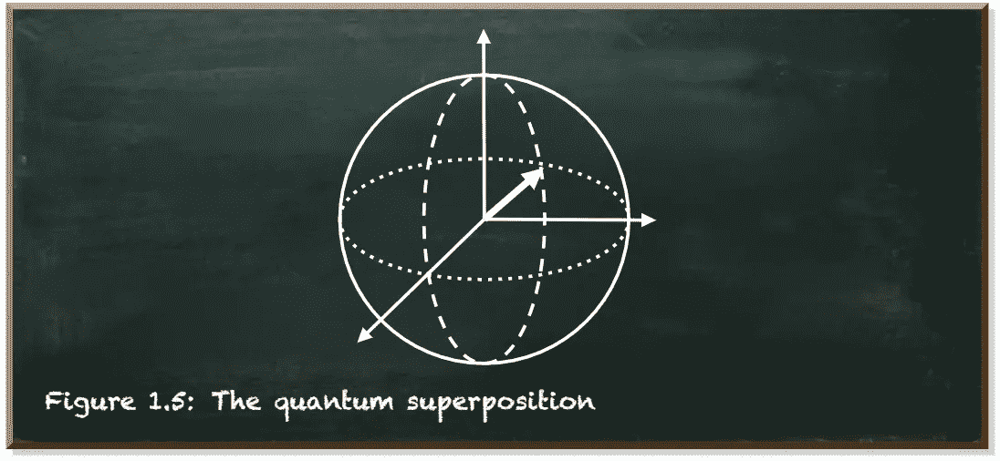
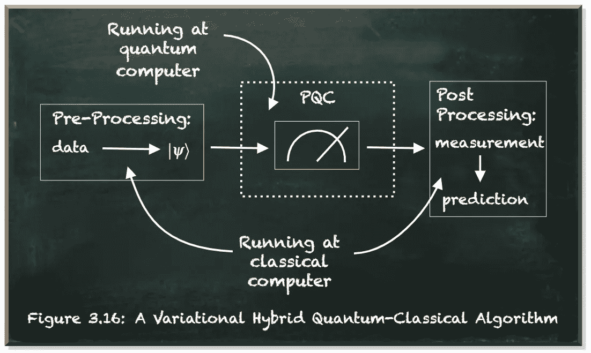

# NISQ 是什么意思？

> 原文：<https://towardsdatascience.com/what-does-nisq-mean-fadf1aa9fdd6?source=collection_archive---------31----------------------->

## 它的含义是什么？

量子机器学习要不要入门？看看 [**动手量子机器学习用 Python**](https://www.pyqml.com/page?ref=medium_nisq&dest=/) **。**

作者图片

量子计算是一种不同形式的计算。一种可以改变解决问题的复杂性，使问题变得容易处理的形式。但是这种不同形式的计算带来了自己的挑战。数字计算机需要区分两种状态:0 和 1。

电路需要区分高电压和低电压。只要有高电压，就是 1，有低电压，就是 0。这种离散化意味着误差必须相对较大才能被注意到，然后可以实现用于检测和纠正这种误差的方法。

与数字计算机不同，量子计算机需要非常精确。它们保持连续的量子态。量子算法需要对连续变化的参数进行精确操作。

然而，在量子计算机中，错误可能小到无法检测，但它们的影响仍然会累积到破坏计算。

作者图片

这种脆弱的量子态非常容易受到来自量子比特周围环境的噪声的影响。噪声可能来自控制电子设备、热量或量子计算机材料本身的杂质，也可能导致难以纠正的严重计算错误。

但是为了实现量子计算机的承诺，我们需要容错设备。我们需要计算肖尔因子分解算法的设备。我们需要设备来执行所有其他已经在理论上开发出来的算法，这些算法解决了数字计算机难以解决的问题。

但是这种设备需要数百万个量子比特。这种开销是纠错所必需的，因为大多数这些复杂的算法对噪声极其敏感。

目前的量子计算机有多达 65 个量子比特。尽管 IBM 力争在 2023 年前实现 1000 量子比特的计算机，但我们预计在不久的将来，量子处理器将达到 100 量子比特。即使它们超过了这些数量，它们仍然相对较小且噪音较大。这些计算机只能执行短程序，因为程序越长，与噪声有关的输出错误就越多。

作者图片

然而，运行在超过 50 量子位的设备上的程序已经变得很难在经典计算机上模拟了。这些设备可以做传统计算机做不到的事情。

这就是我们即将进入的时代。这个时代，我们可以建造量子计算机，虽然不具备容错能力，但可以做经典计算机做不到的事情。这个时代是由术语“[嘈杂的中尺度量子](https://quantum-journal.org/papers/q-2018-08-06-79/)”——**NISQ**来描述的。

嘈杂是因为我们没有足够的量子位来进行纠错。“中等规模”是因为量子比特的数量太小，无法计算复杂的量子算法，但又足够大，可以显示量子优势甚至优势。

# 结论

我们今天拥有的最好的量子计算机是 NISQ 设备。这些设备需要不同的算法、工具和策略。

例如，**变分量子经典算法**已经成为考虑近期量子设备量子算法的一种流行方式。在这些算法中，经典计算机对它们从量子计算机上运行某些难以计算的计算中获得的信息执行整体机器学习任务。

整个算法由经典部分和量子部分之间的闭环组成。它有三个部分:

*   预处理
*   印刷质量控制系统
*   后处理

作者图片

量子算法基于经典算法提供的一组参数产生信息。因此被称为**参数化量子电路(PQCs)** 。

这些 pqc 相对较小，寿命较短，因此**适合 NISQ 设备**。

量子机器学习要不要入门？看看 [**动手用 Python 学习量子机器**](https://www.pyqml.com/page?ref=medium_nisq&dest=/) **。**

在这里免费获得前三章。