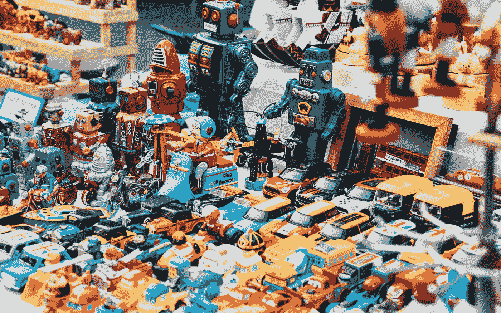

# “AI 安全”中的“安全”实际上是什么意思？

> 原文：<https://towardsdatascience.com/what-does-safety-in-ai-safety-actually-mean-5aeae833469d?source=collection_archive---------36----------------------->

## 三个复杂的问题

在 TDS 播客的最近一期节目中，嘉宾 Rosie Campbell 是 AI Partnership on AI 的安全关键 AI 负责人，他与 T2 的 Jeremie Harris 聊起了发表前沿人工智能研究的潜在风险。我承认，在听他们的对话之前，这是我从未想过的问题；首先，我绝对是*而不是*人工智能研究者，所以我从来不需要这么做。

然而，一个更深层次的原因是我多年来构建的关于危险的人工智能可能会是什么样子的心理图像。流行文化已经让我(我猜想，你们中的许多人也是如此)习惯于想象一个像 HAL 9000 那样邪恶的没有身体的意识，或者一个看起来傻傻的、可能致命的星球大战机器人。相比之下，现实世界、当今的人工智能风险更加抽象，也更加广泛。

如果你和我一样，想了解更多关于这些风险的各种形式，这里有一些我认为特别有用的 TDS 资源，虽然不多，但很有效。

照片由 [Huy-Hung Trinh](https://unsplash.com/@trinhhuyhung?utm_source=medium&utm_medium=referral) 在 [Unsplash](https://unsplash.com?utm_source=medium&utm_medium=referral) 上拍摄

## [所有的 AI 研究都应该发表吗？](/should-all-ai-research-be-published-5226ad5145b4)

我上面提到的 TDS 播客插曲探索了人工智能研究社区必须导航的内在张力:一方面，使知识可访问和自由流动的愿望；另一方面，在坏人试图利用新技术进步达到邪恶目的的情况下，降低风险的竞争需要。Rosie Campbell 和 Jeremie Harris 以 OpenAI 的 GPT-2 及其棘手的初始版本为例开始了对话，并继续就人工智能学术出版中的道德实践进行了更广泛的讨论。

</should-all-ai-research-be-published-5226ad5145b4>  

## [AI 的民主化](/democratization-of-ai-de155f0616b5)

作为普华永道(PricewaterhouseCoopers)人工智能的全球负责人， [AnandSRao](https://medium.com/u/e1679be51455?source=post_page-----5aeae833469d--------------------------------) 非常清楚大规模人工智能的潜在好处和风险。随着人工智能在组织中变得越来越容易获得，Anand 注意到滥用的媒介也在增长:

> 即使是由高素质工程师设计的最复杂的人工智能系统，[也可能成为偏见](https://www.strategy-business.com/article/What-is-fair-when-it-comes-to-AI-bias)、可解释性问题和其他[缺陷](https://www.pwc.com/gx/en/issues/data-and-analytics/artificial-intelligence/what-is-responsible-ai.html)的牺牲品。由没有经过适当培训的人构建的人工智能系统，或者在没有适当控制的情况下运行的人工智能系统，可能会产生非常危险的东西——引入歧视或严重错误。更糟糕的是，问题可能直到系统实施后才变得明显，让公司争先恐后地安抚利益相关者，消除损害，修复技术。

他提出的解决方案是一个微妙的民主化框架——一个考虑到技术、商业和不同利益相关者之间复杂相互作用的框架。在这里不可能做到公正，所以只要跳到 Anand 的帖子里去更详细地了解它。

</democratization-of-ai-de155f0616b5>  

## [全球人工智能竞赛和战略平衡](/the-global-artificial-intelligence-race-and-strategic-balance-which-race-are-we-running-e0176b2349e5)

非专家读者(是的，我说的是我自己)可能需要进行一些思维跳跃，才能理解学术研究的发表会产生不可预见的负面结果。人工智能的军事用途并非如此，当前的危险与我们科幻小说中的想象惊人地重叠。夏洛特·利维最近的帖子深入探讨了全球利用人工智能获得军事力量的争夺战——以及其他人限制其鲁莽、毁灭性行为潜力的尝试。

</the-global-artificial-intelligence-race-and-strategic-balance-which-race-are-we-running-e0176b2349e5>  

如果你从事人工智能安全方面的工作，我们很乐意听到你的意见——请在评论中留下你的工作的链接，或者更好的是— [为 TDS](/questions-96667b06af5) 写点东西！关于人工智能安全和风险的其他深思熟虑的讨论，[前往 TDS 播客](https://towardsdatascience.com/tagged/tds-podcast)。