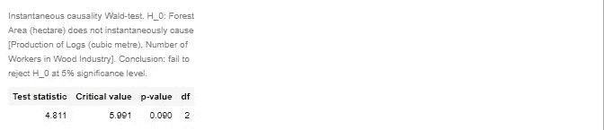

# 关于马来西亚的环境，这些数据告诉了我们什么？

> 原文：<https://towardsdatascience.com/what-does-the-data-tell-us-about-malaysias-environment-5b5d1d22160e?source=collection_archive---------44----------------------->

## 涵盖碳排放、林业和水污染统计


照片由来自 [Pexels](https://www.pexels.com/photo/green-trees-forest-growing-around-stone-water-tank-6038214/?utm_content=attributionCopyText&utm_medium=referral&utm_source=pexels) 的 [Pok Rie](https://www.pexels.com/@pok-rie-33563?utm_content=attributionCopyText&utm_medium=referral&utm_source=pexels) 拍摄

# 介绍

环境数据集往往不是一个有利可图的研究主题，但它是研究人员或数据科学爱好者可以关注的问题。

根据我们所处的位置，被监控的内容通常会有所不同，但是如果我们能够得到一个并开始使用它们，我们通常会为我们的当地社区带来令人惊讶的发现。

从马来西亚的开放数据门户网站，我设法获得了空气污染物排放、林业和河流污染的时间序列数据。我会尝试调查马来西亚的环境状况，看看我是否能为社区增加一些价值。

# 数据和文件

1.  [数据](https://www.dosm.gov.my/v1/index.php?r=column/ctimeseries&menu_id=NHJlaGc2Rlg4ZXlGTjh1SU1kaWY5UT09)
2.  [文档](https://www.dosm.gov.my/v1/uploads/files/3_Time%20Series/Malaysia_Time_Series_2019/20_Alam_Sekitar.pdf)

# 加载数据和函数

```
#Env
myco2e = 'co2e-my-1998-2019.csv'
myforest = 'forest-my-1947-2018.csv'
myriver= 'river-pollutant-my-1998-2018.csv'colors = [
    '#2C947A',
    '#83553E',
    '#7A2A34',
    '#A2D3C2',
    '#658E9C',
    '#4D5382',
    '#514663',
    '#A83375',
    '#FF1F87',
    '#40B7F2',
]
```

## 堆积面积图

```
def make_stacked_area(df, ylist, colorlist, title, legend=True, height=1000, width=800):
    ys = ylist
    colors = colorlist

    x = df.Yearfig = go.Figure()
    for i in range(len(ys)):
        fig.add_trace(go.Scatter(
            x = x,
            y = df[ ys[i] ],
            name = ys[i],
            mode= 'lines',
            line= dict(width = 0.5,
                       color = colors[i]),
            stackgroup='one',
            groupnorm='percent',
        ))fig.update_layout(
        title= title,
        xaxis_tickfont_size=14,
        yaxis=dict(
            title='',
            titlefont_size=16,
            tickfont_size=14,
        ),
        legend=dict(
            x=1.02,
            y=0.98,
            bgcolor='rgba(255, 255, 255, 0)',
            bordercolor='rgba(255, 255, 255, 0)',
        ),
        showlegend= legend,
        height= height,
        width= width,
    )return fig
```

## 线形图

```
def make_line_plot(data, xdata, ydata, cdata, title, legend=True, width=900, height=600):
    import plotly.express as pxfig = px.line(data, 
                  x= xdata,
                  y= ydata, 
                  color= cdata, 
                  symbol= cdata,
                 )fig.update_layout(
        title= title,
        xaxis_tickfont_size=14,
        yaxis=dict(
            title='',
            titlefont_size=16,
            tickfont_size=14,
        ),
        legend=dict(
            x=1.02,
            y=0.98,
            bgcolor='rgba(255, 255, 255, 0)',
            bordercolor='rgba(255, 255, 255, 0)',
        ),
        showlegend= legend,
        height= height,
        width= width,
    )

    return fig
```

# 污染物排放

EPA 已经将六种污染物确定为“标准”空气污染物，因为它通过开发基于人类健康和/或基于环境的标准(基于科学的准则)来设定允许水平，从而对它们进行管理。这六种污染物是一氧化碳、铅、氮氧化物、地面臭氧、颗粒污染(通常称为颗粒物)和硫氧化物。

原始数据没有具体说明记录或监测的污染物是什么。

```
df = pd.read_csv(PATH + myco2e)ylist = ['Industrial', 'Power plant', 'Mobile vehicle', 'Others'] make_stacked_area(df, ylist, colors, 'CO2 emission share by source, Malaysia (1998-2018)')
```

## 将数据转换为长格式

```
df_long = (pd.melt(df, id_vars=['Year','Total co2e (Tonnes)'], value_name='emission'))
df_long.rename({'variable': 'source'}, axis=1, inplace=True)make_line_plot(df_long, 'Year', 'emission', 'source', 'CO2 emissions by source, Malaysia (1998-2018)')
```

**备注:**

1.  排放量以吨为单位。
2.  错误地将柱状图和图表命名为碳排放。原始文件:空气污染物包括臭氧(O3)、一氧化碳(CO)、二氧化氮(NO2)、二氧化硫(SO2)和小于 10 微米的颗粒物质(PM10)。

绝大多数记录在案的排放物来自机动车辆。该国的污染物排放量估计值应该高得多，因为许多其他通常具有高排放量的来源(例如:农业、石油生产、废物管理)并未显示为可用来源。

总的来说，全国的污染物排放总量似乎呈上升趋势。

# 森林面积和伐木活动

```
df = pd.read_csv(PATH + myforest)
```

原始数据集有一些缺失值，如果希望做进一步的时间序列分析，如协整检验或 VECM 模型，这可能会导致一些问题。这可以通过插值很容易地解决，尽管必须**弄清楚“幻影”值被引入**。

```
# Fill missing valeus for time series
df = df.interpolate(method= 'linear', limit_direction= 'forward')
df
```

有了这个，我们就可以开始制作图表了。

```
fig = go.Figure()fig.add_trace(go.Scatter(
    x= df.Year,
    y= df['Forest Area (hectare)'],
    name = 'Forest Area (hectare)'
))fig.add_trace(go.Scatter(
    x= df.Year,
    y= df['Production of Logs (cubic metre)'],
    name = 'Production of Logs (cubic metre)',
    #yaxis= 'y2'
))fig.add_trace(go.Scatter(
    x= df.Year,
    y= df['Number of Workers in Wood Industry'],
    name = 'Number of Workers in Wood Industry',
    yaxis= 'y2'
))###############
fig.update_layout(
    xaxis=dict(
       domain=[0, 0.95]
    ),
    yaxis=dict(
        title="Forest Area (hectare)",
        titlefont=dict(
            color="#1f77b4"
        ),
        tickfont=dict(
            color="#1f77b4"
        )
    ),
    yaxis2=dict(
        title="Number of workers in logging industry",
        titlefont=dict(
            color="green"
        ),
        tickfont=dict(
            color="green"
        ),
        anchor="x",
        overlaying="y",
        side="right",
    ),
    height= 600,
    width= 900,
    title= "Available forest area & logging activity, Malaysia (1947-2018)"
)
```

马来西亚有记录的森林面积多年来一直停滞不前。20 世纪 80 年代左右森林面积的激增可能是由于观察面积的增加。这意味着在我们的森林面积时间序列中有一个结构突变模式。在这种情况下，这将意味着今天的马来西亚的森林面积比几十年前更少。

原木产量在 20 世纪 90 年代达到历史最高水平，此后产量逐年下降。1960-1990 年间伐木活动的增长与同一时期森林面积的减少相一致。

木材行业的工人数量有一些剧烈的波动，可能是由于记录或记账不良。也就是说，尽管伐木活动减少，工人数量仍然达到历史最高水平。这是因为木工或工匠等工作被包括在内。

## 协整检验

既然我们已经做了插值，我们不妨做一个协整检验，看看森林面积的扩展、伐木活动和木材业工人之间是否有任何稳定或长期的关系。

由于结构性断裂无处不在，我们并不期待由此产生任何重大结果。但是如果你想做，你可以这么做。

```
plt.figure(figsize= (12,18) )plt.subplot(4,1,1)
plt.plot(df['Production of Logs (cubic metre)'], label= 'Logging activity')
plt.plot(df['Number of Workers in Wood Industry'], label = 'workers')
plt.plot(df['Forest Area (hectare)'], label = 'forest')
plt.legend()# Spread 1
plt.subplot(4,1,2)
plt.plot(df['Forest Area (hectare)'] - df['Number of Workers in Wood Industry'], 
         label='Forest - Workers')
plt.legend()# Spread 2
plt.subplot(4,1,3)
plt.plot(df['Forest Area (hectare)'] - df['Production of Logs (cubic metre)'], 
         label='Forest - Logging')
plt.legend()#plot spread
plt.subplot(4,1,4)
plt.plot(df['Production of Logs (cubic metre)'] - df['Number of Workers in Wood Industry'], 
         label='Logging - Workers')
plt.legend()plt.show()
```


作者图片

由于所有 3 个不同时间序列的水平数据不具有 0 均值且包含趋势，在我们的后续函数中，我们将使用“线性趋势”作为估计参数。

```
from statsmodels.tsa.vector_ar.vecm import *temp = df
temp.set_index('Year', inplace=True)lag_order = select_order(data= temp[1:], 
                         maxlags=10, 
                         deterministic="li", 
                             # linear, inside
                         seasons=0)
lag_order.summary()
print(lag_order)
```


作者图片

**识别等级(协整关系的数量)**

```
rank_test = select_coint_rank(temp[1:], 
                              det_order=1, 
                              k_ar_diff=0, 
                              method="trace",
                              signif= 0.05)rank_test.rank
rank_test.summary()
```


作者图片

秩等于 1，意味着只有一个稳定的三个变量的线性组合(即:3 个不同时间序列的 1 协整关系)。

```
# Parameter estimation
model = VECM(temp[1:], 
             deterministic="li", 
             seasons=0,
             k_ar_diff= lag_order.bic, #bic for easier interpretability
             coint_rank= rank_test.rank)vecm_res = model.fit()
vecm_res.summary()
```


作者图片

**预测**

```
vecm_res.plot_forecast(steps= 15, plot_conf_int=True)
```


作者图片

**格兰杰因果关系**:

**X 格兰杰原因 Y** 如果**使用****X 的当前和过去值以及**Y 的当前和过去值来预测 Y 的未来值的模型比仅使用 Y 的当前和过去值来预测 Y 的模型具有更小的预测误差。

换句话说，格兰杰因果关系回答了以下问题:

> 变量 **X** 的过去是否有助于提高 **Y** 未来值的预测？

**瞬时因果关系**:

**X 瞬时导致 Y** 如果**使用 X 的当前、过去和未来值以及 Y 的当前和过去值**来预测 Y 的模型比仅使用 X 的当前和过去值以及 Y 的当前和过去值的模型具有更小的预测误差

换句话说，瞬时格兰杰因果关系回答了这个问题:

> 知道 **X** 的未来是否有助于提高对 **Y** 未来值的预测？

```
g_cause_forest = vecm_res.test_granger_causality(caused="Forest Area (hectare)", signif=0.05)
g_cause_forest.summary()
```


作者图片

```
g_cause_log = vecm_res.test_granger_causality(caused="Production of Logs (cubic metre)", signif=0.05)
g_cause_log.summary()
```


作者图片

```
g_cause_wood = vecm_res.test_granger_causality(caused='Number of Workers in Wood Industry', signif=0.05)
g_cause_wood.summary()
```


作者图片

```
i_cause_forest = vecm_res.test_inst_causality(causing= 'Forest Area (hectare)')
i_cause_forest.summary()
```



作者图片

```
i_cause_log = vecm_res.test_inst_causality(causing= 'Production of Logs (cubic metre)')
i_cause_log.summary()
```


作者图片

```
i_cause_workers = vecm_res.test_inst_causality(causing= 'Number of Workers in Wood Industry')
i_cause_workers.summary()
```


作者图片

在这两个变量中都找不到格兰杰因果关系。在这两个变量中也找不到任何即时的因果关系。

然而，**如果 alpha 上升到 0.10** ，变量`Forest Area`和`Production of Logs`都可以被识别，以瞬间引起其他变量的未来值。(例如，如果我知道森林面积或原木产量的未来值，我就可以合理地预测其他变量的未来值。)

**脉冲响应**

`irf`函数返回对[VEC(*p*–1)模型](https://www.mathworks.com/help/econ/vecm.irf.html#mw_5195628e-a044-48d3-bc31-b7bc14d2fd4b)中每个变量的一个标准差冲击的动态响应，或[脉冲响应函数](https://www.mathworks.com/help/econ/vecm.irf.html#mw_1f64290f-51a5-4154-8da5-a94690ba33ff) (IRF)。

脉冲响应试图追踪一个变量的冲击对系统中所有变量响应的影响。

```
num_periods = 15
ir = vecm_res.irf(periods= num_periods)ir.plot(plot_stderr=True)
```


作者图片

**备注:**

1.  我要警告不要对这种协整分析的任何结果进行解读。时间序列数据太不可靠，包含太多结构突变，粒度太大。
2.  由于 Choleski 分解，脉冲响应函数(IRF)对 VAR 中内生变量的排序(即列的排列)很敏感。在实践中，通常使用不同的排序来测试 IRF 对变量排序的敏感性。

# 河流污染状况

```
ylist = [
    'Biochemical oxygen demand (polluted)',
    'Biochemical oxygen demand (slightly polluted)',
    'Biochemical oxygen demand (clean)', 
]ylist2= [
    'Ammoniacal Nitrogen (polluted)',
    'Ammoniacal Nitrogen (slightly polluted)',
    'Ammoniacal Nitrogen (clean)',
]ylist3=[
    'Suspended solids (polluted)',
    'Suspended solids (slightly polluted)', 
    'Suspended solids (clean)',
]river_plot1 = make_stacked_area(df, ylist, colors[-3:], 'Share of rivers polluted (biochemical oxygen demand),<br>Malaysia (1998-2017), n=140', height= 600)river_plot2= make_stacked_area(df, ylist2, colors[-3:], 'Share of rivers polluted (Ammoniacal Nitrogen),<br>Malaysia (1998-2017), n=140', height= 600)river_plot3= make_stacked_area(df, ylist3, colors[-3:], 'Share of rivers polluted (Suspended solids),<br>Malaysia (1998-2017), n=140', height= 600)
```

**注意事项**:

1.  监测的河流数量从 120 条开始，2005 年增加到 140 条。

## 生化需氧量

生化需氧量(BOD)是衡量需氧细菌分解过程中去除水中废弃有机物所需氧气量的指标。水中有机物的衰变被测量为生化或化学需氧量。

某些环境压力，如肥料的引入，会减少水体中溶解氧的含量，从而对当地水生生物造成压力。

马来西亚所有河流的生化需氧量都严重污染。近十年来，没有一条河流在这方面被记录为干净的。受污染河流的份额从 10%增长到了顶峰时的 85%。

## 氨态氮污染

氨是工农业的副产品。常见的形式包括空气污染，由腐烂的农业泥浆或渗入河流的化肥排放的氨气造成。

在水生环境中，氨会导致含氮需氧量、富营养化和鱼类健康的变化。溶解氧在硝化过程中被消耗，与氨反应，导致依赖它的生物可利用的 O2 减少。

硝化作用还会释放硝酸盐，导致陆地环境中的富营养化。嗜硝藻类和大型植物在死水中产生了大量的水华。

几乎所有的马来西亚河流都有氨态氮污染的问题。污染河流的份额多年来保持稳定，这可能表明以前污染的河流仍然受到污染。

## 悬浮体

悬浮固体是指作为胶体或由于水的运动而悬浮在水中的小固体颗粒。颗粒尺寸越小，单位质量颗粒的总表面积(克)越大，因此可能携带的污染物负荷就越高。

悬浮固体由于其相对较大的尺寸，可以通过沉淀去除。它可以作为水质、污水浓度或一般废水的指标。

悬浮固体污染似乎对马来西亚的河流更有利。也就是说，近年来污染问题似乎又回来了。

# 编后记

虽然我不是环境专家来建议任何政策，但事实是我们的环境是我们所有人都有责任照顾的。

监测更多的环境数据以确保我们有一个健康的地球来生活总是值得的。

我希望马来西亚政府能改善他们的环境数据集，为研究开辟更多的进展，并发现其中一些见解是可行的。

喜欢你看到的吗？如果你已经打算要一个，考虑在 Medium 上跟随我或者使用这个 [*推荐链接*](https://medium.com/@just_neldivad/membership) *获得 Medium 的会员资格。*

*如果你想从我做的其他工作中获得更多帮助，也可以考虑订阅我的个人博客*[*QED Insight*](https://www.qed-insights.com/)*。*

同时，这是我在 Medium 上完成并发表的一些其他项目。

</a-simple-python-guide-to-find-carbon-intensity-of-commodities-6f973170f64e>  <https://medium.com/alpha-beta-blog/key-findings-from-world-banks-global-findex-data-fee8d7505355> 