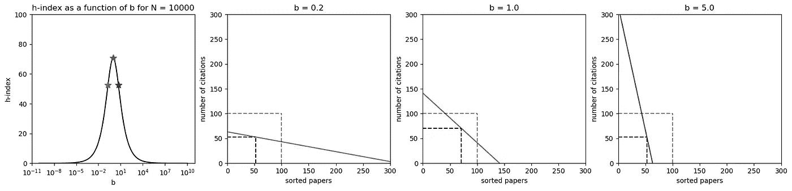
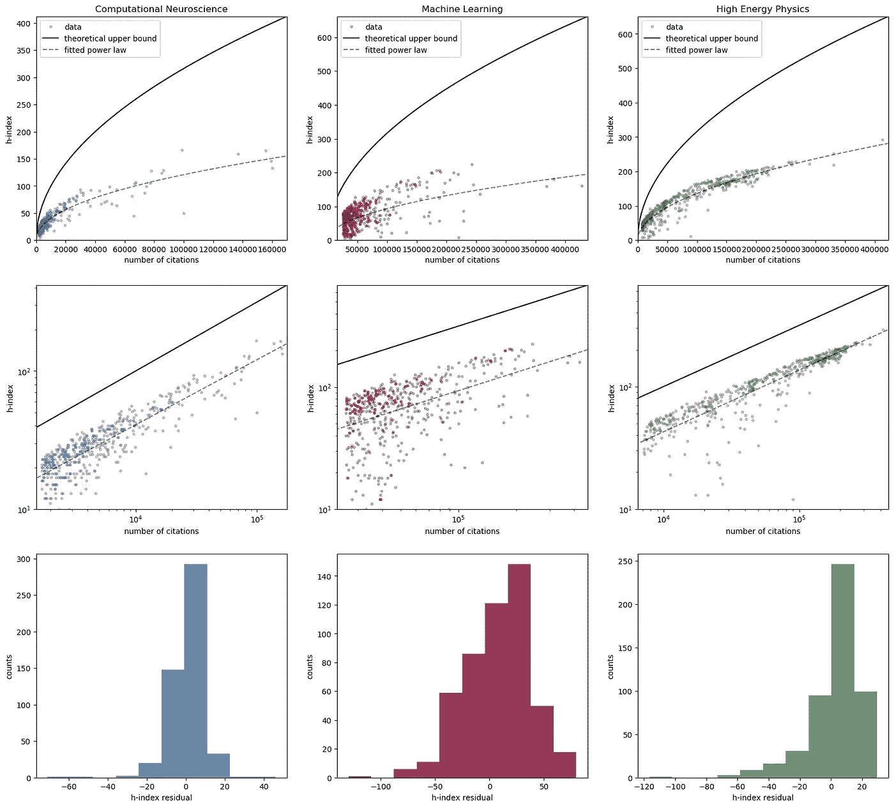

# h 指数告诉了我们什么，没有它我们无法知道？

> 原文：<https://towardsdatascience.com/what-does-the-h-index-tell-us-that-we-could-not-know-without-it-22ada0d73459?source=collection_archive---------24----------------------->

## 对 h-index 包含的、在引用总数中找不到的额外信息的理论和实证研究

为了对研究人员进行相互比较，我们需要一个衡量标准，用一个数字来表示他们的影响力和成功程度。一种方法是查看他们的文章被引用了多少次，并计算他们的总引用次数( *N* )。一种更复杂的方法是计算他们的 [h 指数](https://en.wikipedia.org/wiki/H-index) ( *h* )，这也应该考虑到这些 *N* 引用是如何在一名研究人员的论文中分布的。

最近和几个朋友的一次讨论让我思考 h 指数以及它的真正含义。我开始做一些有趣的计算，最后从谷歌学术收集数据来测试我的假设。我主要关心的是理解引用总数 *N* 和 h 指数 *h* 如何相互关联，以及 h 指数包含多少额外信息。

下面，我首先从理论上讨论一下 *h* 和 *N* 之间的关系。然后，我对来自计算神经科学、机器学习和高能物理 3 个不同领域的 1500 名研究人员的数据做了简要分析，并表明我们的理论直觉与经验数据一致。

# h 指数？曲线下的正则化区域

## 什么是 h 指数？

如果一个研究人员的 h 指数是 *h* ，那么这意味着 *h* 是“他或她有 *h* 篇文章至少被 *h* 次引用”这句话成立的最大数。形式上，给定一个研究者，我将**引用函数**定义为 *f* : *ℕ → ℕ* 其中 *f(n)* 表示该研究者第 *n* 篇被引用最多的论文的引用次数。那么，对应于该函数的 h 指数是最大值 *h* ，我们有*f(h)*≥*h*——见图 1。换句话说， *h* 是可以放在 *f* 下面的最大正方形的边。这种解释是我们在本文剩余部分所关注的。

**图一。**黑点表示函数 f(n)，绿色方块的边长表示对应的 h 指数。照片取自[维基百科，公共领域。](https://en.wikipedia.org/wiki/File:H-index-en.svg)

## 曲线下的面积

函数 *f* 下的面积等于引用总数 *N* 。这让我们很快得出结论， *h* 以 citations⁴总数的平方根为界，即 *√N.* 注意，这个界是紧的:如果 *N* 篇引用在第 1 篇 *√N* 篇论文之间平均分布，那么这个界就达到了，我们有 *h=√N.* 在这种情况下， *f(n)* 本身就是一个正方形，等于

从这个角度来看， *h* 可以看作是曲线下的正则化区域，它既取决于曲线的形状，也取决于曲线下的真实区域( *N* )。不严格地说，h 指数喜欢大的 *N* 值以及形状类似于正方形的曲线，例如，没有长尾的曲线或二阶导数较小的曲线。

在下一节中，我问是否有可能将这种正则化显式化，并将 *f* 的形式的效果与其面积( *N* )分开？

# 将形式的影响与引用数量的影响分开

**重要提示:**为了简化分析，在本节中，我删除了 *f* 从 *ℕ* 到 *ℕ* ，的约束，并使用从ℝ⁺到ℝ⁺.的 *f* 的插值版本因此， *N* 等于 *f、*和 *h* 的积分，表示 *f* 与 *y=x* 线相交的位置。

## 一个卡通例子:线性引用函数

在进入一般情况并获得一些直觉之前，让我们考虑一个简单的例子，其中 *f* 具有线性形式 *f(n) =* max{ *a - bn，0* } *，*其中 *a > 0* 和 *b > 0* 是自由参数。如果我们假设知道 *N* ，那么我们可以找到 *a* 作为 *N* 和 *b* 的函数，并且通过找到 *f* 与 *y=x* 线的交点，我们也可以找到 h-index 作为 *N* 和 *b* 的函数

**方程式 1。** h 为 b 和 N 的函数，为线性情况

关于情商有趣的一点。1 是可以因式分解的，可以写成 *h(b，N) = k(b)√N* ，其中

1.  第一项， *k(b)* ，只是斜率 *b* 的一个函数，它描述了引用是如何在论文中分布的，无论有多少引用。
2.  第二项， *√N* ，只是引用总数的函数，与它们在论文中的分布无关。

图 2 显示了当 *N* 等于 10000 时作为 *b* 的函数的 h 指数，以及对于 *b 的 3 个不同值的 *f(n)* 的三个示例。*当 *b=1* 时达到最大 h 指数。对于 *b < 1* 来说，引用次数很少的论文太多，而对于 *b > 1、*来说，被多次引用的论文很少。因此，h 指数更倾向于那些被广泛引用的论文数量和引用次数都相当多的情况。

**图二。**对于 *f(n) = a-b.n 的情况:左起第一个面板显示了当 N 假定为固定值且等于 10'000 时，h 指数作为 b 的函数；接下来的图显示了三个不同 b 值的 f(n)(实线)(对应于第一个图中的星号)。每个黑色虚线框显示 f(n)下的最大正方形，边长等于 h 指数，灰色虚线框显示 N=10'000 的最大可能正方形。这个图形是作者画的。*

## 找到一般情况下的相同因式分解

情商。1 表明，可以通过简单的因式分解将 *N* 的影响与 *b* 对 h 指数的影响分开。对于一般的引用函数，有可能找到类似的公式吗？我的答案是肯定的！但是要找到它，我们首先需要定义来自的**的概念——它可以充当一般引用函数的参数 *b* 的角色。**

我说引用函数 *f₁* 和 *f₂* 具有相同的**形式**如果存在一个正α使得对于每一个 *n≥0*

**方程式 2。** *f₁* 和 *f₂* 的形式相同

根据这个定义，两个线性引用函数具有相同的形式，当且仅当它们具有相同的斜率*b*——这与我们的直觉一致。

使用 Eq。2，我们可以很容易地证明，如果 *f₁* 和 *f₂* 具有相同的形式，那么 *N₂=* α *N₁* 和 *h₂=* α *h₁* ，这就让我们得出结论，只要两个引用函数具有相同的形式，我们就有 *h₂/h₁=√N₂/√N₁.根据这个推理， *h* 可以写成*

**方程式 3。** h 作为形式和 N 的函数

其中 *k≤1* 相对于 *N* 是常数，仅取决于 *f* 的**形式**；这与我们在 Eq 中看到的一致。1 其中 k*是 b*的函数*。取等式两边的对数。3，我们以*

**方程式 4。**对数版 Eq。3

情商。4 同时回答我们所有的问题:h 指数的对数有两个分量:

1.  第一个分量，log *k(b)* ，仅仅是形式 *f* 的函数，并且独立于 *N、*
2.  而第 2 个分量，log *√N* ，只是引用总数的函数，与形式无关。

第一部分是 h-index 包含的附加信息，是上一节讨论的正则化的显式表达式。为了了解这些信息在不同研究人员之间的相互比较中有多重要，我们需要了解引用函数的形式在实践中的可变性。

在下一节中，我将分析经验数据，并比较不同研究领域中的形式 f 和 N 对 h 指数的贡献。

# 我们在数据中看到了什么？

我从计算神经科学(CN)、机器学习(ML)和高能物理(HP)三个不同领域的 1500 名研究人员的谷歌学术页面中提取了 *h* 和*N*——有关分析的详细信息，请参见附件代码。图 3 总结了这些信息。

我分别为每个字段将 log*h = a+b*log*N*的幂律形式拟合到该数据中。根据等式。4、我们必须有 *b* =0.5 独立于场；与这个理论预测一致，我发现 CN，ML，HP 分别为*b*= 0.47±0.01，*b*= 0.50±0.04，*b*= 0.50±0.01。拟合曲线的相应 R 平方应该显示出 *N* (与 *f* 的形式相比)在解释 h 指数中的主导地位；我发现 CN、ML 和 HP 的 R 平方值分别为 0.75、0.21 和 0.73。这些结果表明，引用函数形式的可变性在不同领域是不同的；特别地，形式信息似乎在解释 ML 中研究人员的 h 指数中占主导地位，而在解释 CN 和 HP 中研究人员的 h 指数中并不重要。⁵

**图 3。**2021 年 3 月 16 日摘自《谷歌学术》的计算神经科学(左栏)、机器学习(中栏)、高能物理(右栏)领域 500 名研究人员的引用信息——共计 1500 名研究人员。第 1 行和第 2 行分别以线性和对数标度显示了作为引用数量(N)函数的 h 指数。每个点对应一名研究人员，黑色实线对应理论界限(即 N 的平方根)，灰色虚线对应数据拟合的幂律曲线。第三行显示拟合的残差直方图，即真实 h 指数和幂律曲线预测的 h 指数之间的差异直方图。*图为作者所作。*

# 结论

当 *N* 是引用函数下的区域时， *h* 可以被视为引用函数下的正则化区域。通过对形式的适当定义，这种正则化可以变得显而易见，这使我们能够将引用数量的影响与引用函数的形式对 h 指数的影响分开。此外，对经验数据的分析证实了理论的预测，并表明 h 指数的有用性取决于研究领域。

# 承认

我很感谢伯芬·辛塞克和伊萨克·福尔克，他们发人深省的讨论让我写下了这篇文章。

# 代码:

用于分析的代码(用 [Julia](https://julialang.org/) 语言)可以在[这里找到。](https://github.com/modirshanechi/medium_notes/blob/master/MediumRandomNotes/notebooks/H-index%20analysis.ipynb)

# 脚注:

在这里，我不是在讨论为什么我们想要或需要比较研究人员，也不是在讨论是否有可能定义一个标量测量来捕捉关于一个研究人员的影响力和成功程度的所有必要信息。然而，我想强调的是，如果我们想要建立一个公平的科学界，这些问题是至关重要的，不能被遗漏和低估。

在写这篇文章的时候，我发现有很多有趣的论文讨论了 h 指数的不同方面。感兴趣的读者可能想看看 J. E. Hirsch 在 2005 年第一次介绍 h-index 的原始文章，或者看看其他许多关于 h-index 的很酷的研究中的三个例子，比如 T2 的伊格莱西亚斯(Iglesias)&佩查罗曼(2007) 、[米纳斯尼等人(2013)](https://peerj.com/articles/183/) 或[巴恩斯(2017)](https://www.sciencedirect.com/science/article/pii/S0099133316301732?via%3Dihub) 。

这里，我不区分有一篇 0 次引用的论文和没有那篇论文。

⁴如果 *√N* 不是整数，那么上界就是它的整数部分。

⁵回归分析的细节见[附图](https://github.com/modirshanechi/medium_notes/blob/master/MediumRandomNotes/notebooks/H-index%20analysis.ipynb)。原始数据也可以在同一个存储库中获得，我非常乐意看到和讨论其他人的分析结果。:)
欢迎通过**alireza . modirshanechi @ epfl . ch**联系我