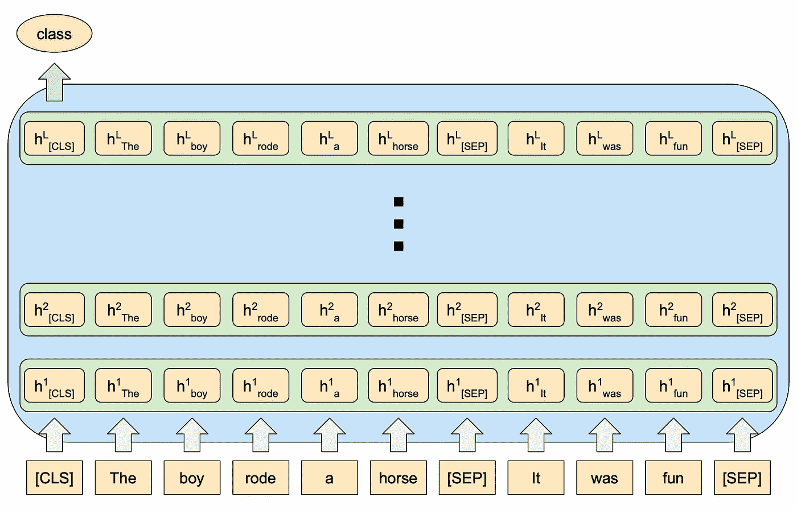
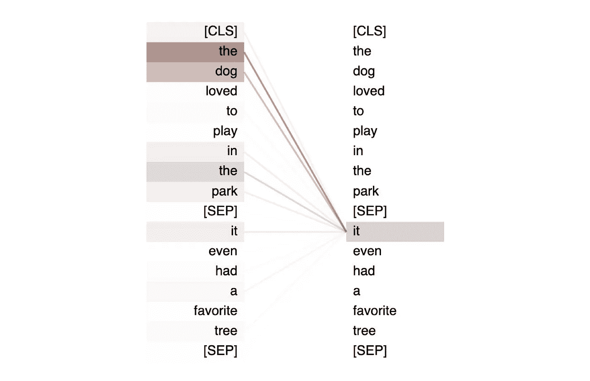
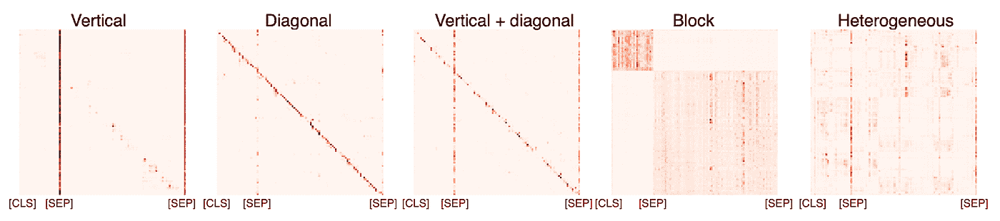
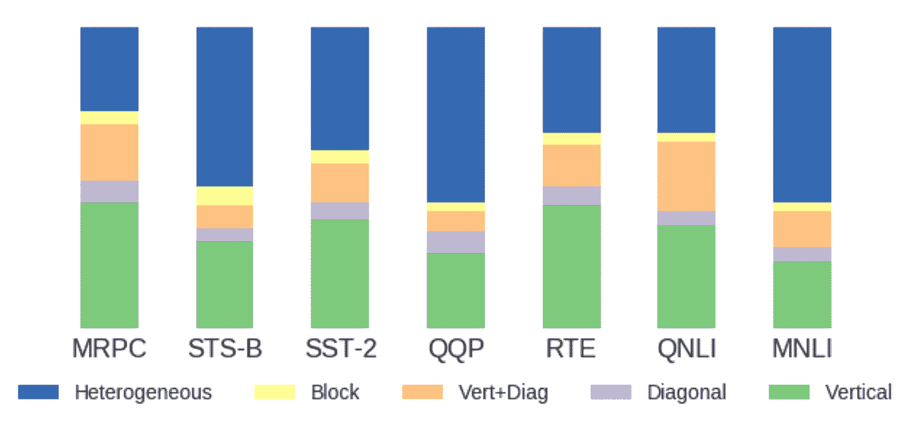
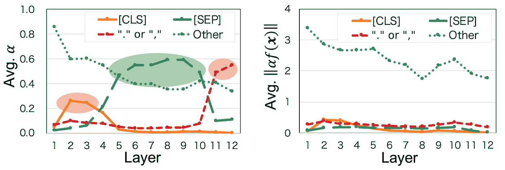
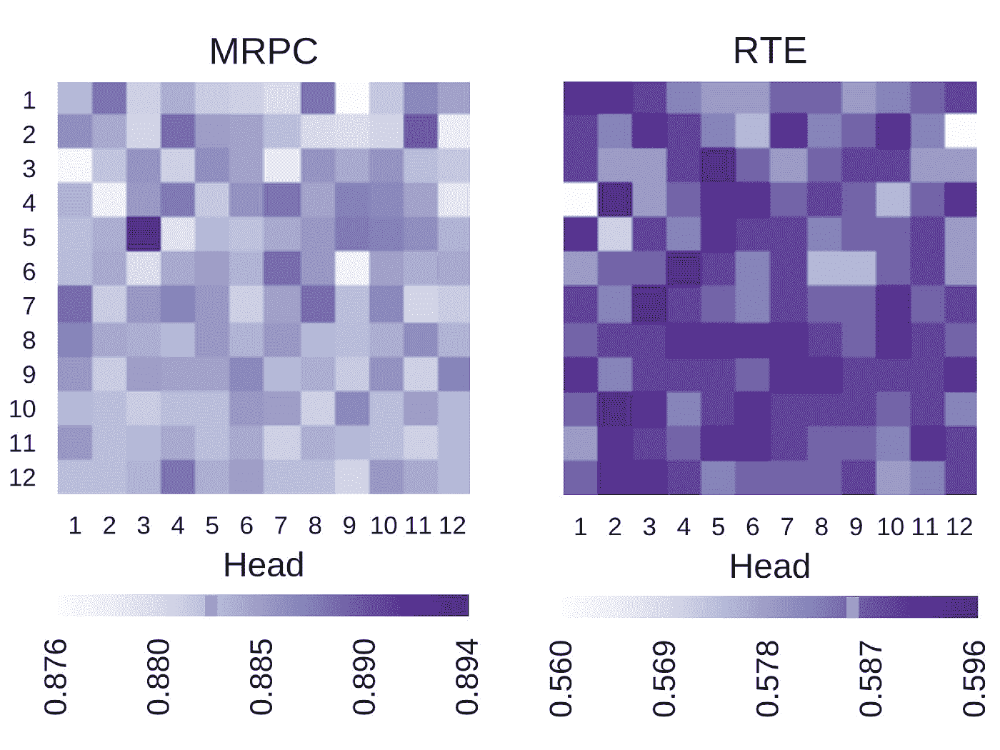
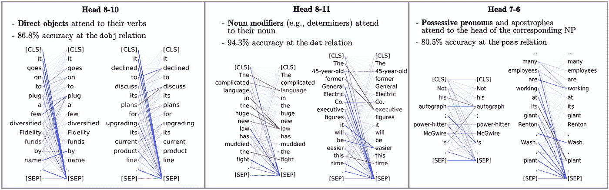

# 变形金刚自我关注其实看的是什么？

> 原文：<https://towardsdatascience.com/what-does-transformer-self-attention-actually-look-at-5318df114ac0?source=collection_archive---------6----------------------->

## 深入探究伯特的注意力

**背景:变形金刚、自我关注、伯特**

在过去的几年里，自然语言理解的进展已经[爆炸](https://www.forbes.com/sites/louisaxu/2021/12/01/a-golden-age-for-natural-language/)，这主要归功于被称为[转换器](https://jalammar.github.io/illustrated-transformer/)的新型神经网络架构。Transformer 模型的主要架构创新是广泛使用所谓的[、【自我关注】、](/illustrated-self-attention-2d627e33b20a)，以至于介绍该模型的论文被命名为[、](https://arxiv.org/abs/1706.03762)。自我注意机制将每个输入编码为所有其他输入的函数，帮助算法化语言中上下文的直观概念。

使用 GitHub Copilot 实例化一个复杂的对象，只需要查看它的类签名和前面的样板文件。Copilot 是通过在 Github 的开源代码上训练一个变压器模型而创建的。([GitHub copilot 能为数据科学家做些什么？](/tips-for-using-github-copilot-in-everyday-python-programming-8ef9e91a9b47))

自 2017 年推出以来，变压器架构已经分为多个子家族，最著名的是因果解码器种类( [GPT-2](https://openai.com/blog/better-language-models/) 、 [GPT-3](https://arxiv.org/abs/2005.14165) )，它们被训练来预测序列中的下一个字，以及编码器种类([伯特](https://arxiv.org/abs/1810.04805)、 [T5](https://arxiv.org/abs/1910.10683) 、[μm](https://blog.google/products/search/introducing-mum/))，它们被训练来在序列中的任意位置填空。每一种都有自己的优点和缺点，但是为了本文的目的，我们将把重点放在各种编码器上，尤其是 BERT。

**伯特建筑进修**

BERT 被设计成一个非常通用的语言编码器模型，它可以用于许多不同类型的任务，而不需要改变它的架构。它通过以单词标记*的一般形式接收输入来实现这一点，在开始处有一个特殊的[CLS]标记，在每段文本之后有一个特殊的[SEP]标记。(*技术上讲[文字块](/wordpiece-subword-based-tokenization-algorithm-1fbd14394ed7)令牌)

然后，该输入序列被转换为向量嵌入，向量嵌入通过自关注机制(稍后将详细介绍)相对于彼此被重复重新编码，随后的每次重新编码都保持相同的序列长度。

通过这种方式，任何接收多个输入的任务，比如一段文本+一个关于文本的问题，都可以自然地作为[SEP]划分的标记序列传入。类似地，任何期望进行分类的任务，例如“输入是消极情绪还是积极情绪？”可以通过最后一层的[CLS]令牌嵌入自然输出。

伯特如何消化输入“男孩骑着马”+“很有趣”的图示。输入令牌被转换成嵌入，然后由每一层重复重新编码。特殊[CLS]令牌的最终嵌入可以用于执行分类。(图片由作者提供)

对于基本 BERT 模型，有 12 层，每层包含 12 个注意头，总共有 144 个注意头。注意力操作有些复杂(详细的演练见[插图:自我注意力](/illustrated-self-attention-2d627e33b20a))，但重要的是要知道，对于每个注意力头:

1.  每个输入被赋予三个向量:一个键、一个查询和值
2.  为了确定我应该“关注”输入 j 多少，我们取输入 I 的查询向量与输入 j 的关键向量的点积，重新调整它，并通过一个 sigmoid 传递它。
3.  然后，我们使用这个结果注意力分数来加权输入 j 的值向量。

好了，介绍完了，我们终于可以进入有趣的部分了。

**伯特的注意力(不要)看什么**

通常，当你听到对伯特注意力的高层次描述时，接下来是“这使得注意力头能够自己学习经典的 NLP 关系！”接下来是这样一幅挑衅性的图形:

BERT 的第 5 层注意力头之一执行[共指解析](https://en.wikipedia.org/wiki/Coreference)。“它”最受其相关名词短语“狗”的关注。(图片由作者提供，使用 [BertViz](https://github.com/jessevig/bertviz) 生成)

虽然*一些*注意力集中的人确实学会了表现这样美好的可解释的关系，但大多数人没有。 [Kovaleva 等人(2019)](https://arxiv.org/abs/1908.08593) 将 BERT 的注意力焦点分为 5 种类型:

1.  *垂直*:所有记号都强烈关注同一个其它记号，通常是[SEP]记号。
2.  *对角线*:所有的记号要么强烈地关注它们自己，要么关注一个具有恒定偏移量的记号，例如紧随它们自己之后的记号。
3.  *垂直+对角线*:前两种图案的组合。
4.  *块*:令牌强烈关注其[SEP]划分的块内的其他令牌，而不关注该块之外的任何令牌。
5.  *异质*:更复杂、不明显的图案。

每个网格代表特定输入的特定注意头的行为。网格中的位置(I，j)表示表征 I 对表征 j 的注意力强度。此处显示的是展示 5 种特征注意力模式的输入。([科瓦列娃等人，2019](https://arxiv.org/abs/1908.08593) )

有趣的是，当你看到这些注意力模式有多普遍时，你会发现异质+阻断模式，也就是唯一能做任何有趣事情的模式，只解释了注意力头的一半*的典型行为。更奇怪的是，在所有情况下都盯着同一个标记的垂直模式，占据了 ***注意力头部的三分之一。****

产生每种注意模式的输入部分。每个条形代表一组不同的输入，所有这些输入都是来自 [GLUE](https://gluebenchmark.com/) 数据集的任务。([科瓦列娃等人，2019](https://arxiv.org/abs/1908.08593) )

当您深入研究垂直模式时，您会发现大多数单个标记都是[CLS]、[SEP]和标点符号。那么，究竟为什么像伯特这么聪明的模特会花费这么多宝贵的注意力资源在这些毫无意义的符号上呢？

关于这里发生的事情的理论是，当一个注意力头盯着这些停止标记之一时，它的行为就像一个不操作。因此，如果一个特定的注意力头所调谐的任何语言结构在输入中不存在，这就允许它“关闭”。

[Kobayashi et al. (2020)](https://arxiv.org/abs/2004.10102) 进一步挖掘这一奇怪的发现，发现虽然这些代币上的注意力得分很高，但正在与注意力得分相乘的值向量的范数很低。如此之低，以至于最终产品接近于零。

每一层中给予不同标记类型的注意力权重。左:天真的注意力得分，右:由价值向量的范数加权的注意力得分。([小林等人，2020](https://arxiv.org/abs/2004.10102)

真正有趣的是，因为有太多的这些注意力头基本上什么都不做，所以实际上你可以通过移除某些注意力头来提高模型的性能！事实上，对于像[【MRPC】](https://paperswithcode.com/dataset/mrpc)(确定两个句子是否等价)和 [RTE](https://paperswithcode.com/dataset/rte) (确定一个句子是否暗示另一个句子)这样的任务，随意去掉一个头*更有可能帮助表现而不是伤害它。*

**

*禁用不同注意头时的任务绩效。橙色线表示未改变的 BERT 模型的准确性。y 轴上显示图层编号，x 轴上显示头部编号。左:MRPC 任务的性能，右:RTE 任务的性能。( [Kovaleva 等人，2019](https://arxiv.org/abs/1908.08593) )*

***有用的注意力模式呢？***

*回到第一部分的图:的确，在 BERT 中有一些*注意力头，它们似乎被调整来执行可识别的 NLP 子任务。那么，这些头是什么，它们能做什么？**

*发现一些注意头编码与[依存解析](https://web.stanford.edu/~jurafsky/slp3/14.pdf)树中特定边相同的关系。特别地，对于给定输入(忽略[CLS]和[SEP])的最强注意力分数始终被给予具有 T20 特定依赖关系的成对单词。*

**

*BERT heads 编码特定的依赖关系。左:[直接宾语](https://universaldependencies.org/u/dep/obj.html)关系，中:[限定词](https://universaldependencies.org/u/dep/det.html)关系，右:[所有格修饰语](https://universaldependencies.org/u/dep/nmod-poss.html)关系。([克拉克等人，2020](https://arxiv.org/abs/1906.04341) )*

*许多 NLP 系统的另一个复杂而重要的任务是[共指消解](https://nlp.stanford.edu/projects/coref.shtml)。这就是确定一个句子中的两个词何时指代同一个实体的问题。要理解为什么这是一个如此困难的问题，考虑一下句子“莎莉给莎拉一颗曼妥思，因为她的口气不好。”在这种情况下,“她”指的是“莎拉”,但做出这一决定需要知道曼妥思是用来减轻口臭的，而不是某种道歉礼物。*

*这种对世界知识的依赖使得这成为一项非常重要的任务，然而 Clark 等人发现，第 5 层中的 Head #4 以 65%的准确度正确地识别(即，最强烈地关注)共同参照，相比之下，选择最近的提及作为共同参照的系统只有 27%的准确度。*

*我们可以走的另一条路是观察所有注意力头总共学到了什么。还记得前面的依赖关系解析树吗？我们可以问的一个问题是:对于一个给定的词对，如果我们考虑由网络中所有注意力头的*产生的注意力分数，我们能在依存分析中计算出它们是否应该由一条边连接吗？**

**

*通过聚合所有 144 个注意力头的注意力分数，为给定的词对创建全网络的注意力向量( [Coenen 等人，2019](https://arxiv.org/abs/1906.02715) )*

*事实证明，答案是肯定的，以这种方式构建的分类器可以以 85.8%的准确率预测依存解析中的边缘，远高于 chance ( [Coenen et al .，2019](https://arxiv.org/abs/1906.02715) )。虽然正如 Rogers et al. (2020) 所指出的，当在这样的高维表示之上构建分类器时，并不总是清楚有多少知识包含在底层表示中，而有多少知识是由分类器注入的。*

***最后的想法***

*关于这个主题有许多研究，我还没有时间触及，例如不同的架构决策在确定 BERT 的能力方面有什么作用([Ontaón 等人，2021](https://arxiv.org/abs/2108.04378) )，在 BERT 的不同层内正在进行什么样的推理( [Tenney 等人，2019](https://arxiv.org/abs/1905.05950) )，以及注意力头部下游的单词嵌入编码是什么( [Hewitt & Manning，2019](https://nlp.stanford.edu/pubs/hewitt2019structural.pdf) )。*

*许多头条论文都是关于这些巨大的神经网络模型所拥有的突破性能力，但这个领域最让我感兴趣的是这些模型是如何在引擎盖下工作的。我认为，特别是在这种情况下，我们发现备受吹捧的注意力机制花了大量时间来寻找无用的标记，我们意识到我们对这些模型的理解是多么贫乏。我认为这种神秘的气氛让他们更酷。*

***作品引用***

*[1] J. Alammar，插图变压器(2018)，GitHub 博客*

*[2] R. Karim，插图:自我关注(2019)，走向数据科学*

*[3] J. Vig，解构 BERT，第 2 部分:可视化注意力的内部工作方式(2019)，走向数据科学*

*[4] A .科尔提，GitHub copilot 能为数据科学家做些什么？(2021)，走向数据科学*

*[5] J. Devlin，M. Chang，K. Lee 和 K. Toutanova，BERT:用于语言理解的深度双向转换器的预训练(2019)，ArXiv.org*

*[6] A. Rogers，O. Kovaleva 和 A. Rumshisky,《伯特学入门:我们知道伯特如何工作》( 2020 年), ArXiv.org*

*[7]K·克拉克、u .汉德尔瓦尔、o .利维和 C. D .曼宁,《伯特看什么》?伯特的注意力分析(2019)，ArXiv.org*

*[8] O .科瓦列娃、a .罗马诺夫、a .罗杰斯和 a .拉姆什基，《揭露伯特的黑暗秘密》(2019)，ArXiv.org*

*[9] G. Kobayashi、T. Kuribayashi、S. Yokoi 和 K. Inui,《注意力不仅仅是重量:用向量范数分析变形金刚》( 2020 年)，ArXiv.org*

*[10] A. Coenen，E. Reif，A. Yuan，B. Kim，A. Pearce，F. Viégas 和 M. Wattenberg，可视化和测量 BERT 的几何形状(2019)，ArXiv.org*

*[11]s . Ontaón、J. Ainslie、V. Cvicek 和 Z. Fisher，《让变形金刚解决作曲任务》(2021)，ArXiv.org*

*[12] I. Tenney，D. Das，E. Pavlick，Bert 重新发现经典的 NLP 管道(2019)，ArXiv.org*

*[13] J. Vig，变压器模型中注意力的多尺度可视化(2019)，ACL 选集*

*[14] C. D .曼宁、K·克拉克、j .休伊特、u .汉德尔瓦尔和 o .利维，《通过自我监督训练的人工神经网络中的自然语言结构》(2020 年)，《美国国家科学院院刊》*

*[15] J. Hewitt 和 C. D Manning，在词表示中寻找句法的结构性探索(2019)，计算语言学协会*

*[16] M. Marneffe、B. MacCartney 和 C. D. Manning，从短语结构语法分析生成类型化依赖语法分析(2006)，Lrec*

*[17] D. Jurafsky 和 J. H. Martin，语音和语言处理，第二版(2014 年)，培生教育*

*[18]普遍依赖关系，UniversalDependencies.org*