# 顶点 AI 是做什么的？

> 原文：<https://towardsdatascience.com/what-does-vertex-ai-do-d30014024f55?source=collection_archive---------9----------------------->

## 机器学习的一站式商店

Clark Van Der Beken 在 [Unsplash](https://unsplash.com/s/photos/geometric-pattern?utm_source=unsplash&utm_medium=referral&utm_content=creditCopyText) 上拍摄的照片

# TL；速度三角形定位法(dead reckoning)

在这篇文章中，我介绍了典型的机器学习工作流中的常见任务，以及 Vertex AI 如何在一个统一的用户界面(UI)下整合所有需要的工具来实现这些任务。

# 🤔我们为什么需要一套“统一的”工具呢？

今天，数据科学家努力应对手动拼凑机器学习(ML)点解决方案的挑战。

这会使模型开发和实验变得复杂和缓慢，导致很少的 ML 模型进入生产。

**不仅仅是数据科学家希望获得 ML 功能…**

应用程序开发人员、数据分析师，甚至商业用户都开始看到这些能力的价值，并希望利用 ML 增强他们的工作流程或产品。但是他们不一定具备创建 ML 模型所需的专业知识。

为了应对这些挑战，Vertex AI 将用于构建 ML 的[谷歌云](https://console.cloud.google.com/) (GCP)服务整合在一个统一的 UI 和 API 下，以简化大规模构建、训练和部署机器学习模型的过程。

# 🧩顶点人工智能如何适应 ML 工作流程

下图(图 1)说明了 Vertex AI 如何将您需要的所有工具整合在一起，以实现典型 ML 工作流中的常见任务。我将简要介绍每个任务，特别是 Vertex AI 为您做了什么。

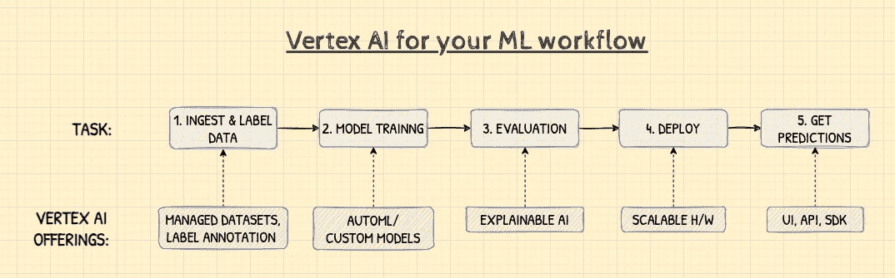

*图一。ML 工作流中的常见任务和相应的 Vertex AI 产品。作者插图。*

从 GCP 控制台选择 Vertex AI 时，您首先会遇到的屏幕之一是如下所示的仪表板(图 2)。在这里，您可以完成一些常见任务，例如创建数据集、查看您最近训练的模型以及最近批量预测作业的结果(稍后将详细介绍)。

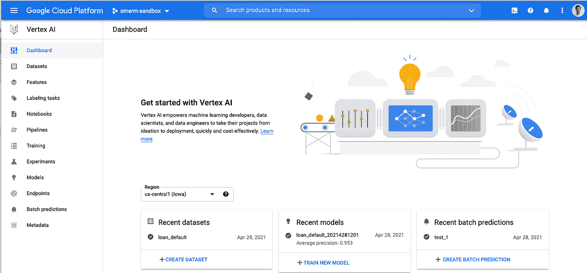

*图二。顶点人工智能仪表板—入门*

⏭**现在，让我们深入了解具体的工作流程任务。**

## 1.摄取和标记数据

ML 工作流的第一步通常是加载一些数据。假设您已经完成了必要的数据准备步骤，Vertex AI UI 会引导您完成创建**数据集**的过程。这也可以通过一个 [API](https://cloud.google.com/vertex-ai/docs/datasets/create-dataset-api) 来完成。

下面的屏幕截图(图 3)显示了在创建数据集的过程中可用的选项。您可以选择类型:图像、表格、文本和视频。UI 还会根据您想要解决的问题的目标或类型来指导您，并最终指导您从哪里上传数据。在我们的例子中，我选择了图像对象检测。

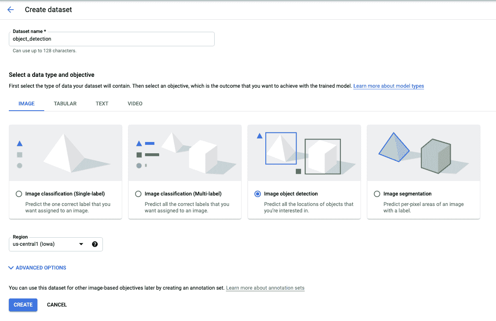

*图 3。顶点 AI —创建数据集、数据类型和目标*

在训练一个 ML 模型来预测一些事情之前，你需要标记你的数据，这样模型就有了可以学习的例子。

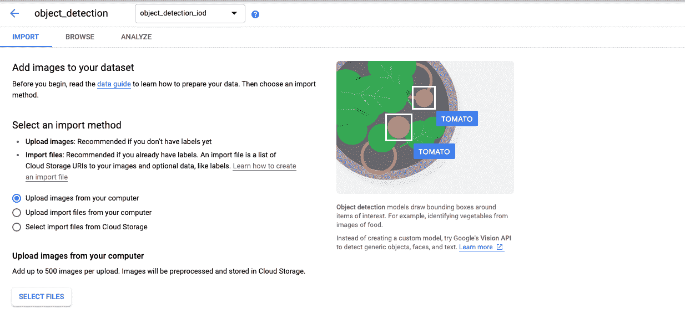

*图四。顶点 AI —创建数据集，向数据集添加图像*

假设您的目标是对图像中不同类型的车辆进行分类。如上所示(图 4)，您需要提供您期望模型分类的对象的示例图像。这些图像需要被标记，以便模型知道一个对象类和另一个对象类之间的差异。

顶点 AI UI 让你创建**注释集**。注释集包含与数据集中的文件相关联的标签。在我们的例子中，它是对应于我们想要分类的不同车辆的标签。

当使用 AutoML 的图像数据时，建议每个标签大约有 1000 个训练图像。每个标签的最小值是 10，但是您提供的训练示例越多，在进行预测时模型的准确性就越高。

如果数据集中的文件还没有一组对应的标签，也可以在 UI 中交互完成。例如，在我们的用例中，我们可以围绕我们想要在训练图像中检测的车辆绘制边界框，如下所示(图 5)。

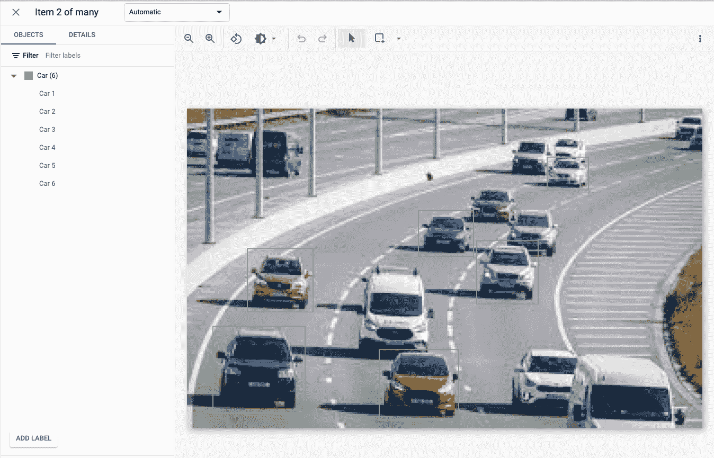

*图 5。顶点 AI——数据集标记，围绕对象绘制边界框以进行分类*

如果您没有时间标记数据集中的文件，您还可以[请求人类数据标记服务](https://cloud.google.com/vertex-ai/docs/datasets/data-labeling-job)。

**💡你可以在这里** **阅读更多关于如何准备每种类型的数据集，你需要多少训练数据的指导方针，以及如何标记它们** [**。**](https://cloud.google.com/vertex-ai/docs/datasets/datasets)

## 2.模特培训

基本上有两种方法可以在 Vertex AI 中训练模型。这很大程度上取决于你的经验水平。下面的屏幕截图(图 6)显示了基于我们在上一步中加载的车辆数据集的可用模型训练选项。

如果您想在使用已经加载的数据集训练模型的过程中得到指导，而不需要编写任何代码，请使用 **AutoML** 。它还将为您处理任何数据准备步骤，例如特征工程。

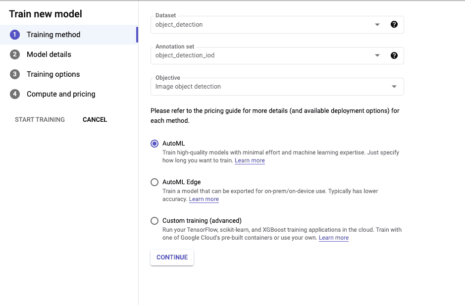

*图 6。顶点人工智能——模型训练选项*

另一方面，如果你是一个更高级的用户，希望对培训过程有更多的控制，并且你已经在 TensorFlow、PyTorch、sci-kit learn 或 XGBoost 中预先构建了 ML 模型，请使用**自定义培训**选项。

在您可以使用 Vertex AI 上的自定义训练选项训练您的模型之前，您的代码需要被容器化。你可以从 Vertex AI 提供的[预建容器图像](https://cloud.google.com/vertex-ai/docs/training/pre-built-containers)中进行选择，或者你可以使用自己的自定义图像进行更精细的控制……在这一点上，我假设如果你正在考虑自定义路线，你可能知道自己在做什么！

🧐你可能已经注意到还有第三个选项: **AutoML Edge** 。对于与视觉相关的目标(图像和视频)，您还可以训练一个模型，该模型可以导出以在移动设备或内部部署系统上使用，这些设备或系统不一定具有互联网连接。

📌**旁注**📌

**边缘计算**

我不会在这里详述，但是边缘计算越来越受欢迎。这基本上是一个概念，指的是在离行动发生地更近的地方用计算机做智能的事情。

以我们的车辆检测用例为例。想象一下，你管理着一个地方政府机构，但你的高速公路上没有基础设施或连接来建立一个可以连接到云的监控站，以从你的模型中获得预测。

如果您将 AutoML Edge trained 模型与连接到[小型摄像机](https://www.raspberrypi.org/products/camera-module-v2/)的 [Raspberry Pi](https://www.raspberrypi.org/products/raspberry-pi-3-model-a-plus/) 或 [Coral EdgeTPU](https://coral.ai/products/dev-board/) 等低成本、低功耗的边缘计算设备相结合，它会突然赋予您在任何地方使用 ML 的能力！

👩🏻‍💻想试一试，但不确定从哪里开始？我哥哥用 TensorFlow Lite 和一个边缘 TPU [写了一个示例应用程序。](https://github.com/Tqualizer/Directional-object-tracking-with-TFLite-and-Edge-TPU)

📌**边注**📌

## 3.估价

在你将你的 ML 模型投入使用之前，评估它是否适合你的目的，或者更确切地说，它是否预测了你所期望的值，这是一个好主意。

下面的屏幕截图(图 7)显示了在之前的车辆数据集上训练 AutoML 模型的评估输出。它显示了模型没有正确分类为“汽车”的对象，即“假阳性”，以及如何改进模型的提示-在这种情况下，向数据集添加更多的训练图像并重新训练。

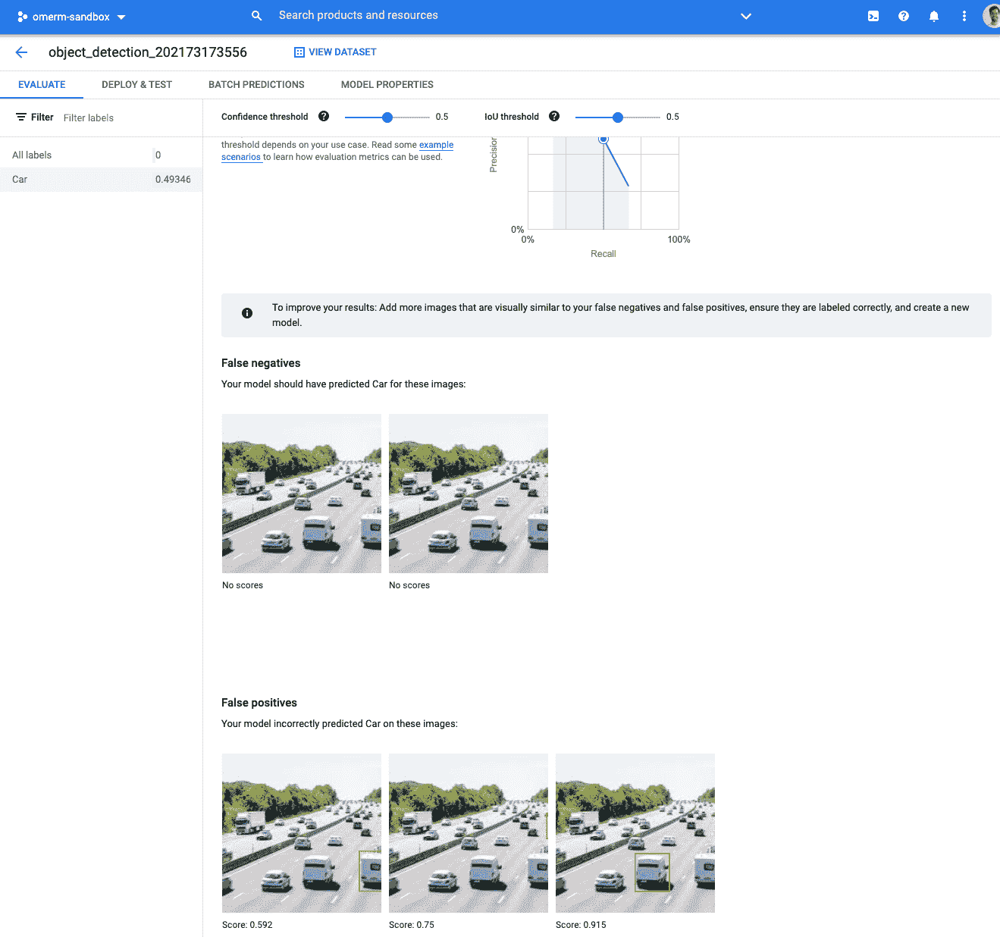

*图 7。顶点 AI —模型训练评估输出*

Vertex AI 中的**可解释的 AI** [功能](https://cloud.google.com/vertex-ai/docs/explainable-ai/overview)可以帮助你理解为什么你的模型会做出某些预测，显示哪些特征是最重要的，哪些特征归因于特定的结果。

下面的屏幕截图(图 8)显示了一个完全不同的模型和数据集的示例输出。具体来说，它使用了贷款违约数据集中的表格数据，目标是客户是否违约=“1”或=“0”。

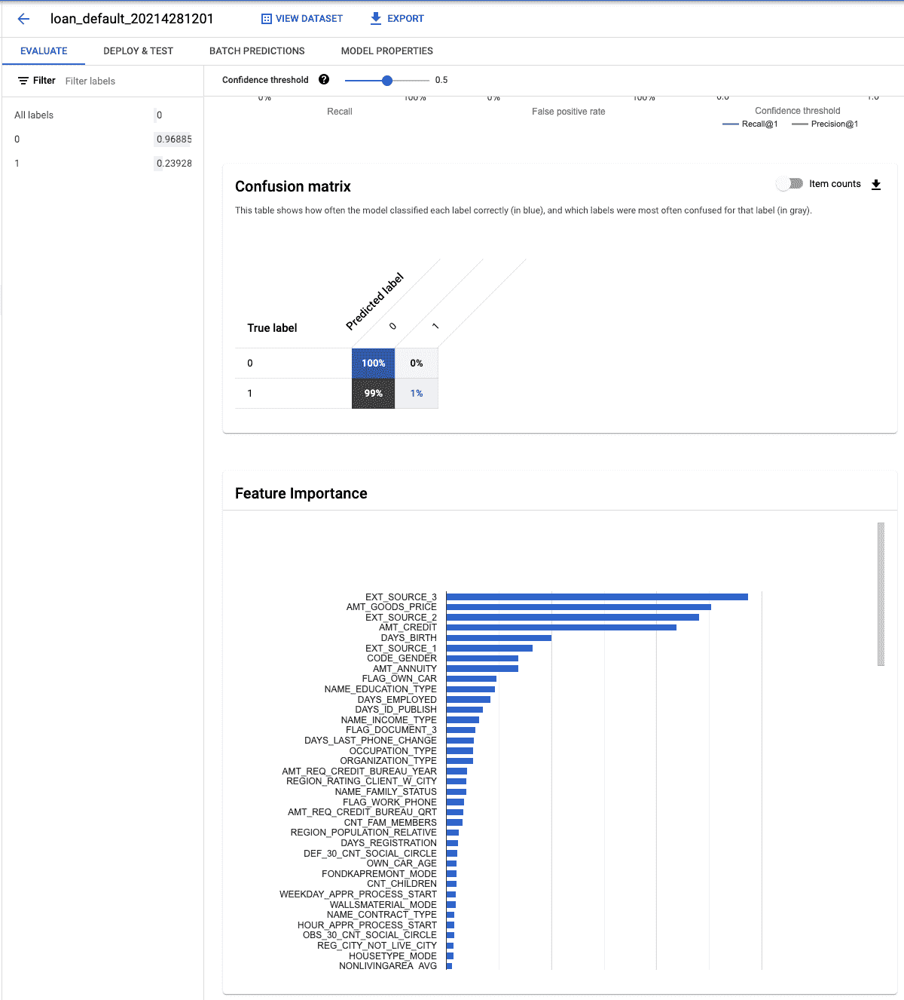

*图 8。顶点人工智能——基于表格数据的分类模型的可解释人工智能输出。*

要素重要性图表告诉我们，在影响模型预测时，哪个数据列(或要素)的影响最大。

关于可解释人工智能的更多信息，请参见推荐阅读部分。

## 4.部署

因此，您已经训练了您的模型，并且您对输出感到满意。现在您需要一个地方来部署它！

如果您选择了 AutoML 路线，Vertex AI UI 为您提供了一个选项，您只需点击几下鼠标就可以将训练好的模型部署到一个端点，如下所示(图 8):

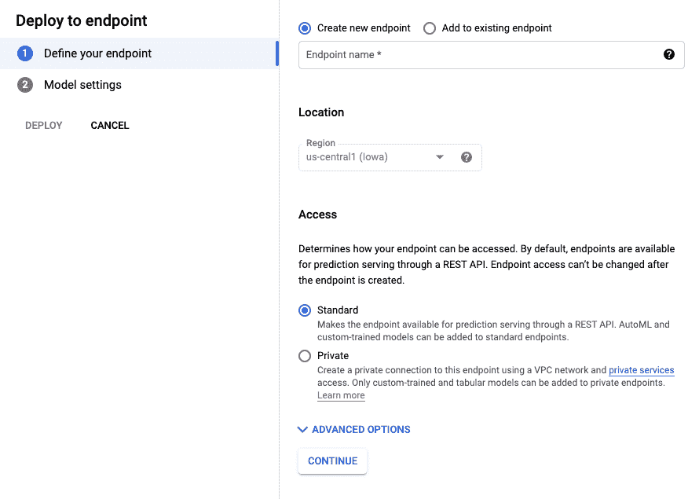

*图 8。顶点 AI —模型部署选项，定义端点。*

如果您走自定义路线，同样可以使用预构建或自定义的容器映像来服务预测请求，或者可以将模型部署到端点

**对于 AutoML 和定制型号，您可以:**

*   通过在部署期间定义流量分配[，在模型之间进行试验。如果你想做一些](https://cloud.google.com/vertex-ai/docs/predictions/deploy-model-console#automl-image) [A/B 测试](https://en.wikipedia.org/wiki/A/B_testing)，这是很方便的。
*   微调您的模型将使用的资源(图 9)并利用自动缩放，通过定义您希望顶点 AI 向上扩展的最大计算节点数。

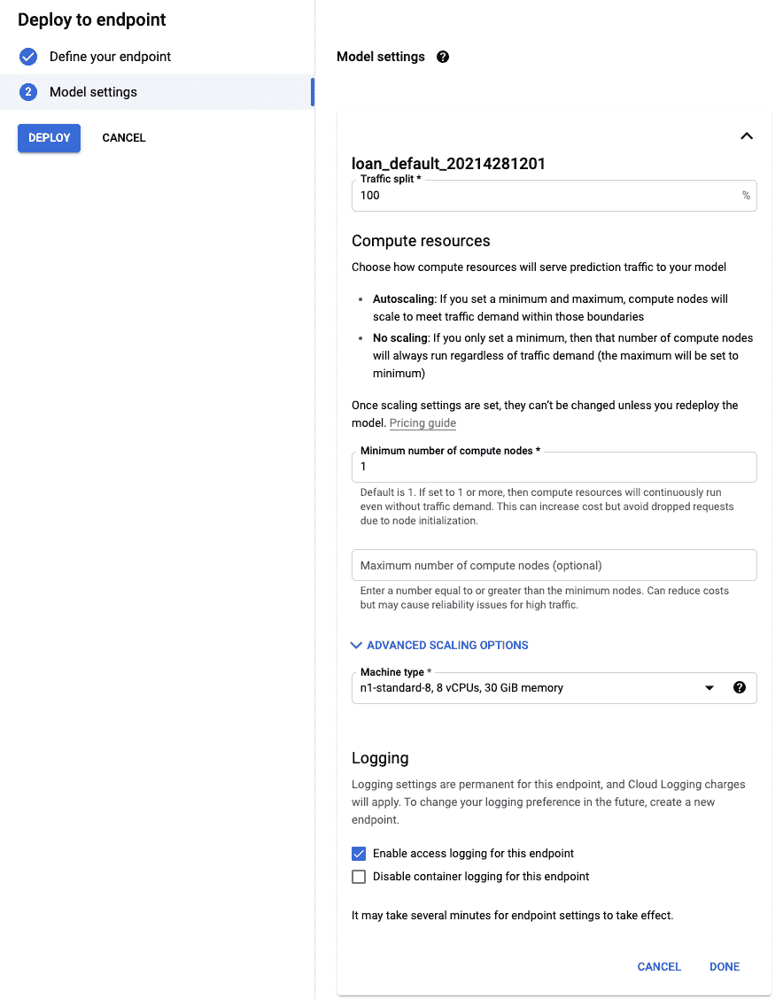

*图九。顶点人工智能-模型部署选项，模型设置。*

测试您的部署的机制将根据您的目标而变化，例如对于图像识别，您可以上传测试图像，UI 将显示预测的标签和置信度。

对于定制模型，您需要将您的容器化模型部署到一个端点。如果您使用一个预构建的容器来提供使用 TensorFlow、scikit-learn 或 XGBoost 的预测，那么您的预测输入实例需要格式化为 JSON。如果您使用自定义容器映像进行部署，情况类似。

## 5.获得预测

这就是“橡胶上路”的地方，您部署的模型已经准备好服务于预测，那么您如何得到它们呢？

从 Vertex AI UI(图 10)中，您可以选择一个模型并创建一个批量预测，即发送一组您希望模型在某个时间点(异步)返回预测的数据。在这种情况下，您不需要一定已经部署了模型。

将您的数据上传到云存储桶并选择它进行预测，显然数据类型会因型号而异。

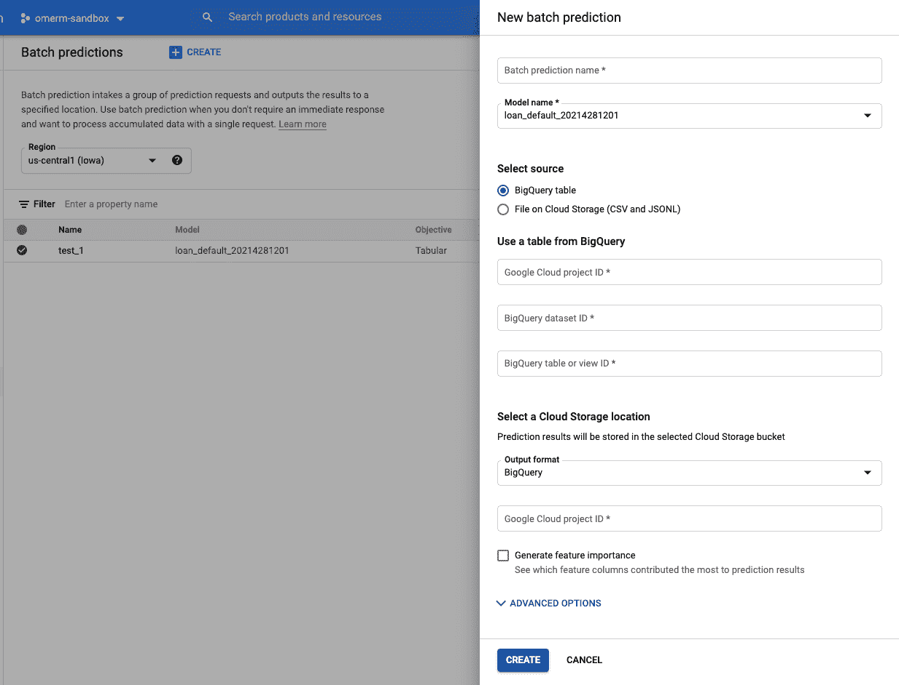

*图 10。顶点 AI —批量预测，新的批量预测。*

您还可以获得在线预测，即发送您想要立即预测的单个实例或数据行(同步)。您可以通过从模型页面选择[部署&测试选项卡或者从您的应用程序或网站调用 API](https://cloud.google.com/vertex-ai/docs/predictions/online-predictions-automl#classification) 来实现这一点。

我们现在已经到达了 ML 工作流程的末尾。但希望你现在理解了 Vertex AI 在创建 ML 模型所需的最常见任务的上下文中做了什么——从数据摄取到将其投入生产。

# 📑总结和后续步骤

这篇文章的目的是在常见 ML 工作流任务的背景下提供顶点 AI 的简化解释。关于 Vertex AI 的内容比我打算在这里写的要多得多，所以我建议你看看推荐阅读部分。

## 总而言之，我喜欢 Vertex AI 的三点是…

1.  **易上手** —用户界面干净直观。将您需要的一切都集中在一个地方。从创建快速实验到支持完整 MLOps 管道所需的所有螺母和螺栓。
2.  **有多个入口点** —无论你的技能水平和经验如何，无论是使用 AutoML，还是使用完全定制的代码，你都可以在几分钟内开始使用 Vertex AI 创建模型。
3.  **可扩展的基础设施** —托管服务的优势之一是，您可以根据需要在试验期间花费尽可能少的资金，但有信心知道您的模型可以在生产中轻松扩展。

仍然不确定下一步该做什么，我创建了下面的决策树(图 11)来帮助指导你如何用 Vertex AI 创建你的第一个 ML 模型。

没有硬性规定，但如果你的回答大多是“不”，那么考虑自动路线，反之亦然。

**好运和快乐的模型建筑！**

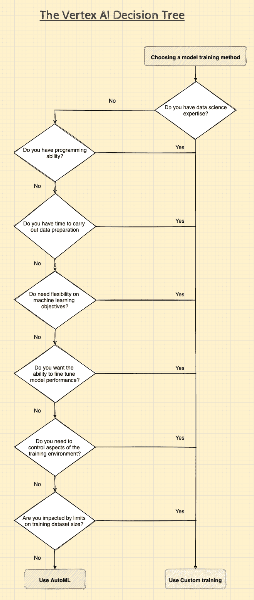

*图 11。顶点人工智能决策树——作者举例。*

# 📚进一步阅读

1.  [AutoML 入门指南](https://cloud.google.com/vertex-ai/docs/beginner/beginners-guide)，谷歌云，Vertex AI 文档
2.  [ML 新手:顶点人工智能上的学习路径，](https://cloud.google.com/blog/topics/developers-practitioners/new-ml-learning-path-vertex-ai?utm_source=linkedin&utm_medium=unpaidsoc&utm_campaign=fy21q3-googlecloudtech-blog-ai-infeed-no&utm_content=vertex&utm_term=-)伊万·纳迪尼，谷歌云
3.  [什么是可解释的人工智能？](/whats-explainable-ai-fff416111830)，奥马尔·马哈茂德，走向数据科学
4.  [在谷歌云上实现机器学习的最佳实践](https://cloud.google.com/architecture/ml-on-gcp-best-practices)