# 权重和偏差有什么作用？

> 原文：<https://towardsdatascience.com/what-does-weights-biases-do-c060ce6b4b8e?source=collection_archive---------8----------------------->

## 支持协作式 MLOps 文化的平台


照片由 [Unsplash](https://unsplash.com/photos/uc5Use-klm0?utm_source=unsplash&utm_medium=referral&utm_content=creditCopyText) 上的 [Piret Ilver](https://unsplash.com/@saltsup?utm_source=unsplash&utm_medium=referral&utm_content=creditCopyText) 拍摄

# TL；速度三角形定位法(dead reckoning)

*   [Weights&bias](https://wandb.ai/site)(W&B)是一个面向开发者的机器学习平台，用于更快地构建更好的模型。
*   它旨在支持和自动化 MLOps 生命周期中的关键步骤，如实验跟踪、数据集版本和模型管理。

## 🧠唤起了你的记忆-> MLOps

创建一个 ML 模型是容易的部分——操作化和**管理 ML 模型、数据和实验的生命周期**是事情变得复杂的地方。这就是为什么我们需要一套系统的方法和实践来应对这一挑战。

在深入研究 W&B 之前，🧐还想知道更多关于 MLOps 的事情吗？这里有一个我以前写的帖子:[什么是 MLOps](/whats-mlops-5bf60dd693dd)

## 🧠 **唤起你的记忆- > MLOps**

# 🚀入门指南

正如我之前的产品和平台相关的帖子一样，我决定在一个下午卷起袖子，给 W&B 一个旋转！

W&B 本质上是一个基于网络的订阅服务，个人账户是免费的，并提供 100 GB 的数据集存储和工件跟踪。你可以在这里报名:[https://wandb.ai/site](https://wandb.ai/site)

W&B 由两个主要组件组成，工作空间和 Python API。事实上，下面是通过这两个组件提供的功能的一个很好的总结。

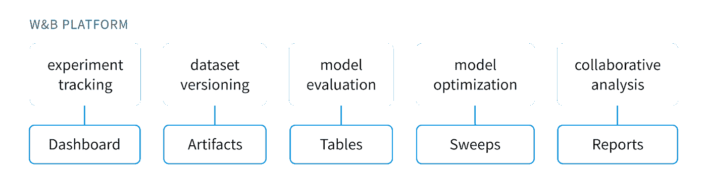

*图 0: W & B —平台，来源:W & B 网站*。

框的顶行代表 MLOps 的使能器，底行显示相应的 W&B 特性，我将在这篇文章中涉及它们。

## **工作空间**

当您登录 W&B 时，您通常会看到一个类似下图的**仪表盘**，它的左侧有一个简单干净的导航栏，您可以在这里访问最近的项目或创建一个新项目。您还可以查看您所属的团队、资源和设置。

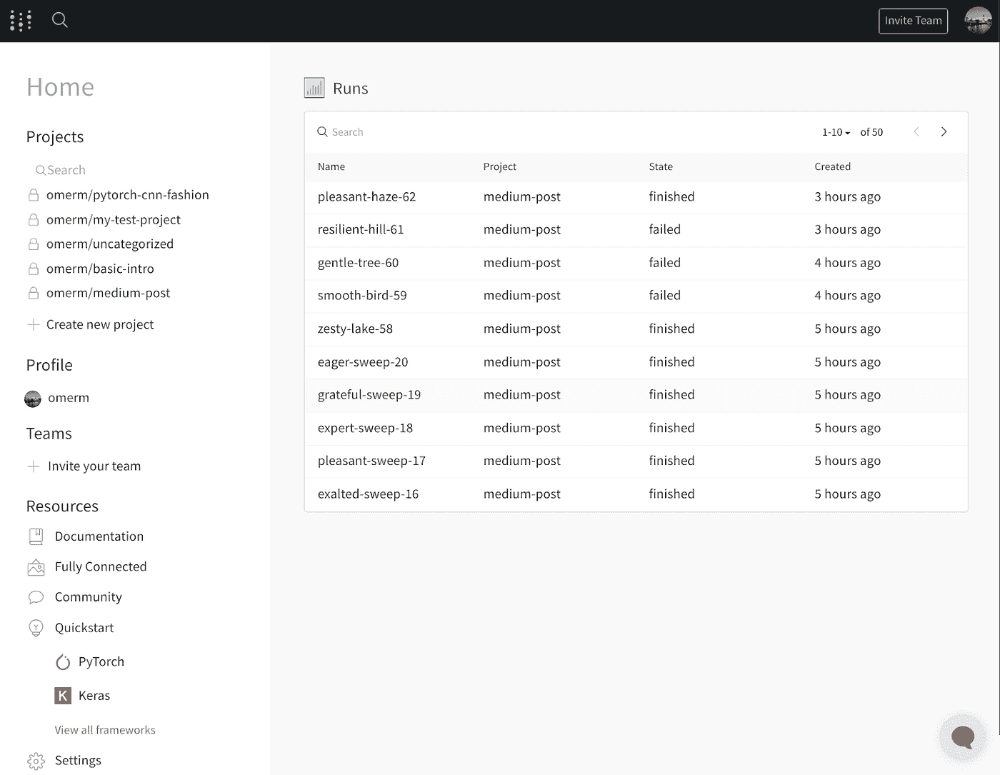

*图 1: W & B —工作空间*

导航栏右侧的主窗格包含最近的“运行”列表，稍后会详细介绍。

## **Python API**

这就是 W&B 如何与您现有的模型代码集成，并能够在工作空间中展示您的实验见解。

根据你喜欢的框架，有一些快速入门指南，在这篇文章中，我选择了 PyTorch。我使用 W&B github repo 中的 PyTorch 示例之一，使用[时尚 MNIST](https://www.kaggle.com/zalando-research/fashionmnist) 数据集训练一个 [CNN](https://en.wikipedia.org/wiki/Convolutional_neural_network) 模型。这是一个类似于[MNIST](https://en.wikipedia.org/wiki/MNIST_database)的数据集，但不是用它来训练一个对数字进行分类的神经网络模型，而是旨在识别服装、配饰和鞋类的常见类别，如靴子、运动鞋、外套和包。

用几行代码集成 W&B 真的很简单。我不会在这里重复[快速入门](https://wandb.ai/quickstart/pytorch)，而是通过几个步骤:

1.  在您的环境中安装 W&B Python API 库，并登录到您的 W&B 帐户(快速入门中提供了身份验证令牌)。

```
pip install wandbwandb login
```

2.在您现有的模型训练代码中为 W&B 库添加一个导入行，定义您想要在其中跟踪实验运行的项目，并配置超参数。

```
import wandbwandb.init(project="medium-post", entity="omerm")wandb.config = {"learning_rate": 0.01,"epochs": 10,...}
```

3.最后，在您的训练循环中添加一行代码，记录您希望在工作空间中跟踪和可视化的指标。

```
wandb.log({"loss": loss})
```

# 🧪(跑)宁和跟踪实验

MLOps 的关键支柱之一是能够进行各种实验，并有某种方式跟踪每个不同的配置如何影响您最感兴趣的模型度量。

当您运行包含给定实验的训练过程的代码时，项目中的 Runs 部分是 W&B 展示所有这些好的实验数据的地方，如下面的屏幕截图所示。

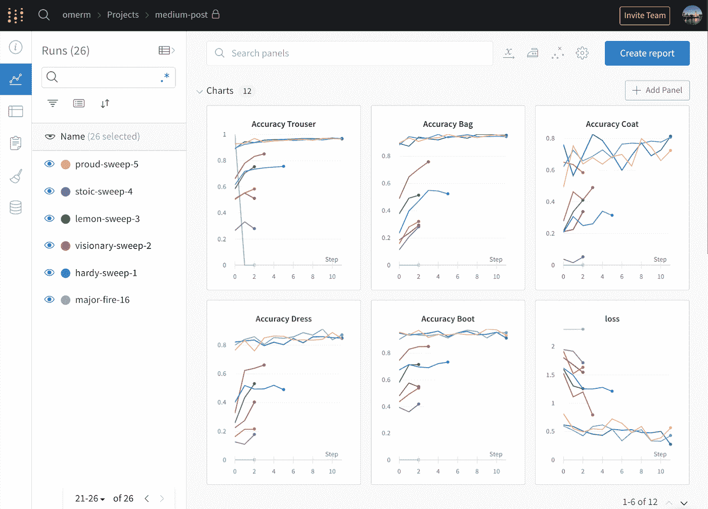

*图 2: W & B —工作空间，项目运行*

Runs 视图在左侧显示实验运行的列表，右侧的图表代表您选择记录的每个实验的指标。

例如，您可以搜索跑步、过滤并方便地按团队或指标分组。

多次实验中常见的指标由每次实验的不同颜色图表示。

单击一个单独的运行，您可以深入了解与实验相关的更详细的配置、指标和各种其他统计信息，如下面的屏幕截图所示。

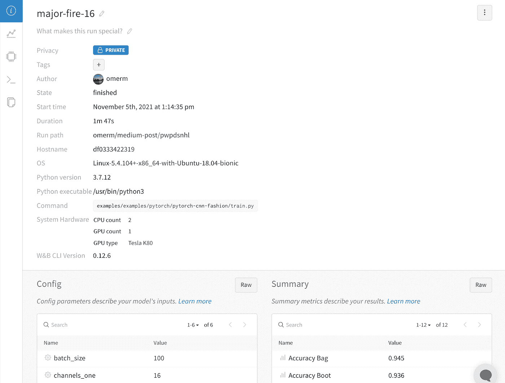

*图 3: W & B —工作区，运行*

# 🧹扫描，又名模型优化

另一个属于模型**实验和开发**的常见 MLOps 任务是超参数调整。

我对超参数调优的类比是烘焙蛋糕🍰。请考虑一下，您为构建模型而编写的框架、训练数据和代码是您组合在一起制作蛋糕混合物的配料。

然后运行代码来训练一个模型，或者将蛋糕混合料放入烤箱烘烤。

您可以将超参数视为烤箱上控制蛋糕烘烤方式的旋钮，例如定时器、温度、对流类型等。改变这些旋钮会对你的蛋糕产生很大的影响；太热，它会燃烧，如果你不煮足够长的时间，它可能不会上升。

对于模型来说也是如此——超参数值，如学习率和批量大小，会对模型需要多长时间[收敛](https://developers.google.com/machine-learning/crash-course/DPE/tp-ss-reducing-loss-learning-rate?hl=en)(或最小化损失)产生很大影响。

失败是对错误预测的惩罚。也就是说，损失是一个数字，表示模型对单个示例的预测有多差。[2]

如果模型的预测是完美的，损失为零；否则损失更大。训练模型的目标是找到一组**权重和偏差😏**在所有示例中，平均损失较低。[2]

在 W&B 中，我们可以使用“扫描”来执行超参数调优工作，并轻松地将它们分布到多台机器上以加快进程。

很容易从工作区(如图 4 和 5 所示)或者通过代码中的 API 调用来创建和配置扫描。

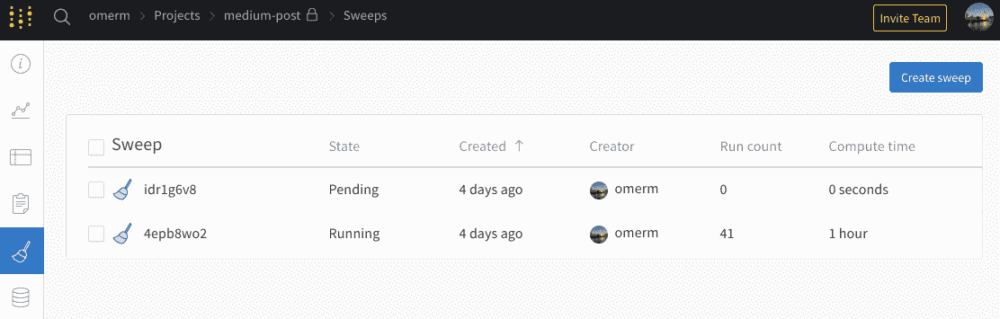

*图 4: W & B —工作区，创建/查看扫描*

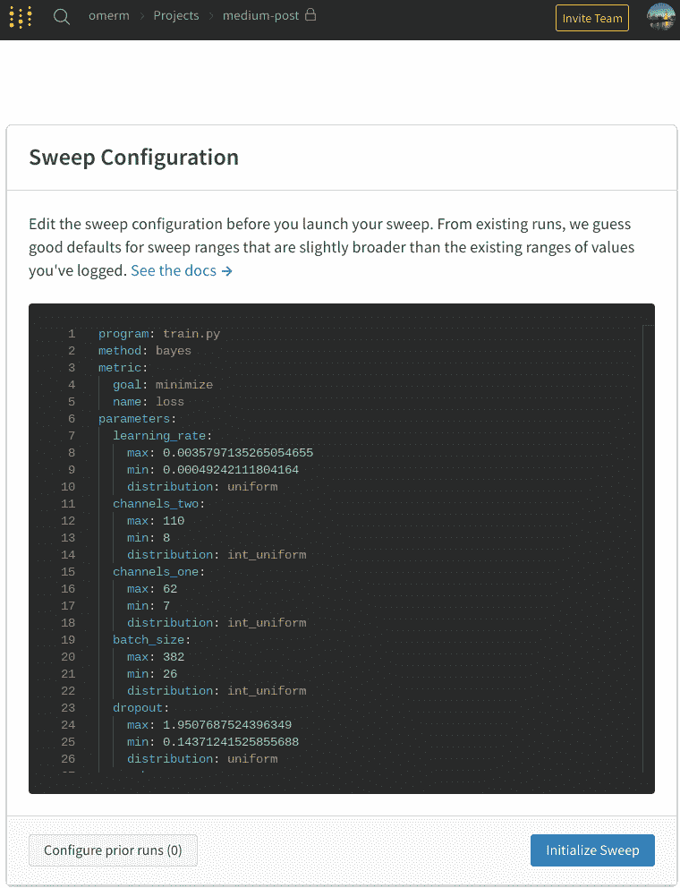

*图 5: W & B —工作空间，扫描配置*

一旦您设置了扫描的参数，您就可以用一个单行命令启动它，然后监视它的进度，特别是到目前为止已经完成的运行。

你得到了一些很好的视觉效果，总结了你的扫描结果。例如，一个图表突出显示了参数对于特定指标(如损失或准确性)的重要性。

我个人最喜欢的是平行坐标图，例如，它可以显示每次扫描的参数值及其对特定标签精度的影响，如下所示:

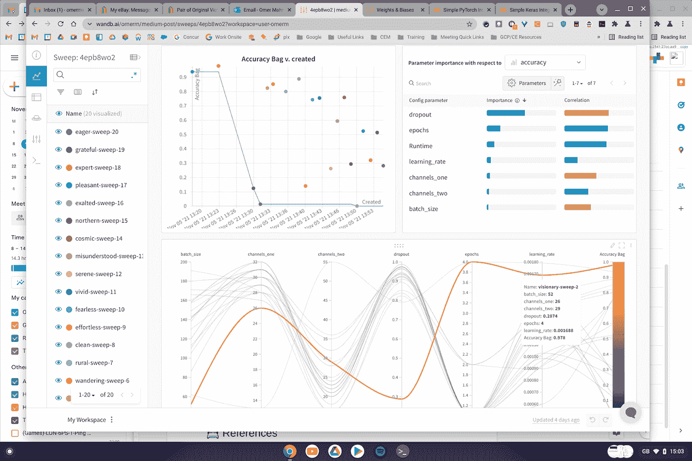

*图 6: W & B —工作空间，扫描，可视化结果*

最终，您可以使用扫描的输出为您的模型训练选择最佳超参数值。

💡**专业提示**，正如我在玩的时候发现的，贝叶斯或随机参数搜索的扫描将永远运行，除非你从命令行或工作区 UI 强制停止(ctrl-c)这个过程。或者，您可以使用计数标志指定代理应该提前尝试的运行次数:

```
NUM=10SWEEPID="ex56dcvv"wandb agent --count $NUM $SWEEPID
```

# 📊报告和协作分析

我不打算花太多时间来介绍这套功能，因为 [W & B 文档](https://docs.wandb.ai/guides/reports)已经很好地向您介绍了这些功能。

报告是让 W&B 对**分享发现**和**跨团队协作**有用的基础部分。

您得到了一个超级丰富和灵活的概念——比如创建报告的“命令的类型”/“UI。它由面板组成，可以包含从文本和降价到预建图表的任何内容，这些图表直接从项目中的各种运行中提取数据。

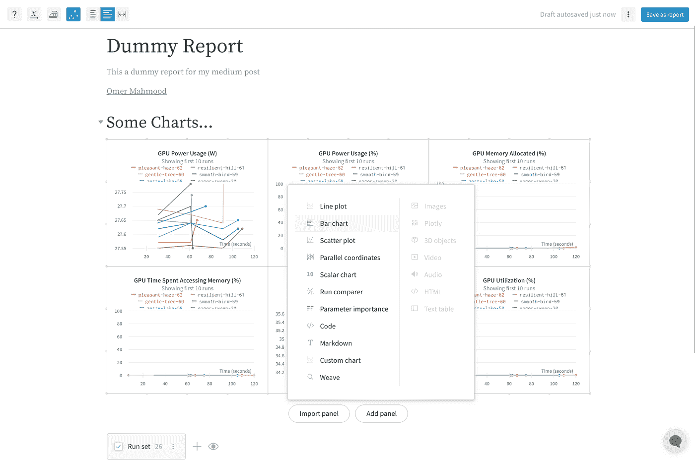

*图 7: W & B —工作区，报告*

我最喜欢的报表元素之一是“文本表格”面板。这是一个非常有用的方法来可视化你通过 wandb.log()函数记录的数据，比如你的**模型** **评估**的结果。

以时尚 MNIST 为例，我可以查看我的模型对数据集中的每张图片所做的预测。我还可以交互式地过滤该表，以显示不正确的预测、猜测与事实，如下所示:

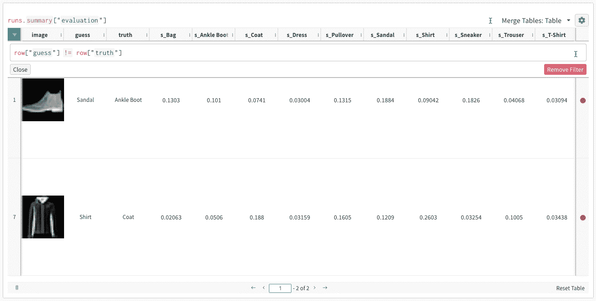

*图 8: W & B —工作区、报告、模型评估—文本表格*

它确实消除了必须快速策划、总结和分享数据科学项目发现的挫折感，并且以一种非常干净的方式做到了这一点。

# 📝工件:数据集、模型修订和管理

W&B 工作区包括一个工件注册表。在这里，您可以看到与特定项目相关的所有工件，您可以通过实例化 W&B 工件对象并将其保存在您的代码中，将数据集和模型添加到该视图中，例如:

```
artifact = wandb.Artifact(name, “model”)artifact.save()
```

您保存的任何内容都可以在项目工作区中看到，如下所示:

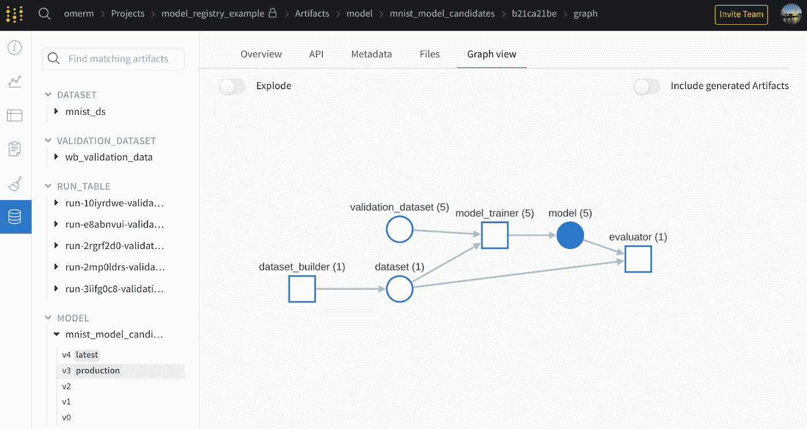

*图 9: W & B —工作空间，工件*

简而言之，W&B API 使得存储关于数据集和模型的元数据变得很容易。还有一个有用的图形视图，它展示了您的工件的血统。

跟踪工件的能力是有用的，但是当涉及到**监控**和**部署**到生产中时，这如何帮助支持我们的 MLOps 管道呢？这就是 W & B 的模型管理特性派上用场的地方！

在撰写本文时，W&B 的模型管理特性还处于测试阶段，他们正在“积极地构建模型注册和模型评估用例”。[1]

**W & B 用于模型管理功能的设计是为了跟踪和报告模型的完整生命周期:**

*   数据集:模型在其上训练的数据集的精确版本
*   代码:模型训练中使用的代码
*   模型:训练模型本身的权重
*   度量:模型在不同黄金数据集上的评估结果
*   状态:每个模型在管道中的位置(例如“暂存”或“生产”)[1]

当涉及到实现 MLOps 管道时，这个列表无疑勾选了很多框。我在文档中使用了 github 的例子,让测试版的功能快速旋转了一下。

**示例代码基本涵盖以下步骤:**

1.  为模型训练和评估生成数据集(下载 MNIST 数据),并将其发布到工件存储。
2.  使用步骤 1 中的数据集训练几个模型，改变超参数以区分每个模型。该步骤还按照创建顺序将每个候选模型及其度量发布到工件存储中。
3.  评估每个模型以确定其损失；损失最低的模型然后被“提升”到生产中。

⚠️请记住，当我说“升级”时，您的生产环境中并没有实际的模型部署。这纯粹是一个元数据标记，可以应用于工件以实现监控和跟踪的目的——但这并不是说您不能触发脚本来执行基于元数据更改的实际操作。

然后，您可以使用报告和包含编织组件的面板来可视化结果，如下所示:

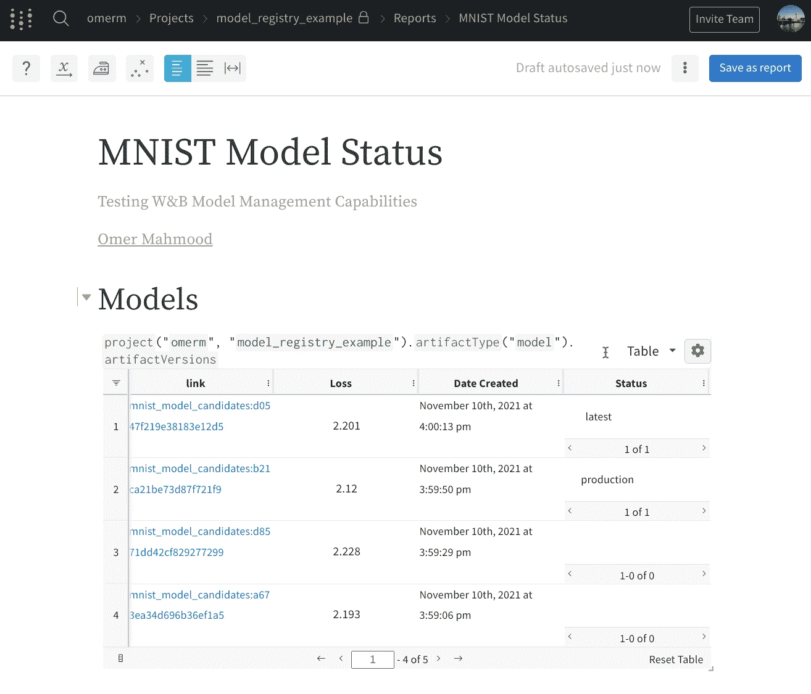

*图 10: W & B —工作区、报表、模型管理—编织*

weave 组件类似于文本表，只是它用于从工件存储中提取数据。然后，您可以将其作为报告的一部分，显示有用的信息，如创建日期、损失、状态等。

# ⚖️初步印象

我从未打算写一篇全面的产品评论😅。但是我想至少说明一下 W&B 是做什么的，并分享我使用它的简短经验！这里有一个总结…

## **设置:**

使用谷歌账户创建免费账户非常简单。我在使用 Google Colab 笔记本进行测试时，没有遇到向 W&B 认证的问题。

我没有深入研究更高级的特性，比如分布式清扫或者向一个项目添加多个贡献者。

## **易用性:**

W&B 绝对不是绝对新手的平台。您不会在这里找到任何预构建的模型，或者用于构建模型的无代码/AutoML 选项。

然而，如果你在(或管理)一个由编写 python 代码的数据科学家/工程师组成的成熟团队中，并且一直在寻找一种更结构化的方式来跨项目协作，同时也推动 MLOps 文化，那么 W&B 可能是一个不错的选择。

开始从 W&B 获得价值是如此容易，这令人吃惊。只需几行代码和对最流行的 ML 框架的广泛支持，您应该能够非常快速地将其与您现有的 python 数据科学工作流集成。

我还想说文档非常好，有很多视频，在 Google Colab 笔记本上的工作示例和一个很棒的用户社区。

## **成本:**

免费的个人账户为项目相关的存储和工件提供了 100 GB 的空间；使 W&B 工作空间工作所需的计算资源似乎也包括在内。

对[学术和开源团队](https://wandb.ai/site/academic)有优惠。除此之外，他们还根据你想存储的数据量和你想追踪的物品数量，按“现收现付”的方式收费。

请记住，您仍然需要一个运行代码的环境，这意味着在模型训练或评估的过程中，您需要消耗任何资源。

## **总体:**

我真的很喜欢为这篇文章测试 W&B。我认为随着产品的发展，它可能会成为一个更加端到端的平台，用于**自动化** MLOps 流程，但目前它在实现 MLOps 文化方面做得非常好。

如果你已经看完了，那么谢谢你的阅读，我们下一集再见！👋

# 📇参考

[1] W&B，文档，[Beta]模型管理:[https://docs.wandb.ai/guides/models](https://docs.wandb.ai/guides/models)

[2]谷歌机器学习速成班，降入 ML:训练与损失:[https://developers . Google . com/Machine-Learning/Crash-Course/降入 ML/训练与损失](https://developers.google.com/machine-learning/crash-course/descending-into-ml/training-and-loss)