# word2vec 实际学的是什么？

> 原文：<https://towardsdatascience.com/what-does-word2vec-actually-learn-489f3f950388?source=collection_archive---------17----------------------->

## [思想和理论](https://towardsdatascience.com/tagged/thoughts-and-theory)

## 以及如何从相似性函数中训练嵌入

用连续向量表示离散对象，即所谓的嵌入，是许多成功的机器学习解决方案的核心。这种优越性来自于这样一个事实，即与原始的离散对象不同，嵌入向量提供了一种紧凑的表示，它捕捉了原始对象之间的相似性。

在本文中，我们考虑著名的 word2vec 算法。Word2vec 简单直观。在高层次上，它认为频繁出现的彼此接近的单词应该具有相似的向量表示。具体来说，该示例

*嵌入(男人)-嵌入(国王)~嵌入(女人)-嵌入(女王)*

已经成为单词嵌入捕捉单词语义能力的典型代表。

然而，优化目标不能由明确定义的量来表示。作为比较，考虑使用矩阵分解学习单词嵌入。设 D 是由 *m* 个文档和一个 *n* 个唯一词的词汇组成的文本语料库。我们计算 n 乘 M 字，文档矩阵 *M* ，其中*M【u，v】*记录了字 *u* 在文档 *v* 中出现的次数，见图 1。

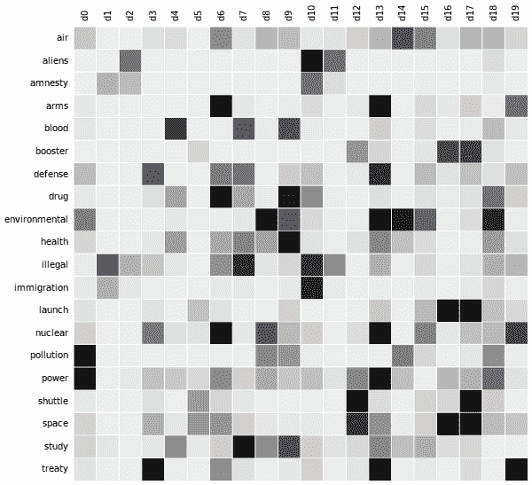

图 1: Word 文档矩阵。克里斯托弗·卡尔·克林拍摄。来源:[维基媒体](https://commons.wikimedia.org/wiki/File:Topic_detection_in_a_document-word_matrix.gif)

矩阵分解被定义为

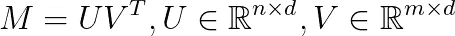

*在下文中，我们将稍微滥用符号，并用 u 表示单词 u 及其嵌入向量。*

在这种情况下，我们知道对于一个嵌入了 *u* 的单词，和一个嵌入了 *v* 的文档， *u* 和 *v* 的内积保存了单词 *u* 在文档 *v* 中出现了多少次的信息。嵌入维数 *d* 越大，逼近性越好。不幸的是，word2vec 模型的优化目标没有如此清晰的表述。word2vec 中两个字向量的内积到底保存了什么？并且通过增加维度 *d* 嵌入一定会变得更好吗？

Levy 和 Goldberg 的一篇研究论文回答了这个问题[1]。在这篇文章中，我给出了[1]中的理论结果，然后展示了如何用它们来设计更一般的嵌入类。

## 训练单词嵌入:word2vec

让我们简单考虑一下负采样的 word2vec 是如何工作的。更全面的描述，我们参考[这篇文章](/word2vec-from-scratch-with-numpy-8786ddd49e72)。设 *D* 是由单词、语境对组成的语料库。在 word2vec 中，单词 *w* 的上下文被定义为围绕 *w* 的 *k* 单词，其中 *k* 通常是在 5 和 15 之间变化的小常数。我们想要学习单词嵌入，使得如果两个单词在语料库中频繁地同时出现，则它们的内积很大。

考虑一个单词 *w* 并且让 *c* 是其上下文中的一个单词。对于语料库中一起出现的词对 *(w，c)* ，我们希望嵌入的内积最大化 *(w，c)* 确实出现在语料库中的概率(表示为 D=1)。概率由 sigmoid 函数建模:

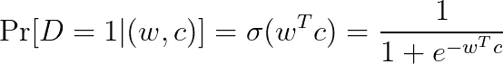

上面有一个琐碎的解决方案，我们可以简单地把所有的内积任意变大。因此，我们也引入否定对，即在语料库中不共现的对，其目的是:

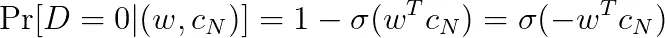

该算法可以总结如下:

```
Algorithm word2vec1\. Assign a random *d*-dimensional vector to each word that appears in the corpus.2\. Traverse the corpus and generate pairs of words that appear in it. These are the positive pairs.3\. For each positive pair, generate *k* random pairs of words. These are the negative pairs.4\. Feed the inner products of the embedding vectors of positive and negative pairs into a binary classification model where the learnable parameters are the word embeddings.
```

我们在语料库上运行上述算法几个时期，以保证学习过程收敛到最优。

## 理论分析

固定一个单词 *w* 并考虑所有出现 *w* 的配对的目标。设 *#(w，c)* 为语料库中 *(w，c)* 对的出现次数。我们可以把目标写成

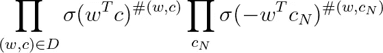

其中第二个乘积在我们生成的负对之上。

通过取目标的对数并观察每个否定词 cN 有机会被采样，我们得到:


我们来解释一下上面的内容。单词 *w* 是固定的，我们考虑语料库中出现的所有单词上下文对( *w，c)* ，并且我们对 *k* 否定对 *(w，cN)* 进行采样，使得每个单词 c 以概率#(c)/|D|被采样。我们希望正对的内积是一个大的正数。对于负对，我们希望内积是一个绝对值很大的负数。

注意，语料库中的对数|D|是恒定的。因此，通过将上述表达式除以|D|,目标变为

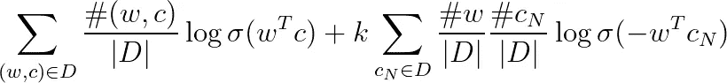

这已经给我们提供了一些直觉。目标是优化嵌入，使得它们反映正配对被采样的概率，而不是随机采样的配对。正对是以概率产生的

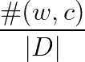

对于负对，两个词被独立地随机抽样，每个词都有概率

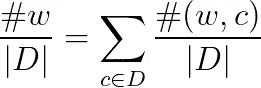

通过将内积设置为未知参数并求解相应的优化问题，我们可以找到内积的最优值:

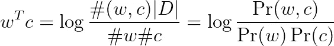

在上面的 P(w，c)是单词对(w，c)出现的概率，P(w)是单词 w 在语料库中出现的边际概率。以上原来是一个在自然语言处理中广泛使用的词语关联度量，即 [*【点态互信息(PMI)*](https://en.wikipedia.org/wiki/Pointwise_mutual_information) 度量。

这真是太神奇了！事实证明，word2vec 本质上相当于矩阵分解，其中矩阵条目是词对之间的 PMI 得分。自 80 年代以来，PMI 作为一种距离度量被用于 NLP 相关的任务[2]，远远早于单词嵌入概念的出现。

## 基于任意相似度函数的嵌入

现在很容易看出，我们可以简单地替换采样正负对的概率。我们只需要更新上面给出的 word2vec 算法中的第二步和第三步:

```
Algorithm sim2vec:1\. Assign a random *d*-dimensional vector to each word that appears in the corpus.2\. **Generate pairs of words according to a words similarity measure.** These are the positive pairs.3\. For each positive pair, **generate *k* random pairs of words by the independent sampling of word pairs**. These are the negative pairs.4\. Feed the inner products of the embedding vectors of positive and negative pairs into a binary classification model where the learnable parameters are the word embeddings.
```

为什么这很有帮助？这给了我们更多的自由来分配配对的重要性。我们可以变得有创造性，考虑不同的相似性度量。例如，单词之间的 Jaccard 相似度定义如下:

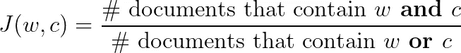

因此，如果 w 的存在意味着 c 也可能出现在文档中，则我们可以学习优化单词 w 和 c 彼此相似的目标的嵌入，反之亦然。在这种情况下，这一对(“凯拉”、“奈特莉”)的得分可能会高于(“数据”、“科学”)。目标变成了:

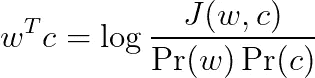

我们也可以模拟产生负对的概率。例如，Pr(w)可以是均匀分布，其中所有单词具有相同的被选择概率，而不管它们出现的频率如何。

## 从分布中取样

如果我们可以计算并存储所有对(u，v)的相似性，那么根据相似性进行采样就变得简单了:只需将相似性分数作为权重来存储对，并使用类似于 [numpy.random.choice](https://numpy.org/doc/stable/reference/random/generated/numpy.random.choice.html) 的算法进行采样。然而，这在计算上可能是不可行的。

有不同的方法来处理具有大量线对的问题。一般来说，我们希望仅使用那些具有高相似性得分的配对作为阳性配对。

*   如果您的相似性度量主要基于计数，那么数据的子样本将保留最频繁的对，但许多不频繁的对将被过滤掉。例如，我们可以只考虑语料库中文档的子集。诸如(“数据”、“科学”)之类的常用词对将可能保留下来。但这可能不是这种情况(“凯拉”，“奈特利”)。
*   对于每个对象，只考虑最近的 *t* 个邻居。例如，我们可以使用 scikit-learn 的公开实现，它使用 kd-trees 这样的算法来加速相似性搜索。这些算法适用于维度不是很高的数据。否则，人们可以考虑像[这样的方法，本地敏感散列](/understanding-locality-sensitive-hashing-49f6d1f6134)将产生相似的单词。对于像 Jaccard 相似性这样的度量来说尤其如此。

# 实用的实现

为了便于说明，我们实现了一个简单的解决方案，用于从文本语料库中学习文档嵌入。这个问题与训练单词嵌入的问题是正交的:我们根据文档包含的单词训练文档的向量表示。

我们考虑 [IMDB 情感分析数据集](https://www.kaggle.com/lakshmi25npathi/imdb-dataset-of-50k-movie-reviews/)。该数据集由用户的电影评论组成，每个评论都标有积极或消极的情绪。

*   在对文本进行预处理之后，我们使用 tf-idf 编码将文档转换成向量，这样每个文档

```
from sklearn.feature_extraction.text import TfidfVectorizer
tfv=TfidfVectorizer(min_df=0.00,ngram_range=(1,1))
tf_reviews = tfv.fit_transform(reviews)
```

参数 min_df 表示我们只考虑出现在至少 0.1%的文档中的单词。本质上，这防止我们使用可能只出现在几个文档中的非常具体的单词。

*   对于每个输入向量，找到其最近的邻居。这可以通过使用现成的软件包来实现，例如 scikit-learn 的 K-nearest neighborhood，它返回以下各项的最近邻居:

```
from sklearn.neighbors import NearestNeighbors
nn_model = NearestNeighbors(n_neighbors=t, algorithm='auto')
nn_model.fit(tf_reviews)
distances, indices = nn_model.kneighbors(tf_reviews[idx])
```

*   计算生成的 *n*t* 正对的相似度，在一个数组中对它们进行排序，并使用 numpy.random.choice()根据它们的权重进行采样:

```
eps = 1e-3
weights = [(1.0/(d+eps))**2 for d in distances[0][1:]]
weights = [w/sum(weights) for w in weights]
pos = np.random.choice(indices[0][1:], nr_pos_samples, p=weights)
neg = np.random.choice(nr_reviews, nr_neg_samples)
```

*   使用 Keras 生成器生成正负对:

```
class PairsGen(tf.keras.utils.Sequence):

    def __init__(self, data, nr_pos, nr_neg, ...):

        """Initialization
        :param data: the sparse matrix containing 
        :param nr_pos: the number of positive samples per word
        :param nr_neg: the number of negative samples per pos. pair
        ...
        """
        ... def __getitem__(self, idx):
       """
       Sample self.nr_pos word pairs and self.nr_neg word pairs
       """
       .....
```

*   将生成的对输入到具有嵌入层、计算内积的点层和具有 sigmoid 激活函数的输出层的浅层神经网络中:

```
Layer (type)                    Output Shape         Param #     Connected to                     
==================================================================================================
input_2 (InputLayer)            [(None, 2)]          0                                            
__________________________________________________________________________________________________
context_embedding (Embedding)   (None, 50)           2500000      tf.__operators__.getitem_3[0][0] 
__________________________________________________________________________________________________
word_embedding (Embedding)      (None, 50)           2500000      tf.__operators__.getitem_2[0][0] 
__________________________________________________________________________________________________
dot_1 (Dot)                     (None, 1)            0           context_embedding[0][0]          
                                                                 word_embedding[0][0]             
__________________________________________________________________________________________________
flatten_1 (Flatten)             (None, 1)            0           dot_1[0][0]                      
__________________________________________________________________________________________________
dense_1 (Dense)                 (None, 1)            2           flatten_1[0][0]                  
=====================================================================
Total params: 5,000,002
Trainable params: 5,000,002
Non-trainable params: 0
```

上述方法将训练嵌入:

```
model.compile(optimizer='adam', loss= 'binary_crossentropy', 
              metrics=['accuracy', 'AUC'])
model.fit(generator, epochs=10)
Epoch 1/10
10000/10000 [==============================] - 153s 15ms/step - loss: 0.6354 - accuracy: 0.6667 - auc: 0.5359
Epoch 2/10
10000/10000 [==============================] - 152s 15ms/step - loss: 0.6129 - accuracy: 0.6868 - auc: 0.6151
Epoch 3/10
10000/10000 [==============================] - 151s 15ms/step - loss: 0.5680 - accuracy: 0.7292 - auc: 0.6963
  ...........
Epoch 10/10
10000/10000 [==============================] - 151s 15ms/step - loss: 0.3891 - accuracy: 0.8323 - auc: 0.8865
```

然后，我们可以提取每个单词的嵌入层，并对文档进行聚类(类似于图 1 中的 gif 所示)。我们观察到两个集群中的情感分布非常不同:

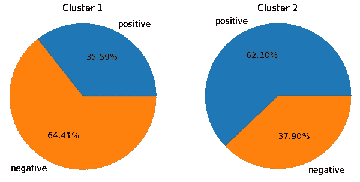

两个集群中的情感分布。图片作者。

## 密码

上述内容的 Python 实现可在以下网站公开获得:[https://github.com/konstantinkutzkov/sim2vec](https://github.com/konstantinkutzkov/sim2vec)

[1]奥马尔·利维，约夫·戈德堡。[神经字嵌入为隐式矩阵分解](https://papers.nips.cc/paper/2014/file/feab05aa91085b7a8012516bc3533958-Paper.pdf)。国家实施计划 2014 年:2177-2185

[2]肯尼斯·沃德·丘奇和帕特里克·汉克斯[词语联想规范、互信息和词典编纂](https://aclanthology.org/P89-1010.pdf)。计算语言学，16(1):22–29，1990。