# 是什么驱使人们去抗议，什么因素促成了最大的成功？

> 原文：<https://towardsdatascience.com/what-drives-people-to-protest-and-what-leads-to-the-most-success-7ca6c7ad3547?source=collection_archive---------44----------------------->

## 围绕抗议活动的关键问题的数据驱动多学科方法。 [*附随代码可在 GitHub*](https://github.com/malikamohan01/protestproject/blob/main/codeappendix) *上查看。*

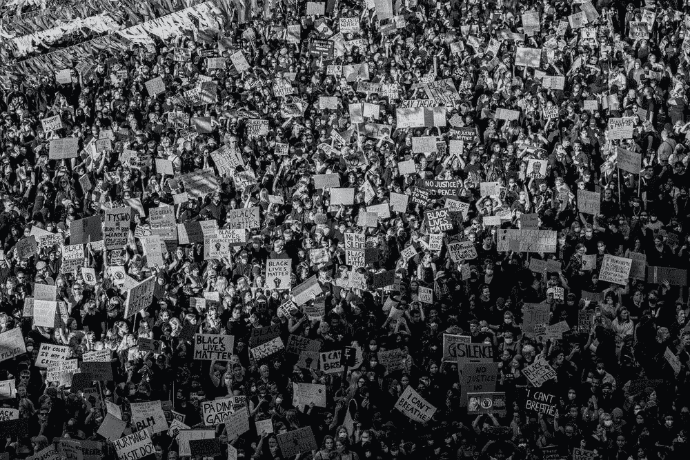

[Teemu Paananen](https://unsplash.com/@xteemu?utm_source=unsplash&utm_medium=referral&utm_content=creditCopyText) 在 [Unsplash](https://unsplash.com/s/photos/protest?utm_source=unsplash&utm_medium=referral&utm_content=creditCopyText) 上拍摄的照片

在印度全国范围的农民抗议和正在进行的黑人的命也是命示威之间，过去几个月暴露了印度公民对邦政府和国家政府的一系列不满，促使他们进行抗议，以满足他们的要求。

这些当前的事件促使我们想要进一步研究抗议行为，并探索世界各地的抗议是什么样的，是什么驱使人们进行抗议，以及在决定政府行为者是否满足抗议者的要求时，哪些因素可能是重要的。我们选择对这些问题采取多学科的方法，对抗议和政治权力进行文献综述，从 Tableau 的数据可视化中汲取见解，分析统计上显著的变量，并在 r。

**数据理解**

除了我们的文献综述，我们还利用了来自[群众动员项目](https://dataverse.harvard.edu/dataset.xhtml?persistentId=doi:10.7910/DVN/HTTWYL)的数据集进行分析，该数据集纳入了 1990 年至 2019 年期间针对政府的抗议活动，涉及至少 50 人。大众动员通过评估《纽约时报》、《华盛顿邮报》、《伦敦时报》等报纸来源来收集数据，并建立了需要退回和审查的关于特定抗议事件的文章基线。随后的数据集包括抗议的开始日期和结束日期、地点、抗议者身份、抗议者人数、抗议是否是暴力的、抗议者的要求、国家的反应以及描述抗议活动的注释/文本信息和背景等变量。有关数据收集过程和数据集的更多信息，请参见大众动员数据项目手册和用户手册。值得注意的一个有趣区别是，虽然有几个地区和国家的抗议数据，包括北美国家加拿大和古巴，但没有美利坚合众国的抗议数据。

**数据清理**

通过特征工程、列删除和检查空值和错误值，使我们的数据集适合分析的过程非常漫长。经历的步骤包括:用“.”替换所有的空格和单元格在具有“NA”的 it 中，删除不相关/无意义的字段，例如 ID、CCode 和 Sources，创建连接开始日/开始月/开始年的新开始日期字段和连接结束日/结束月/结束年的新结束日期字段，通过计算开始日期和结束日期变量之间的差创建用于拒付长度的新列，删除具有多数空列/单元格的行，删除全部空列，将字符串数字变量转换成数字(例如“十几”)， 使用“注释”列中的上下文信息创建一个新的基于文本的 csv，最后创建一个状态响应虚拟变量，作为我们的**目标变量**，通过 if/else 功能将负面的高级状态响应(例如，杀戮、枪击、忽视)**转换为“0”并将抗议者要求的状态调节转换为“1”。**

**探索性数据分析**

为了获得见解，我们在 Tableau 和 R 中进行了一系列探索性数据分析，评估变量的分布和计数，并回答了有关世界各地抗议活动特征的关键问题，如下所示。

***可视化效果***

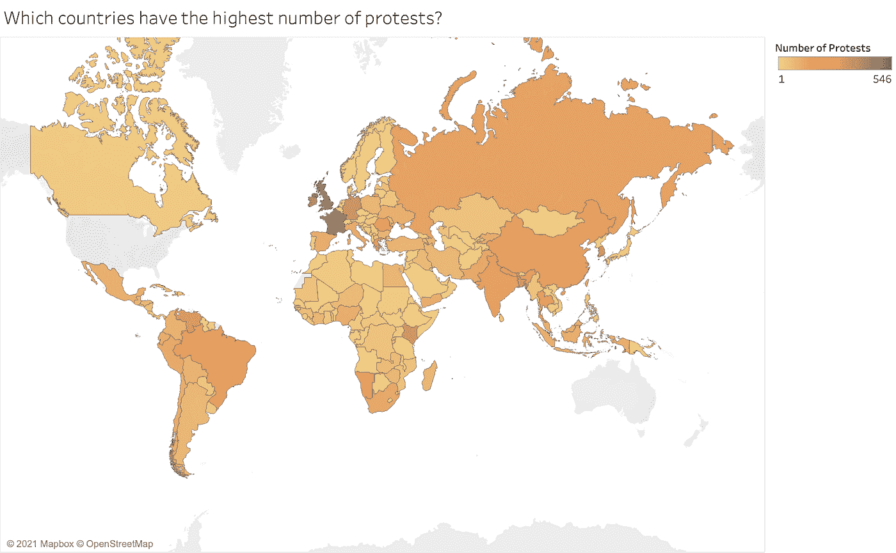

作者图片

*法国和英国等欧洲国家的抗议活动是世界上最多的。在亚洲，韩国和中国是抗议率最高的国家。此外，委内瑞拉和巴西是南美抗议数量最多的国家。*

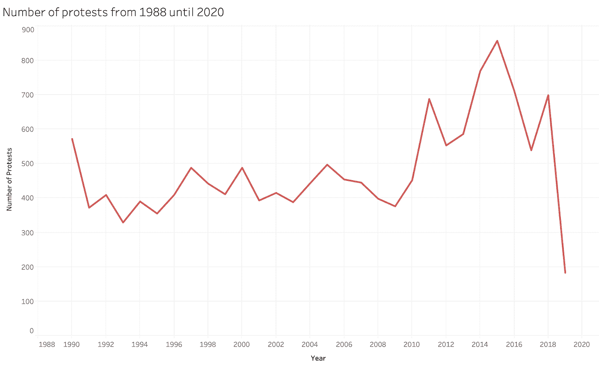

作者图片

*这些年来，抗议活动的数量缓慢增加，其间有一些波动。2011 年，我们经历了自 1990 年以来的最高峰值，随后在 2015 年出现了更高的增长，共有 857 次抗议。*

作者图片

*在 1 月到 5 月期间，我们观察到抗议活动的高潮。在这个范围内，三月的抗议活动最多。此外，在任何一年的下半年，抗议活动的数量似乎都较少。*

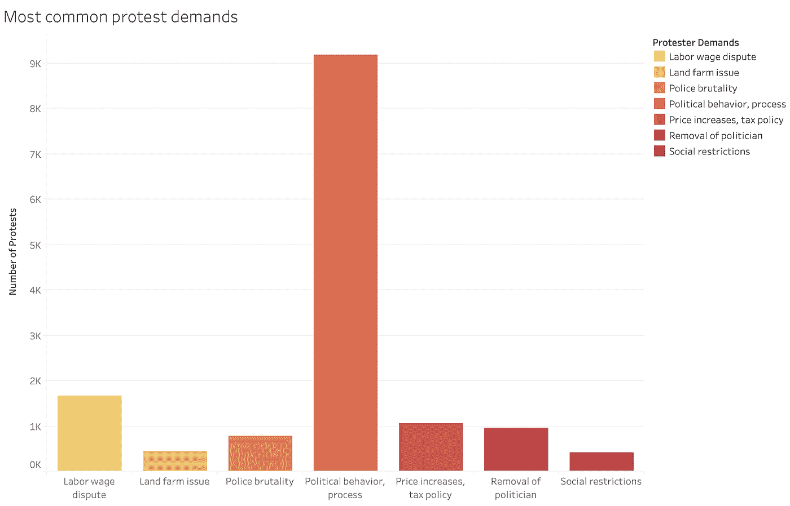

作者图片

抗议者的要求涉及各种社会、经济和政治问题。最常见的需求与政治行为和过程有关。这一类别包括与政治改革和保护民主程序有关的任何要求。

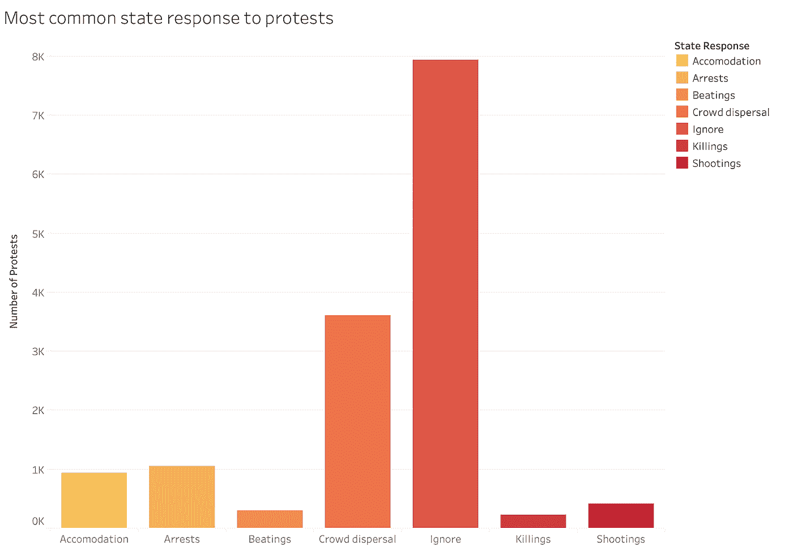

作者图片

政府最常见的反应是无视抗议，然后驱散人群。这些类型的政府反应是意料之中的，因为大多数抗议活动被归类为非暴力。

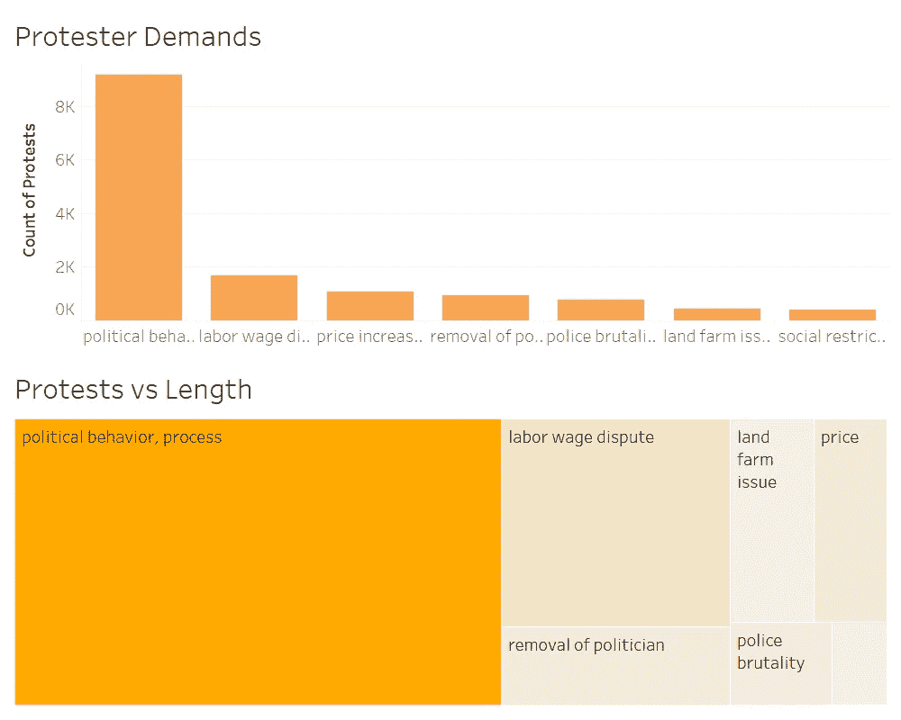

作者图片

*抗议活动最常见的驱动因素是对政治行为和政治程序问题的回应，其次是劳动工资纠纷。这些反映了抗议时间最长的类型；因为相同的两种类型的需求具有覆盖最高天数的抗议。类似地，抗议次数和平均持续时间最少的是那些涉及社会限制要求的抗议。*

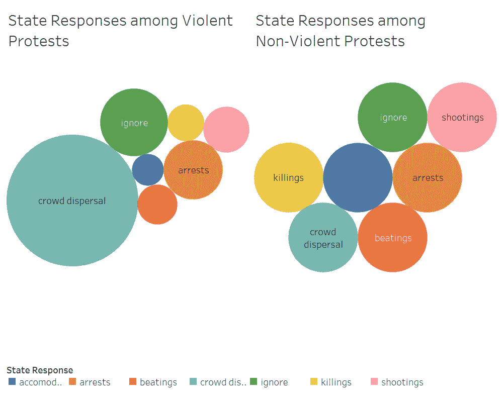

作者图片

*各州如何应对暴力和非暴力抗议的分类，每种类型的比例相似，但非暴力抗议的频率较低。*

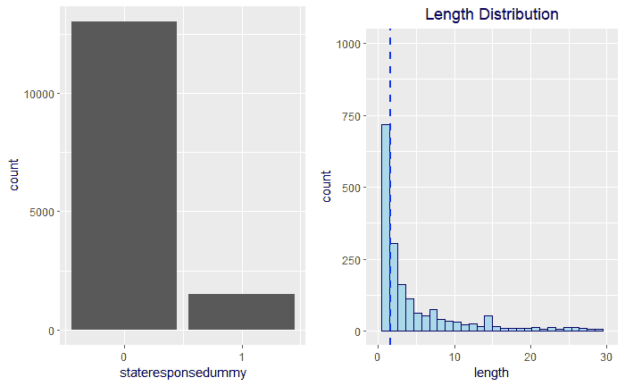

作者图片

*大多数抗议活动都没有得到政府的通融，这使得探究导致政府通融与合作的因素变得有趣起来。此外，抗议活动的持续时间通常不到一天，中位数为 0，平均值为 1.664。然而，最大值是一个持续数年的抗议，持续时间为 938 天(出于比例目的，未在可视化中描述)。*

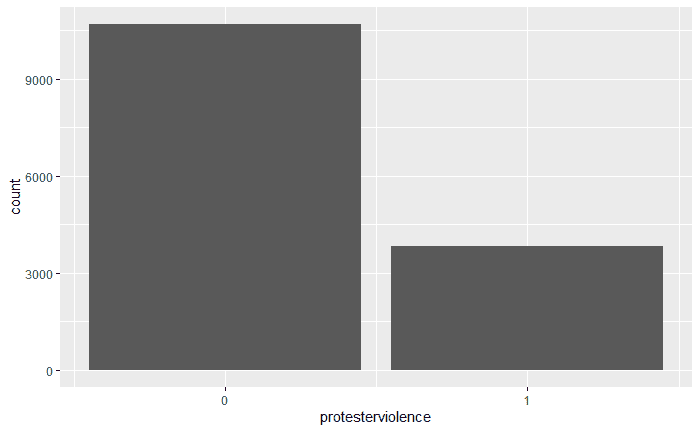

作者图片

*尽管媒体经常描述抗议活动(如文献综述部分所述)，但大多数抗议活动并不涉及抗议者的暴力行为。*

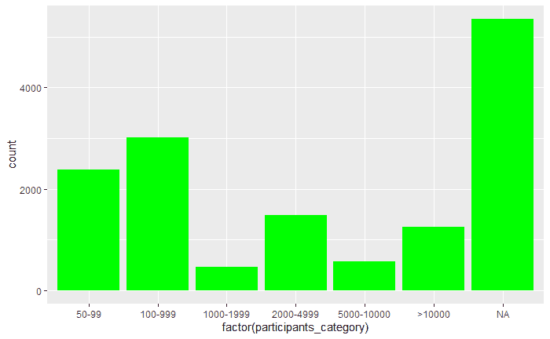

作者图片

*出现频率最高的参与者类别是 100–999，后面是 50–99，表明他们通常处于较小的一方，但是这通常没有被报告，因为 NA 的显著水平表明了这一点。*

您可以使用我们的 [**交互式仪表盘继续探索抗议数据的计数，点击此处链接(预览如下)**](https://public.tableau.com/shared/56TC6WW2B?:display_count=y&:origin=viz_share_link)**，并按国家、时间范围、抗议者要求和州响应进行过滤！**

**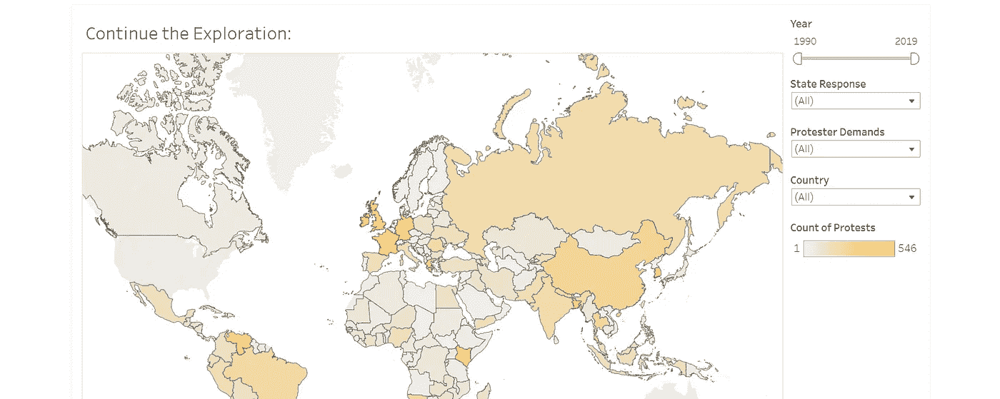**

*****测试*****

**除了可视化，我们的探索性分析包括测试变量的独立性和统计显著性。最有趣的发现包括国家反应和长度之间的统计显著正相关(抗议时间越长，它与政府的通融越相关)，卡方检验向我们揭示了国家反应虚拟变量和抗议时间长度以及长度和抗议者暴力(存在或不存在)之间的关系不是独立的。**

****造型****

**在对各种模型进行迭代和比较，并将分类变量转换为因子以便能够在模型中使用它们之后，最适合我们的数据并为我们提供最多见解的是一个简单的**广义线性回归模型** (glm)和一个更加微妙的**随机森林**模型。这些模型可以用来预测围绕抗议的某些因素是否可能导致国家对请求的通融。此外，他们还帮助确认了在我们的探索性数据分析阶段确定的、在州对抗议者要求的适应中被确定为重要的变量。**

**作为参考，广义线性模型是“普通线性回归的灵活推广，允许响应变量具有非正态分布的误差分布模型”(维基百科)，随机森林模型通过“在训练时构建大量决策树并输出作为类模式或单个树的均值/平均预测的类”来运用集成学习(维基百科)**

**在使用所有解释变量和所创建的状态响应虚拟字段的目标变量构建线性模型后，统计显著变量(< 0.05) included length, protester violence, participants category, and protester demand. Additionally, based on the factors the outputs showed us that specific statistically significant positive relationships were the year 2008, the region of Asia, length, protester violence, a participants range of 2000–4999, and the protester demand of price increases/tax policy . Negative ones included the years 1992, 1993, 2003, 2011, 2016, 2019, the regions Central America, South America and Europe, startmonth, and the protester demand of police brutality. The model had an adjusted R-Squared value of 0.6073, suggesting 60% of the data is explained by the model. More insights into the outputs of this linear model can be found by running the code in the accompanying GitHub.**

**The trained and tested random forest model had a lower r-squared of 0.1195, but still provided us valuable information based off the node purity and decrease in error with the additional amount of classification trees utilized (500 trees) as can be seen below:**

**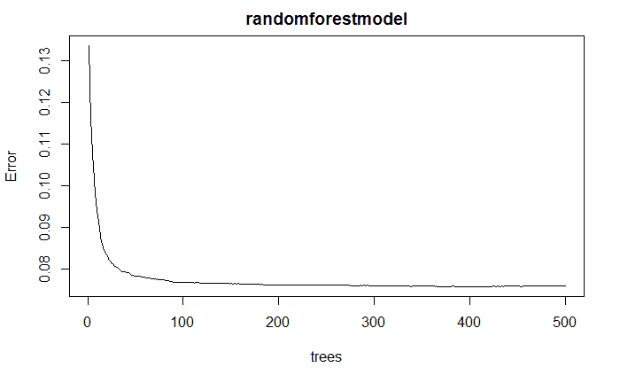****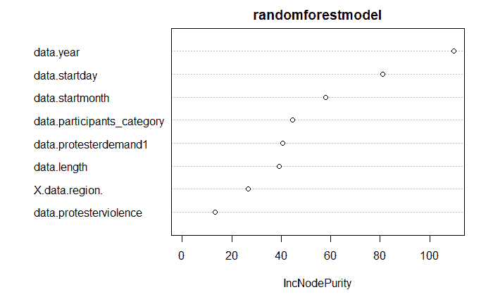**

**The variables our random forest model opted to include (listed in order of node purity) were: **年的 p 值、开始日期、开始月份、参与者 _ 类别、抗议者需求、长度、数据区域和抗议者暴力**)(关于抗议中是否使用暴力的虚拟变量)。节点纯度越高，表明越多的数据属于一个类，因此变量能够被这些变量更明确地分割，因为它们在确定一个州是否可能满足抗议者的要求方面更重要。**

**最后，我们对数据集中提供的上下文注释进行了文本建模，以查看在描述抗议活动时不同措辞的**最高频率。出现频率最高的术语或词干是抗议( *20，222)* 、警察( *10，252)* 、治理( *7984)* 和德蒙斯特( *7597)* 。在下面的可视化中可以看到更多，较大且更集中的术语是在数据集中出现频率较高的术语:****

**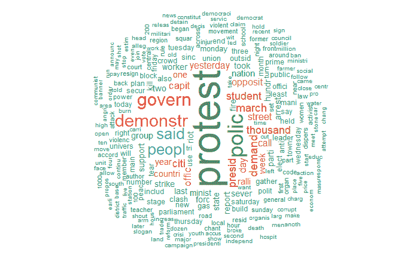**

****文献综述发现****

**互联网上有大量与抗议相关的文献，涵盖了一系列主题，包括抗议是否有效，世界各地的大规模抗议有哪些共同点，以及媒体如何描述它们。**

**虽然在本文的探索部分分享的国家通融与被忽视的负面回应/要求的数量可能令人沮丧，但研究向我们揭示了在正确的环境和情况下，抗议实际上是有效的，有价值的。**

**正如《大西洋月刊》上的一篇文章所写的那样，“在短期内，抗议活动可以起到一定程度的作用，以至于他们可以吓唬当局改变他们的行为。抗议是信号:“我们不高兴，我们不会容忍事情的现状。但要做到这一点，“我们不会容忍”的部分必须是可信的。如今，大型抗议活动有时缺乏这样的可信度，尤其是因为数字技术让组织抗议变得如此容易。” [(来源)](https://www.theatlantic.com/technology/archive/2020/06/why-protests-work/613420/?fbclid=IwAR0BltT543L0hdh6o_MFkivjurshKpVMXmqwSIfn_a9ImK1kvomvWldKG-Y)**

**此外，促使成功的最有说服力的抗议因素被发现是抗议活动的规模和范围，以及抗议者之间是否达成一致，他们的信息是否统一[(来源)](https://www.asanet.org/sites/default/files/attach/journals/apr17asrfeature.pdf?fbclid=IwAR1TXD8htABFbDwSxlWmr6lYA8HB0awc-MsQzYIoDbt691ZWjngmcv--tQ0)。**

**至于现在媒体描绘抗议的方式，通常是以负面的视角，描绘暴力和敌意。这可能会适得其反，最大限度地减少抗议者的运动，因为这助长了抗议者只是愤怒和煽动暴力或伤害社区的言论，而不是有效地展示这些情绪是如何源于他们所反对的系统性问题的。**

**用来描述这一点的框架被称为抗议范式，它被定义为“社会抗议报道的惯例化模式或隐含模板”。《牛津手册》将此描述为*“当运动开始变得更大或更具破坏性，足以引起媒体关注时，他们收到的报道往往是对抗性的——正如跨越数十年媒体报道抗议运动的大量研究所确立的那样。记者对反战抗议、劳工抗议、堕胎法抗议、反政策示威、反核运动和反全球化抗议等给予了敌意对待——通常是通过嘲笑它们或将其描绘为暴力的。”* [(来源)](https://www.oxfordhandbooks.com/view/10.1093/oxfordhb/9780199935307.001.0001/oxfordhb-9780199935307-e-90?fbclid=IwAR1lz-JSnkYgsdardsUlBkv2ATdxdqj3DywXc3bpBwFyAhS_FJ4k0P8lPQ0)**

****结论&含义****

**关于促成抗议成功的因素，一些最重要的要点是，抗议的时间长度和暴力行为与国家的通融程度有着统计上的显著正相关。然而，正如一些文献指出的，这些可能是大规模问题的症状，需要长期和更暴力的抗议，因此更重要，从而促使政府做出更多回应；重要的是要区分它，就像我们通篇提到的其他关系一样，不一定是因果关系，但仍然是一种关系。**

**此外，在当前的社会政治对话中，一个特别相关的统计数据是，迁就需求和警察暴行抗议之间存在显著的负相关(同时，与价格上涨/税收政策问题之间存在正相关，表明政府更有可能迁就处理这些话题的抗议)。此外，从全球角度来看，中美洲、南美洲和欧洲的政府不太可能回应抗议者的要求，而亚洲政府则更有可能。这一分析中有趣的下一步将包括对言论自由的地区政策、政府体制结构的审查，以及纳入美国的抗议数据。**

**随着抗议活动能够通过社交媒体和数字化社区平台更快地进行规划和实施，看看这种形式的社会变革的未来将会是一件有趣的事情。虽然一些研究人员认为，由于其频率增加或减少到趋势化/不可描述的事件，这可能导致他们潜在地失去可信度和做出改变的能力，但其他人认为，如果做得正确，并且在允许的环境下，它将继续作为一种从外部点燃政治变革的方式。**

**鉴于当前的事件和稳定的抗议流交织在我们的媒体流和生活中，我们希望这种对过去近 30 年来世界各地抗议活动的多学科一瞥能够提供一些有趣的见解，了解政府抗议发生在哪里和为什么以及何时更有可能取得成功！**