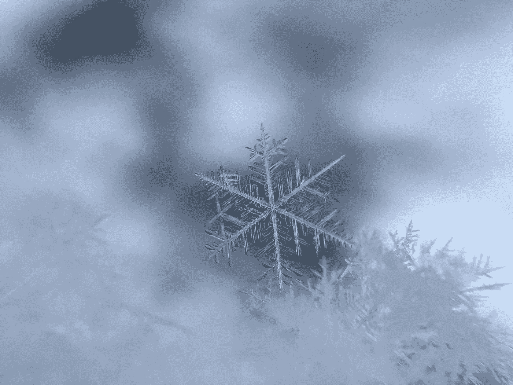
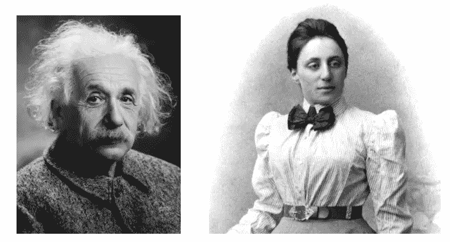
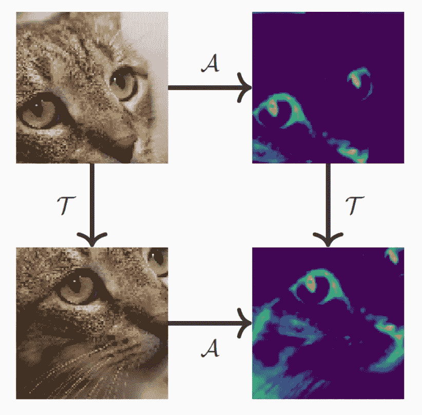

# 关于机器学习，爱因斯坦能教给我们什么

> 原文：<https://towardsdatascience.com/what-einstein-can-teach-us-about-machine-learning-1661e26bef2c?source=collection_archive---------29----------------------->

## [思想和理论](https://towardsdatascience.com/tagged/thoughts-and-theory)

## 利用机器学习中的对称性

*在许多方面，物理学和机器学习有一个共同的目标:为观察到的现象建立模型。在实现这个目标的过程中，物理学家早就理解了对称性的重要性。在这篇文章中，我们来看看物理学中的对称思想是如何作为机器学习的指导原则的。*

这篇博客文章是由来自[的奥利弗·科布和](https://www.kagenova.com/)的卡根诺娃共同撰写的。

雪花的对称性。[图片由 [Damian McCoig](https://unsplash.com/@damianmccoig?utm_source=medium&utm_medium=referral) 在 [Unsplash](https://unsplash.com?utm_source=medium&utm_medium=referral) 上拍摄]

在过去的十年里，机器学习取得了长足的进步，特别是在涉及复杂高维数据的问题上，如计算机视觉或自然语言处理。然而，与生物智能相比，对机器智能的一个常见批评是它从例子中学习的效率低下。一个小孩可能只通过少数几个例子就能学会识别一种新动物，而现代机器学习系统可能需要数百甚至数千个例子才能完成同样的壮举。

# 物理学中的对称性

作为人类，我们根据强有力的物理法则形成周围世界的模型，其中许多是我们下意识学到的。物理学家探索这些定律和模型是如何被形式化和发现的。他们的目标是制定模型的基本过程，准确地描述和预测观察到的现象。

物理系统可以在不同的抽象层次上建模。用来解释天文现象的模型通常利用不同的物理定律来解释亚原子粒子。然而，有一个原则贯穿于所有抽象层次的物理定律:必须尊重自然界已知的对称性。

关于物理定律的对称性的概念与它在描述物体对称性时更熟悉的用法略有不同。如果一个物体在某种变换下保持不变(即不变),则认为它具有对称性。例如，一个球体在任意旋转下保持为球体的事实意味着它表现出旋转对称性。

另一方面，如果支配一个系统行为的物理定律以同样的方式适用于该系统，则该定律被认为是关于某种变换对称的。

一个简单的例子是平移对称，它满足的定律以同样的方式应用于一个系统，而不考虑系统的位置。例如，一个球落在一所房子的一个房间里的行为与一个球落在另一个房间里的行为是一样的(忽略任何外部因素，如任何轻微的微风)。

第二个例子是旋转对称，它满足的定律同样适用于一个系统，不管它面向哪个方向。第三个例子是时间平移对称性，满足不随时间变化的定律。

物理学家早就意识到物理定律的时空对称性。然而，在 20 世纪早期，对称性在物理学中的重要性经历了一次范式转变。

爱因斯坦没有从物理定律出发，推导出相应的对称性质，而是在他 1905 年关于狭义相对论的著名论文中，用对称原理作为出发点，推导出新的物理定律。

十年后，德国数学家艾米·诺特进一步提升了对称性在物理学中的作用，他在抽象代数和理论物理两方面都做出了开创性的贡献，而当时女性在很大程度上被排除在学术职位之外。她证明了物理定律的每一个连续对称都存在一个相应的守恒定律。例如，动量守恒定律可以从物理定律的平移对称性中推导出来。类似地，角动量守恒来自旋转对称，能量守恒来自时间平移对称。

阿尔伯特·爱因斯坦(左)和艾米·诺特(右)。【图片来源于维基共享资源:[爱因斯坦](https://en.wikipedia.org/wiki/File:Albert_Einstein_Head.jpg)；[诺瑟](https://commons.wikimedia.org/wiki/File:Noether.jpg)

> 物理学的基本定律，如能量守恒和动量守恒，实际上是从宇宙的对称性而来的。

利用对称性作为指导原则来发现相应的规律和模型来描述观察到的现象不仅在物理学中有很大的用处，而且还可能在机器学习中得到利用。

# 机器学习中的对称性

机器学习实践者非常清楚对模型进行约束以控制[偏差-方差权衡](https://en.wikipedia.org/wiki/Bias%E2%80%93variance_tradeoff)的重要性。当寻找解释变量和目标变量之间关系的模型时，在机器学习中，我们首先指定一类模型，我们假设这些模型包含一个充分描述的模型。在这一课程中，我们寻找最能描述观察到的现象的模型——即最大化拟合经验测量的模型。

重要的是要指定一个足够宽的类，使其包含一个准确描述关系的模型，同时也要有足够的限制，使其不会被过度适应数据的模型超越。这通常很难实现，因为当解释变量和目标变量之间的关系没有被很好地理解时(毕竟这是我们希望学习的)，机器学习是最有用的，因此如何设置这些界限并不明显。例如，我们知道图像(即像素强度阵列)和对应于图像语义的类别之间的关系非常复杂。我们如何指定一个模型，在相对受限的情况下允许这样的复杂性？

> 将[归纳偏差](https://en.wikipedia.org/wiki/Inductive_bias)引入机器学习模型来解决这个问题的一个特别有效的方法是利用对称原则，这在这一点上应该不会令人惊讶！

给定一大类模型，我们可以立即忽略绝大多数不符合已知问题所展示的对称性概念的模型。本着与爱因斯坦发现狭义相对论时相同的精神，我们首先注意到应该满足的对称原则，然后反向工作，找到一个最能描述观察到的数据的模型。

# 卷积神经网络中的对称性

这个原则如何在机器学习中得到利用的典型例子是为计算机视觉问题设计卷积神经网络([CNN](/applied-deep-learning-part-4-convolutional-neural-networks-584bc134c1e2))。正如在神经网络的任何使用中，目标是从低级特征中分级学习高级特征。计算机视觉中最重要的对称是平移对称:无论出现在图像的什么位置，猫眼都是猫眼。

平移等方差图。给定一幅图像(左上)，应用卷积核(𝒜)以获得特征图(右上)，然后平移(𝒯)该特征图(右下)相当于首先平移图像(左下)，然后应用卷积核(右下)。【[猫和特征图图片来源](/applied-deep-learning-part-4-convolutional-neural-networks-584bc134c1e2)

CNN 通过其架构的设计来编码平移对称性。每个神经元对应于输入的空间区域，并且仅连接到前一层中神经元的相应邻域。至关重要的是，每一个神经元都以完全相同的方式与前一层中的相应邻域相关联。因此，无论特征(例如猫眼)位于图像中的何处，它都会以相同的方式刺激相应位置的神经元。卷积运算符的这一属性称为平移等方差，如上图所示-将运算符应用于要素，然后进行平移，相当于平移后应用运算符。

通过这种仔细的架构设计，我们将模型的空间限制在那些坚持平移等价这一常识性属性的模型上。启发式地，我们可以考虑通过保证一个模式只需要学习一次来帮助我们的学习算法。我们不必在所有可能的位置学习模式，而是通过在模型本身中对平移等变进行编码，确保模式可以在所有位置被识别。

# 将对称性集成到平面图像及其他图像的机器学习中

> 将平移对称性集成到机器学习模型中是推动过去十年计算机视觉革命性进步的关键因素之一(结合数据和计算能力的激增)。

这当然有助于 2D 图像具有简单的平面形式，平移对称性可以以直观和计算有效的方式进行编码。对于涉及具有更复杂(非平面)几何形状的数据的问题，遵守期望的对称原则可能更困难。处理复杂的几何需要更先进的数学机器，催生了[几何深度学习](https://flawnsontong.medium.com/what-is-geometric-deep-learning-b2adb662d91d)的领域。几何深度学习社区已经朝着这个目标取得了显著的进展，我们将在未来的帖子中进一步考虑这一点。

# 参考

[1]布雷丁&卡斯泰拉尼，*物理学中的对称性:哲学反思* (2018)， [arXiv/0301097](https://arxiv.org/abs/quant-ph/0301097)

[2]希金斯、阿莫斯、普法乌、拉坎尼埃、马泰、雷森德、勒施纳，*走向解纠缠表象的定义(* 2018)， [arXiv:1812.02230](https://arxiv.org/abs/1812.02230)

[3]昆斯塔特，*物理定律的对称性(* 1999)，[https://theory . uwinnipeg . ca/users/Gabor/Symmetry/slide 15 . html](https://theory.uwinnipeg.ca/users/gabor/symmetry/slide15.html)