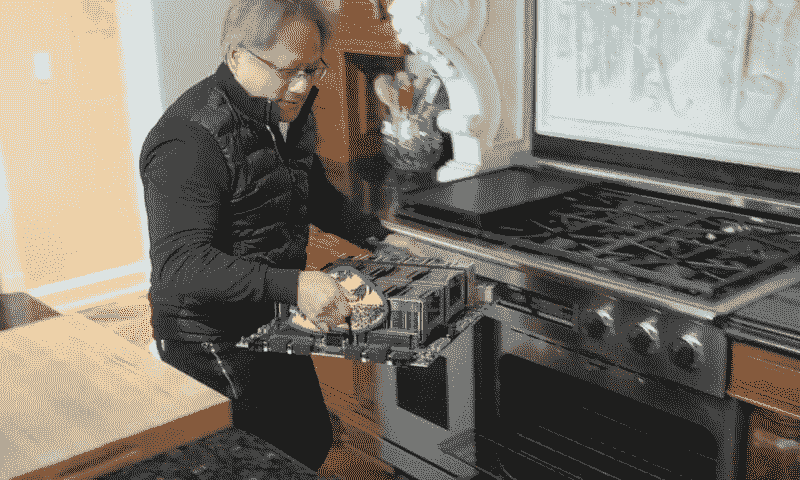
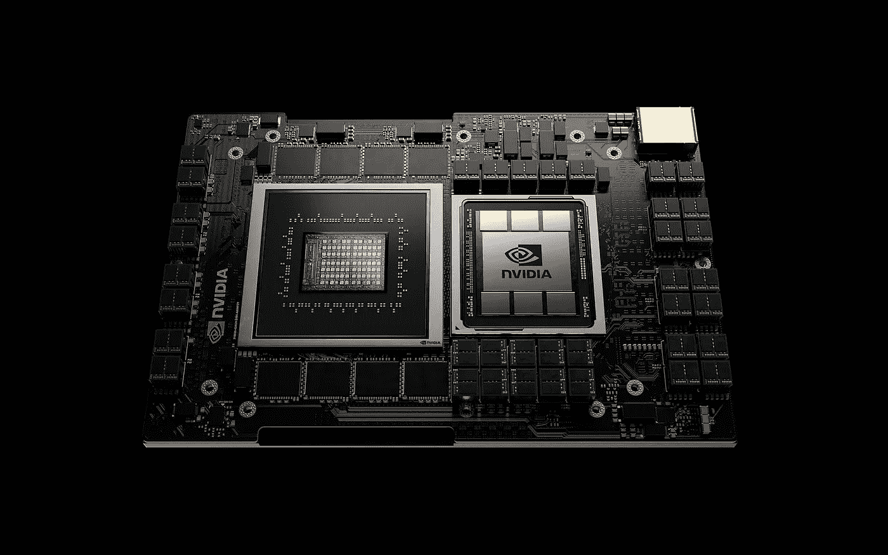
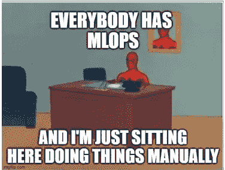

# 2021 年英伟达 GTC 发生了什么

> 原文：<https://towardsdatascience.com/what-happened-on-this-2021-nvidia-gtc-7f9b348fc5c6?source=collection_archive---------24----------------------->

## *回顾今年 NVIDIA GPU 技术大会上发布的内容，以及在会议期间关于深度学习和人工智能的讨论*

今年的 GTC 以英伟达首席执行官和[创始人黄仁勋的主题演讲](https://gtc21.event.nvidia.com/media/GTC%202021%20Keynote%20%5BS31895%5D/1_jhboc455)开始，宣布了今年将发布的内容。自从 COVID 以来，世界上大多数的商务会议都是在我们自己家里的不同寻常的房间里举行的，这次开幕主题演讲也不例外，詹森在他自己的**厨房**里录制了这次演讲。去年的版本也是在那里制作的，可能证明了 2020 年和 2021 年看起来仍然非常相似。

英伟达首席执行官黄仁勋从烤箱中拿出一些基于 Arm 的 CPU。[图片来自 YouTube](https://www.youtube.com/watch?v=So7TNRhIYJ8)

Jensen cookings 今年的主菜:**“Grace”，NVIDIA** 发布的首款 CPU。Grace 基于 Arm，这在该公司去年 9 月打算收购 Arm 后并不奇怪。政府监管机构仍在考虑是否批准合并，但英伟达并没有停止展示这款 CPU，称它将使数据中心实现比基于英特尔 x86 处理器的英伟达 DGX 系统高十倍的性能。Grace 将于 2023 年上市，并且已经有一个感兴趣的早期采用者:瑞士国家超级计算中心，用于其即将推出的名为 Alps 的超级计算机。菜单上的其他菜肴是其新一代数据处理单元 BlueField 和 DGX SuperPOD，这是一种旨在用于云人工智能研究的**基础设施，如此庞大**如果你不是索尼，你可能不会考虑购买它，但你现在可以用你的份额每月订阅 9000 美元。

但在英伟达，并非所有东西都是硬件。他们发布了 Omniverse，一个 3D 设计和模拟的合作平台。设计需要高性能的计算机，这通常是会议和并行工作的一个限制，尤其是在疫情时间，当你不能只是走到你的队友的桌面。有了 Omniverse，任何人都可以在任何电脑上进行任何项目，甚至可以在同一时间进行。自去年 12 月以来，宝马、Foster + Partners 和 WPP 等大型设计团队一直在使用 Omniverse beta。

开场主题演讲以 Jensen 宣布“最终， **Nvidia 是一种工具，**一种让你成就一生事业的工具”而结束，然后整个厨房被一部分一部分地拆除。抽屉、勺子、椅子和家具从场景中飞走，让我们想知道这个厨房是真的还是只是一个宇宙模拟。然后，GTC 开始了，在一千多个虚拟会议中，演讲者讨论了如何将 Nvidia 作为一种工具来使用。

格雷斯，詹森今年的主菜，肯定一个英特尔不会要求晚餐。[图片来自 TecnoBlog](https://tecnoblog.net/430732/nvidia-grace-cpu-arm-ia-supercomputadores/)

会议议程非常庞大，以至于很难阅读一天的会议列表。题目清单很广，涉及的行业也很广。它可以是像“[奇异期权风险的神经网络](https://gtc21.event.nvidia.com/media/Neural%20Networks%20for%20Exotic%20Options%20and%20Risk%20%5BS32060%5D/1_nofjfv1p)这样具体的东西，或者是一个甚至会让你爷爷感兴趣的标题，比如“[人工智能的下一个十年](https://gtc21.event.nvidia.com/media/The%20Next%20Decade%20in%20AI%3A%20Four%20Steps%20Toward%20Robust%20Artificial%20Intelligence%20%5BS31922%5D/1_zhbz74dc)”。Nvidia 强调了一些会议，但除此之外，你还可以在议程中找到自己的方式，找到让你着迷的东西。

# 米罗普斯要去哪里

随着每天越来越多基于人工智能的系统投入生产(终于！)，MLOps 每天都在变热，GTC 议程也不例外。MLOps 是由 WWT 在他们的谈话中提出的,是关于进化还是*消失的问题。他们共享一个模板，说明这种演变在组织内部应该如何发生，逐步采用 MlOps，不仅在专注的团队中，而且让每个人都成为其中的一部分。有这么多关于 MLOps 的说法，有时它进入了我们都想去的天堂，但不知道它看起来像什么。这就是为什么我特别喜欢 [Moses Guttmann 在 ClearML 会议](https://gtc21.event.nvidia.com/media/How%20to%20Supercharge%20Your%20Team%E2%80%99s%20Productivity%20with%20MLOps%20%5BS31250%5D/1_yp84hx7v)上的演讲，他向**展示了地球上的 MLOps 看起来是什么样子**:在你的机器上创建一个模板训练，让它在本地工作，然后只需将该模板部署到远程机器上，进行多次实验，搜索超参数的最佳组合，尝试不同的数据集，所有显示的内容都直接使用 ClearML 共享他的屏幕。正如 [Nick Elprin 在 J & J talk](https://gtc21.event.nvidia.com/media/How%20Johnson%20%26%20Johnson%20is%20Embedding%20Data%20Science%20Across%20their%20Business%20%5BS33036%5D/1_41yx5zxl) 上说的那样:**请不要试图自己建造所有的基础设施！**这是一个很有吸引力的问题，但是你的工程师专注于你的企业特有的问题会更有价值”*

摩西·古特曼为他的会议创造了一些好的迷因。[来自 Nvidia 会议的照片](https://gtc21.event.nvidia.com/media/How%20to%20Supercharge%20Your%20Team%E2%80%99s%20Productivity%20with%20MLOps%20%5BS31250%5D/1_yp84hx7v)

# ML 框架的发展方向

如果 Nvidia 本身是一个工具，那么像 TensorFlow 和 PyTorch 这样的 ML 框架就是让我们使用另一个工具的工具。这些框架在去年经历了疯狂的发展，试图跟上学术研究和行业趋势。API 变得越来越大，ML 学习模型不再由代码和权重来定义，而是现在的 ***模型=代码，*** 正如 sou Smith chint ala 在[这个演讲中所展示的。除非模型稳定在某个稳定的架构中，否则我们不会在专用硬件上看到太多的发展，尽管这不会发生， **ML 框架必须跟上高速的变化**。](https://gtc21.event.nvidia.com/esearch/search?keyword=A%20Vision%20for%20the%20Future%20of%20ML%20Frameworks) [Soumith](https://medium.com/u/45e1eae66802?source=post_page-----7f9b348fc5c6--------------------------------) 揭示了，如果通过先验的数据有效模型最终成为一切，那么 **ML 实践将包括将知识主体的先验应用于特定案例**，就像现在律师工作时所做的那样。

Keras 和 tensor flow 的未来五年的方向确实是将 priors 库民主化，试图通过创建一个可重复使用部件的生态系统来改进 UX 设计以提高生产率:计算机视觉问题的 KerasCV，语言问题的 KerasNLP，甚至“反重力应该像进口反重力一样简单”。ML 框架的最终 UX 设计只是一个提供用户数据集和优化指标的 API，算法将为用户做一切事情。用户工作将集中在问题规范和治疗数据集。深度学习应该对每个人都是真正可能的，因为今天的任何人都可以制作一个网站。在 [PyTorch 的状态会议](https://gtc21.event.nvidia.com/media/The%20State%20of%20PyTorch%20%5BS31223%5D/1_u5e2d7fi)上，同样的重点放在了更好的前端 API 愿望上，他们宣布了一个非常有趣的版本: **PyTorch profiler，**它将让我们在 Tensorboard 选项卡上看到模型及其不同层的性能分析。

# 研究的方向

更多的学术研究也在 GTC 占有一席之地，卷积网络之父 Yann LeCun 提出了自我监督学习的基于能量的观点，既介绍了基于能量的模型如何工作，也介绍了它们如何用于 SSL。[Sepp hoch Reiter](https://gtc21.event.nvidia.com/media/Modern%20Hopfield%20Networks%20%5BS32287%5D/1_68qbucuy)(他提出了消失梯度问题)介绍了现代 Hopefield 网络，谈论了它们如何工作，以及它们如何被集成以充当**“带记忆的深度学习”**。以方程式和积分为特色的这些绝对不是你想以 1.5 倍的速度观看的那种演讲。

# **行业的发展方向**

业界是如何采用这么多 AI 开发和发布的工具的？GTC 会议是一个很好的机会，可以直接从创造者的口中听到行业趋势。

## 会议在哪里举行

在封锁期间，虚拟会议比以往任何时候都更加突出，它的强制和快速采用为许多使用人工智能的创新解决方案打开了大门。自动检测有人举手要求关注，实时语音到文本的转换和不同语言之间的翻译，甚至让人工智能总结呼叫和讨论要点，这些功能都将破坏我们在虚拟会议上的体验。

## 零售业何去何从

在开始谈论这个行业之前，需要强调的一点是，根据专家在电话中的说法，人工智能的目的不是取代人类的认知能力，而是相反，增强和自动化最适合机器的任务(这是一个长期的辩论，你可以同意或不同意这个论点)。无论是简化复杂的任务，还是在人类失误高于机器的单调活动中减少失误。[这里是一些应用人工智能最相关的领域，从价格优化、异常检测、流程自动化、产品推荐、人工验证、库存盘点和用于客户关怀的聊天机器人开始。](https://gtc21.event.nvidia.com/media/Top%20AI%20Use%20Cases%20Implemented%20by%20the%20Most%20Innovative%20Retailers%20%5BS32013%5D/1_4agkurlz)

## 汽车行业的发展方向

尽管人工智能机器人制造汽车看起来很特别，是下一级创新的例子，但这已经是过去的事情了。为了给你一个接下来会发生什么的例子，你可以参考[宝马的使用案例，他们已经在 Nvidia Omniverse](https://gtc21.event.nvidia.com/media/BMW's%20Approach%20to%20a%20Holistic%20Digital%20Twin%20Using%20NVIDIA's%20Omniverse%20%5BS32398%5D/1_hjwql80b) 的工厂中做了一个 3D 数字双胞胎来训练新的机器人&人。是的，你没看错:没有现场培训，这将在时间和金钱方面产生巨大的开销，相反，他们利用这个 3D 双胞胎。这不会就此停止，因为这打开了一个[的可能性世界，在那里可以测试工厂的变化](https://gtc21.event.nvidia.com/media/Keynote%20Demo%3A%20NVIDIA%20Omniverse%20-%20Designing%2C%20Optimizing%20and%20Operating%20the%20Factory%20of%20the%20Future%20%5BD3100%5D/1_wdmq8yev)，员工的新工作路线，硬件空间利用率，等等。

## 数字艺术和电影摄影的发展方向

借助惊人的渲染，一个伟大的生态系统和毫无疑问先进的人工智能技术，像 Adobe 和 Nvidia Omniverse 这样的公司正在改变数字艺术方面的世界。覆盖广泛用途的 Adobe Photoshop[现在推出一项新功能，将语义分割提升到一个全新的水平](https://gtc21.event.nvidia.com/media/AI%20Implementation%20at%20Scale%3A%20Lessons%20from%20the%20Front%20Lines%20%5BS31938%5D/1_636jtciq)，基本上你可以立即删除任何背景，甚至重建图像中以前没有的运动或地方，这是另一项人工智能技术 GANs 完成的。

但是电影摄影呢？这是一个令人兴奋的话题，因为它融合了许多人工智能技术，是应用人工智能的最具创造性的方式之一！对这种技术的偷偷窥视包括具有 3D 数字化的人类运动捕捉，其中它们包括拾取真实的人类姿势并输出 3D 虚拟角色，语音到面部表情，其中给定音频输入，它创建 3D 网格面部，与语音的情感和自动场景生成对话。所有这些为来自世界各地的热情的人们创造了一个完美的组合，让他们使用这种前瞻性的思维工具来表达他们的创造力。要看到这一点，你可以参考这篇演讲:[Omniverse Machinima 简介](https://gtc21.event.nvidia.com/media/Intro%20to%20Omniverse%20Machinima%20%5BS32075%5D/1_jtg6pwhs)

# 我们要去哪里

今年有这么多的发布，这么多令人鼓舞的演讲，在协助尤尔根·施密德胡伯在他的会议上做了精彩的人工智能历史回顾之后，人们怎么能不相信**我们已经非常接近奇点了呢？**我推荐听听加里·马库斯更保守的[演讲，他提醒我们关于人工智能发展的许多先前失败的预测。我们一直被大数据和深度学习所困扰，这对学习有好处，但对抽象却不利。另一方面，经典的 ML 模型有利于抽象，但不利于学习。Gary 呼吁混合模型，因为我们需要一些方法来表示关于空间、时间和因果关系的知识，只有真正的推理和认知模型才能带领我们到达那里。](https://gtc21.event.nvidia.com/media/t/1_zhbz74dc)

希望这篇简短的评论能让你了解 2021 年的 GTC。当然，这里还有很多其他值得一提的演讲，所以如果你想特别推荐一个，请发表评论！

**我们是 eidos.ai，这是一个与创业公司和前瞻性公司合作的人工智能开发实验室。通过 info@eidos.ai 或我们的网站**[**https://eidos . ai**](https://eidos.ai/)联系我们

> [1]詹森厨房从去年[到现在](https://www.youtube.com/watch?v=Dw4oet5f0dI&t=216s)没有太大变化，勺子在同一个地方，盐和胡椒粉也是。所以我们可以说他做饭没做新 GPU 多。