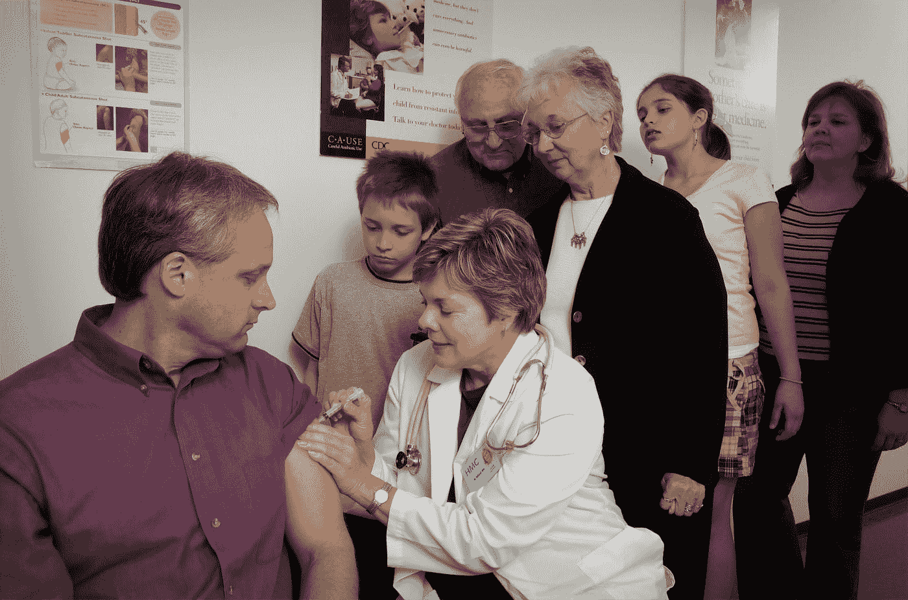

# 机器学习在医疗保健领域的进展如何？

> 原文：<https://towardsdatascience.com/what-has-machine-learning-been-up-to-in-healthcare-a137db866f05?source=collection_archive---------35----------------------->

## 对已经完成的工作进行高层次的审视

上周，我写了一篇关于 Eva 的博文，Eva 是一个强化学习系统，希腊政府部署该系统是为了在边境监控和分配稀缺的 COVID 测试[2]。这个话题让我好奇机器学习在医疗保健中的其他用途。我四处搜寻，找到了一个关于自然的相对全面的观点[1]和一大堆关于这个主题的报告。恕我直言，这些信息足以让我发表一篇博文。

[疾控中心](https://unsplash.com/@cdc?utm_source=medium&utm_medium=referral)在 [Unsplash](https://unsplash.com?utm_source=medium&utm_medium=referral) 拍摄的照片

# 数据

你可能已经听到小道消息，机器学习是从数据开始的。在公共卫生领域，数据通常来自两个来源。

## 调查和政府报告

卫生部门和组织通过多种机制获取这类数据。他们可以被动地接受您的医疗保健提供商报告的数据(上次您看医生时，他们是否会询问您除电子邮件密码之外的所有信息？).或者，他们可以主动向您的医疗保健提供者索取信息，例如在 covid 的情况下。

## 个人生成的数据

两个字:社交媒体。(还有 FitBit 数据之类的其他东西，但没那么朗朗上口)。最重要的是，这种类型的数据通常与地理位置相关联，并带有时间戳。然而，这种数据的非结构化本质带来了一系列挑战。

# 公共卫生中的机器学习

这个主题有四个子类别值得注意。

## 识别因素及其与健康结果的关系

这里有几个例子。ML 可用于确定影响疾病结果的遗传因素[3]。在其他新闻中，ML 已被用于定位登革热(一种蚊子传播的病毒感染)最严重的地区[4]。

## 干预设计

在这方面已经取得了一些进展。ML 已被用于解决抑郁管理[5]、减肥自我效能[6]、戒烟[7]和基于血糖反应的个性化营养[8]。

## 结果预测

天啊，这里已经做了很多了。是我还是这个类别感觉像是由 Kaggle 竞赛驱动的？下面是已经完成的工作的一个小例子。

2017 年，一组研究人员设计了一种多步建模策略来预测心力衰竭的再入院率，AUC 为 0.78，电子病历数据的准确率为 83.19%。这比当时 AUC 在 0.6-0.7 范围内的现有预测模型有所提高。[10]

同样，在 2018 年，为了绕过从标准化电子健康记录(EHR)数据中提取精选预测变量的劳动密集型任务，一组研究人员提出了基于快速医疗互操作性资源(FHIR)的患者全部原始 EHR 记录的表示。然后，他们表明，基于这些数据训练的深度学习模型可以实现高精度的任务，如预测住院死亡率、30 天计划外再入院、延长住院时间以及患者的所有最终出院诊断。[9]

此外，在 2018 年，一个深度卷积神经网络(inception v3)在癌症基因组图谱的整片图像上进行训练，以准确地将它们分类为 LUAD、LUSC 或正常肺组织，其 AUC 高达 0.97。根据作者的说法，这种表现可与病理学家相媲美。[11]

## 资源分配

嗯，Eva，一个分配稀缺的 covid 测试的强化学习系统，就属于这一类[2]。同样，在 2019 年，Chun-Hao change 和他的同事提出了一个深度强化学习(deep RL)模型，该模型在 MIMIC-III [12]上进行训练，MIMIC-III 是一个数据库，包含了 2001 年至 2012 年期间在 Beth Isreal Deaconess 医疗中心重症监护病房停留的 40，0 00 多名患者。对于这些患者，您需要进行测试来预测有害事件。然而，测试是昂贵的。通过学习最小化测试成本和最大化预测增益的策略，深度 RL 模型将测量总数减少了 31%。[13]

# 总结

我希望这篇文章对你有用。我喜欢写这篇文章，因为 ML 及其应用发展如此之快，课堂教学已经跟不上了。了解 ML 很酷，但对我来说，更令人兴奋的是了解它在现实生活中的实际应用。你可能已经注意到了，基于我的兴趣，我更喜欢某些话题。但是我包含了一些链接，以防有什么引起你的兴趣。

# 保持联系

我喜欢写关于数据科学和科学的文章。如果你喜欢这篇文章，请在 [Medium](https://medium.com/@h-vo) 上关注我，加入我的[电子邮件列表](https://medium.com/subscribe/@h-vo)，或者[成为 Medium 会员](https://medium.com/@h-vo/membership)(如果你使用这个链接，我将收取你大约 50%的会员费)，如果你还没有的话。下一篇帖子再见！😄

# 来源

[1] [公共和人口健康中的机器学习和算法公平](https://doi.org/10.1038/s42256-021-00373-4)

[2] [希腊用强化学习遏制新冠肺炎的涌入](https://medium.com/@h-vo/greece-used-reinforcement-learning-to-curb-influx-of-covid-19-a7d62ccfe508)

[3] [从全基因组关联研究数据推断风险因素和结果之间的因果关系](https://www.annualreviews.org/doi/abs/10.1146/annurev-genom-083117-021731)

[4] [登革热的全球分布和负担](https://www.nature.com/articles/nature12060)

[5] [利用情境感知开发抑郁症移动干预](https://www.jmir.org/2011/3/e55/)

[6] [健康行为改变互联网故事的自动索引:减肥态度试点研究](https://www.jmir.org/2014/12/e285/)

[7] [走向戒烟的移动健康干预](https://epublications.marquette.edu/cgi/viewcontent.cgi?article=1265&context=mscs_fac)

[8] [机器学习在现实生活数字健康干预中的应用:文献综述](https://www.jmir.org/2019/4/e12286/)

[9] [一种可扩展的、精确的深度学习与电子健康记录](https://www.nature.com/articles/s41746-018-0029-1)

[10] [使用电子病历范围的机器学习对医院再入院率进行预测建模:使用西奈山心力衰竭队列的案例研究](https://pubmed.ncbi.nlm.nih.gov/27896982/)

[11] [使用深度学习从非小细胞肺癌组织病理学图像进行分类和突变预测](https://pubmed.ncbi.nlm.nih.gov/30224757/)

[12] [MIMIC-III 临床数据库演示](https://physionet.org/content/mimiciii-demo/1.4/)

[http://proceedings.mlr.press/v97/chang19a.html](http://proceedings.mlr.press/v97/chang19a.html)