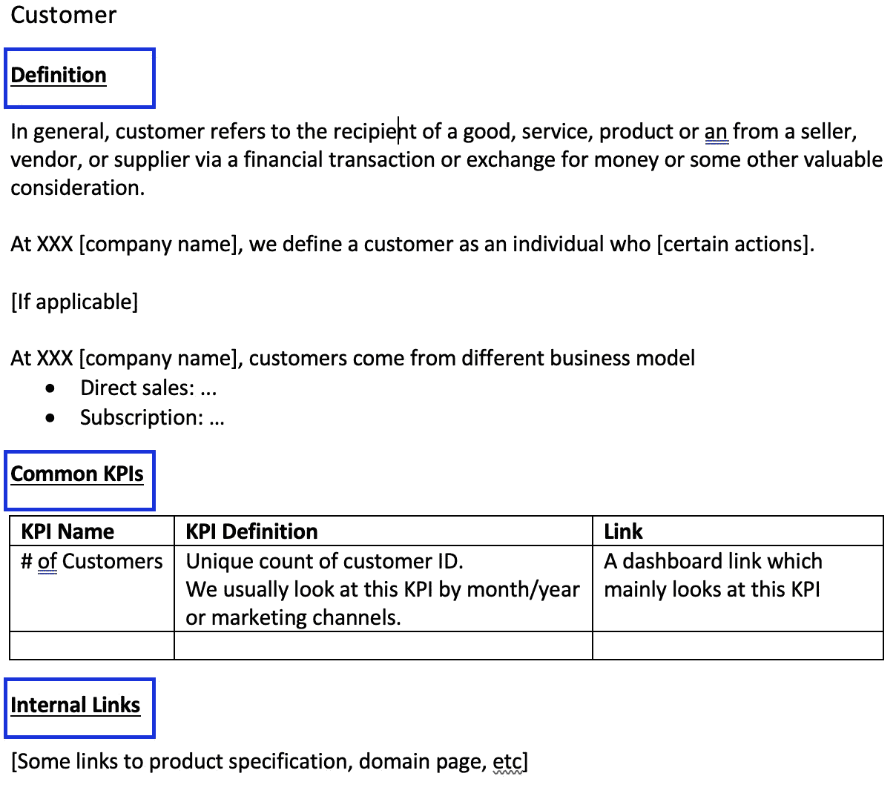

# 是什么帮助我们在一家金融科技初创公司建立了强大的自助分析

> 原文：<https://towardsdatascience.com/what-helped-us-build-strong-self-service-analytics-in-a-fintech-startup-ef9f0333b94d?source=collection_archive---------14----------------------->

## [行业笔记](https://towardsdatascience.com/tagged/notes-from-industry)

## 培训我们的内部用户成为有效和负责任的数据内容消费者(和创造者)

由[城市教会克赖斯特彻奇](https://unsplash.com/@citychurchchristchurch?utm_source=unsplash&utm_medium=referral&utm_content=creditCopyText)在 [Unsplash](https://unsplash.com/s/photos/self-serve-food?utm_source=unsplash&utm_medium=referral&utm_content=creditCopyText) 上拍摄的照片

我在以前的工作中做过的最自豪的工作之一是，我们在组织内部建立了强大的自助服务分析。

为了避开围绕自助分析的所有讨论，一个非常简单但有力的论点是，**很长一段时间以来，只有两个人(我和另一个 BI 分析师)的 BI 团队是一个 300 多人的组织的数据“大脑”**，也就是说，几乎所有内部决策和外部投资者报告的数据都来自我们的 BI 平台。

我们成功做到这一点的关键原因，或者引用一位同事的话，“你们正在做其他创业公司需要 10 名分析师团队才能做的事情”，是因为从很早的阶段起，我们就开始**培训我们的内部用户成为有效和负责任的数据内容消费者，其中一些人还是创造者**。通过这样做，大多数首要问题(例如，这个月的销售额是多少？)可以由内部用户自己回答，只需很少或不需要 BI 团队的帮助，我们的 BI 团队可以专注于为二级问题生成更深入的见解(例如，为什么本月的销售数字下降了？)更重要的是，在整个组织中培养数据文化。

如果我曾经对构建自助分析的重要性有过任何怀疑，那么我最近在 INSEAD MBA 项目中的经历应该已经消除了这种怀疑。当我发现一门名为“不确定性、数据和判断”的核心课程完全是关于应用统计学(相关性、假设检验、回归等)来回答现实生活中的商业问题，并且我们被鼓励(尽管不是强制要求)使用 R 来解决我们的商业案例时，我感到非常惊讶——嗯，我没想到在离职后这么快就有机会开设 R studio😃。另一个惊喜即将到来，那就是我们将会有另一门名为“管理客户价值”的核心课程，我们将会使用 Python 进行细分分析。这两门课程清楚地告诉我们一个不可再忽视的趋势，即**从数据中做出合理判断的能力不应再是一群头衔中带有“数据”的人的特权。相反，这种权力应该民主化**,每个需要做出商业决策的人都应该有权根据高质量的数据做出高质量的判断。

受这两门课程的启发，我决定回顾一下过去五年在一家金融科技初创公司构建自助 BI 的经历，并分享一些思考。

在深入讨论细节之前，我想再分享几个支持性统计数据，来说明为什么我认为我们拥有强大的自助式分析:

*   当我离开前雇主时，我们是一个 300 人的团队，其中 200 多人在我们的 BI 平台上有一个活跃的用户账户(我们使用 Superset 和 Mixpanel)。
*   我们的用户遍布组织的所有级别和所有部门——无论是市场营销还是销售、工程师还是 UX 设计师、初级经理还是高管。
*   在 Superset 上，我们有 2.7K 图表和 200 多个仪表板，涵盖了我们业务的所有方面。
*   随着时间的推移，越来越多的内容由非 BI 用户创建。据我所知，最近 30 天内创建的仪表板中有 50%是由 BI 团队以外的用户创作的。

事后看来，我认为我们在克服共同挑战和不断改进工作方面做得很好。

📍将 BI 职能定位为**一个可靠的业务合作伙伴**而不是服务台。

🎬创建**一个有利于商业的商务智能词汇表**来帮助新员工。

👟**期望管理**是成功培训的关键——对 BI 团队和内部用户都是如此。

🌱**不断指导你的同事**帮助他们提高技能，成为你的数据盟友。

## 定位:BI 职能部门是可靠的合作伙伴，而不是服务台。

虽然没有在任何工作场所的文件中正式说明，也没有作为标语挂在墙上，但我相信，当我作为第一个 BI 人加入公司时(并且在相当长的一段时间内)，我对 BI 职能的理解绝不是服务台或接收订单并简单地给你所需数据集的图书管理员。相反，BI 职能应该是业务利益相关者的可靠伙伴。

服务人员和合作伙伴之间的主要区别在于，合作伙伴并不总是对所有请求都答应。如果需要的话，伴侣会挑战你，并试图征求我们需要的真正见解，而不是照字面理解你的话，好像它们是要实现的最终要求。

向内部数据用户明确这一定位至关重要— **它提醒他们，他们的请求与他们有利害关系，在某种程度上，数据/见解交付的质量以及解释在很大程度上取决于他们的数据素养。**换句话说，为了做出高质量的决策，他们需要高质量的判断，而高质量的判断需要高质量的数据/见解，这反过来又要求他们提出高质量的问题。此映像的出现为构建自助服务分析奠定了基础。

我在之前的文章 [*中分享了一个将此付诸实践的例子，它帮助我成为了一名更好的数据分析师*](/what-helped-me-become-a-better-data-analyst-92cff70c5e10) *。每次当你或你的团队接到某人的要求时，不要把他们的要求当成是他们如何提出的，而是试着和你的同事一起思考他们真正的目标是什么。*

## 入职:为新员工创建一个业务友好的商务智能词汇表。

我想分享作为我们自助服务分析基础的文档——BI 词汇表。它既不是一个指标层定义，也不是一个领域页面，而是一个面向业务的关键指标和公司术语的访问页面，特别是对于新加入者(不仅仅是 BI，还有其他团队)。

它按字母顺序排序，每个条目如下所示:

作者照片

*   **定义**:我们通常包括行业范围的通用定义(因为新加入者可能对通用定义相当熟悉)和公司特定的定义。
*   **公共 KPI**:这里我们包括一些与这个实体相关的指标以及一个仪表板链接。注意，这并不取代我们的度量定义(用 dbt 维护),并且应该与度量层保持一致。因此，为了减少更新的频率，我们只包括 2-3 个最常用的 KPI，它们不会轻易改变。
*   **内部链接**:这里我们链接到真实的来源，也就是一些领域定义页面。请注意，该页面并不旨在成为领域知识的真实来源，而是为新加入者提供一个不那么令人生畏但更有利于业务的关键实体的页面。

## 培训:期望管理是关键——对 BI 团队和内部用户都是如此。

像其他公司一样，我们定期组织培训计划来教我们的同事使用我们的 BI 平台，例如，他们应该查看哪些数据集，如何创建可视化，如何编写简单的 SQL 查询等。

我从一开始就注意到，尽管许多参与者表示他们对数据感兴趣并注册了培训，但他们中很少有人能真正参加培训或真正提高了技能。例如，在会议结束后，我仍然会收到参与者提出的本应由他们自己解决的问题。不是说任何人在他们的热情上撒谎，愚蠢或懒惰，我相信更好的期望管理会带来更好的结果。

更具体地说，这些实践可能是有帮助的:

*   **将你的训练内容分成不同的等级，以满足不同的需求。**并不是每个人都想成为数据专家，有些人可能只是想看看他们的团队仪表盘，大致了解一下他们的表现。不是每个人都有成为数据专家的天赋——有些人可能已经在 Excel 中苦苦挣扎了。因此，期望每个人从相同的培训内容中获得相同的价值是过于理想化的。为了克服这一挑战，我将我的内容分为三个级别，并为每个级别定义了先决条件和预期结果:1) **数据内容消费者**从 Excel 的初步知识开始，并希望知道在哪里可以找到仪表板，并在完成级别 1 后阅读可视化；2) **数据内容创建者**在 1 级之后开始，并被期望基于给定的数据集创建或转换简单的可视化以回答一级问题，例如，创建饼图以显示我们的用户的年龄分布；3) **高级数据内容创建者**从第 2 级开始，如果他们想要更多给定数据集以外的内容，则需要创建高级可视化(如直方图、旭日图等)并编写简单的 SQL 查询。当宣布培训计划时，这些定义被明确地陈述，以便人们知道他们可以从每个级别期望什么，以及他们被期望做什么来达到那里。他们可以自由选择他们想去的地方。
*   清楚地陈述你的期望，并跟踪培训项目的成功。一旦我们定义了三个级别，我们还会为每个级别设计作业，并明确说明参与者需要完成作业，以便他们可以进入下一个级别。通过这样做，我们确保只有那些真正热爱数据的人才会留在这个项目中。此外，这也有助于 BI 团队跟踪项目的成功。如何温和地执行这确实是一个挑战，坦率地说，随着团队的成长，我发现很难执行。

## 建立关系:不断指导你的同事，帮助他们提高技能，成为你的数据盟友。

我们自发开始做的一件事是**每周与关键数据用户进行接触。后来，当团队有了新的领导者时，这正式成为每周数据诊所**。我们在这里做的一些例子:

*   BI 团队分享最近的见解，这些见解可能会引起更广泛的受众的兴趣，而不仅仅是请求这些见解的人。例如，负责客户满意度的产品经理最近要求我们分析为什么留存率下降，然后我们发现这与一个新的货币化功能有关。这将是一个完美的话题，在更广泛的一轮讨论中涉及到货币化项目经理。
*   我们与项目经理、UX 设计师和工程师一起审查产品仪表规范，并就活动名称、活动属性、KPI 定义等提出建议。如果你感兴趣，这里是[我对产品仪器仪表](https://bootcamp.uxdesign.cc/my-5-takeaways-for-effective-product-instrumentation-1f36e9596c3e)的学习总结。
*   我们为快速技术问题提供即时支持，例如，编写查询或创建可视化的困难。

确定潜在的高级用户/数据内容创建者并与他们建立良好的关系至关重要。这可以通过回答一些问题“谁通常会向您提出数据请求？”来轻松实现，“他们的问题有多深？”以及“他们对数据的熟练程度如何？”。一旦你确定了这些用户，当他们向你寻求问题或帮助时，给予他们更多的关注。随着时间的推移，他们可以发展成为事实上的 BI 人员以及他们自己团队中解决数据问题的关键人物。在我的前雇主，我们能够在营销、产品和战略方面发展这样的超级用户，他们帮助分享了一些本应属于 BI 的流量。😉

这里没有讨论的是工具和技术部分——我将在另一篇文章中分享我在这方面的学习和思考！