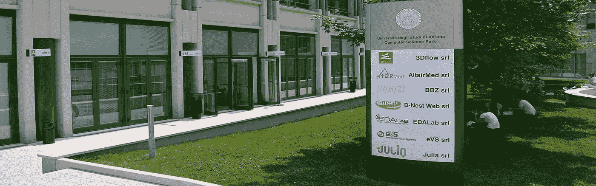
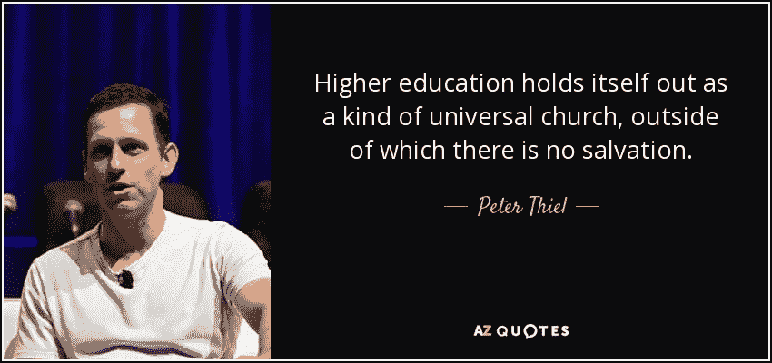
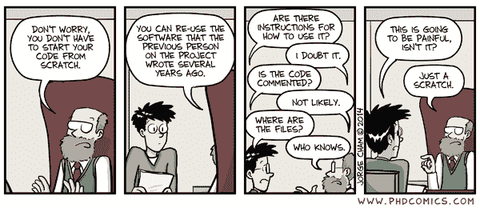
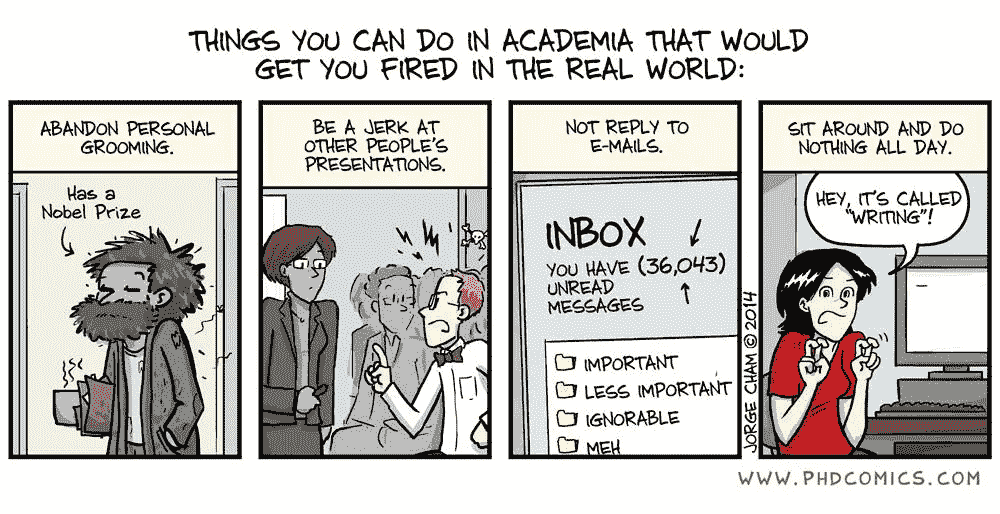
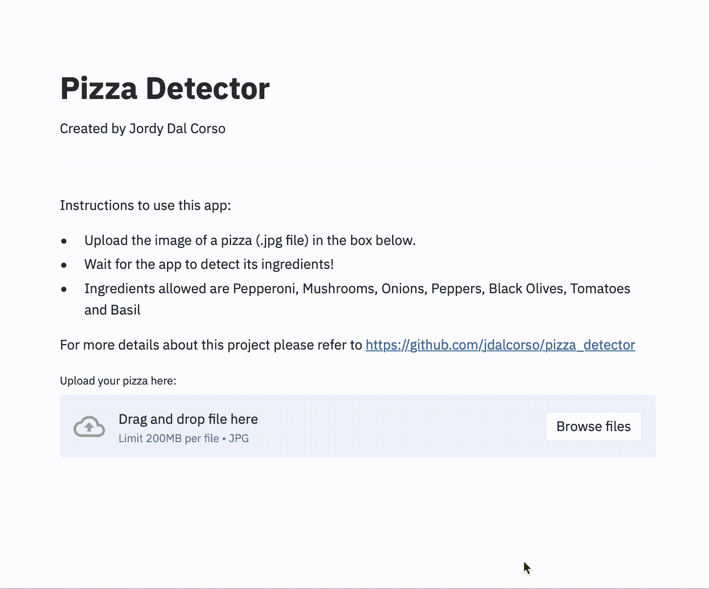
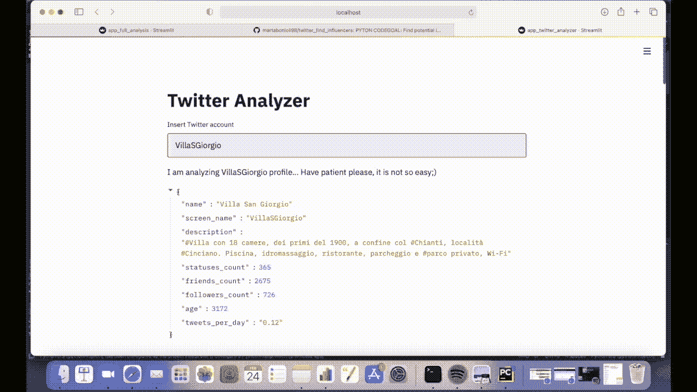
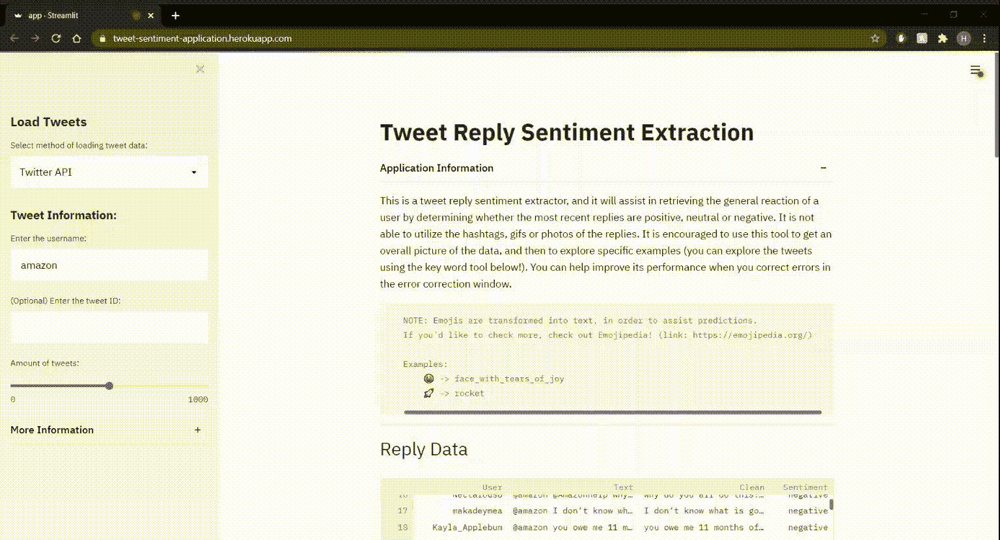
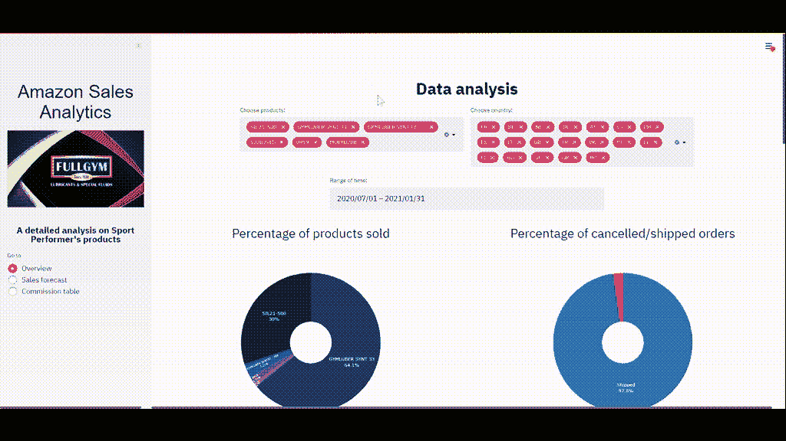

# 我在维罗纳大学教授数据科学的收获

> 原文：<https://towardsdatascience.com/what-i-have-learned-from-teaching-at-data-science-faculty-at-the-university-b4df12c31745?source=collection_archive---------18----------------------->

## 针对教育工作者和自学的数据科学家的提示

## 在知识商品化、研究商业化的时代，如何学习

一张来自[的照片&id = 236&tipo BC = 5&lang = en](https://www.di.univr.it/?ent=bibliocr&id=236&tipobc=5&lang=en)

半年前，我同意为自己进行一次小小的冒险。我的大学教授兼论文导师[卢卡·迪·珀西奥](https://www.linkedin.com/in/luca-di-persio-52178150/)邀请我加入我的第二个母校维罗纳大学的一个全新的[数据科学学院](https://www.di.univr.it/?ent=cd&cs=955)的教学团队。几年前，我做过多次讲座和技术讲座，但从来没有对学生的长期结果负责过，所以我决定接受挑战。

通过写这篇文章，我的目标是:

*   教育家们正在寻找更注重结果的学术教学方法的替代品
*   自定进度的学生，他们的目标是取得成绩，并接受现实世界的评判，而不是同龄人的评判

我将数据科学作为一门学术学科、行业专业和商业领域的方法与大多数教育材料中流行的方法大相径庭。我是一名**实践驱动型企业家，为了成为我所在行业的佼佼者，我获得了数学学位**，这极大地影响了我的观点和教学方法。我认为这种观点对教育工作者和学生是有用的，他们看到数据科学领域的当前教育系统没有达到它应该达到的目标。

我邀请您参加本周四在俱乐部会所举行的讨论，思考这个话题:

<https://www.joinclubhouse.com/event/PNzJO11K>  

# 开始前我就知道的问题

https://www.azquotes.com/quote/1447564 在这篇文章的主题中引用了彼得·泰尔的一段相当激进但却非常真实的话

我本人在乌克兰和意大利的两所大学获得了学位，并自学了多门欧美 MOOCs 课程，因此我非常明白，大学不是万能的，也不会让你为现实生活做好准备。然而，我喜欢这个想法，现代大学:

*   吸引并建立一个由专注于单一领域的人才(学生、研究人员、教师)组成的社区
*   给你一种独特而深刻的知识，这是用其他教育材料或短期课程很难获得的

现实是不同的，尤其是在数据科学中，作为科学、工程和商业交叉的新学科:

*   数据科学项目吸引了 a)学者、b)行业专业人士和 c)工程师，他们都被相似的趋势团结在一起，但几乎拥有**正交的知识、技能和心智模型**
*   大多数**教育项目**要么 a)遵循“经典”的统计学习书籍，要么 b)“酷而新潮”的博客，两者**都被商品化**并被 MOOCs 和在线教育者广泛访问和解释

简而言之，这个系统没有给出它所承诺的东西，在这场游戏中，每个人都是输家:政府(输掉了科学竞赛)、企业(无法参与全球竞争)、大学(失去了人力资本)，当然，最重要的是，失去了生命年数的学生。

# 我决定改变的是

我在维罗纳大学学习的课程叫做“编程”,旨在为学生将来学习统计学习、数据库等课程做准备。我已经将一学期课程的目标设定为:

> 学生了解计算机科学和科学计算的基础，并准备好独立创建简单而有用的终端客户数据驱动的解决方案

为了实现这一点，我将课程分成了 4 个逻辑块，并根据每一个逻辑块来评估期末项目:

## **编程基础校准**

即使跳过这些步骤很有诱惑力，但这只会损害而不是促进职业发展。图来自[https://explain programmer humor . com/post/184600929440/skipping-steps](https://explainprogrammerhumor.com/post/184600929440/skipping-steps)

在这门课上，有来自经济学、物理学、应用数学、计算机科学和其他系的学生。我决定确保在几周内每个学生都能**打开并研究任何类型数据的主要属性**:表格、图像、文本、声音等等(当然是真实的数据集)。为了做到这一点，每个实验环节我都进行小规模的实时编码，在这里我可以跟踪每个人是否可以在 15-20 分钟内打开并使用任何类型的数据集。我使用了你可以在 Kaggle 找到的基本数据集，包括 Numpy、Pandas、OpenCV 和 Matplotlib。

## **计算机科学和科学计算**

然后，我想直观地了解我们在上一节中所做的数据分析在幕后是如何工作的:

*   首先，我们致力于广义上的数据结构:从内存和不同变量(变量、熊猫数据帧、张量)如何存储到列表、哈希表和树，以及实际用例和从头开始的实现
*   然后，我们研究了经典的**算法**(排序和搜索)；**机器学习**算法，这些算法通过循环和 Numpy 支持的向量化实现，并比较了不同情况下的性能

我推荐以下材料:

<https://www.labri.fr/perso/nrougier/from-python-to-numpy/>  <https://www.coursera.org/specializations/algorithms>  

## **以人为本的软件开发**

学术界的典型软件开发，插图来自[https://blogs . egu . eu/divisions/GD/2018/09/19/reproducible-computational-science/](https://blogs.egu.eu/divisions/gd/2018/09/19/reproducible-computational-science/)

在学院中编写的代码是众所周知的噩梦，所以我专门用了一整块来介绍 OOP，并在几个场景中实践它:

*   **重构现有代码**:实现线性和逻辑回归，并围绕它们构建类层次结构
*   **从头规划项目结构**:使用 ide 代替笔记本来构建项目，定义库需求，创建 UML 图

结合我的实用技巧和诀窍，我主要遵循了两个很棒的演示:

当然，我已经展示了最好的开源项目是如何组织的。

## **现实世界的解决方案**

学术界和现实世界的另一个比较，插图来自[https://twitter.com/phdcomics/status/604978904558792704](https://twitter.com/phdcomics/status/604978904558792704)

最后但同样重要的是，我想确保学生能够**将他们的解决方案作为对其解决方案的最终客户有意义的东西来操作。为了解释什么是“有用的数据驱动产品”以及它通常是如何被创建的，我简单地介绍了一下:**

<https://pair.withgoogle.com/guidebook/>  <https://course.fullstackdeeplearning.com/>  

关于操作化，我提供了三种选择:分析仪表板、交互式 GUI 或 REST API。对于前两种 app，我推荐了 Streamlit，对于后者——Flask。此外，我还展示了解决方案的 dockerization，并将其发布在 Heroku 上。

# 结果发生了什么

我真的对项目的最终质量感到惊讶(以一种好的方式)——具有更深 CS 背景的学生用从游戏数据中学习的算法创建了他们自己的游戏；数学和经济学专业的学生已经开发了很酷的应用程序，用于分析他们朋友和亲戚的真实业务数据。我想提几个同意分享他们经验的学生的项目:

## 基于深度学习的披萨分类器

作者插图

**乔迪·达尔·科尔索** ( [LinkedIn](https://www.linkedin.com/in/jordy-dal-corso-0335761bb/) ， [Email](http://jordy.dalcorso@studenti.univr.it) )对算法进行了最深入的研究，并开发了一款应用程序，使用最先进的深度学习模型从照片中识别披萨的成分。看看[资源库](https://github.com/jdalcorso/pizza_detector)中的源代码和算法的使用是如何组织的。没有和披萨相关的项目就没有好的课程:)

## 影响者的社交媒体图表分析

作者插图

**Marta boni oli**([Linkedin](https://www.linkedin.com/in/marta-bonioli-1985481b5/)， [Email](http://marta.bonioli@studenti.univr.it) )专注于非常实际的应用——基于社交图谱分析为每家公司找到合适的影响者。她开发了一个工具，你可以进入你的目标公司，它分析周围的人的网络，并找到谁能最好地推广他们的产品！

## 推特情感分析

作者插图

**Hunter Paul Youngquist**([Email](http://hunterpaul.youngquist@studenti.univr.it))也关注了 Twitter，但更多的是在情绪分析的角度。根据配对指南，他找出了黑盒解决方案的典型问题，即没有给用户提供反馈和解释性能的机会，并在他的应用程序中解决这个问题。也来看看他的知识库吧！

## 亚马逊销售预测

作者插图

Martina Urbani ( [电子邮件](http://martina.urbani_02@studenti.univr.it))使用了一家真实零售公司的数据，该公司通过亚马逊开展业务活动，并建立了一个交互式仪表盘，提供实时分段分析、分析佣金以及预测销量。这将有助于企业主做出正确的战略决策！

如果你认为他们能帮助你应对挑战，请随时联系他们；)

# 我能做得更好吗？

尽管整个课程进行得非常顺利，但我觉得有两个时刻我绝对可以做得更好:

## 线上和线下互动

在课堂上讲课时，如果学生专注于材料，我至少可以感同身受地理解，离线时很难做到。在接下来的课程中，我想尝试:

*   **互动 ML 操场**，不需要太多的编码，在那里我可以看到关于进度和理解水平的即时反馈。
*   **邀请客座讲师或“客户”**与学生一起探讨一些特定的话题。正如我们所见，这在俱乐部会所中效果很好:)
*   **团队项目**——非常明显的游戏，但我在课程中完全忽略了它

## 强调基础

我只有相当有限的时间来深入研究科学计算和计算机科学基础，我发现这些非常重要。在我解释完之后，我认为像 Coursera 那样用自动评分练习来检查理解是很棒的。每周自动给深奥主题的练习打分肯定会对理解 cs 主题产生更积极的影响。

# 结论

我想用我对学术教育未来的观点来结束这篇文章。随着**知识** **变得商品化**和**研究变得商业化**，大学需要定义一个新的甜蜜点，在这个点上它们可以保持独特性，并在某种程度上成为精英机构。也提醒关于会所聊天即将到来；)

<https://www.joinclubhouse.com/event/PNzJO11K>  

首先，我认为，大学应该建立并保护对基础研究活动的垄断，这需要形成独立的思想家，专注于非常狭窄的科学前沿领域，但对重要的世界问题有广阔的视角。我在我的课程中通过数据科学顾问的心智模型强调了独立的**概念**，数据科学顾问负责以表达的指标来表示业务结果。在科学领域，这有点不同，在保罗·格拉厄姆的博客中有更好的描述:

  

第二，我认为，为了在教育和应用研究方面与机构竞争，大学需要**参与进来**，对结果负责，减少对政府拨款的依赖(政府拨款应该只用于基础研究)。基于大学应用研究、商业和技术加速器的风险投资衍生产品，以及与具有明确 KPI 的行业的合作伙伴关系**可以给学术界带来所需的推动力，使其走出停滞状态，注入新鲜血液。**

**第三，**科学又要变得性感了**。如果爱因斯坦生活在我们这个时代，他的 Instagram 肯定是最受欢迎的，但正如我们今天所看到的，科学家甚至没有进入前 1000 名。诺贝尔奖并没有真正做好，因为如果你问一个随机的人，他们是否知道任何获奖者，他们会提到和平或文学天才，也许是经济学家，但物理学家不会是第一个。我个人很喜欢尤里·米尔纳和他的突破计划，我们确实需要更多这样的东西:**

**<https://breakthroughinitiatives.org/initiative/3>  

**附言**
如果你觉得这个内容有用，有观点，可以[在 Bitclout 上支持我](https://bitclout.com/u/alexrachnog)。我对技术教育领域的讨论和合作持开放态度，你可以在[脸书](https://www.facebook.com/rachnogstyle.blog)或 [LinkedIn](https://www.linkedin.com/in/alexandr-honchar-4423b962/) 上与我联系，在那里我会定期发布一些人工智能相关的文章或新闻观点，这些文章或观点对于媒体来说太短了。**