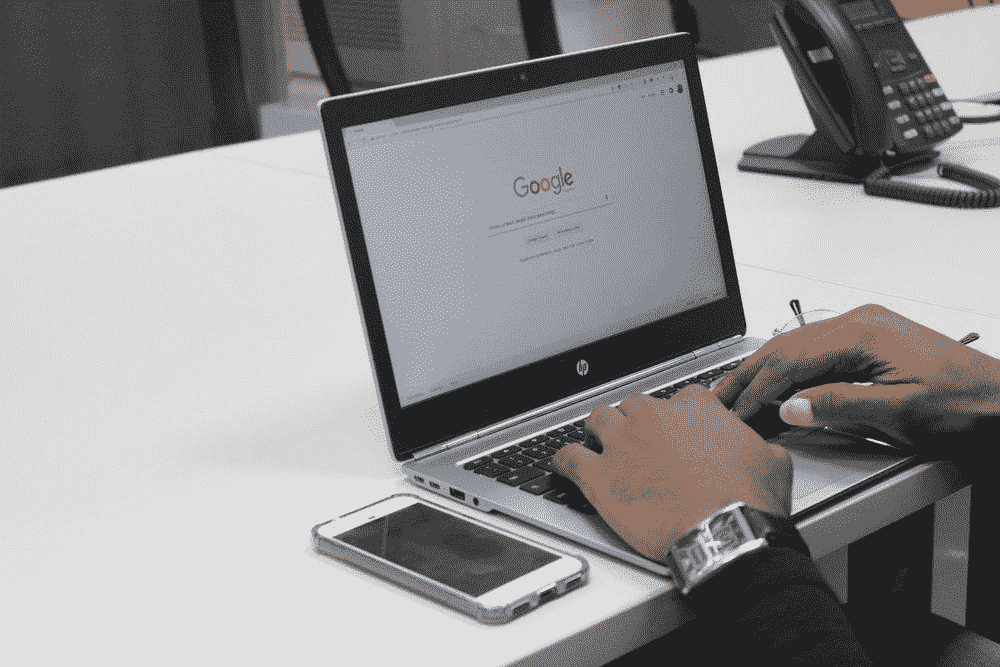

# 我从编写谷歌代码中学到了什么

> 原文：<https://towardsdatascience.com/what-i-learned-coding-google-from-scratch-cd7ddb02d9?source=collection_archive---------15----------------------->

## 如何加速您的编程开发

杰米·哈根在 [Unsplash](https://unsplash.com/photos/zHB5er-rQC8) 上的照片

# 介绍

我在大学四年级的时候用 Java 从头开始复制了一个 Google 风格的搜索引擎。在整个学期中，我花了 30 个小时完成了五个单独的作业，在课程的最后两个星期，我花了 100 多个小时以四人小组的形式完成了课程的最终项目。

我现在是在宾夕法尼亚大学获得数据科学硕士学位前的最后一个学期。尽管它给我带来了难以置信的压力、睡眠不足和疲惫，但这门网络系统课程是我在宾夕法尼亚大学四年中迄今为止最有收获的课程。在四个月的辛勤工作和磨砺之后，我想不出还有什么比这更值得的了，因为我知道你从零开始建立了谷歌，一个每天都有数十亿人使用的系统。

我们建立了一个类似于 [Spark Java](https://sparkjava.com/) 的网络服务器和框架，一个网络爬虫，以及一个可以独立分布在不同节点上的系统。我们以 4 人一组的方式完成了这个学期的工作，用这些组件和其他一些组件构建了完整的搜索引擎。

到学期结束时，我们已经从互联网上抓取了超过 100 万个文档(遵守每个网站上的[机器人排除协议](https://en.wikipedia.org/wiki/Robots_exclusion_standard))，在词典和反向索引中索引了这些文档中的超过 1.4 亿个单词，并开发了一个 [PageRank](https://en.wikipedia.org/wiki/PageRank) 算法来对我们抓取的所有文档进行排序。我们学习了如何在 AWS 上运行所有这些不同的组件，使用不到 400 美元的预算，通过 AWS 教育帐户信用。最后，我们创建了一个用户界面来输入搜索查询，并用我们的排名结果进行响应。

[本杰明·达达](https://unsplash.com/@dadaben_)在 [Unsplash](https://unsplash.com/photos/EDZTb2SQ6j0) 上的照片

这篇文章的目标并不是要展示我通过这个课程能够完成的所有事情。我列出了我们项目的所有组成部分，向你们展示了我在四个月的编程中所能完成的工作。在此之前，我做过的最大的项目是用 Java 创建国际象棋。如果你愿意努力，不要怀疑你能完成什么。

我的目标是鼓励你考虑做一个你感兴趣的项目，这个项目感觉非常困难，甚至是不可能的。到最后，你会创造出一些不可思议的东西，这是值得的。如果你不感到不舒服，不为自己设定很高的期望，这种类型的成长机会是不存在的。

# 我学到了什么

## 如何阅读文档

作为一名程序员，最有用的技能之一是阅读库文档并使用它实现代码的能力。

给定语言中不同库的文档质量差别很大。当你在一个大型项目中工作时，你将会使用大量不同的库。这有助于您了解这种多样性，并培养您阅读各种形式的文档的能力。

到项目结束时，我们已经使用了 20 多个不同的 Java 库。整个小组会议甚至几天的时间都用来熟悉如何在一些更复杂的库中编写高效的代码。我现在非常自信，我可以有效地学习任何我想使用的库。

## 如何谷歌编码问题

与阅读文档类似，我们花了大量时间在谷歌上搜索我们面临的错误以及某些事情是如何工作的。作为一名程序员，学习如何将正确的搜索查询写入 Google 是一项必要的技能。

这些问题从我们无法解决的错误信息到如何更有效地运行我们的代码。代码效率的第二个问题不是您在处理小规模项目时通常会遇到的问题。

[迈特·沃尔什](https://unsplash.com/@two_tees)在 [Unsplash](https://unsplash.com/photos/tVkdGtEe2C4) 上拍照

当你在从事一个大型项目时，比如搜集 100 万个文档或索引超过 1.4 亿个单词，理解代码效率是按时完成项目的必要条件。诊断代码的哪些部分没有像你希望的那样快速运行，然后在网上找到解决方案，这是一项重要的技能，大型项目可以让你提高这项技能。

## 如何与团队合作

另一个需要培养的关键技能是你在编码时的团队合作能力。如果你想成为一名软件工程师或数据科学家，你必须能够在团队中有效地工作。虽然没有必要为了一个个人项目而在一个团队中工作，但是如果你有几个人想加入你，这绝对是一个强烈的建议。在这些大型项目中，团队合作还有一些额外的好处。

第一个好处是你的整体面试体验。在行为面试中，大多数公司都想知道你在团队中的表现如何(因为当你为团队工作时，你也将在团队中工作)。拥有令人印象深刻的经历，比如在团队中参与一个具有挑战性的项目，对这些对话非常有帮助。

另一个好处是，你将学会如何有效地向人们传达技术想法。在从事大型项目时，需要做出许多设计决策。在与你的小组开会时，你有机会表达你对如何实现项目各个方面的看法。有效地讨论技术想法是一个非常有用的工具，无论是在倡导你自己的想法的背景下，还是在讨论你对队友想法的看法的背景下。

你也有机会使用像 [git](https://git-scm.com/) 这样的版本控制工具。版本控制是大多数程序员必备的技能。理解如何和队友一起为同一个项目编写代码，不是你一个人能够自然而然学会的。

最后，当和一群人一起工作时，工作会更愉快。独自在一个项目上花费数百个小时不如与他人交流和集体朝着一个重要的目标努力有趣。

由[安妮·斯普拉特](https://unsplash.com/@anniespratt)在 [Unsplash](https://unsplash.com/photos/MChSQHxGZrQ) 上拍摄

## 如何对项目资源进行预算

并非所有的大型项目都必须有货币成本。如果是这样，了解如何管理这些成本还有一个额外的好处。如果这个项目没有任何金钱成本，你也可以学习如何有效地安排你的时间。

AWS educate 向所有去合作大学学习云计算平台的学生提供 100 美元的免费学分。当我们在谷歌项目上工作时，我们的四人小组明白我们有 400 美元的综合预算来明智地在 AWS 上花费以完成项目。

除了用于爬行和索引的并行 EC2 节点，以及用于运行索引和 PageRank 计算的 map-reduce 作业的 EMR 集群，我们所有的数据都存储在 AWS 上。

为了有效地预算我们的资源，我们在一起工作的两周内举行了多次会议。这些会议涉及我们计算什么机器我们可以使用，既完成项目的时间，也保持在我们的预算限制。这种类型的成本与效率规划不适用于小规模项目。

[NORTHFOLK](https://unsplash.com/@northfolk) 在 [Unsplash](https://unsplash.com/photos/Ok76F6yW2iA) 上的照片

作为一名学生，我也不得不预算如何度过我的时间。这学期我还选修了其他五门课程(包括其他三门研究生计算机科学课程)。这门课程所需要的时间让我重新思考我是如何度过我所有的时间的。我完全改变了我安排时间的方式，以及如何处理我拖延的冲动，以便每周为这个项目腾出时间。

## 我喜欢编码

在这门课之前，我曾怀疑自己喜欢编码。我从未能够检验这个理论。我喜欢做我的计算机科学作业，并且非常确定我想在毕业后从事数据科学工作，但我不确定这是否是正确的道路。

在完成这个项目后，我意识到我不仅喜欢编码，我热爱它。在四个月的时间里，我在这个项目上工作了数百个小时，这向我展示了我热爱编码，即使是在压力很大的时候，即使是在我不得不编码很长时间的时候，即使是在它导致我极度睡眠不足的时候，即使是在问题感觉太难克服的时候，甚至是在我不想继续编码的时候。第二天，我总是兴奋地醒来，继续处理前一天无法解决的问题。

我现在有信心毕业后会热爱我的数据科学工作。没有这种经历，你无法真正知道在艰难时期你会喜欢什么(我相信这是享受工作的关键)。我现在可以把编程称为一种激情，我很高兴我也可以把我的激情称为一份工作。

丹尼尔·伊德里在 [Unsplash](https://unsplash.com/photos/FCHlYvR5gJI) 上的照片

# 结论

在课程的最初几周，我不断告诉自己，“我真的应该放弃这门课程。我无法完成所有这些工作。”我们的教授不断鼓励我们，尽管工作量很大，但我们不会后悔选修这门课，我们会通过考试的。到学期末，我意识到他是对的。

作为程序员，我们太怀疑自己了。我们认为在开始一个新的编程项目之前，我们必须了解所有的事情。如果我们坐下来开始努力，我们会惊奇地克服挑战并成长。

这个项目完全改变了我对自己作为程序员的看法。我仍然认为我永远也完成不了我刚刚想到的那个非常酷的主意。然后我就对自己说，“我创造了谷歌。”我开始工作。我希望你有同样的燃料。过去几周你一直坚持的真正雄心勃勃的想法是什么？开始吧。你能做到的。你会成为一个更好的自己。

感谢您阅读本文，并祝您的雄心勃勃的项目好运。