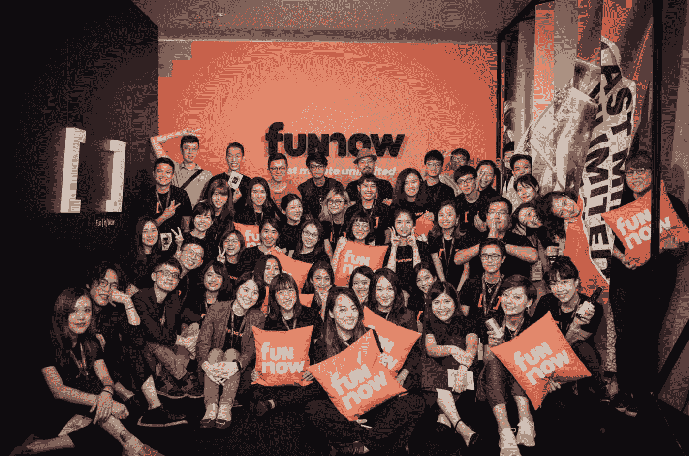
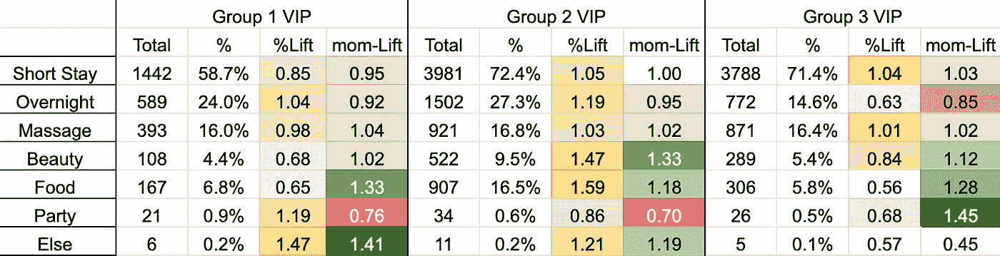
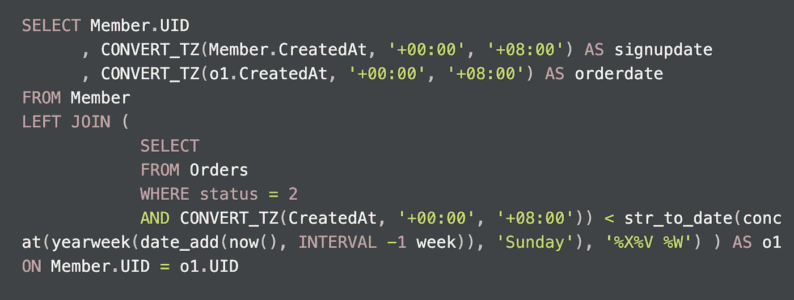
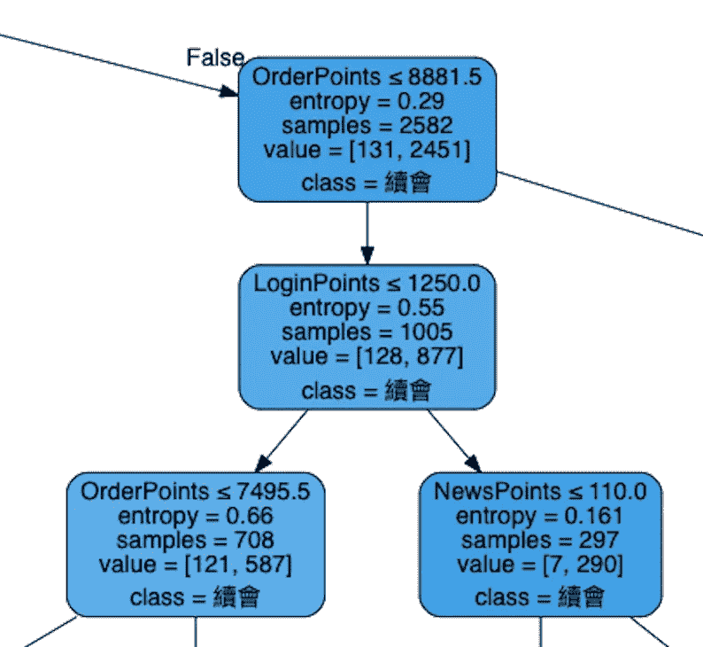
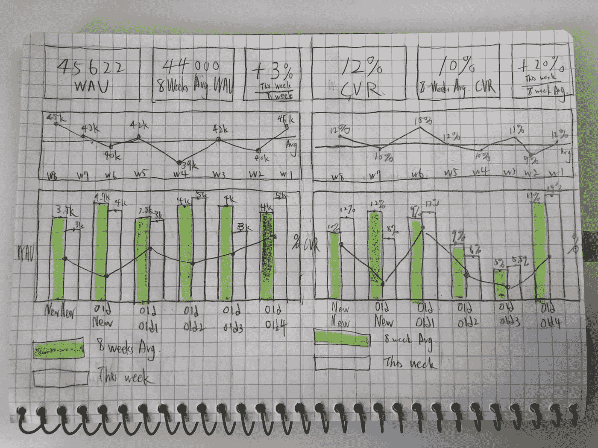

# 我在 A 轮创业公司的数据分析师实习中学到了什么

> 原文：<https://towardsdatascience.com/what-i-learned-from-my-data-analyst-internship-at-a-series-a-startup-ab8ef16b6eb1?source=collection_archive---------15----------------------->

## 这篇文章记录了我在数据分析师实习期间的 22 条经验和想法，希望能帮助你成为一名更好的初创公司数据分析师。

由 FunNow 拍摄的照片

在我即将飞回美国之际，我想这将是一个很好的时间来反思我在台湾台北的 A 轮市场初创公司 FunNow 担任商业数据分析师实习生的最后五个月。

# 背景

我叫 John(Yueh-Han) Chen，目前是计算机科学专业的大二学生，专攻数据科学、产品分析和用户增长的交叉领域。([在 Linkedin 上跟我打招呼](https://www.linkedin.com/in/yueh-han-chen/))。)

由于 2020 年新冠肺炎在美国爆发，一切都在网上移动，我决定回来暂时呆在我的祖国台湾，那里比去年的美国安全得多。起初，Covid 看起来很失望，因为我失去了与我的朋友、同学和教授见面的机会。然而，一枚硬币总是有两面，对我来说这实际上是一个机会，因为人们仍然去办公室，公司仍然在台湾招聘。相比之下，许多美国公司因为 Covid 取消了许多实习项目。

我幸运地发现，FunNow 正在招聘实习生，这是我所钦佩的一家发展迅速的台湾初创公司。我毫不犹豫地申请了这个职位，花了几天时间更新我的 SQL、Python 和 Excel/电子表格技能，并通过了面试过程。幸运的是，我得到了实习机会:)

我的家乡，台湾台北。—[蒂莫·沃尔茨](https://unsplash.com/@magict1911?utm_source=medium&utm_medium=referral)在 [Unsplash](https://unsplash.com?utm_source=medium&utm_medium=referral) 上的照片

# 那么，现在有什么好玩的？

[FunNow](https://www.myfunnow.com/en) 是一个在亚洲各国进行休闲和娱乐活动的即时预订平台，包括台湾、日本、香港和马来西亚，并致力于扩展全球所有大城市。到目前为止，它已经积累了大约**150 万次下载**和 **15 万个月活跃用户**。

 [## 台湾创业公司 FunNow 获得 500 万美元 A 轮融资，帮助亚洲城市的当地人找到最后一分钟的东西…

### 让游客在极短的时间内报名参加活动的“即时预订”应用程序已经见诸报端…

techcrunch.com](https://techcrunch.com/2018/08/12/taiwan-startup-funnow-gets-5m-series-a-to-help-locals-in-asian-cities-find-last-minute-things-to-do/) 

# **我实习期间都做了些什么？**

我在用户运营团队，团队的总体目标是提高用户留存率，从而增加 GMV。因此，我所参与的一切都直接或间接地致力于提高用户保留率，包括构建每周仪表板、编写 SQL 来查询数据、分析和细分 VIP 用户、训练 ML 模型来提取可操作的见解、对客户忠诚度计划进行研究、实验设计以及进行群组分析。

因为有很多不同的任务，所以我决定把这 22 课分成 7 类:

> 1.数据分析:4 课
> 
> 2.编写 SQL: 5 课
> 
> 3.机器学习:3 课
> 
> 4.仪表板构建:3 课
> 
> 5.实验设计:2 节课
> 
> 6.沟通/演示:3 节课
> 
> 7.一般主题:2 课

好了，有了足够的背景信息，下面是我在这 5 个月的数据分析师实习经历中的 22 个教训、收获和想法。请享用。

# 关于数据分析的 4 堂课

1.  ***大部分分析不加实值。先想想什么方向能带动最大的商业价值，然后一头扎进去。***

照片由 [NeONBRAND](https://unsplash.com/@neonbrand?utm_source=medium&utm_medium=referral) 在 [Unsplash](https://unsplash.com?utm_source=medium&utm_medium=referral) 上拍摄

在实习期间，我纯粹出于好奇做了 2-3 次分析，但都没有带来任何商业价值。主要原因是缺乏预先假设或对优化方向的清晰认识。所以，在这几个非增值的分析之后，我列出了几个在投入研究之前必须要做的事情，这些对我帮助很大。一个是**从客户的角度思考是什么让产品难以使用**。另一个是**研究其他公司有哪些成功优化的，看看他们的案例是否适用于我们的案例**。列出根据上述方法产生的想法，并探索和可视化每个想法的潜在投资回报率，然后深入分析以验证可行性。

此外，阅读关于增长战略和其他公司成功增长经验的书籍可以提高选择正确探索方向的商业指导。我的经理推荐给我的一本书是 Alistair Croll 和 Benjamin Yoskovitz 写的[***【精益分析】***](https://www.amazon.com/Lean-Analytics-Better-Startup-Faster-ebook/dp/B00AG66LTM/ref=sr_1_1?crid=1PNCAYT8LFM9C&dchild=1&keywords=lean+analytics&qid=1627564623&s=digital-text&sprefix=lean+ana%2Cdigital-text%2C494&sr=1-1)**。它包括 6 种最常见的商业模式和选择相应的正确指标进行分析的建议，我认为这是一本非常适合初学者的书。后来偶然看到摩根布朗 [***黑客成长*和肖恩·埃利斯**](https://www.amazon.com/dp/B01IZTCF6Y/ref=dp-kindle-redirect?_encoding=UTF8&btkr=1) ，对我思考成长策略和优化有超级大的帮助。除此之外，陈楚翔和布莱恩·鲍尔弗的博客也是有益的。**

《精益分析》的合著者之一 Alistair Croll 解释了什么是精益分析。

**②*。浏览数据时，使用自上而下的方法。***

找到一个方向之后，那么就可以跳到分析了。然而，仍然有一个陷阱。不要直接跳到细节上。

原因是分析必须提交给经理，而你和他们之间可能存在信息鸿沟。因此，解决这个问题的更好的方法是从一个更广阔的视角向一个更小的领域提供分析，这样他们就可以对研究有一个详尽的了解。因此，逆向思考，要让管理者和其他团队成员轻松把握整体，最好是呈现整体情况，然后逐渐转移到微观上的信息。

***3。确保电子表格中的表格分析是灵活的。***

无论是使用 Python、R 还是 SQL 进行分析，您都可以将分析结果导入到电子表格中，以便与您的团队共享。如果你决定以表格的形式呈现，你可以做一些结构上的调整。

就像我前面提到的，您的团队成员可能想要检查数据或进行进一步的分析。如果表格数据已经被**手动**调整了很多结构，团队成员进一步处理它将会非常困难(参见下面的例子)。因此，前车之鉴，我认为表格数据应该尽可能少的进行**手动**的结构性修改。

这是一个我手工过度调整结构的例子，所以其他成员很难进一步处理这个数据。(这些都不是真实数据。)— *作者图片*

**4*。如果数据透视表能做分析，就用它。***

如果 Google sheets 中的数据需要结构上的改变，不要手工去做。请改用数据透视表。使用数据透视表有三个原因。这很简单，很容易检查，原始数据可以保持完整。再说，如果一个简单的分析任务都可以用透视表完成，为什么还要用 Python 或者 R 呢？

由[多产橡树](https://www.youtube.com/channel/UCgvZvNWjPkX8ESEJJHRF1rg)简单介绍数据透视表

# 关于编写 SQL 的 5 堂课

1.  编写优秀的 SQL 代码最重要的是对数据库模式的理解。

在编写 SQL 之前，您需要了解哪些表包含您想要的数据、默认数据类型和键。如果这是分类数据，通常使用缩写，你应该知道每个缩写是什么意思。此外，这里最重要的是对表之间关系的理解，这将有助于您编写高效的 SQL 代码。

实习期间让我吃惊的第一件事是 FunNow 的数据库中有很多表(70 多个)。数据模式的复杂性受业务和产品的影响。有些公司有 100 多张桌子，而有些公司只有 30 张桌子。我还练习了许多 Leetcode 的 SQL 面试问题。其中许多在一个查询中只需要使用不超过 3 个表。不过我在 FunNow 的时候，一个查询用 5+的表超级普遍。因此，我认为在分析员工作开始时最重要的事情是充分研究数据模式，以掌握数据是如何组成和连接的。

***2。不要改造机器。***

在大多数情况下，除非你是公司的第一个数据科学家或数据分析师，否则有人可能已经编写过类似的 SQL 查询。所以要想拿到查询数据的手，最快的方法就是养成先查代码再写代码的习惯。这会节省你很多时间。

***3。当共享您的分析时，请确保您附加了用于查询数据的原始 SQL 代码。***

SQL 代码- *图片作者*

两个原因。第一个是当查询很复杂时，您的同事可能需要检查代码的准确性。第二，其他团队成员或您的经理可能希望根据您的工作进行进一步的分析。因此，附加您的 SQL 可以帮助您的团队更快地进入下一步。

***4。检查 SQL 查询结果是否准确的能力。***

当查询不正确的数据导致你从分析中得出错误的建议时，你在团队中的可信度会大大降低。能够检查数据的正确性是 DA 或 DS 最重要的职责之一。在初创公司，由于人力短缺，人们可能不会一行一行地检查你的代码。因此，代码自检能力在创业公司中尤为重要。

通常，有几种方法可以获得可比较的数据。我以前会想可能是哪里出了问题，然后用其他表格来检查。另一种方法可能是使用以前的数据来推测查询结果是否有意义。

***5。最小化 SQL 运行时间，但不要过度优化。***

有些表可能有数百万行，不同语法中的细微差别可能会增加几分钟的计算时间。特别是当查询需要每天运行或者非常频繁地运行时，应该对它们进行优化。

我觉得有两个方向可以探索。一是你可能选择了一个低效的表。我正在编写一个查询，可以通过选择两个主列中的一个来完成:一个有 200 万行，另一个有 10 万行。我选择了 200 万，因为我认为代码会更简单，因为它需要过滤的相关表更少。然而，又花了 4 分钟。优化的第二个方向可能是调整语法。

 [## 优化 SQL 查询的 8 种方法(针对生产数据库)| Sisense

### SQL 是目前最强大的数据处理工具之一。在 SQL Superstar 中，我们为您提供可行的建议，以帮助您…

www.sisense.com](https://www.sisense.com/blog/8-ways-fine-tune-sql-queries-production-databases/) 

然而，有些查询可能只需要运行一次或每几个月运行一次，而优化一分钟可能需要 3 个多小时，在这种情况下，就让它留在那里吧。

# 3 堂关于机器学习的课

1.  ***使用决策树时，将贡献最大的数值变量分成更小的组，这样它们就不会被奇数分割成无限多的分支。***

我在训练决策树模型的时候，转储了一个贡献度很高的数值变量(叫做 OrderPoints，见下图)，它的取值范围是 0 到 10000。因为它与目标变量密切相关，所以模型将它分成几个小分支，导致一些奇数个分割点，如 8881.5 和 7495。然而，它的切割方式过于自发，很难察觉和提取洞察力。

决策树的一部分。- *作者图片*

我的同事建议我预先处理这些数据，并将其分为 5 类，0–2000 属于第 1 类，2001–4000 属于第 2 类，依此类推。这使得数值变量变成了分类变量。然后，我可以使用一键编码方法来创建 5 个相应的列。就这样，我解决了这个奇怪的数字问题！

***2。在选择贡献最大的变量时，我应该选择 random forest 或 XGBoost。***

我构建决策树模型的原因之一是为了找到最有贡献的变量，因为它会在划分树的顶部位置显示主要变量。但是决策树有偏差，我当时是机器学习新手。如果我可以再做一次，我会选择随机森林模型并使用其 **feature_importances_** 或选择 XGBoost 并使用其 **xgb.plot_importance()** 来查找重要性分数，因为随机森林和 XGBoost 都属于[**Ensemble**](/ensemble-methods-bagging-boosting-and-stacking-c9214a10a205)**方法。这意味着将计算许多树，然后将它们加起来得到平均数，这比单棵树的偏差要小。**

** [## Python - Machine Learning Mastery 中 XGBoost 的特征重要性和特征选择

### 使用像梯度推进这样的决策树方法的好处是，它们可以自动提供…

machinelearningmastery.com](https://machinelearningmastery.com/feature-importance-and-feature-selection-with-xgboost-in-python/) 

**3。随着许多 ML 过程将被类似 AutoML 的产品所取代，使用领域知识来生成新特性在未来将变得更加重要。**

当使用实际数据来构建 ML 模型时，我发现最令人兴奋的部分是制作新功能，因为它需要**直觉、领域知识、商业意识，有时还需要创造力**来思考可以带来价值但无法通过数据库访问的潜在功能。

以网飞为例。DS 可能想了解是什么因素导致续订。DS 将创建的功能可能是已完成电影的比率(已完成电影的数量除以已点击电影的数量)，或者每个用户都有一个标签，K-means 模型根据用户的去看电影类别分配该标签，等等。由于每家公司都有不同的商业模式，DS 想要探索的商业问题也会非常不同，这使得创造新功能的任务很难被机器取代。

这次实习结束后，我花了一些时间研究像 AutoML 这样的自动化 ML 产品是否会在未来取代数据科学家。我的研究总结是，尽管这些自动化的 ML 产品在特征选择、特征预处理、模型选择和超参数调整任务方面优于人类，但未来使用类似 AutoML 产品的数据科学家将腾出时间来完成这些任务，有更多时间思考业务，并应用他们的判断来更快地改善业务。[数据科学家之死 AutoML 会取代他们吗？](https://www.kdnuggets.com/2020/02/data-scientists-automl-replace.html))。

人工判断部分包括**定义业务问题，应用领域知识生成更有价值的特征，以及提取可操作的见解**。简而言之，在这次实习后的研究之后，我学到的经验是，作为一名未来的数据科学家，我应该留出大量时间投入到业务方面，选择一个专注的行业，并随着时间的推移积累我的领域知识。

 [## 数据科学家之死 AutoML 会取代他们吗？- KDnuggets

### 在科技巨头谷歌和微软向世界推出他们的 AutoML 服务后不久，这种流行和兴趣…

www.kdnuggets.com](https://www.kdnuggets.com/2020/02/data-scientists-automl-replace.html) 

# 关于仪表板构建的 3 堂课

1.  ***在构建仪表板之前频繁的沟通和起草*。**

我实习的第一个任务是制作每周仪表板。在创建优秀仪表板的所有因素中，我认为最重要的一个是与你的观众频繁交流，他们可以是你的队友、经理或高管。在 FunNow，我们使用 Metabase，一个开源的 BI 服务器来构建仪表板。仪表板中的每个图表都是由一个 SQL 脚本构建的，因此十个图表意味着幕后有十个 SQL 脚本。(虽然，我们也使用了一个更流行的工具，比如 Mixpanel，它在分析和构建仪表板方面更有效，但是没有 Metabase 灵活。我个人更喜欢使用 Tableau，因为它既灵活又高效，但对初创公司来说太贵了。)

如果最终的仪表板不是您的最终用户想要的，如果您使用元数据库，您可能会浪费时间安排不需要的布局或编写许多不必要的脚本。因此，创建仪表板最重要的原则是在创建之前起草并经常与您的受众交流。

这是我用来与经理沟通的草稿之一，确保它包含所有必要的数据和正确的图表。数据当然是可以想象的。— *作者图片*

**2。*如果这两个数据组合在一起可以指示潜在的重要信息，则将它们并排放置，以便您可以轻松地一起查看它们。***

例如，我构建的一个仪表板是跟踪每周 GMV(商品总值)。GMV 是 ARPPU(每个付费用户的平均收入)乘以付费 UU(唯一用户)的公式，也是 OrderCnt(订单数)乘以 AOV(平均订单值)的公式。直觉上，我首先以垂直的方式设计它们:我首先订购 ARPPU，然后支付 UU，然后 OrderCnt，然后是 AOV。

但真的很难看到 ARPPU 和付费 UU 之间的动态，或者 OrderCnt 和 AOV 之间的动态。因此，如果这两个数据结合在一起可以指示潜在的重要信息，将它们并排放置，这样您就可以像下图一样轻松地一起查看它们。

因为 GMV = OrderCnt * AOV，把这两个数据并排放在一起，观众很容易看出哪一个导致了 GMV 的变化。数据当然也是可以想象的。— *作者图片*

**3。*本期与前期平均值相比的增长比仅显示平均线更直观。***

例如，它可以是本周的 WAU(每周活跃用户)除以过去 8 周的平均 WAU。这比在折线图中只显示一条平均线或趋势线要好，因为通过这种方式，观众必须在心里计算出本周与过去 8 周的平均水平相比增长了多少。相反，使用当前时期与以前时期的平均值相比的增长率，观众可以看到数量发生了多大的变化。

# **2 节实验设计课**

***1。让实验尽可能简单。***

在三月和四月，我们的市场部开展了一项活动，一下子吸引了许多首次使用 VIP 的用户。我所在的用户运营团队希望让这些用户不仅仅是一次性购买者，而是长期使用 FunNow。因此，我设计了一个实验，即首次购买 VIP 的顾客，只要订购了两件 VIP 特价商品，就可以享受独家折扣。其背后的基本原理是，如果他们能够尽快体验到 VIP 用户的好处，那么他们可能更愿意保持 VIP 身份。

由于我们是创业公司，而且我们的 VIP 身份是每个月计算一次的。所以，为了留住这一批第一次成为 VIP 的人，这个实验应该在月底之前进行。

然而，这却成了让这个实验没有我们预期的那么成功的原因。自从我们在四月中旬开始这个测试以来，一些第一次的 VIP 已经完成了购买一个 VIP 独特物品，一些没有购买任何东西。因此，由于有这两组首次 VIP，我们需要在推送通知软件 CleverTap 中设置两个应用内和推送通知轨道。每个曲目将有 5 到 6 个步骤，其中第一步是用户第一次打开应用程序，然后弹出通知，然后等到用户购买了一件 VIP 商品，然后发送推送通知，然后重复这个过程，直到他们完成购买两件商品。这使得实验更加复杂。

尼古拉斯·托马斯在 [Unsplash](https://unsplash.com?utm_source=medium&utm_medium=referral) 上拍摄的照片

在 4 月底，虽然我们发现这个实验比之前的统计多了 10%的首次 VIP 在第二个月停留，但我们发现已经购买了一个 VIP 项目的群体中约有 40%没有收到我们的应用内推送内容，这意味着他们甚至没有进入推送通知轨道，这表明如果这个实验没有出现故障，我们本可以让更多的用户留下来。然而，我们学到的一个教训是，让实验尽可能简单。

**2*。如果你能用数据来支持你的假设，那就用它。***

设计一个实验的第一步是形成假设，可以通过数据探索、用户访谈、其他公司的经验、心理学原理等找到假设。然而，初创公司通常缺乏人力资源，所以我们必须选择可能带来最高投资回报率的测试。因此，如果一个假设只包含定性观察，就很难说服数据驱动的管理者批准这个实验。所以，正因为如此，如果一个假设能够得到数据证据的支持，那就更好了。

# **3 堂关于沟通/展示的课**

***1。先解释一下数据来源。***

向数据团队做演示时，您应该解释一下数据来源，原因有几个。第一个是他们都理解数据模式，并且可以检查您的分析是否与数据源完全匹配。第二个原因是，他们可能会建议你使用其他你没有考虑过但对你的研究有帮助的数据来源。第三个原因是，您团队中的一些高级同事可能知道一些没有记录在数据模式中但对您的项目有帮助的数据。

**②*。将数字与行业标准进行比较。***

克里斯·利维拉尼在 [Unsplash](https://unsplash.com?utm_source=medium&utm_medium=referral) 上的照片

当你提出数据时，附上比较数字。否则，很难理解这个特定的数字是高还是低，例如，30 天后的保留率是高还是低？根据 Localytics 的数据，30%在游戏公司是正常的，而在社交媒体公司(Bhargava。[充分利用推送通知提高用户留存率](https://blog.getsocial.im/getting-the-most-out-of-push-notifications-to-improve-user-retention/)。

***3。用百分比表示数字时，一定要清楚地解释分母。***

我的经理经常问我，“等等，约翰，这个分母是什么意思？”提出比率时，确保解释分母的含义，因为通常情况下，细微差别隐藏在上下文中。你是指所有的登录用户吗？还是付费用户？还是特定时间范围内的付费用户？

# **2 节课/关于一般主题的思考**

1.  ***系统思考——在思考策略时，考虑它们会如何影响其他团队。如果不确定，就问！***

当你制定的策略需要与其他团队/部门合作时。你需要系统地思考这个任务对他们来说是否太多，或者他们是否应该专注于手头其他更重要的任务。如果不确定，就和他们谈谈。我一开始没有想到这个至关重要的角度，使得我提出的最初几个建议显得有点幼稚。

**②*。我太沉浸在任务中了。我应该参加更多的会议。***

莱昂在 [Unsplash](https://unsplash.com?utm_source=medium&utm_medium=referral) 上拍摄的照片

我记得两年前我在读蒂姆·费里斯 的《泰坦的 [***工具》时，蒂姆问 Instagram 和优步的早期投资者克里斯·萨卡，“如果在创业环境中工作，一个人会做什么或专注于什么来尽可能地学习或提高？”克里斯回答他说:“尽可能参加所有的会议，即使你没有被邀请，也要想办法帮上忙。如果人们想知道你为什么在那里，那就开始记笔记吧。”我完全没有遵循这个建议，因为我太专注于我的任务和项目，尽管这并不可怕。我仍然认为，如果我可以重来一次，我会严格地强迫自己参加更多的会议。***](https://www.amazon.com/dp/B01LF32ZNU/ref=dp-kindle-redirect?_encoding=UTF8&btkr=1)

# 包扎

台北——图片由 [TangChi Lee](https://unsplash.com/@tangchilee?utm_source=medium&utm_medium=referral) 在 [Unsplash](https://unsplash.com?utm_source=medium&utm_medium=referral) 上拍摄

我试图在一篇文章中包含尽可能多的想法，但仍然有许多有价值的想法，我没有放进去，因为它太长了。总的来说，我从这次实习中获得的最有价值的东西是实际经验，从分析真实数据到设计实验到建立 ML 模型到提取商业见解到执行到分析结果到与团队成员交流并获得反馈。这些是我在单独使用 Kaggle 的样本数据构建 side 项目时不可能经历的。此外，这次实习也让我更加坚信，用数据驱动商业价值是我真正热爱的，也是我未来职业生涯想要追求的！

> 谢谢你，FunNow，还有我出色的同事们，佩吉，袁和史蒂文，让我有了如此美妙的经历！

如果你读到这里，[请在 Linkedin 上给我发一个连接请求](https://www.linkedin.com/in/yueh-han-chen/)！我喜欢结识新朋友，探索我们未来如何合作。

引用作品:

*   克罗尔、阿利斯泰尔和本杰明·约斯科维茨。*精益分析:利用数据更快地建立更好的创业公司。*奥莱利媒体，2013 年。
*   布朗、摩根和肖恩·埃利斯。*黑客成长:当今发展最快的公司如何取得突破性成功。*兰登书屋，2017。
*   Chin，Joseph，Aifaz Gowani，Gabriel James 和 Matthew Peng。" [*数据科学家之死 AutoML 会取代他们吗？*](https://www.kdnuggets.com/2020/02/data-scientists-automl-replace.html)“KD nuggets，2020。
*   李，迈克尔。" [*自动化会不会淘汰数据科学岗位？*](https://techcrunch.com/2020/08/27/will-automation-eliminate-data-science-positions/)”Techcrunch，2020。
*   Bhargava，Vanhishikha。" [*充分利用推送通知提高用户留存率*](https://blog.getsocial.im/getting-the-most-out-of-push-notifications-to-improve-user-retention/) " GETSOCIAL，2021。
*   费里斯蒂姆。*泰坦们的工具*。霍顿·米夫林·哈科特，2016。**