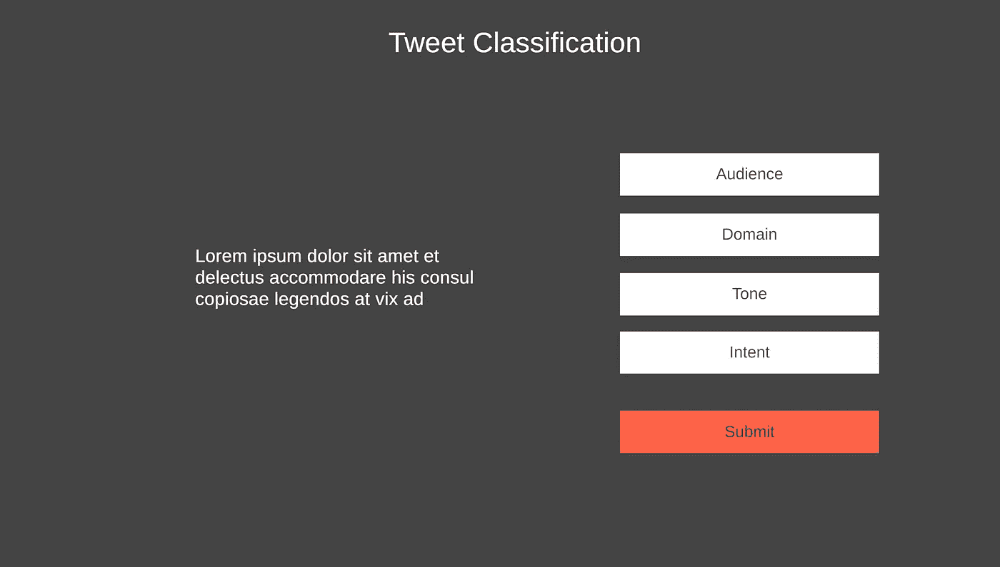

# 我在为机器学习项目设置存储时学到了什么

> 原文：<https://towardsdatascience.com/what-i-learned-setting-up-storage-for-a-machine-learning-project-7ae1e5668762?source=collection_archive---------30----------------------->

## [入门](https://towardsdatascience.com/tagged/getting-started)

## 面向小型项目的快速存储解决方案之旅

[瓦西里·科洛达](https://unsplash.com/@napr0tiv?utm_source=medium&utm_medium=referral)在 [Unsplash](https://unsplash.com?utm_source=medium&utm_medium=referral) 上的照片

总的来说，机器学习框架和技术已经走了多远，我们现在能够以多快的速度将机器学习功能集成到应用程序中，这是令人惊讶的。**几周前终于进入 TensorFlow 和 Keras**几个小时后就训练了我的第一个模型。我完成了三个教程，几个 YouTube 视频，用演示数据训练模型，并想知道为什么训练过程的“改进”会产生相反的效果。🙂

总的来说，这是一次非常好的经历，我当然想了解更多。我跟随的教程都附有数据集，这些数据集已经进行了适当的分类和结构化。对我来说，合乎逻辑的下一步是从头开始一个新项目:收集数据，手动分类数据，并训练一个模型。由于我目前正在构建一个专门用于创建和安排 Twitter 内容的工具，也就是 Tweets，我考虑过在其中加入 ML 特性。

为此，我需要一堆推特。好在我的机器上已经有大约 30，000 条 JSON 格式的推文。当然，这些没有标签。但是丢失标签并不是最大的问题。我在想储物件，以及我如何能够

*   一次给一条推文加标签，
*   添加和删除推文，而不打破以前的分类。

一开始尝试用微软 Excel。不，不是因为我看了[这篇](https://venturebeat.com/2020/12/30/you-dont-code-do-machine-learning-straight-from-microsoft-excel/)文章。这是一个强大的工具，在过去，我经常选择用代码来实现自动化，而不是使用现有的和经过验证的解决方案。因此，我将推文转换为 CSV 格式，并将 CSV 文件导入 Excel 表格。我为我的班级添加了专栏，并在同一张纸上标注了前几百条推文。直到我意识到有些推文不是用英文写的。事后看来，这并不奇怪，因为我没有按语言过滤推文。这很不幸，因为我不确定我是否可以再次导入 CSV 文件，而不会弄乱我已经标记的推文。

第二天，我决定花更多的时间为分析打基础。如果推文存储在数据库中，我可以不分类地随机选择一条，然后单独更新。我将能够添加更多的推文，而不必担心打破推文和它们各自的分类之间的关联。不过，也有一些缺点。

*   复杂性:更多的组件意味着更多的维护工作和更高的故障几率。
*   **访问** : Tweets 以 CSV 和 JSON 文件的形式存储在我的文件系统中，我可以用任何文本编辑器查看它们。数据库需要额外的工具来查看和操作数据。
*   **版本控制**:由于推文存储在文本文件中，它们受到版本控制。Git 也存储二进制 blobs，但是，当然，二进制文件的变化不容易可视化和理解。

此外，什么数据库是一个选项？构建我的 Twitter 内容工具时，我对 MongoDB 相当满意。我最喜欢的是我能够使用 API 来创建、更新和检索数据。不需要使用不同的语言，如 SQL。这是一个很大的优势。此外，MongoDB 支持模式和模式验证，但默认情况下并不强制执行。

我想到的另一件事是:**摆脱了 Excel，我也失去了对数据进行分类的用户界面**。Mongo-express 是一个选项，但是对于大量数据的批量编辑来说太不方便了。快速搜索后，我找到了 [Labelbox/labelbox](https://github.com/Labelbox/labelbox) ，但对抽象级别不满意。它仍然需要手动获取数据并编写 HTML 来可视化训练数据和标签。

但是对于 tweet 分类，它不需要过于复杂的应用程序。毕竟，我想对包含多达 280 个字符的文本应用标签。我很快就想出了这个简单的模型如下所示。它在左边显示 tweet，在右边显示一个包含各种选择元素的表单和一个提交按钮。

推特分类前端的模型

所以，我决定用 MongoDB 存储数据，并编写一个简单的 HTML 前端来标记推文。

最初将所有 tweets 插入 MongoDB 集合非常简单。我使用 Python 将 JSON 文件读取并解析到一个数组中，并将该数组一次插入 MongoDB 集合中。有趣的是，几天前我用 Python 的内置 JSON 模块创建的 JSON 转储包含一些语法错误，我必须用第 17 行来修复。

随着推文被存储在数据库中，是时候考虑分类数据的存储了。分类数据包括推文的 id 和分类本身。**我定义了经典的情感分析标签**

*   **正面、中性、负面来捕捉推文的语气，**
*   **随意而又商务地描述观众，**
*   **和提问、告知、说服分类意图**。

分类数据必须以某种方式与 tweet 数据一起存储。有两种选择:

*   **规范化**:使用单独的集合存储分类标签和 tweet id。
*   **嵌入式**:使用我已经用过的 tweets 集合来存储 tweets 本身。含义:将分类标签存储在 tweet 旁边，或者将分类数据与 tweet 数据混合。

对于那些不熟悉 MongoDB 的人来说:**集合大致相当于关系数据库的表**。集合存储相关的文档，比如 Tweets，并且可能施加某些规则，比如模式或者读写文档的权限。**在关系数据库的上下文中，文档是一行**。

一开始我选择了第一个选项:一个集合包含所有推文，另一个集合包含每个推文的分类。但这又一次给我带来了麻烦。为了找出哪些推文还没有被标记，我必须加入这两个集合。这可以用 [$lookup](https://docs.mongodb.com/manual/reference/operator/aggregation/lookup/) 操作符实现，但是这个过程很慢，即使在我只有 30000 个文档的情况下也是如此。花了 20 秒在 tweets 集合中找到 tweets，但在 classifications 集合中没有。那太慢了。

出于性能原因，MongoDB 鼓励用户嵌入集合。在这种情况下，嵌入意味着在文档中包含嵌套的对象。这基本上是我上面提到的第二种选择。

> 一般来说，嵌入为读取操作提供了更好的性能，并且能够在单个数据库操作中请求和检索相关数据。嵌入式数据模型使得在单个原子写操作中更新相关数据成为可能。
> [docs.mongodb.com/data-model-design/](https://docs.mongodb.com/manual/core/data-model-design/)

所以选择二。下面是我用来从数据库中提取一条没有标签的 tweet 的代码。

不出所料，表演棒极了。渲染前端应用程序，包括从数据库获取下一条 tweet，大约需要 200 毫秒。

此时此刻，我为自己所取得的成绩感到高兴。我为我的机器学习项目实现了一个可扩展的存储解决方案和一个轻量级的快速分类过程。我能够时不时地更新推文，而不会中断甚至破坏分类过程。

我将在另一个故事中分享关于前端应用程序的细节，我也将在未来几周继续分享关于我的机器学习之旅的进一步细节。

感谢来到这里，也感谢你的阅读，
Stefan， [www.blauspecht.io](https://www.blauspecht.io/) 的创作者👋