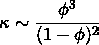

# 我在最近的黑客马拉松中可能会做些什么

> 原文：<https://towardsdatascience.com/what-i-might-have-done-in-a-recent-hackathon-55e15832a4db?source=collection_archive---------28----------------------->

## 以及为什么领域专业知识在机器学习中很重要


Alex Kotliarskyi 在 [Unsplash](https://unsplash.com?utm_source=medium&utm_medium=referral) 上的照片

最近，我的同事【Michael Pyrcz 教授 ( [@GeostatsGuy](https://twitter.com/GeostatsGuy) )和我在[德克萨斯大学奥斯汀分校](https://utexas.edu)举办了一场[数据科学黑客马拉松](https://github.com/PGEHackathon/PGEHackathon)，由[希尔德布兰德石油和地球系统工程系](https://pge.utexas.edu)提供支持。鉴于 COVID 疫情，我们在 2021 年 4 月的两个周末举办了该活动。第一个周末由一个[研讨会](https://github.com/PGEHackathon/workshop)组成，随后是对[问题数据集](https://github.com/PGEHackathon/data)的解释，然后学生们分成小组，研究他们的解决方案，最终在接下来的周末提交给一个行业专家小组进行评分、代码审查和演示评审。

对我个人来说，这是一次非常有趣的经历，所有参与者的反馈都令人难以置信。鉴于我多年来一直在教授数据科学技能，并用高难度的编码练习挑战我的学生，看到他们展示自己的能力真是太棒了。

我鼓励你看一下详细的问题陈述和上面链接的数据集，但简单地说，挑战是:给定来自测井的岩石物理数据和从已经生产一段时间的 73 口油井的地震解释的空间图，预测最近钻探的 10 口新井的 3 年累计产量，并有测井数据，但尚未投入生产。除了他们的“最佳估计”，学生们还被要求提供 100 个额外的实现，以便可以评估不确定性模型。客观评分包括相对于他们的“最佳估计”和真实的 3 年产量(我们知道，但对学生保密)的均方误差的比较，以及他们的不确定性模型与 Deutsch (1996)提出的“良好性测量”的评分。

我认为这将是一个有趣的练习，考虑我自己可能会做些什么来完成这个挑战。本着黑客马拉松的精神，我将把我在项目上的工作时间限制在我一天能完成的范围内。当然，因为我已经熟悉了数据集，所以我比比赛中的团队有优势，他们通常在第一天就花几个小时调查数据。但鉴于我的时间表很短，我不会训练任何复杂的神经网络架构或任何复杂的机器学习模型。我想看看我如何利用我的领域专业知识来设计有意义的功能，以快速获得答案。关于我如何处理不确定性模型，我也有一个惊喜。所以让我们开始吧…

# 特征插补

首先，像 Python 中的所有工作一样，我将从这项工作中使用的模块导入开始。

我将从已经生产的油井和我们称之为*试生产*的油井中读取测井数据集，即我们试图预测 3 年后累积产量的油井。

现在我们将这两个数据帧合并成一个数据帧。


并检查数据集的一些总体统计数据。


我们可以看到有相当多的数据缺失。特别值得关注的是大量渗透率缺失，因为这将是最强的生产指标之一。所以我们的第一个任务是估算缺失的特征，特别是建立一个好的渗透率模型。首先，让我们绘制一些提供的地图数据。这里我们展示了储层中百分比相的空间分布。水库里有一条断层，我们只知道它的位置，没有其他信息。白色圆圈代表我们有产量的井，红色圆圈是我们试图预测产量的井。红线表示故障。虽然我试图展示尽可能多的代码，但 matplotlib 绘图命令有些冗长，所以我将取消输入，只显示绘图。


相分数彩色地图

看起来断层不会在空间相信息中产生任何偏移或不连续，这是个好消息，因此我们将继续使用空间位置信息输入缺失的相信息。首先，我们将划分数据帧的子集，并用数字替换岩相的字符串标签，因此 0 表示砂岩，1 表示砂质页岩，依此类推…

现在我们将构建一个*k*-最近邻分类器，用 [scikit-learn](https://scikit-learn.org/stable/index.html) 的内置 [GridSearchCV](https://scikit-learn.org/stable/modules/generated/sklearn.model_selection.GridSearchCV.html) 做一点超参数调整。

```
{'n_neighbors': 4, 'weights': 'distance'}
```

使用上面的超参数设置，我们现在可以预测(和估算)缺失的相值。


假设我们期望相同岩相的岩石具有相似的密度和声阻抗，我们将用每个岩相的平均值来估算这些缺失的特征。

现在，我们将对数据框进行子集划分，并使用所示的特征通过多项式回归来估算缺失的孔隙度值。


我们将设置一个管道，并再次使用`GridSearchCV`来寻找最佳超参数。

```
{'pca__n_components': 5, 'poly__degree': 2, 'scaler': MinMaxScaler()}
```

最佳参数如上所示。现在我们将使用这个模型来估算缺失的孔隙度。

下面我们将绘制估算的和给定的孔隙度。这里看起来没什么奇怪的，没有一个估算值是给定数据范围内的异常值。


作为深度函数的预测孔隙度

我们还可以观察估算孔隙度的分布，并与给定值进行比较。插补保留了原始数据的双峰分布。


给定和预测孔隙度

现在我们将这个估算数据添加到我们的`wells_df`中。

为了估算缺失的渗透率，我们将使用一些岩石物理学知识来做一些特征工程。孔隙度和渗透率之间有一个广泛使用的相关性，称为 Kozeny-Carmen 关系，它将渗透率建模为



其中κ是渗透率，ϕ是孔隙度。我们可以使用 [seaborn](https://seaborn.pydata.org/) 的内置函数快速查看这种关系，即


作为孔隙度函数的渗透率的 Kozeny-Carmen 变换和拟合

虽然不是最好的模型，但我们可以使用这些数据来调整我们未来更复杂的预测。首先我们找到上面蓝线的斜率和截距。

现在我们将使用这个模型来创建一个我们称之为`'KC permeability, mD'`的特征。

使用上面显示的数据，我们将建立一个模型来估算缺失的渗透率。同样，使用`GridSearchCV`进行超参数调整，我们有

```
{'pca__n_components': 4, 'poly__degree': 2, 'scaler': RobustScaler()}
```

有了这些参数，我们可以预测缺失的渗透率。

根据给定数据可视化预测结果，该模型表现良好。同样，我取消了冗长的绘图命令


作为孔隙度函数的预测和给定渗透率

`'KC permeability, mD'`现在是多余的，所以我们将它从数据帧中删除。

# 特征工程

由于断层正好穿过生产井和我们试图预测产量的井，让我们设计一些与断层相关的特征。首先，我们将设计一个称为`'Distance to fault'`的特征，它计算到断层的垂直距离。此外，我们不知道断层是否以任何方式划分了油藏，因此我们还将创建一个名为`'left/right fault'`的要素来指示油井位于断层的哪一侧。

因为所有预测井都“靠近”断层，所以我们将创建另一个布尔要素，赋予断层附近的井一定的重要性。我们将“近”定义为比平均预生产(即预测)井距断层更近的任何井。

假设我们预期“相似”的井具有“相似”的产量，我们将使用`KMeans`聚类在我们的数据框架中寻找相似的井

```
{'cluster__n_clusters': 14, 'scaler': MaxAbsScaler()}
```

并且使用该模型来预测预生产井将落入哪个组。

现在我们将读入生产历史，并将它们与我们的工作数据框架合并。


现在，我们将计算每个丛的 1 年、2 年和 3 年的平均产量，并将此平均值作为每个井位的预期平均产量分配给一个新特征。

将这些平均产量值合并到我们的工作数据框架中，我们就有了最终的数据框架，我们将用它来进行预测。


# 预言

为了对我们即将推出的模型进行超参数调整，我们将使用 Deutsch，1996 的“良好度”度量，即


除了来自 scikit 的`mean_absolute_percentage_error`-学习给我们的模型打分。我们的想法是使用`BaggingRegressor`来创建一个模型集合，我们对其进行平均以创建我们的“最佳估计”,并使用每个单独的估计值作为我们不确定性模型的实现。我们将使用`GridSearchCV`在交叉验证中对我们的模型进行评分。功劳归于 [Honggeun Jo](https://github.com/whghdrms) 创造了这个函数的原始版本，我在这里只做了一点小小的修改。

分离我们的预测和响应特征标签。

由于每口井都有几个数据样本，但我们只需要报告整个井的预测，因此有几个选择。最简单的方法是对每个孔中的所有样本进行平均，为了节省时间，我们将使用这种方法。

为我们的训练井(已经投产的井)获取布尔索引器。

现在我们将建立一个管道，并将其传递给`GridSearchCV`进行超参数调整。我重复了几次，以缩小要搜索的最终参数集，以便最终的笔记本/解决方案能够及时运行。这里，我在 k 倍交叉验证中使用了 7 倍，因为这在测试集中留下了大约 10 个孔，类似于我们需要预测的数量。

```
0.8432431728379238{'bag__base_estimator': LinearRegression(),
 'bag__bootstrap': True,
 'bag__max_features': 0.75,
 'bag__max_samples': 0.75,
 'pca__n_components': 9,
 'poly__degree': 1,
 'scaler': MaxAbsScaler()}
```

上面显示了“最佳分数”和最终的超参数集。现在，我们将把我们的最佳估计和实现写到解决方案文件中。

提交解决方案文件进行评分，我们可以生成以下图。首先，我们有一个准确度图，它将预测值与实际值进行了比较。10 口井的产量。

```
MSE: 24697.56
```


下面显示了不确定性模型和真实值。


最后是善良的情节。我们在上面的`scorer`函数中使用的品质度量与黑色虚线相对于红色对角线的积分有关，其中红色对角线上方的面积是下方面积的两倍。

```
Goodness: 0.856
```


最后，我在其他团队中的排名(注意，这只是客观评分的一部分，在实际的黑客马拉松中，我们有额外的代码质量和演示栏，因此此表中其他团队的最终排名并不反映比赛的实际最终结果)。对于一天的工作来说还不错！


这里的最后一个信息是，导致良好估算和特征工程策略的领域专业知识远比花哨的机器学习模型有用。此外，准确理解您正在寻找的感兴趣的数量，以便您很好地评估(即评分)您的模型。最终我用一个线性回归模型“赢”了比赛。

*最初发表于*[T5【https://johnfoster.pge.utexas.edu/blog/posts/hackathon/】](https://johnfoster.pge.utexas.edu/blog/posts/hackathon/)*。*