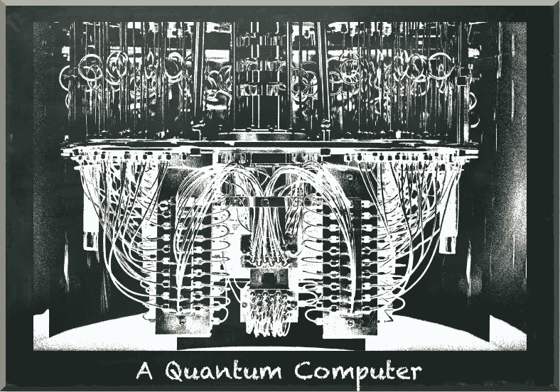

# 如果我买不起量子计算机怎么办

> 原文：<https://towardsdatascience.com/what-if-i-cant-afford-a-quantum-computer-51ce96cd7b9c?source=collection_archive---------18----------------------->

## 使用量子计算机还有其他方法

量子机器学习要不要入门？看看 [**动手量子机器学习用 Python**](https://www.pyqml.com/page?ref=medium_afford&dest=/) **。**

作者图片

量子计算机不再是科幻小说了。他们是现实。

谷歌已经在 2019 年宣布了量子优势——他们的量子计算机在 200 秒内解决了一个经典计算机需要 10，000 年才能完成的任务。尽管 IBM 反驳说，他们的一台(经典)超级计算机可以在不到三天的时间内解决同样的问题，但这仍然是一个令人印象深刻的加速。

但是，如果两个科技巨头争夺谁的设备首先证明量子优势，那么在你当地的零售商那里找到一台量子计算机出售的机会就很小了。所以，即使它们确实存在，除非你有几百万你不需要的钱，否则你今天是买不起量子计算机的。

同时，量子计算是最有前途的技术之一。这是一项技术，你可能想今天就开始学习，而不是明天。

***那么，你能做什么？***

# 选项 1:云

当然是云！如今，一切都在云端。有相当多的云提供商提供量子计算资源。

首当其冲的是 IBM。IBM 在 IBM cloud 中免费提供他们的量子计算机。目前，他们允许你使用的最大量子计算机是 27 量子位计算机。

问题是你必须等待一个空闲的位置。有时，你的电路运行需要几个小时。

第二，还有谷歌。谷歌提供基于量子计算服务的量子计算硬件。但是目前只允许那些在许可列表上的人访问。此外，他们没有指定硬件的大小。

第三个玩家是亚马逊。亚马逊不开发自己的硬件。但它们提供对其他制造商硬件的访问，如 Rigetti。他们的投资组合中有一台 32 量子位的 Aspen-8 量子计算机。缺点是你必须为每一次执行和每一个镜头付费。

# 选项 2:云模拟器

三个云服务也提供模拟器。经典计算机计算你的电路，而不是量子计算机。当然，它没有量子计算机快，但如果你只想看看你的电路是否工作，它们是一个有效的选择。

IBM Cloud 提供了不同的模拟器，大小高达 100 个量子位。虽然您可以免费使用它，但您的电路不会立即运行，而是必须等待一个空闲时间。

就像他们实际的量子硬件一样，谷歌对他们在谷歌云中提供的模拟器并不十分明确。

亚马逊 Braket TN1 模拟器可以模拟某些类型的量子电路，大小高达 50 量子位。

# 选项 3:本地模拟器

第三种选择是用你的本地机器来模拟量子电路。根据你的硬件和你创建的电路，你的本地设备可以在合理的时间内计算 10 到 20 个量子位。

明显的好处是，你不必等待你的电路运行，你也不必支付任何进一步的费用。

# 结论

局部仿真是电路开发过程中的最佳选择。每当你想知道具体的电路结构是如何影响结果的，你最好的选择就是你的电脑。

当然，你需要保持你的电路小。因此，您能够解决的实际问题的复杂性是有限的。

一旦你有了一个对小问题表现良好的电路，你就可以把它送到 IBM 的云模拟器和硬件上。你将看到你的电路是否在有噪声和退相干的真实环境中工作。并且您将知道它是否扩展到您的本地机器很可能无法模拟的大小。

最后，如果你想将量子电路嵌入到生产环境中，当时间很重要时，你可以考虑使用 AWS Braket 为使用真实设备付费。

量子机器学习要不要入门？看看 [**动手量子机器学习用 Python**](https://www.pyqml.com/page?ref=medium_afford&dest=/) **。**

在这里免费获得前三章。