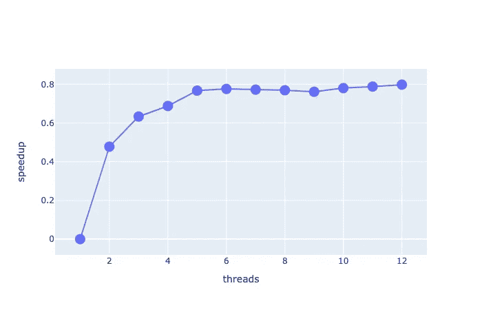

# 如果标准不是最好的呢

> 原文：<https://towardsdatascience.com/what-if-standard-is-not-the-best-534fab31dc3e?source=collection_archive---------33----------------------->


莎伦·麦卡琴在 [Unsplash](https://unsplash.com?utm_source=medium&utm_medium=referral) 上的照片

## 简单的解决方案并不总是最好的

在研究过程中，在某些时候，我需要在**大矩形矩阵**上评估一个特定的度量([多样性指数](https://en.wikipedia.org/wiki/Diversity_index))。这与这个故事无关，但我说的是单细胞 RNA 测序数据。

在实践中，这有助于估计在群体中发现的**不同**成分的数量(例如，一本书中不同单词的数量)，并且[可以解释](https://arxiv.org/abs/2103.09143) [3]在许多复杂系统中出现的特殊幂律分布[1，2，4]。

# 熊猫

给定存储在文件中的数据，测量这个度量的问题可以使用著名的 pandas 库在一行 Python 代码中解决。

```
pd.read_csv().apply(lambda x: len(np.unique(x)))
```

[](https://pandas.pydata.org) [## 熊猫

### pandas 是一个快速、强大、灵活且易于使用的开源数据分析和操作工具，构建于…

pandas.pydata.org](https://pandas.pydata.org) 

这对于许多应用来说是很好的，并且不需要数据科学家付出任何努力来实现它是非常直接的，但是..

我需要在大桌子上测量这个数量(单细胞数据有几十万个样本)，这个简单的任务对熊猫来说很慢。pandas 方法需要很多时间将数据加载到内存中，然后在每一行上评估函数。

一种更快的方法是在将行加载到内存中时立即处理它们，然后丢弃它们(节省内存是一个额外的好处)，所以我在 scartch 中实现了它。

# C++解决方案

我对这个特殊问题的解决方案使用了*标准模板库*和 Boost。

## 这个想法

如上所述，这个想法是在这些行可用时尽快解析它们。我定义了一个[线程](https://en.cppreference.com/w/cpp/thread/thread)，**读取**文件，**将其存储**在[缓冲区](https://en.cppreference.com/w/cpp/container/queue)中，其他线程**解析可用的读取行**。因为我的度量是在列上估计的，所以我需要多个线程同时解析不同的行**而不是**到**重叠**，这是用一个[互斥](https://en.cppreference.com/w/cpp/thread/mutex)数组解决的(每列一个)。

## 有约束力的

使用*升压。Python* 我能够将我新创建的模块加载到一个 Python 模块中，所以使用它会像熊猫一样容易。

[](https://boost.org) [## Boost C++库

### Boost 提供免费的同行评审的可移植 C++源代码库。我们强调与 C++配合良好的库…

boost.org](https://boost.org) 

下面是一个绑定函数的例子

```
#include <boost/python.hpp> BOOST_PYTHON_FUNCTION_OVERLOADS(loadFile_overloads, loadFile<long>, 1, 3) BOOST_PYTHON_MODULE(pydiversity){    
    namespace bp = boost::python;
    using namespace bp;
     def("diversity", loadFile<long>, loadFile_overloads(bp::args("file", "nThreads", "verbose", "out_filename")));
}
```

它可以很容易地导入到 python 中

```
import pydiversity
pydiversity.diversity("mainTable.csv")
```

# 基准

我测量了解析一个有 10000 列和 20000 行的表的时间(你可以猜猜[为什么](https://bionumbers.hms.harvard.edu/bionumber.aspx?id=100310&ver=9&trm=number+of+genes+in+mouse&org=))，看起来我的解决方案比简单的熊猫*应用*的**快 60%。此外，我的解决方案可以利用运行它的机器的全部能力，在一台**多核**机器上，相对于 Python 实现，加速比为 **90%** 。**

## 英国泰晤士报(1785 年创刊)

*   Python 使用*熊猫* : (8.05 0，11)s
*   Python 绑定单线程:(3.3 0，4)s
*   使用多线程的 Python 绑定:(0，71 0，14)s
*   纯 C++单线程:(3.2 0，3)s
*   纯 C++多线程:(0，66 0，11)s

## 加速

因为我的解决方案可以是多线程的，所以我测量了用越来越多的线程运行时的增益。我在一台 6 核机器上测量了加速比(1 倍/(最慢时间))，有一个可感知的增益。



在 6 核机器上加速。图片作者。

# 结论

除了这个特殊的问题，我希望能激励人们不断深入研究，并在可能的情况下实施更有效的解决方案。很多次我听到“因为这是 Python 做这件事的方式”，但作为数据科学家，我认为我们应该提高自己，总是实施新的解决方案，我们不应该每次都接受最简单的解决方案。

# 密码

[](https://github.com/fvalle1/fastDiverse/) [## GitHub-f Valle 1/fast diversity:大表上多样性估计的快速实现

### 以快速有效的方式估计矩形矩阵中不同元素的数量。这很容易做到…

github.com](https://github.com/fvalle1/fastDiverse/) 

# 参考

1.  Lazzardi S，Valle F，Mazzolini A，等[单细胞转录组数据中出现的统计规律。](https://doi.org/10.1101/2021.06.16.448706)(2021)bioRxiv 2021 . 06 . 16 . 448706。

2.马佐利尼 A，格拉尔迪 M，卡塞尔 M，等[复杂组分系统中共享组分的统计。](https://doi.org/10.1103/PhysRevX.8.021023) (2018)体检 X

3.Mazzarisi O，de Azevedo-Lopes A，阿伦松·JJ，Corberi F [极大多样性和齐夫定律。(2021) arXiv:210309143](https://arxiv.org/abs/2103.09143)

4.语言学中的统计规律。 (2016)施普林格国际出版公司。