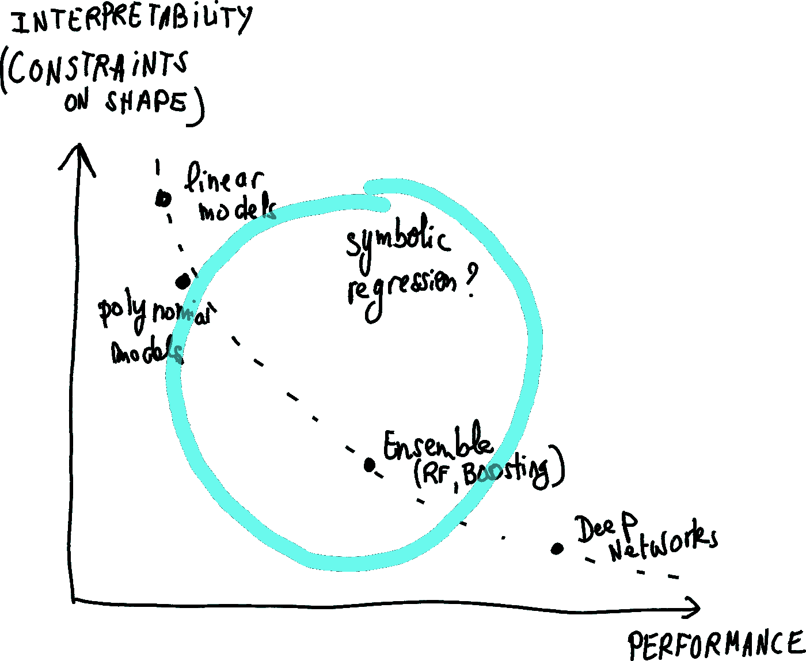
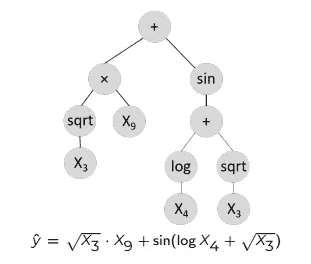
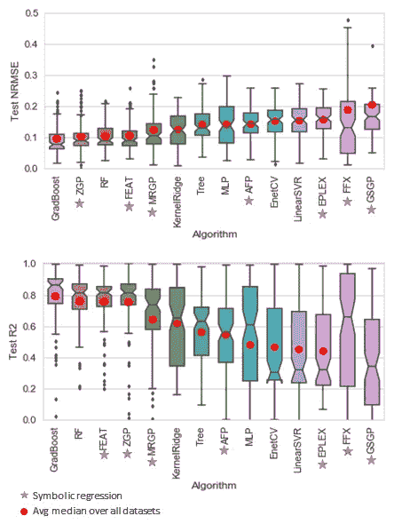
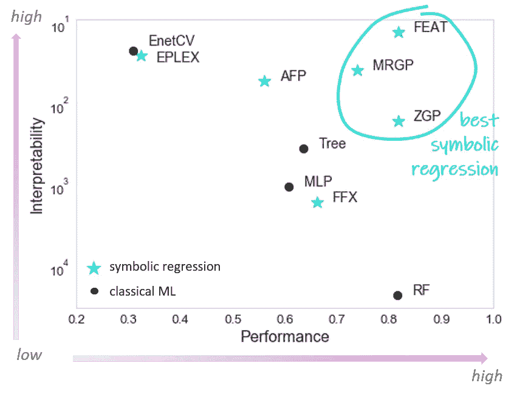

# 如果我们不必在可解释性和性能之间妥协会怎么样？

> 原文：<https://towardsdatascience.com/what-if-we-didnt-have-to-compromise-between-interpretability-and-performance-da00d4e30a44?source=collection_archive---------26----------------------->

## **小数据中的机器学习算法基准测试**

在过去的几年里，我读了很多关于可解释性和性能之间的权衡(顺便说一下，这让我想起了很多偏差-方差权衡)。我见过许多图表，显示了标准机器学习算法在这两个指标方面的地位，如下所示:

*   一方面，**线性模型**天生简单且易于理解，只有当数据符合线性的硬约束时才能产生良好的性能
*   另一方面，我们发现了**集成算法**，如随机森林，甚至更进一步的**深度神经网络**，它们对大多数数据都有良好的性能，但代价是在没有额外策略的情况下难以解释(例如，使用[时间](https://ema.drwhy.ai/LIME.html)或 [SHAP](https://ema.drwhy.ai/shapley.html) )。

性能与可解释性领域的主要机器学习算法

有一类算法总是从那些图表以及机器学习的参考书和材料中缺失，即**符号回归算法**。[拉斐尔·鲁杰罗](https://medium.com/u/4101e7425d00?source=post_page-----da00d4e30a44--------------------------------)最近写了一篇关于它的文章，名为[被遗忘的机器学习算法](/symbolic-regression-the-forgotten-machine-learning-method-ac50365a7d95)，这说明了一切！

# 符号回归

那么，这个进化算法界最了解的算法是什么呢？它包括将模型构建为数学表达式**，也可以表示为表达式树**。以下示例显示了模型的数学公式，其中涉及输入特征 X 的**选择**，使用一元运算符(正弦、平方根和对数)将其修改为**新特征**，以及使用二元运算符(加法和乘法)将其**交互**。****

********

****符号回归模型的示例****

****由于搜索相关的新特征以及如何组合它们是一个非常大的搜索空间和困难的优化问题，传统的机器学习并不真正适合处理它，符号回归的大多数算法依赖于**遗传编程**。在符号回归不为 ML 社区所熟知的可能原因中，我们可以列举以下几个:较慢的计算时间，缺乏与 ML 相关的基准，性能不太好，超参数数量大…****

****然而，在过去的几年里，事情开始发生变化:****

*   ****回归中有几个比较不同符号回归算法与更传统算法(线性模型、决策树、随机森林、多层感知器)的基准，其中一个在大量 ML 数据集上[1]****
*   ****最近发布的几个符号回归算法表明，它们可以实现与随机森林相当的 T2 性能，并接近 T4 梯度增强。这些算法分别是 **Zoetrope 遗传编程**(ZGP)【2】和**特征工程自动化工具**(FEAT)【3】。****

# ****符号回归算法的性能****

****在再次谈论可解释性之前，让我们看看符号回归算法相对于更传统的机器学习算法的表现如何。****

****下图是从[Penn Machine Learning Benchmark](https://github.com/EpistasisLab/pmlb)数据库中对近 100 个数据集执行的基准测试的结果生成的，这些数据集具有多达 3000 个观察值。它们显示了每个算法对所有数据集运行 20 次后，归一化均方根误差(NRMSE)和 R2 的重新分配。这些算法是按平均值排序的(在 NRMSE 是从低到高，因为我们希望它尽可能接近 0，在 R2 是从高到低，给出的分数是 1，表示完全符合)。****

****从这些图中，特别是关于 R2 分数的图，我们看到 4 种算法明显优于其他算法，即:梯度推进、Zoetrope 遗传编程(ZGP)、随机森林和特征工程自动化工具(FEAT)。因此，这里要传达的信息是，良好的性能也可以通过符号回归来实现。****

********

****符号回归和机器学习算法在归一化均方误差(NRMSE，顶部)和 R2 分数(底部)中的性能，按所有数据集的平均值排序。最好的算法在左边。****

****请注意，这里的基准测试是使用大多数方法的默认参数运行的，并且为了尽可能公平起见，对线性方法进行了交叉验证。****

# ****可解释性与性能****

****我们现在回到我们最初的问题:这些算法在可解释性和性能测量方面表现如何？更准确地说，我们是否总是要在这两者之间做出妥协？答案是否定的，这要归功于符号回归算法，我们接下来要研究它。****

****下图是根据与之前相同的基准生成的。它显示了中值 R2 的性能与一些符号回归算法和标准机器学习算法的可解释性。这里的可解释性被测量为树中的节点数(对于符号回归或决策树)或系数数(对于线性模型或多层感知器)。****

> ****它表明，3 个顶级符号回归算法能够实现与随机森林一样好的性能，可解释性接近线性模型，产生人类可以理解的模型。****

****请注意可解释性的对数标度:这意味着符号回归算法可以实现“简单”1000 倍(就节点数量而言)的模型，而性能没有损失。此外，它们可以非常清楚地显示变量之间的相互作用，这在一些应用程序中非常有用。在上面给出的表达式树的例子中，已经发现变量 X9 和 X3 的平方根之间的相互作用。****

********

****符号回归和机器学习算法的实际性能与可解释性****

****基准测试的完整细节在[2]中给出，这些结果的基准测试代码可从以下 Gitlab 存储库中获得:[https://git lab . devenv . mydata models . com/publications/bench-zgp-symbolic-regression](https://gitlab.devenv.mydatamodels.com/publications/bench-zgp-symbolic-regression)。****

# ****结论****

****所以最后，使用符号回归，有可能获得既有好的性能又有好的可解释性的模型。取决于问题(及其大小！)，为了获得可以直接解释的模型，有时牺牲一点性能(例如与深度神经网络相比)是值得的，而不需要求助于额外的方法来理解如何从模型中获得预测。****

# ****参考****

****[1] Orzechowski，p .，La Cava，w .，& Moore，J. H. (2018 年)。我们现在在哪里？近期符号回归方法的大型基准研究。在*遗传和进化计算会议上*(第 1183-1190 页)。****

****[2] Boisbunon，a .，Fanara，c .，Grenet，I .，Daeden，j .，Vighi，a .，和 Schoenauer，M. (2021 年)。回归的遗传程序设计。在 2021 年 7 月 10 日至 14 日的*遗传和进化计算大会*(GECCO’21)上。[https://doi.org/10.1145/3449639.3459349](https://doi.org/10.1145/3449639.3459349)****

****[3]拉卡瓦、辛格、塔加特、苏里和摩尔(2019 年)。通过进化树网络学习回归的简洁表示。在*国际学术代表会议* (ICLR)。https://openreview.net/pdf?id=Hke-JhA9Y7****