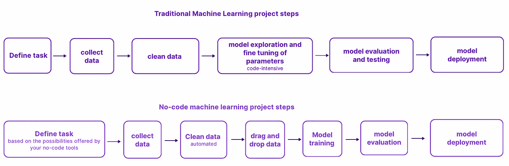
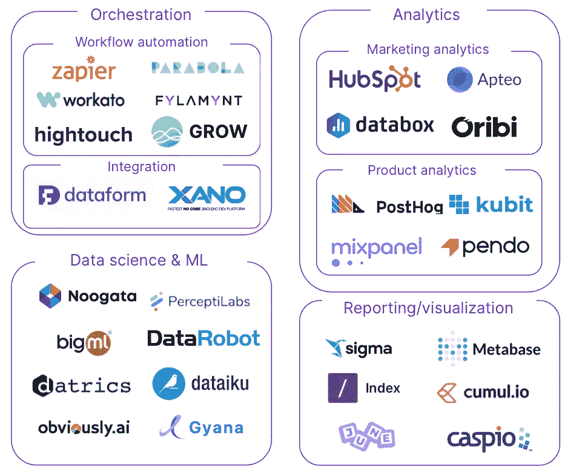

# 如果…你必须用无代码工具构建一个数据栈，那会怎样？

> 原文：<https://towardsdatascience.com/what-if-you-had-to-build-a-data-stack-with-no-code-tools-c01380697117?source=collection_archive---------21----------------------->

## 最佳无代码工具及其用例的基准

图片来自 castor 的网站

在过去的几年里，我们见证了技术生态系统的巨大演变，因为**无代码工具**已经迅速改变了我们生产和管理软件的方式。今天，任何拥有笔记本电脑、互联网连接和大脑的人都可以使用无代码工具构建网站或应用程序。数据生态系统在很大程度上跟上了这种发展，最近出现了一系列无代码数据/机器学习工具。目标:**降低现代数据堆栈每一层的技术壁垒**，让尽可能多的人能够**利用数据科学**。无代码数据工具在数据社区产生了很多兴奋。原因是，这些工具引领了走向**数据民主化的运动，是现代数据堆栈下一波创新的[五大支柱](https://blog.getdbt.com/future-of-the-modern-data-stack/)之一。今天的主题是深入无代码生态系统，理解这些工具的能力/限制，并找出可用的解决方案。**

‍

# 什么是无代码？

无代码平台使用不涉及编写代码的编程方法。相反，用户使用图形用户界面(GUI)工作，他们可以使用模板、逻辑序列和拖放来实现所需的输出。后者可以是数据摄取、转换、分析、机器学习等。一个无代码的数据平台基本上使人们能够在不使用代码的情况下执行各种数据操作，这在传统上是不可能的。这些解决方案提供了一条捷径——利用代码的力量，但抽象掉复杂性，以便用户可以专注于**设计和逻辑**

无代码策略关注四个关键领域:

1.  提供**拖放**功能或其他配置流程的可视化方式。
2.  **创建过滤器**和**数据查询**以允许即时定制流程。
3.  **使用 API**到**整合来自各种来源的**数据。
4.  **吸引非技术用户**，授权他们执行给定的流程。

无代码平台不同于低代码平台。低代码简单地代表减少的编码量。借助低代码，您无需编写一行代码即可构建工作流/数据科学模型。然而，也可以通过编写自己的代码来定制它们，这增加了灵活性。

让我们看看无代码如何在**数据科学/机器学习**的领域中工作:

机器学习是一种痛苦的学习:你需要准备数据，训练你的模型，调整你的参数，等等。机器学习模型传统上是使用 python 等脚本语言构建的，这增加了复杂性。无代码/低代码机器学习工具，如 Google autoML，允许您快速创建机器学习模型。怎么会？主要是通过自动化机器学习过程中的一些步骤。一些工具，如 [autoVIML](https://github.com/AutoViML/Auto_ViML) 可以自动将你的数据放入不同的机器学习模型中，以找出哪一个最适合你的数据。自动化，或者使用拖放选项来完成这个过程的一部分，为数据团队节省了大量的时间。‍

无代码工具机器学习模型流程—图片由 Louise de Leyritz 提供

# 利害攸关的是什么？

无代码数据平台在**民主化数据访问中发挥了关键作用**。这些工具的广泛采用不会在一夜之间发生，但一旦发生，它将对非技术用户和数据工程师/开发人员产生同样的影响，同时为每个人带来巨大的生产力提升。‍

## 对于商业用户

无代码数据平台消除了技术障碍，使非技术用户能够操作数据。这是关键，因为企业开展分析工作的方式已经发生了转变。事实上，如今的公司都在从事**运营分析**——一种让“运营”团队可以访问数据的方法，用于运营用例(销售、营销、..).

我们将它与仅使用数据生成仪表板和 BI 报告的更经典的方法区分开来，在这种方法中，只有数据科学家/数据分析师会与数据争论。运营分析不是使用数据来影响长期战略，而是为企业的**日常运营**提供战略信息。简而言之，就是让公司的数据发挥作用，让组织中的每个人都能做出更明智的决策。

实际上，这意味着销售、营销和其他业务团队每天都要与数据和分析打交道，进行各种分析来启发他们的短期战略。这种趋势只会加剧，这意味着越来越多的人，尤其是非技术人员，将数据作为他们日常工作的一部分。易于使用的数据/机器学习平台允许没有编码技能的用户优化日常操作，并更有效地解决业务问题。对于这些平台来说，学习曲线要平滑得多，这意味着用户可以快速进行价值生成分析，而不是花几个月来掌握复杂的软件。

更重要的是，无代码是为了让非技术人员能够自己在不同的云服务之间分析和路由数据，而不是被迫拿着票等待数据工程师和数据科学家为他们做这些工作(这可能需要几天或几周)。

## 对于数据工程师和数据科学家来说

首先，无代码并不意味着没有编码员，数据工程师/科学家不会很快消失。我们不要忘记，无代码工具是用代码构建的，这些平台的存在是因为有优秀的开发人员一直在努力寻找更好的解决方案。

无代码数据解决方案赋予了新的现代数据堆栈的每一个角色，尤其是技术奇才。事实上，这些平台**自动化了数据处理过程中可以自动化的东西**。数据工程师、数据科学家和其他训练有素的专家可以停止从事可以自动化的重复任务，转而专注于解决更大、**更有趣的问题**，比如系统设计中的偏差。

无代码数据工具不应该只被非编码人员使用。事实上，完全精通 python 的数据人员也可以通过使用无代码方法进行数据分析而获益。使用无代码方法可以让您比使用更传统、代码量更大的方法更快地处理数据。与一个对编程一无所知的人相比，程序员也能更好地理解无代码工作的逻辑。

## 对于企业

采用无代码工具意味着组织不需要依赖工程师和技术数据人员团队来利用他们的数据。技术人才稀缺且昂贵。占美国市场 99%的中小型公司通常雇不起大数据团队。无代码平台代表了一种部署定制数据处理解决方案的新方法，否则大多数组织将无法实现。小公司可以开始利用机器学习和数据分析，而不必进行大量投资。

# 无代码工具的缺点

另一方面，无代码工具也有一些限制，在您决定构建无代码数据栈之前，应该考虑到这些限制。

## 刚性模板

从设计上来说，无代码工具提供的选项不如编码工具精炼。这是完全正常的，就像你可以用文字表达比手势更多的东西一样。当然，现在手势变得非常方便，但这并不意味着你应该只把它作为唯一的交流方式。没有代码工具提供各种可以被配置来满足一组用例的模板。然而，一旦您遇到不可避免的边缘用例，或者需要引入一个定制层，无代码工具就不再有用了。这种无代码的限制在数据处理领域尤其不利，因为在数据堆栈的每一层都有无数不同的用例。

例如，如果您决定完全依赖无代码平台进行数据科学和机器学习，您将很快陷入困境。在设计机器学习模型的时候，你希望你的模型尽可能的微调。有了可视化界面和拖放功能，你很快就会遇到这些平台的边界。原因是，这些平台都是基于模型的。设计数据科学/机器学习工具的开发人员通常决定提出易于理解和使用的简单模型，目的是使机器学习和数据科学能够为业务用户所用。问题是，简单的模型缺乏灵活性，因为人们只能在模型的框架内开发。现在，平台设计者可以选择更精细的模型，从而获得更大的灵活性。但是掌握这些工具的学习曲线显然比简单的解决方案要陡峭得多。这与无代码平台的目的背道而驰，即让非技术用户也能接触到数据科学和机器学习。因此，在机器学习模型的易用性和微调之间存在一个关键的权衡。这就是为什么你应该知道你在为谁购买软件:数据科学家和机器学习工程师，还是商业用户？最终用户会影响你选择的软件类型。

‍

## 平台依赖性

无代码工具的问题是，遇到供应商锁定问题只是时间问题。假设您决定使用无代码工具来编排您的报告工作流。问题是，一旦这些工作流围绕这个工具建立起来，你就完全依赖这个工具了。如果价格上涨，你必须继续支付或自己重建整个系统。在这两种情况下，这都不是一个理想的位置。

# 哪些非代码工具适合您的组织？

下面，你会发现一个无代码工具的前景，它可以帮助你选择一个适合你公司需要的工具。

无代码数据栈。全基准[这里](https://notion.castordoc.com/catalog-no-code-data-tools)。—图片由路易斯·德·莱里兹提供

要获得完整的无代码工具基准测试和更多分类标准，[请单击此处。](https://notion.castordoc.com/catalog-no-code-data-tools)

# 更现代的数据堆栈基准？

点击此处，了解更多关于现代数据堆栈[的基准测试和分析。我们写了利用数据资产时涉及的所有过程:从现代数据堆栈到数据团队的组成，再到数据治理。我们的博客涵盖了从数据中创造有形价值的技术和非技术方面。如果你是一名数据领导者，并希望更深入地讨论这些话题，请加入我们为此创建的](https://notion.castordoc.com/)[社区](https://notion.castordoc.com/unsupervised-leaders)！

在 Castor，我们正在开发一个数据文档工具 Figma，Slack generation。或者对 Fivetran，Looker，Snowflake，DBT 的狂热爱好者来说是数据方面的。我们将我们的目录设计得易于使用、令人愉快且友好。

‍Want 去看看吗？联系我们，我们将向您展示一个演示。

*原载于*[*https://www.castordoc.com*](https://www.castordoc.com/blog/what-are-the-no-code-data-tools)*。*