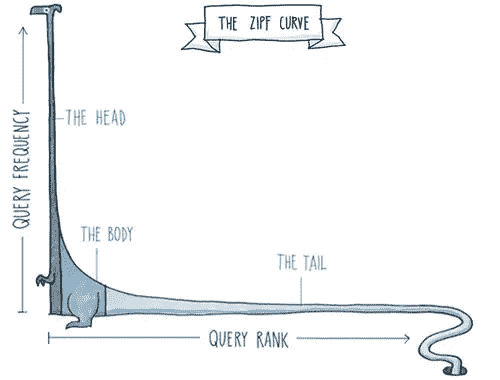
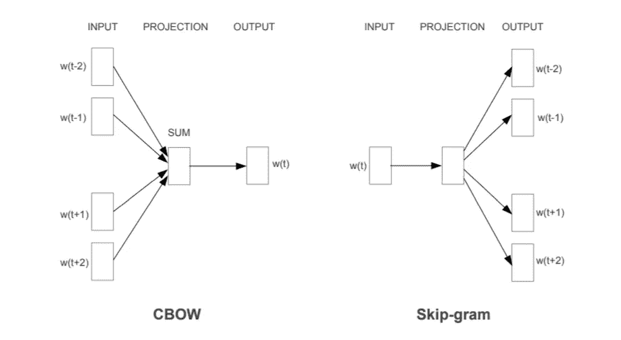
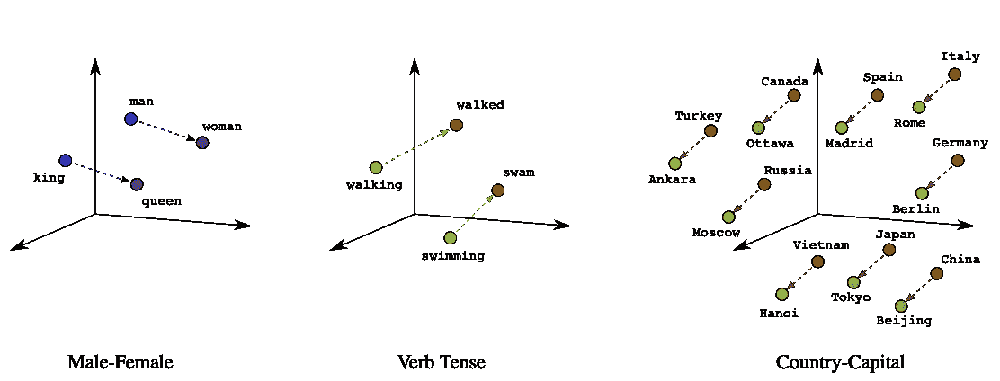
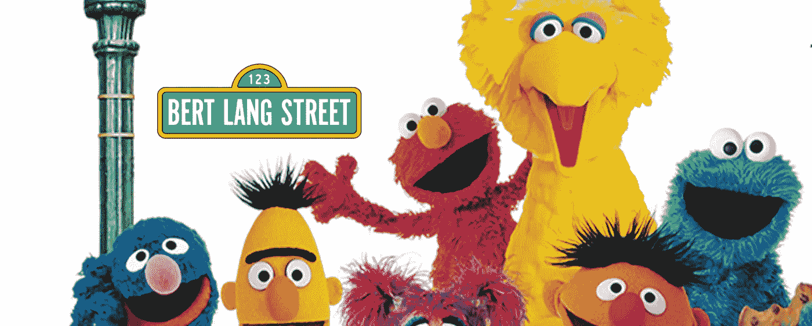
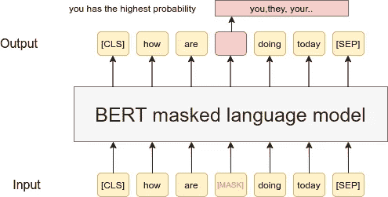

# 语料库中什么是单词嵌入？

> 原文：<https://towardsdatascience.com/what-in-the-corpus-is-a-word-embedding-2e1a4e2ef04d?source=collection_archive---------35----------------------->

## 这些 NLP 模型中的一些很拗口

马修·费尼在 [Unsplash](https://unsplash.com?utm_source=medium&utm_medium=referral) 上的照片

虽然计算机非常擅长处理数字和执行逻辑命令，但它们仍然难以理解人类语言的细微差别！单词嵌入旨在通过构建捕捉意义和上下文的单词的密集矢量表示来弥合这一差距，用于下游任务，如[问答](https://en.wikipedia.org/wiki/Question_answering)和[情感分析](https://www.lexalytics.com/technology/sentiment-analysis)。单词嵌入技术的研究构成了计算语言学领域的一部分。在本文中，我们将探讨建模语言的挑战，以及单词嵌入的演变，从 Word2Vec 到 BERT。

# 计算语言学

在最近对神经网络重新产生兴趣之前，计算语言学严重依赖于[语言学理论](https://en.wikipedia.org/wiki/Linguistics)、手工制作的规则和基于计数的技术。今天，最先进的计算语言学模型是通过结合大型带注释的语料库和深度学习模型开发的，通常缺乏语言学理论和手工制作的特征。在这篇文章中，我的目的是解释单词嵌入的基本原理和不同的技术，同时尽量减少行话，避免使用微积分。

> “什么是语料库/语料库？”你可能会问。非常好的问题。在语言学中，语料库是指一种语言中特定语言元素的完整集合，如单词或句子。通常，语料库(或语料库)是新闻文章、小说、电影对白等的单语(统一语言)集合。

# 罕见的和看不见的单词

大型语料库中单词的频率分布遵循一种叫做[齐夫定律](https://en.wikipedia.org/wiki/Zipf%27s_law)的东西。该定律指出，给定一些自然语言话语的语料库，任何单词的频率与其排名成反比。这意味着，如果像“the”这样的单词排名为 1(意味着它是最常用的单词)，那么它在语料库中的相对频率为 1。而且，如果像“of”这样的单词的等级是 2，那么它的相对频率将是 1/2。诸如此类。

来源于[https://www . smashingmagazine . com/2012/05/stop-re design-start-tuning-your-site/](https://www.smashingmagazine.com/2012/05/stop-redesigning-start-tuning-your-site/#comments-stop-redesigning-start-tuning-your-site)

Zipf 定律的含义是，排名为 1000 的单词将每出现一个像“The”这样的排名第一的单词就出现一次。随着词汇量的增加，情况会变得更糟！Zipf 定律意味着一些单词非常罕见，在你的训练数据中可能只出现几次。或者更糟糕的是，这些罕见的单词在你的训练数据中不存在，但在你的测试数据中存在，也被称为[未收录(OOV)单词](https://www.igi-global.com/dictionary/out-of-vocabulary/21613)。这意味着研究人员需要采用不同的策略来增加不经常出现的词(也称为分布的长尾)的样本，并建立对看不见的词稳健的模型。应对这些挑战的一些策略包括上采样，使用 n-gram 嵌入(如 FastText)和字符级嵌入，如 ElMo。

# Word2Vec，OG

每个尝试过 NLP 的人可能都熟悉谷歌研究人员在 2013 年推出的 [Word2Vec](https://arxiv.org/pdf/1301.3781.pdf) 。Word2Vec 由两种不同的架构组成:连续词包(或 CBOW)和 Skip-gram。这两个模型都产生了一个单词嵌入空间，在这个空间中可以找到相似的单词，但是它们的架构和训练技术略有不同。

来源于[https://arxiv.org/pdf/1309.4168v1.pdf](https://arxiv.org/pdf/1309.4168v1.pdf)

使用 CBOW，我们通过尝试预测给定上下文向量的目标单词 *w* 来训练模型。Skip-gram 是相反的；我们通过尝试预测给定目标单词 *w* 的上下文向量来训练模型。上下文向量只是在我们的目标单词 *w* 周围找到的单词的单词包表示，如上图所示。Skip-gram 在计算上比 CBOW 更昂贵，因此应用对远距离单词的下采样来给予它们更小的权重。[为了解决罕见词和常见词之间的不平衡，作者还积极地对语料库进行子采样——丢弃一个词的概率与其频率成正比。](https://arxiv.org/abs/1310.4546)

来源于[https://developers . Google . com/machine-learning/crash-course/embeddings/translation-to-a-lower dimension-space](https://developers.google.com/machine-learning/crash-course/embeddings/translating-to-a-lower-dimensional-space)

研究人员还展示了 Word2Vec 的显著组合属性，例如，人们可以通过单词嵌入来执行向量加法和减法，并找到*【国王】* + *【女人】* = *【女王】。Word2Vec 打开了单词嵌入世界的大门，开启了语言处理需要更大更差的机器，越来越少依赖语言学知识的十年。*

# 快速文本

到目前为止，我们讨论的嵌入技术用不同的向量表示词汇表中的每个单词，因此忽略了单词的内部结构。FastText 扩展了 Skip-gram 模型，还考虑了子词信息。这种模式对于语法关系如主语、谓语、宾语等的语言是理想的。通过词形变化来反映——单词被变形以表达其含义或语法关系的变化，而不是通过单词的相对位置或添加助词来表达。

这样做的原因是 FastText 学习字符 n 元语法的向量(几乎像子词一样——我们一会儿会谈到这一点)。然后，单词被表示为它们的 n 元文法的向量之和。子词的创建如下:

*   每个单词被分解成一组字符 n 元语法，每个单词的开头和结尾都有特殊的边界符号，
*   原始单词也保留在集合中，
*   例如，对于大小为 3 的 n 元语法和单词“there ”,我们有以下 n 元语法:

> **< th** ， **the** ， **her** ， **ere** ，**re>**and the special feature**<there>**。

特征**<>**和**之间有明显的区别。这种简单的方法支持跨词汇表共享表示，可以更好地处理罕见的单词，甚至可以处理看不见的单词(以前的模型缺乏这一特性)。它训练速度快，不需要对单词进行预处理，也不需要任何语言知识。作者进行了定性分析，并表明他们的技术优于不考虑子词信息的模型。**

# **工程与后勤管理局**

**[ELMo](https://arxiv.org/pdf/1802.05365.pdf) 是由 [AllenNLP](https://allennlp.org) 于 2018 年开发的一个 NLP 框架。它构建了深度的、语境化的单词嵌入，可以处理看不见的单词、句法和语义，以及[多义性](https://en.wikipedia.org/wiki/Polysemy)(单词在给定的语境下具有多重含义)。ELMo 利用预先训练的两层双向 LSTM 模型。从预训练的深度双向 LSTM 模型的内部状态中提取单词向量。ELMo 不是学习单词级标记的表示，而是学习字符级标记的表示。这使得它可以在测试和推理过程中有效地处理[词汇之外的](https://www.igi-global.com/dictionary/out-of-vocabulary/21613)单词。**

****

**比尔斯特姆的内部运作。来自[https://www.analyticsvidhya.com/](https://www.analyticsvidhya.com/blog/2019/03/learn-to-use-elmo-to-extract-features-from-text/)**

**该架构由堆叠在一起的两层组成。每一层有两个通道，一个向前通道和一个向后通道。为了构造字符嵌入，ELMo 在输入单词上使用字符级卷积。正向传递对导致并包括某个单词的句子的上下文进行编码。反向传递对该单词之后和包括该单词的句子的上下文进行编码。前向和后向 LSTM 隐藏向量表示的组合被连接并馈入 biLSTM 的第二层。最终表示(ELMo)是 biLSTM 的第二层的原始单词向量和级联的前向和后向 LSTM 隐藏向量表示的加权和。**

**让 ELMo 在当时(是的，2018 年是 NLP 年很久以前的事)如此具有革命性的是，每个单词嵌入都编码了句子的上下文，并且单词嵌入是其字符的函数。因此，ELMo 同时解决了多义词和看不见的词所带来的挑战。除了英语，预先训练的 ELMo 单词嵌入在葡萄牙语、日语、德语和巴斯克语中可用。预先训练的单词嵌入可以在下游任务中使用，或者根据特定领域的数据进一步调整。**

# **伯特**

**谷歌大脑的研究人员在 2018 年推出了 [BERT](https://arxiv.org/abs/1810.04805) ，比 ELMo 晚了几个月。当时，它打破了 11 个基准 NLP 任务的记录，包括[胶水](https://en.wikipedia.org/w/index.php?title=General_Language_Understanding_Evaluation&action=edit&redlink=1)任务集(由 9 个任务组成)[小队](https://en.wikipedia.org/w/index.php?title=Stanford_Question_Answering_Dataset&action=edit&redlink=1)和 [SWAG](https://en.wikipedia.org/w/index.php?title=Situations_With_Adversarial_Generations&action=edit&redlink=1) 。(是的，名字很时髦，NLP 充满了真正有趣的人！)**

****

**来源于[https://synced review . com/2020/03/13/Bert lang-helps-researchers-choose-bet-models/](https://syncedreview.com/2020/03/13/bertlang-helps-researchers-choose-between-bert-models/)**

**BERT 代表来自变压器的双向编码器表示。不出所料，BERT 使用了 Transformer 架构的编码器部分，并在未标记的[books corpus](https://github.com/soskek/bookcorpus)(800 万字)和未标记的[英语维基百科](https://en.wikipedia.org/wiki/English_Wikipedia)(2500 万字)上以伪监督的方式进行了一次预训练(稍后将详细介绍)。然后，可以通过添加一个附加的输出(分类)层来微调预训练的 BERT，以用于各种 NLP 任务。**

**如果你对变压器(和注意力机制)不熟悉，看看我写的这篇文章。在他们令人难忘的题为“[注意力是你所需要的全部](https://arxiv.org/abs/1706.03762)”的论文中，谷歌大脑的研究人员介绍了 Transformer，这是一种新型的编码器-解码器模型，它仅依赖注意力来绘制输入和输出序列之间的全局依赖关系。该模型使用位置编码注入有关标记的相对和绝对位置的信息。[令牌表示被计算为令牌嵌入、段嵌入和位置编码的总和。](https://www.analyticsvidhya.com/blog/2019/09/demystifying-bert-groundbreaking-nlp-framework/)**

**本质上，BERT 由堆叠的变压器编码器层组成。在 Google Brain 的论文中，他们引入了两种变体:BERT Base 和 BERT Large。前者包括 12 个编码器层，后者包括 24 个。与 ELMo 类似，BERT [双向处理序列](http://jalammar.github.io/illustrated-bert/)，这使得模型能够从左到右捕捉上下文，然后再从右到左捕捉。每个编码器层应用自关注，并通过前馈网络传递其输出，然后传递到下一个编码器。**

****

***阿拉马尔，J .(2018)。图解变压器[博客帖子]。检索自***

***使用两个任务以伪监督方式对 BERT 进行预训练:***

*   ***掩蔽语言建模***
*   ***下一句预测***

***为什么我说*伪监督*是因为神经网络天生就需要监督才能学习。为了训练转换器，我们将非监督任务转换成监督任务。我们可以对文本这样做，文本可以被认为是一系列单词。请记住，术语*双向*意味着一个单词的上下文是它前面的单词和后面的单词的函数。自我关注与双向处理相结合意味着语言模型是全方位的，这使得实际学习潜在变量变得困难。随之而来的是**屏蔽语言模型**，它利用文本的顺序性，并假设一个单词可以通过它周围的单词(上下文)来预测。对于这个训练任务，所有单词的 15%被掩蔽。***

******

***来源于[researchgate.net](https://www.researchgate.net/figure/BERT-Original-sentence-how-are-you-doing-today_fig1_340223686)***

***MLM 任务帮助模型学习不同单词之间的关系。**下一句预测** (NSP)任务帮助模型学习不同句子之间的关系。NSP 的结构是一个二元分类任务:给定句子 A 和句子 B，B 是否跟随 A，或者它只是一个随机的句子？***

***这两项训练任务足以学习真正复杂的语言结构——事实上，一篇名为 [*“伯特对语言的结构了解多少？”*](https://www.aclweb.org/anthology/P19-1356.pdf) 演示了 BERT 的层是如何捕捉越来越多的语言语法粒度的。作者表明，BERT 的底层捕捉短语级信息，而中间层捕捉句法信息，顶层捕捉语义信息。***

***自 2019 年起，[谷歌在谷歌搜索中加入了 BERT，以进一步提高搜索结果的质量](https://blog.google/products/search/search-language-understanding-bert/)。搜索查询通过 BERT(使用最新的云 TPU)运行，特征表示用于对最佳结果进行排名。这张图展示了这个著名的搜索引擎在使用 BERT 后有了多大的改进。***

******

***BERT 被添加到搜索引擎前后的谷歌搜索结果。来源于 https://www.seroundtable.com/google-bert-update-28427.html***

***自诞生以来，BERT 已经启发了许多最新的 NLP 架构、训练方法和语言模型，包括谷歌的 [TransformerXL](https://www.aclweb.org/anthology/P19-1285/) ，OpenAI 的 [GPT-3](https://arxiv.org/abs/2005.14165) ， [XLNet](https://arxiv.org/abs/1906.08237) ，[罗伯塔](https://ai.facebook.com/blog/roberta-an-optimized-method-for-pretraining-self-supervised-nlp-systems/)，以及[多语言 BERT](https://github.com/google-research/bert/blob/a9ba4b8d7704c1ae18d1b28c56c0430d41407eb1/multilingual.md) 。它对语言理解的通用方法意味着它可以用最少的努力对各种 NLP 任务进行微调，包括[问答](https://en.wikipedia.org/wiki/Question_answering)、[情感分析](https://www.lexalytics.com/technology/sentiment-analysis)、[句子对分类](https://nlp.gluon.ai/v0.9.x/examples/sentence_embedding/bert.html)和[命名实体识别](https://www.google.com/search?client=safari&rls=en&q=named+entity+recognition&ie=UTF-8&oe=UTF-8)。***

# ***结论***

***虽然单词嵌入非常有用，并且很容易从文本语料库中编译，但它们不是神奇的独角兽。我们强调了这样一个事实，即许多单词嵌入与歧义性和词汇表之外的单词作斗争。并且[虽然基于接近度推断单词之间的语义相关度相对容易，但是基于单词嵌入](https://www.ijcai.org/Proceedings/2020/0686.pdf)推导出具体的关系类型却要困难得多。例如，即使小狗和狗可能被发现靠得很近，但知道小狗是一只幼犬就更具挑战性了。[单词嵌入也已经被证明反映了他们接受训练的文本中存在的种族和性别偏见。](https://www.pnas.org/content/115/16/E3635)***

***当对大量数据进行训练时，单词嵌入*在学习非常复杂的语言结构的能力方面确实非常出色。对于未经培训的人(或未经培训的 4IR 经理)来说，它甚至可能看起来很神奇，因此当我们使用单词嵌入时，强调并记住这些限制是非常重要的。****

***我很想听到你的反馈。请随时给我发电子邮件，地址是[jeanne.e.daniel@gmail.com](mailto:jeanne.e.daniel@gmail.com)。***