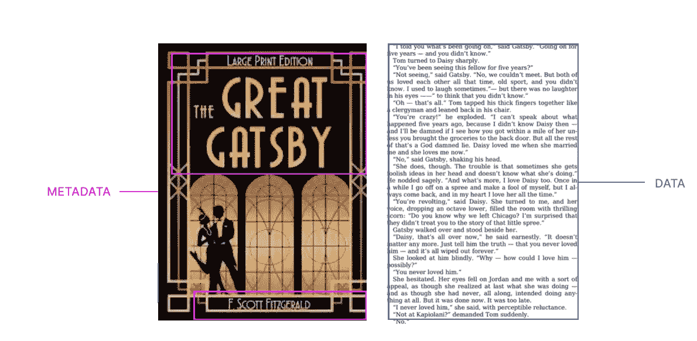
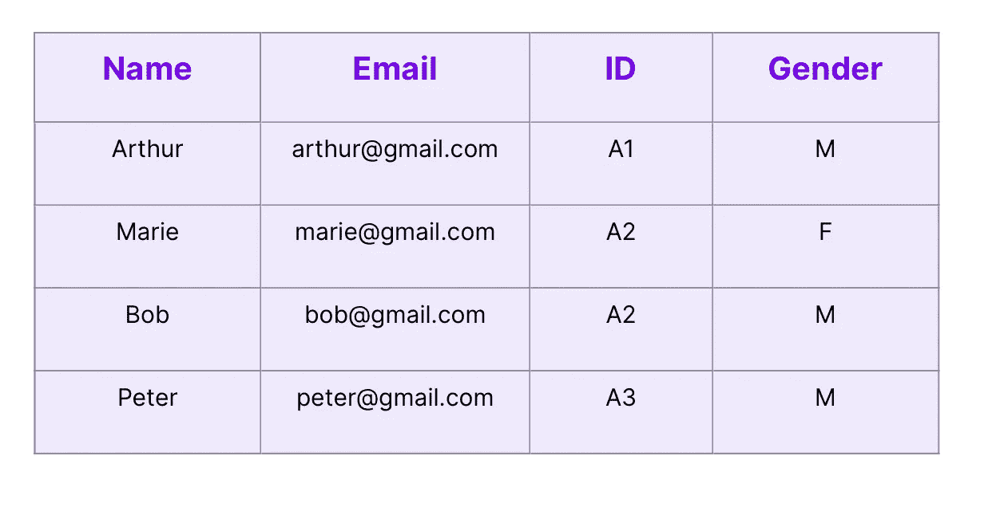
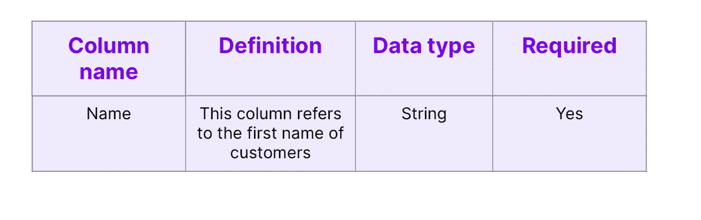
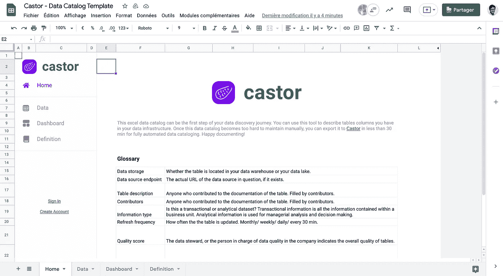

# 什么是数据字典？

> 原文：<https://towardsdatascience.com/what-is-a-data-dictionary-8be625fafdf4?source=collection_archive---------16----------------------->

图片来自 [Castor 的](https://www.castordoc.com/about/blog)网站

如果您属于一个数据团队已经有一段时间了，那么您可能已经被您应该记录的表的数量淹没了。您可能还注意到，其他数据分析师和数据科学家花了大量时间处理这种类型的问题:

*   回答我问题的最佳数据在哪里？
*   列名“XXXX”是什么意思？
*   我可以信任这个资源吗？
*   谁创建了这个资源？数据是如何产生的？
*   数据库上次更新是什么时候？该资源是由哪个进程创建的？
*   如果我发现有问题(错误的记录、错误的行等),我可以联系谁..)?
*   有人已经研究过这个问题了吗？

也就是说，数据人员花费更多的时间寻找和试图理解数据，而不是有意义的创造价值的数据分析工作。好消息是，**数据字典**是一个可以帮助解决所有这些问题的工具，让数据人员专注于他们工作的核心并赢得时间。“数据字典”一词在过去几年中获得了很大的关注，但对于它的含义、它与其他工具(如数据术语表或数据目录)的区别以及它的主要用途仍然存在困惑。

在这篇文章中，我们提供了这个问题的清晰度，以及一个模板和你和你的团队如何使用它的说明。如果你想直接跳到数据字典模板，点击[这里。](https://share.hsforms.com/1TkC_xe4-QSGm0rBrWvTxrQ57je3)关于什么是数据字典和**如何使用模板**的更多信息，请继续阅读！

# 什么是数据字典？

数据字典是与存储在给定系统中的每个数据库模式、表、事件、文件或列相关的信息的存储库。这些信息被称为“**元数据**”。

元数据基本上是为提供您所拥有的数据信息而生成的数据(要素数量、行数等)..).例如，与特定图书文件相关的**元数据**包括标题、作者姓名、出版日期、目录等。元数据具有巨大的价值，因为它允许您释放数据的潜力。如果你不清楚为什么会这样，看看这篇文章。它更深入地解释了元数据的概念，并将帮助您理解元数据收集的相关性。

与书籍相关的数据和元数据—图片来自 Louise de Leyritz

回到要点，数据字典是存储与文件系统相关的所有元数据的地方。关于数据库的元数据通常存储在不同的表中，与原始数据库分开。这种资源使数据用户能够理解大量大型数据库的内容，而不必滚动浏览每一列和记录。例如，如果您想检查数据库中是否有空值，您只需检查数据字典中的元数据，而不是滚动数据库来查看某个字段是否可能为“null”。这种资源为数据用户节省了大量时间。

以一个包含你的网站用户记录的数据库为例。你将收集关于他们的不同类型的信息:出生日期、电子邮件地址、电话号码等..比方说，您创建了一个存储客户姓名的列。在“name”列的数据字典中，您将找到该列的定义、数据类型、可能的值、值是否唯一等。包含关于您的客户的每条记录的数据库将看起来像 this:‍

数据库中的表格 Louise de Leyritz 的图片

特定“名称”列的数据字典如下:

包含给定列的元数据的数据字典—图片由 Louise de Leyritz 提供

这是一个具体的例子。通常，对于数据库中的每个表，数据字典包括以下内容:

*   表格名称—表格的预定义名称
*   表格位置—精确的数据库、文件、书籍…
*   表定义-数据库模式中表的内容和用途的详细描述。示例:“每行代表我们平台的一个用户”
*   列名—列的预定义名称
*   列定义—对列的内容和用途的详细描述，包括主键和外键指定。
*   数据类型—列的预定义特征。数据类型因数据库管理系统(DBMS)而异。例如，在 Oracle 中标记为 BLOB 数据类型的列在 Microsoft SQL Server 中将被标记为文本。数据类型可以是整数、日期、字符串、XML 等。我们将在后面详细讨论数据类型。
*   空值—指示“空”是否是可能的，这意味着是否可以为列存储空值。指明数据字典中的字段是否可以为空非常有用。这意味着数据用户不必打开数据库来检查一个实例是否可以为空。
*   唯一值-指示每个值/行是否唯一。
*   业务规则—包括模式验证或数据质量。
*   实体关系和其他系统级图表。

这些信息通常以表格的形式存储。使用数据字典，甚至不需要打开数据库就可以发现数据库对象的上述信息。

# 数据字典是用来做什么的？

数据字典是与存储在给定系统中的每个数据库模式、表、事件、文件或列相关的信息的列表。这些信息被称为“**元数据**”。

虽然这看起来像是一个简单的练习，但是很难从不同的地方引入一直在变化的相同文档信息。将业务部门与相同的定义联系起来就更难了。我们合作的一家 B2B SaaS 公司很难让每个人在特定的日期或时间范围内对“客户数量”有相同的定义。为什么？

*   财务团队将“客户数量”定义为**在 2021 年 1 月 1 日 12:00AM→2021 年 1 月 31 日 11:59 PM 期间支付账单**的客户总数。
*   销售团队将“客户数量”定义为**在 2021 年 1 月 1 日上午 12:00→2021 年 1 月 31 日晚上 11:59 之间签订合同**的客户总数。
*   销售团队将“客户数量”定义为在 2021 年 1 月 1 日 12:00AM→2021 年 1 月 31 日 11:59 PM 期间**正在付款或处于 14 个试用期**的客户总数。

这里的日期并不是真正的问题，而是在谈论特定指标时应该考虑的事件日期。

简而言之，数据字典让每个人都遵循这些定义。这样每个人都“说”同一种语言。数据字典用于:

*   文档—数据字典是一种工具，可以清晰、有序地记录文件系统。这为数据分析师、业务分析师和其他用户提供了对数据结构细节的访问。文档齐全的数据库使员工能够立即找到并理解他们需要的数据。有了维护良好的数据字典，引用特定业务对象的每个分析都可以使用数据字典中的定义和描述作为指导。引用特定业务对象的每个分析都应该使用字典中的定义作为指南。
*   沟通——为每个用户提供共享数据的唯一定义，并帮助开发人员衡量模式更改的影响。
*   数据集成——数据库管理系统(DBMS)中元素的清晰定义为每个用户提供了上下文理解。
*   决策制定——好的元数据管理软件有助于数据收集、项目开发和其他协作工作的规划。

如果你正在寻找好的数据字典软件，看看我们在市场上可用的工具基准[。但是，假设您出于任何原因不想投资新的数据工具，您能做些什么呢？](https://www.castordoc.com/blog/data-catalog-benchmark-for-mid-market-companies)

# Excel 解决方案

您确信数据字典的相关性，但是您还没有准备好安装一个 newt 工具？“移动”解决方案是让您的数据团队使用共享的 excel 电子表格和手动维护数据字典来处理数据文档。

此电子表格；元数据的中央存储库将包含文件系统中数据对象的描述。这包括表位置、表和数据库描述、数据质量、关于表列的细节等..该电子表格将成为贵公司中任何寻找特定表格的人的一个参考点，允许他们迅速**找到、理解和使用**数据对象。

[点击此处获取数据发现/目录模板](https://share.hsforms.com/1TkC_xe4-QSGm0rBrWvTxrQ57je3) —图片来自 Castor

这个 excel 数据字典易于使用、可靠，并将快速为您的数据团队提供价值。唯一的缺点是，随着文件系统中表格数量的增加，电子表格变得更加难以维护。但是，在以后迁移到自动化数据字典之前，没有什么可以阻止您手动启动。

在 Castor，我们为您的个人使用整合了[一个基于电子表格的数据目录模板](https://share.hsforms.com/1TkC_xe4-QSGm0rBrWvTxrQ57je3)。请随意下载它，这样您就可以立即开始使用您的数据文档。

# 这个模板怎么用？

直接从你的桌面上，你可以像在谷歌上一样搜索数据资产。这个数据字典就像是您的数据资源的门户。

对于您拥有的所有数据对象，您可以使用此模板在桌面上记录它们。例如，以一个包含您的平台在 2020 年的用户列表的表格为例。在记录您的表格时，您应该特别注意三个方面:**位置**、**质量**和**治理**。我们依次讨论每个方面。

# 位置

在文档过程中，你的目标应该是根据**定位你的表，在系统中的**可以找到它，以及**谁**负责它。这样，员工可以快速方便地找到该表。因此，首先要指出表的位置(**数据存储—数据库—模式**)。也就是说，表是位于数据仓库还是数据湖中。您还应该指定可以在哪个数据库和哪个模式中找到该表。如果可能的话，指明表的 URL(**数据源端点**)，这样员工就可以很容易地找到它。然后概述**表名、**一个** * *简短的* *描述/* *表中包含的内容的定义，以及一些标记。指出**数据集类型**也很关键——这是该表经历了多少次转换的指示。不同的类型如下:交易数据的“应用程序”，从未修改的原始分析数据的“T0”，转换或修改过一次的数据的“T1”，等等。务必要确定**表所有者的名字，**通常是负责创建表的人。这样，员工就能准确地知道关于桌子的问题应该联系谁，而不是浪费时间四处寻找答案。您可以提供一个贡献者列表:贡献者是自愿丰富表格文档的用户。这是一种给这些数据精灵以信任的方式，并把它们作为可能对数据对象有疑问的伙伴的参考点。

# 质量

数据记录的第二个方面与数据质量有关。您希望确保您的数据对象是一致的和定性的，并确保最好的数据资产是公司中最常用的。有了这个想法，从填写**刷新频率**栏开始。该表每周每 30 分钟刷新一次吗？每月？这将允许用户发现一个过时的表，并挥舞红旗。**质量分数**位应由数据管理员或负责数据质量的人员填写。数据是否完整、准确、一致？我们简单地使用表情符号。但是你可以随意使用你觉得最舒服的系统。质量分数很重要，因为分析人员将能够快速定位哪些表可用于进行数据分析。

一旦您的表被清楚地记录下来，就该弄清楚列端发生了什么。我已经听到你的叹息了。不要。您可能已经观察到，当分析师发现他们无法开始工作时，他们会感到非常沮丧，因为他们(可以理解)想不出一些列的名称。这是您的数据团队生产力大幅下降的开始。因此，为每一列列出**列名**和**简短列描述**非常重要，即使它们的数量很大。

对于**文档级**部分，你什么都不用做。该模板计算文档的质量和水平。分数介于 0 和 1 之间，1 表示最高文档级别。如果字典包含大量的空列，分数会更接近 0。同样，这将分析师引向文档记录良好的表，并鼓励表所有者记录他们的表(文档记录不良的表会对表所有者产生不良影响)。

# 数据类型

数据字典中的一个关键字段是“数据类型”字段。指定类型为您的分析人员增加了一层上下文，他们不需要调出有问题的表来获取这些信息。如上所述，数据类型取决于组织使用的数据库管理系统。最常用的数据类型是 SQL 数据类型，这并不奇怪，因为 SQL 是最广泛使用的数据库语言。我们将在这里做一个短暂的停留，回顾一下不同的 SQL 数据类型，这将允许您准确地填充您的数据字典。

有 6 类数据类型:

**数字数据类型**

*   integer-当数据库中的列只包含整数值(即没有小数点的数字)时进行标记
*   Tinyint —当表中的列包含整数，但只包含(0，255)范围内的数字时
*   Bigint 表中的列存储大于一万亿的整数
*   浮点型—此列存储近似值

**日期和时间数据类型**

*   日期—给定年份和月份的日期
*   时间—一天中的时间
*   时间戳-保存日期和时间组合的时态数据类型。时间戳的格式是 YYYY-MM-DD HH:MM:SS

**字符&字符串数据类型**

*   Char —指固定长度的字符，最多 8，000 个字符
*   Varchar —上限与 char 相同(8，000)，但 Varchar 指的是每个条目可以有不同的长度。Varchar 是一种流行的数据类型。
*   文本—也称为“字符串”或“STR”，这意味着列处理字母，而不是数字或符号。与 varchar 的含义相似，但最大容量为 2GB。

**Unicode 字符和字符串类型**

*   nchar —指固定长度的字符，最多 8，000 个字符
*   nvarchar —指可变长度的字符，最多 8，000 个字符。nvarchar 占用的空间是 varchar 的两倍。
*   ntext-类似于 nvarchar，最大存储为 2GB。

**二进制数据类型**

*   二进制—固定长度的二进制数据，最多可存储 8000 个字节。例如，布尔值(真/假)是二进制数据。
*   varbinary —可变长度的二进制数据，最多可存储 8000 个字节

**其他数据类型**

*   斑点——代表**二进制大物体。**它是一个对象的引用或指针。
*   CLOB——代表**字符大对象**。它存储大量的字符数据，最大为 4 GB。CLOB 数据类型类似于 BLOB，但包括字符编码，它定义了字符集和每个字符的表示方式。
*   XML-存储 XML 数据的数据类型。XML 文件是一个**可扩展标记语言**文件，它用于组织数据以便存储和传输。在 XML 文件中，您会发现标签和文本。XML 文件中的标签提供了数据的结构。文本被这些标签包围，这些标签遵循特定的语法准则

# 管理

数据字典就像一个门户。无论您的专业技术如何，您都可以直接从您的桌面访问有关数据资源的信息。即使是手动数据字典也可以帮助您处理治理问题。数据字典可以成为您的法律团队的数据门户。在这本字典中，您可以指出给定的列是否符合 **PII** (个人身份信息)，这意味着它包含任何可能用于识别特定个人的数据。这允许你处理隐私问题，例如通过限制从你的桌面直接访问标记为 PII 的栏。‍

# 附加功能

我们鼓励您为您的特定业务定制这个数据字典，所以不要犹豫为您的数据对象添加额外的定义/文档字段！该模板提出了一些建议，尽管它们不是我们自动化数据目录产品的一部分。

# 仪表板和数据术语表

“仪表板”选项卡允许您以与表格完全相同的方式记录仪表板。

该模板还包含一个“词汇表”选项卡。这是业务术语表的空间，包含共享数据的常用词汇和定义。数据术语表是一个存储库，每个业务术语都附加到它的定义上。这确保了业务关键字总是在正确的上下文中使用，并且公司中的每个人都同意一个特定的定义。以术语“付费用户”为例。这个词在公司的产品部门经常使用。虽然这看起来很简单，但是如果员工没有一个明确的定义，他们可能会有不同的解释。例如，一个分析师可能将免费试用的用户归类为“付费用户”，而另一个分析师可能将他们排除在外。因此，每个部门都有一个术语表是很重要的。**术语所有者**是编写定义的人，通常准备好回答关于特定单词的问题。

将数据术语表与数据字典联系起来也可以节省时间，提高效率。这丰富了业务环境中的数据，使数据分析师和数据科学家能够根据业务战略调整数据。事实上，当数据术语表和数据字典在同一个存储库中时，数据用户可以直接访问术语的定义，以及与该术语相关的任何表或数据库。

如果您对如何使用模板有任何疑问，请联系 louise@castordoc.com[的](mailto:louise@castordoc.com)

# 了解更多信息

我们写了利用数据资产时所涉及的所有过程:从[现代数据栈](https://notion.castordoc.com)到数据团队组成，再到数据治理。我们的[博客](https://www.castordoc.com/about/blog)涵盖了从数据中创造有形价值的技术和非技术方面。如果您是数据领导者，并且希望更深入地讨论这些主题，请加入我们为此创建的[社区](https://notion.castordoc.com/unsupervised-leaders)！

在 [Castor](http://www.castordoc.com) ，我们正在为 idea，Figma，Slack generation 构建一个数据文档工具。或者对 Fivetran，Looker，Snowflake，DBT 的狂热爱好者来说是数据方面的。我们将我们的目录设计得易于使用、令人愉快且友好。

想去看看吗？[联系我们](https://meetings.hubspot.com/xavier76/trist-xav-calendar)，我们将向您展示一个演示。

‍

*最初发表于*[*【https://www.castordoc.com】*](https://www.castordoc.com/blog/what-is-a-data-dictionary)*。*