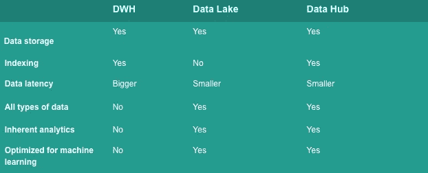
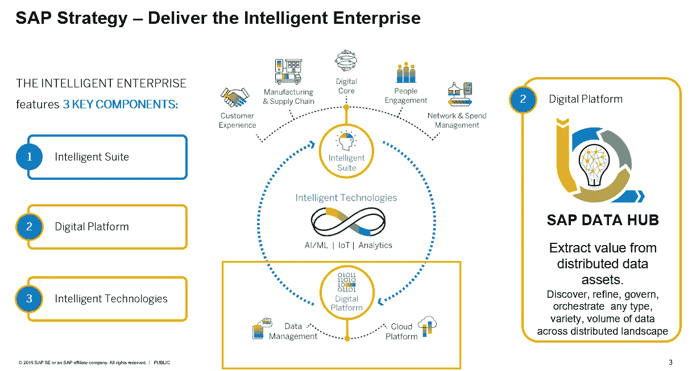

# 什么是数据中心？

> 原文：<https://towardsdatascience.com/what-is-a-data-hub-41d2ac34c270?source=collection_archive---------12----------------------->

## 为什么像数据中心这样的架构正在兴起

卢卡·布拉沃在 [Unsplash](https://unsplash.com/s/photos/nature?utm_source=unsplash&utm_medium=referral&utm_content=creditCopyText) 上的照片

## 定义

数据中心是一种数据交换，其核心是无摩擦的数据流。它可以被描述为由不同技术组成的解决方案:数据仓库、工程、数据科学。这不仅仅是一种技术，而是一种更有效地确定数据需要在哪里、何时以及为谁进行传递、共享，然后链接和/或持久化的方法。端点可以是应用程序、流程、人员或算法，它们可能实时地与网络中心交互，向网络中心提供数据或从网络中心接收数据[1]。

## 与数据仓库和湖的区别

虽然数据仓库和数据湖被理解为支持组织的分析而存在的数据收集的端点，但是数据中心充当中介和数据交换的点。每个解决方案的特征总结如下。

特征—作者提供的图像

## 数据中心的优势

数据中心通过连接数据的生产者和消费者来实现数据共享。端点通过向数据中心提供数据或从数据中心接收数据来与数据中心交互，而数据中心提供了一个中介和管理点，使得数据如何在企业中流动变得可见[2]。

数据中枢实时连接许多不同的系统——它是应对当今挑战的合适工具:即尽可能快速和标准化地交换大量数据，并使其可用于系统、机器学习或报告等应用。

## 数据中心技术示例

即使如前所述，数据中心本身并不是一项技术，而是一种方法，但市场上仍有产品被称为数据中心。这些例子也清楚地表明，数据中心是几种技术的结合。

**例子:**

*   Cumulocity 物联网数据中心[3]
*   Cloudera，企业数据中心[4]
*   谷歌广告数据中心[5]

另一个很好的例子是对 SAP 的描述。这很好地展示了技术的相互作用以及数据中心的实际概念。

SAP 数据中心—来源 [SAP](http://blogs.saphana.com/wp-content/uploads/2019/06/DataHubBlog1.png) [6]

## 结论

数据中心汇集了来自不同来源和格式的企业数据，以提取有价值的知识。我们谈论的更多的是方法或平台，而不是技术。希望本文能让您初步了解什么是数据中心。然而，为了深入研究，我建议深入阅读这个主题。我下面的消息来源可能会有所帮助。

## 资料来源和进一步阅读

[1] Eckerson，[数据中心—数据架构的下一步是什么？](https://www.eckerson.com/articles/data-hubs-what-s-next-in-data-architecture) (2019)

[2] A. Awadallah，大数据平台，Cloudera 白皮书(2013 年)

[3] Cumulocity 物联网，[数据中心概述](https://cumulocity.com/guides/datahub/datahub-overview/) (2021)

[4]云时代，[企业数据中心](https://www.cloudera.com/products/enterprise-data-hub.html) (2020 年)

[5]谷歌，[广告数据中心](https://developers.google.com/ads-data-hub) (2021 年)

[6] SAP，[我有 SAP HANA，我何时需要 SAP 数据中心](https://blogs.sap.com/2019/06/10/i-have-sap-hana-when-would-i-need-sap-data-hub/) (2019)