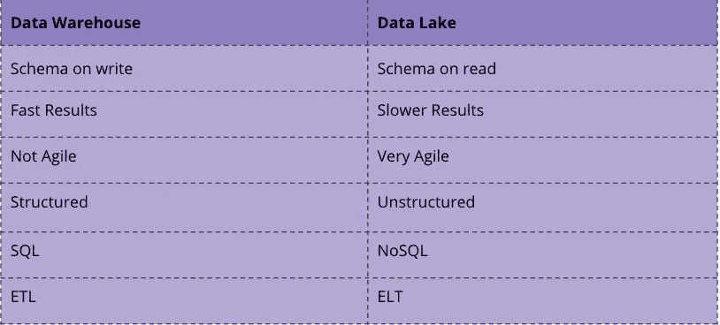
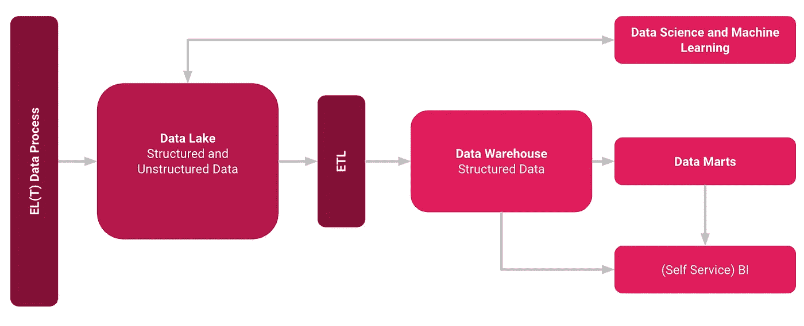

# 什么是数据湖？

> 原文：<https://towardsdatascience.com/what-is-a-data-lake-94ed74ebb7b9?source=collection_archive---------27----------------------->

## 术语和定义，以及如何从中获利

彼得·德·格兰迪在 [Unsplash](https://unsplash.com/s/photos/lake?utm_source=unsplash&utm_medium=referral&utm_content=creditCopyText) 上拍摄的照片

谈到存储大数据，数据湖和数据仓库都是公认的术语，但这两个术语不是同义词。数据湖是尚未确定用途的大量原始数据。另一方面，数据仓库是已经为特定目的处理过的结构化、过滤数据的存储库[1]。

## 数据湖的特征

在数据湖中，数据以最少的转换被接收到存储层，同时保持输入格式、结构和粒度。这包含结构化和非结构化数据。这导致几个特征，例如:

*   多个数据源的集合，例如批量数据、外部数据、实时数据等等。
*   控制摄入的数据，并专注于记录数据结构。
*   通常对分析报告和数据科学有用。
*   但是[也可以包括一个集成的数据仓库](/what-is-a-hybrid-data-lake-b7ef2c3cce0c)来提供经典的管理报告和仪表板。
*   数据湖是一种数据存储模式，它在整个企业、所有部门和所有数据用户中优先考虑可用性。
*   新数据源的易集成性。

## 数据湖和数据仓库的区别

虽然数据仓库将经典的 ETL 过程与关系数据库中的结构化数据结合使用，但数据湖使用 ELT 和模式等范例读取非结构化数据[2]。

差异数据仓库与 Lake —作者图片

在上图中，您可以看到主要的区别。你使用的技术也很不同。对于数据仓库，您将使用 SQL 和关系数据库，而对于数据湖，您可能会使用 NoSQL 或两者的混合。

我自己的经验经常表明，数据湖可以更快地实现。一旦所有数据都可用，数据仓库仍然可以作为混合解决方案构建在其上。

混合数据湖概念—图片来自作者

这使得僵化和传统规划的数据仓库成为过去。这大大加快了仪表板和分析的提供，是迈向数据驱动文化的良好一步。来自云的新 SaaS 服务的实现以及 ELT 代替 ETL 等方法也加速了开发。

## 结论

本文简要介绍了什么是数据湖，以及它如何使您的公司能够灵活地以数据形式捕获业务运营的各个方面，同时保持传统数据仓库的活力。与传统数据仓库相比，它的优势在于不同的数据和数据格式，无论是结构化的还是非结构化的，都必须能够存储在数据湖中。这样就避免了分布式数据孤岛。还可以提供来自数据科学和经典数据仓库方法领域的用例。数据科学家可以更快、更准确地检索、准备和分析数据。所以最终数据湖不会取代数据仓库。相反，这两种选择是相辅相成的。

## 资料来源和进一步阅读

[1] talend，[数据湖 vs .数据仓库](https://www.talend.com/de/resources/data-lake-vs-data-warehouse/)

[2] IBM，[绘制数据湖:使用读取模式和写入模式的数据模型](https://www.ibmbigdatahub.com/blog/charting-data-lake-using-data-models-schema-read-and-schema-write#:~:text=Blogs-,Charting%20the%20data%20lake%3A%20Using%20the%20data%20models%20with%20schema,read%20and%20schema-on-write&text=There%20is%20no%20attempt%20to,-on-read%20data%20stores.) (2017)