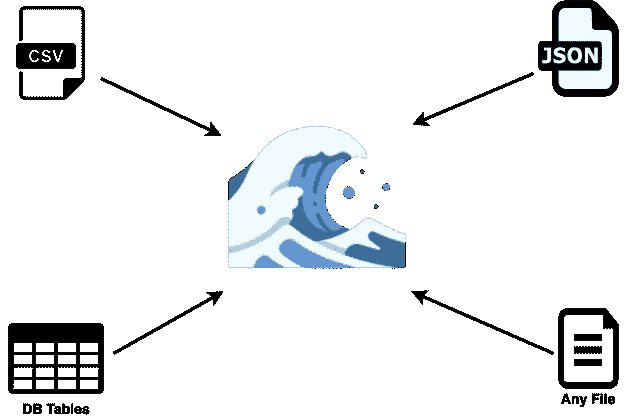
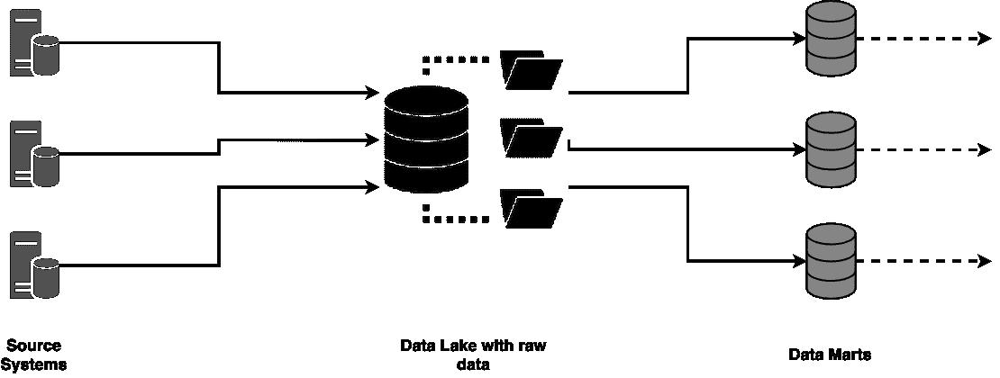

# 什么是数据湖？这不是一个数据沼泽

> 原文：<https://towardsdatascience.com/what-is-a-data-lake-it-is-not-a-data-swamp-376430d6c15e?source=collection_archive---------21----------------------->

## 介绍构建数据湖的参考体系结构

约瑟夫·巴里恩托斯在 [Unsplash](https://unsplash.com/s/photos/sea?utm_source=unsplash&utm_medium=referral&utm_content=creditCopyText) 上拍摄的照片

在工作中，我目前正在谷歌云平台上建立一个数据湖。在工作的同时，你才真正意识到一个中型公司已经可以拥有多少数据。我在能源部门工作。在许多文章和博客中，已经有很多关于大量数据需要整合到一个地方的讨论。一个开发者、科学家或任何人可以居住并获取项目所需数据的地方。在这样做的时候，消费者可以有各种各样的意图:构建仪表板，构建机器学习模型，或者运行说明性分析。当然还有比上面提到的更多的用例。

> 世界上最有价值的资源不再是石油，而是数据。(《经济学人》)

你知道这句名言吗？我没有什么要补充的。如果你有兴趣，你可以在这里阅读这篇文章[。](https://www.economist.com/leaders/2017/05/06/the-worlds-most-valuable-resource-is-no-longer-oil-but-data)

# 那么什么是数据湖呢？

数据湖是存储大量数据的地方，这些数据来自不同的来源，并以原始形式存储。重要的是，在加载过程之前，异构数据既没有被清理也没有被转换。加载过程完成后，数据现在可以在单个系统中获得。除了结构化数据，数据湖还存储和管理半结构化(CSV、日志、JSON)、非结构化(电子邮件、文档、报告)和二进制数据(视频、音频、图像)。所有可能格式的列表当然是不完整的，但是我想你知道我的意思。目标是将所有公司数据收集到一个地方，以便能够快速访问整个数据库。用户应该能够立即从数据中创建可视化、报告和分析。

你可以在数据湖中存储任何你想要的东西。图片由作者创作，使用 [draw.io](http://draw.io/) 创建。

# 产生不受控制的数据沼泽的风险？

如果你想到创建一个不受控制的数据沼泽，我可以理解。所有数据都以原始形式加载到数据湖中，并且事先没有清理，这使得确保所需的数据质量变得更加麻烦。结果，数据湖会很快变成一个*数据沼泽*，使得恰当地评估数据变得困难。

简·安东宁·科拉尔在 [Unsplash](https://unsplash.com/s/photos/sort?utm_source=unsplash&utm_medium=referral&utm_content=creditCopyText) 上拍摄的照片

为了让数据湖的原理有效地为您工作，并且不会导致无法找到更多数据的数据沼泽，收集的数据必须显示未来的业务附加值。分析师很难从大量数据中提取信息。当没有使用元数据或标签时尤其如此。没有这一点，分析师几乎不可能分配数据。此外，几乎不可能从数据中导出关系，因为所有数据都存储在一个地方，没有可见的上下文。*获得更好概览的第一步是使用元数据。*以这种方式，例如，在网站上的访问、呼叫和购买可以链接到 IP 地址和位置。你必须事先定义一个组织结构。

# 数据湖的一般体系结构

图片由作者创作，使用 [draw.io](http://draw.io/) 创建。

上图显示了数据湖的参考架构。源系统/数据源显示在左侧。这些源将数据传递给数据湖。在这里，一个人是根据推还是拉原理工作并不重要。原则上，公司或设备中的任何系统都可以作为数据湖的来源。例如，这包括 web 服务器、SAP ECC、物联网设备或 CRM 系统等等。

在图的中间，您可以看到数据湖，它充当数据存储库。如上所述，文件夹图标再次提醒了元数据的使用。这是所有数据以原始状态存在的地方。这里或之前没有发生任何变化。

从这一点出发，可以从数据湖中提取数据并进行转换。在这个例子中，转换后的数据存储在数据集市中的数据湖系统之外。用户必须清楚他们需要数据湖中的哪些数据，以便能够继续使用这些选定的数据。

现在，数据分析师和其他用户可以根据自己的意愿分析或处理这些数据。例如，来自数据集市的数据可以构成数据仓库的基础，并用于报告目的。在工作中，我们目前正试图构建后者，即基于数据湖的数据仓库。

# 结论

我已经向您展示了什么是数据湖，并且您不必冒数据湖变成数据沼泽的风险。此外，我向您展示了一个通用架构，其中包含构建数据湖所需的必要组件。构建中间部分(数据湖)所需的所有组件几乎都可以在任何云环境中实现。只是作为一个预尝:对于一个数据湖，你可以使用谷歌云平台上的谷歌存储服务。有几个标签选项来标记你的斑点。例如，通过数据目录服务，Google 提供了一个 API 来查询这些标签，从而在 web 门户中组织数据。

我将写关于数据目录、大查询和云存储在未来的使用，并带您踏上构建数据湖的旅程。

> 良好的秩序是一切的基础。(埃德蒙·伯克)

如果你有任何问题，请留下评论。