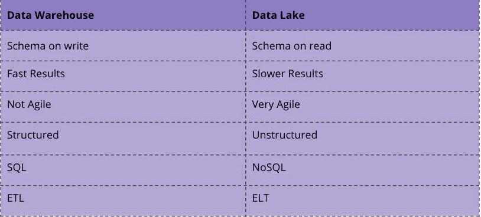
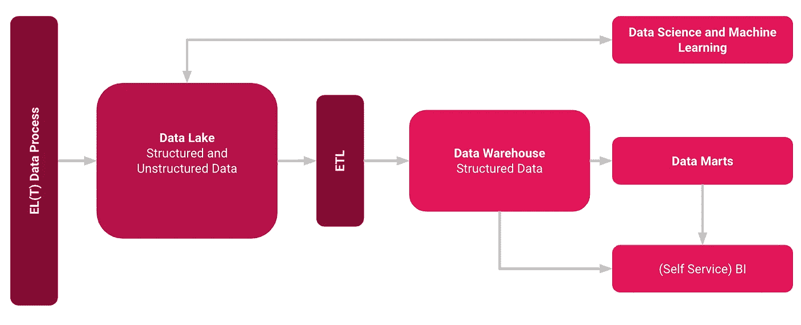

# 混合数据湖的优势

> 原文：<https://towardsdatascience.com/what-is-a-hybrid-data-lake-b7ef2c3cce0c?source=collection_archive---------34----------------------->

## 如何将数据湖与数据仓库结合起来

康斯坦茨湖——作者图片

谈到存储大数据，数据湖和数据仓库都是公认的术语，但这两个术语不是同义词。数据湖是尚未确定用途的大量原始数据。另一方面，数据仓库是已经为特定目的处理过的结构化、过滤数据的存储库[1]。

## 共同点

数据仓库和数据湖代表一个中央数据库系统，可用于公司的分析目的。该系统从各种异构数据源提取、收集和保存相关数据，并提供给下游系统。

数据仓库可以分为四个子过程:

*   数据获取:从各种数据仓库中获取和提取数据。
*   数据存储:在数据仓库中存储数据，包括长期存档。
*   数据供应:为下游系统提供所需的数据，提供数据集市。
*   数据评估:对数据库的分析和评估。

## 差异

虽然数据仓库将经典的 ETL 过程与关系数据库中的结构化数据结合使用，但数据湖使用 ELT 和模式等范例读取非结构化数据[2]。

差异数据仓库与湖

以上，可以看出主要区别。你使用的技术也很不同。对于数据仓库，您将使用 SQL 和关系数据库，而对于数据湖，您可能会使用 NoSQL 或两者的混合。

## 将两者结合在混合数据湖中

那么这两个概念如何结合起来呢？在下图中，您可以从高层次的角度看到一个架构。

该过程是将非结构化和未转换的数据加载到数据湖中。从这里，一方面，数据可以用于 ML 和数据科学任务。另一方面，数据也可以以结构化的形式被转换和加载到数据仓库中。从这里开始，可以通过数据集市和(自助式)BI 工具实现传统的数据仓库分布。

混合数据湖概念—图片来自作者

您可以为这个架构使用的主要技术可以是例如:[3][4]

*   ELT/ETL 流程通过——talend、Google 数据流、AWS 数据管道
*   数据湖 via — HDFS、AWS 雅典娜和 S3、谷歌云存储
*   数据仓库通过——Google big query、AWS Redshift、雪花

> 注意:像 Google 的 BiqQuery 或 AWS Redshift 这样的技术通常被认为是数据仓库和数据湖技术的混合体，因为它们通常已经实现了 NoSQL 的一些特征。

## 结论

本文解释了如何使用混合数据湖。数据湖使您的公司能够灵活地以数据形式捕获业务运营的各个方面，同时保持传统数据仓库的活力。

## 资料来源和进一步阅读

[1] talend，[数据湖与数据仓库](https://www.talend.com/de/resources/data-lake-vs-data-warehouse/)

[2] IBM，[“绘制数据湖:使用读取模式和写入模式的数据模型”](https://www.ibmbigdatahub.com/blog/charting-data-lake-using-data-models-schema-read-and-schema-write#:~:text=Blogs-,Charting%20the%20data%20lake%3A%20Using%20the%20data%20models%20with%20schema,read%20and%20schema-on-write&text=There%20is%20no%20attempt%20to,-on-read%20data%20stores.) (2017)

[3]谷歌，[帮助保护从数据湖到数据仓库的管道](https://cloud.google.com/solutions/help-secure-the-pipeline-from-your-data-lake-to-your-data-warehouse?hl=en)

[4] AWS，[AWS 中的混合数据湖](https://aws.amazon.com/de/quickstart/architecture/hybrid-data-lake-with-wandisco-fusion/)