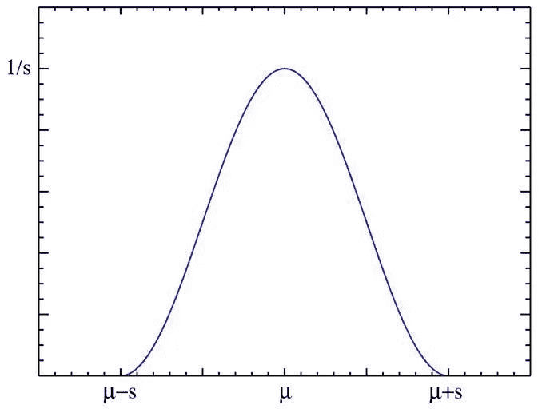
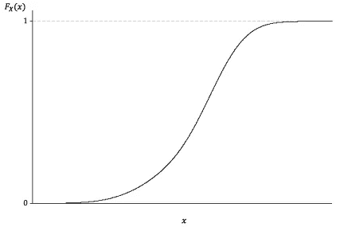

# 什么是概率密度函数？

> 原文：<https://towardsdatascience.com/what-is-a-probability-density-function-d9b4b8bea121?source=collection_archive---------10----------------------->

## pdf 格式的统计微分方程简介

[https://pixabay.com/images/id-2853022/](https://pixabay.com/images/id-2853022/)

# 介绍

在统计的奇妙世界里，分布是位于数学宇宙中心的绝对重要的组成部分。分布用于以数学方式描述数据，并在机器学习和统计测试中有很强的众所周知的应用。它给出了实验中不同可能结果出现的概率。它们用于描述使用样本空间和事件可能性的随机现象。

概率分布可以以各种形式描述，例如通过概率密度函数或累积分布函数。概率密度函数，或 pdf，是通常应用于连续和离散值的数学函数。现在我们对 PDF 有了一个基本的概念，那么它们在统计中是如何使用的呢？更重要的是，它们如何应用于数据科学，它们在纸面上是什么样的？

# PDF 在数据科学中的应用

pdf 在统计分析中非常常用，因此在数据科学中也非常常用。一般来说，pdf 是使用统计学研究应用科学数据的必要工具。然而，有一些 pdf 超出了这一基本用途，其用途与乍看之下的设想略有不同。例如，t 分布的 PDF 通常用于计算 T 统计量。这个 T 统计量和自由度(n 减 1)(v)通常被放入正则化的下不完全β函数，它恰好是 T 分布的累积分布函数。虽然连续随机变量取任何特定值的绝对可能性为 0，但 PDF 的值可用于推断，在随机变量的任何特定样本中，与另一个样本相比，随机变量在统计上更有可能等于一个样本。

还有一个可能是科学中最常用的 PDF 的应用，正态分布，它在机器学习中非常常用。数据的标准缩放是一种非常流行的方法，用于规范化数据具有高方差的连续值。该 PDF 将连续样本转换为总体均值的标准差。这对于机器学习来说非常好，因为通常它可以将数据的方差降低一个百分点，并使数据感觉更接近。这也是统计分析中常用的方法，因为当它与平均值相差 1.96 个标准偏差时，很容易判断出什么时候有统计学意义。我个人更认同 2.0 法则，但是 1.96 当然可以表示一些统计意义！这是因为少于 25%的数据超出平均值的 2 个标准偏差。对于已发表的测试，通常认为标准偏差应该比平均值高 2.6 倍。

查看 PDF，我们看到它有一条抛物线，中心是我们大部分数据所在的位置:

([来源](https://snappygoat.com/s/?q=bestof%3ABidirectional+scattering+distribution+function.svg+Illustration+of+BRDF+Bidirectional+reflectance+distribution+function+and+BTDF+Bidirectional+transmittance#00255e96222507bf3243bcd6a7bc813f22228284,0,481.))

将其与 CDF 进行比较，我们可以很容易地发现这两个函数之间的差异:

([这个来源还有很多关于 CDF 的信息，值得一查！)](http://amsi.org.au/ESA_Senior_Years/SeniorTopic4/4e/4e_2content_2.html)

# 正常情况下更多

正态分布是 PDF 的一个很好的例子。这部分是因为它被大多数科学家非常普遍地使用和熟悉，但也部分是因为它在应用统计学的整个范围内有突出的应用。对于许多其他分布，正态分布是概率论的基础。

更好的是，正态分布的 PDF 的公式相对简单，并且允许我们看一看 PDF 可视化后的样子。为了计算这个 PDF，我们简单地从 xbar(当前样本)中减去 mu(平均值),然后除以 sigma(标准偏差)。)这也用于标准缩放数据，通常用于连续模型以提高准确性。

# 结论

pdf 是任何统计工作或应用科学的基本工具。它们不仅在分析和概率论中有应用，而且也经常应用于机器学习。了解很多关于 pdf 和与某些发行版相关的函数，一定会给你一个坚实的统计基础，并在你的 DS/ML 职业生涯中助你一臂之力。考虑到这一点，我当然认为他们是值得学习的！非常感谢你的阅读，我希望你有一个精彩的一天休息！