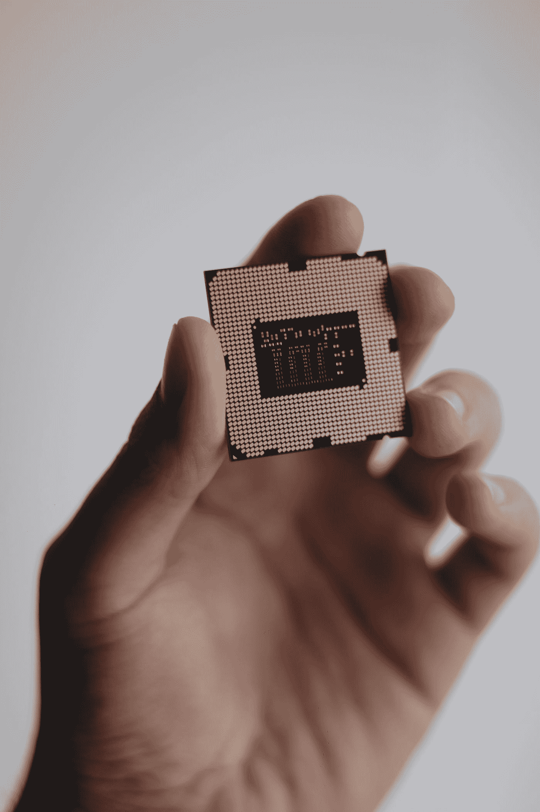

# 什么是张量处理单元(TPU ),它是如何工作的？

> 原文：<https://towardsdatascience.com/what-is-a-tensor-processing-unit-tpu-and-how-does-it-work-dbbe6ecbd8ad?source=collection_archive---------13----------------------->

## TPU 比最先进的 GPU 快 20 倍以上…但是怎么做到的呢？

> TPU 是专门从事深度学习任务的硬件加速器。在这个代码实验室中，您将看到如何在 Keras 和 Tensorflow 2 中使用它们。云 TPU 在具有 8 个核心的基本配置中可用，也在多达 2048 个核心的称为“TPU pod”的更大配置中可用。额外的硬件可用于通过增加训练批量来加速训练。

来源: [Colab](https://codelabs.developers.google.com/codelabs/keras-flowers-data/#2)

我们都知道，在机器学习方面，GPU 比 CPU 更快。在过去几年中，我们可以看到行业巨头 Nvidia 和 ARM 正在开发新的芯片来优化机器学习张量(矩阵)运算，这为我们带来了张量处理单元(TPU)。你可能在进行 Kaggle 比赛或使用在线 GPU 提供商如 Google colab 时遇到过它们。

在这篇文章中，我想解释为什么 TPU 比 GPU 快，是什么使它们能够执行更快的张量运算，使它们成为最快的 ML 引擎。

为了客观地看待问题，我们必须认识到每个芯片都是针对其用途而优化的。鉴于 GPU 最初是为图形渲染而构建的(因此是图形处理单元)，对于机器学习和加密货币挖掘等任务，GPU 比 CPU 更快可能是一个巧合。我认为在我们开始深入 TPU 之前，有必要解释一下为什么 GPU 比 CPU 快。

## GPU 与 CPU

由[尼克·杜普](https://unsplash.com/@niekdoup?utm_source=medium&utm_medium=referral)在 [Unsplash](https://unsplash.com?utm_source=medium&utm_medium=referral) 上拍摄的照片

尽管与 CPU 相比，GPU 通常拥有更小的内核，但它们拥有更多内核。这些内核包含算术逻辑单元(alu)、控制单元和内存缓存，允许 GPU 进行大量的数学运算。这些 alu 被包括在内，以允许快速的几何计算，使游戏每秒钟有大量的帧。[1]

请记住，CPU 当然比 GPU 有一些优势，但不是在机器学习方面。这些优势的一个例子是对内存的访问。GPU 通常只能访问 8GB 内存，可能是 16 GB，而 CPU 可以轻松访问更多内存(取决于您的 RAM)。与 RAM 之间的传输操作比与 GPU 之间的传输操作要快得多(但这仅适用于频繁的操作，而不是像训练模型这样的长时间操作)。

现在回到我们最初的比较，CPU 最初是为了同时处理几个任务而构建的，而不是处理一个复杂的任务，如运行操作系统操作(如内核操作)。然而，GPU 是为了尽可能快地进行数学运算而构建的，因为渲染图形都是基于这些简单的数学运算。

好消息是，所有这些几何 3D 渲染操作都是**张量操作，如纹理计算、RGB 渲染，所有这些本质上都是矩阵算术操作。**此外，所有这些操作都是一种**浮点**格式，这使得它非常适合机器学习。事实上，测量 ML 模型性能的事实是通过每秒浮点运算(FLOPS)来实现的。

好了，关于 GPU 和 CPU，让我们深入到 TPU。

## **TPUs vs GPU**

照片由 [Nana Dua](https://unsplash.com/@nanadua11?utm_source=medium&utm_medium=referral) 在 [Unsplash](https://unsplash.com?utm_source=medium&utm_medium=referral) 上拍摄

虽然 TPU 和 GPU 执行张量运算，但与 3D 图形渲染相比，TPU 更倾向于执行**大张量**运算，这些运算在神经网络训练中经常出现。如果你像我一样是一个系统爱好者，这对于你来说还不够，你还想了解更多的细节！

> TPU v2 内核由一个运行矩阵乘法的矩阵乘法单元(MXU)和一个用于所有其他任务(如激活、softmax 等)的向量处理单元(VPU)组成。VPU 处理 float32 和 int32 计算。另一方面，MXU 以混合精度 16–32 位浮点格式工作。

来源: [Colab](https://codelabs.developers.google.com/codelabs/keras-flowers-data/#2)

谷歌的 TPU 核心由两部分组成。如上所述矩阵乘法单元和向量处理单元。至于软件层，优化器用于在 **bfloat16 和 bfloat32** 操作之间切换(其中 16 和 32 是位数)，这样开发人员就不需要更改代码来在这些操作之间切换。显然，bfloat16 使用的 RAM 较少，但精度不如 bfloat32。

> 最终结果是，在计算矩阵乘法时，TPU 脉动阵列架构具有显著的密度和功耗优势，以及与 GPU 相比不可忽视的速度优势。

来源: [Colab](https://codelabs.developers.google.com/codelabs/keras-flowers-data/#2)

另一个加速张量运算的有趣概念是所谓的“**脉动阵列”**。收缩是指流的收缩和释放(通常用于医学)[2]。脉动阵列用于在 TPU 的一个内核上执行张量的点积，而不是在多个 GPU 内核上并行展开。它们可以使用乘法累加器来实现，乘法累加器对两个矩阵使用 bfloat16 运算，对结果使用 bfloat32 运算。

这里需要注意的另一点是，当你使用 Colab/Kaggle 的 TPU 时，你不仅仅使用一个 TPU 内核，实际上你使用了相当多的内核。梯度[2]通常使用“ [all-reduce 算法](https://medium.com/r?url=https%3A%2F%2Fwww.logicalclocks.com%2Fgoodbye-horovod-hello-tensorflow-collectiveallreduce%2F)在 TPU 核之间交换

我想谈的最后一点是量化，它使 TPUs 的性能优于 GPU。量化是在两个极限之间逼近随机值的过程。通过将连续数字转换为离散数字，这种方法大量用于压缩浮点计算。这很有趣，你可以在这里找到更多关于它的[。](https://www.tensorflow.org/lite/performance/post_training_quantization)

## 最后的想法和收获

我希望这篇文章给出了一些关于为什么像苹果的神经引擎和 Colab 的 TPUs 这样的芯片在 ML 模型训练中表现良好的背景。当这些模型必须进入我想写一篇文章的移动设备时，也有更多的创新进入 ML 的芯片。我认为我们总是习惯于看到创新发生在事物的模型方面，但我们忘记了那些模型需要那些芯片来运行。

**参考文献**

[1][https://blogs . Oracle . com/data science/CPU-vs-GPU-in-machine-learning](https://blogs.oracle.com/datascience/cpu-vs-gpu-in-machine-learning)

[2][https://code labs . developers . Google . com/code labs/keras-flowers-data/# 2](https://codelabs.developers.google.com/codelabs/keras-flowers-data/#2)