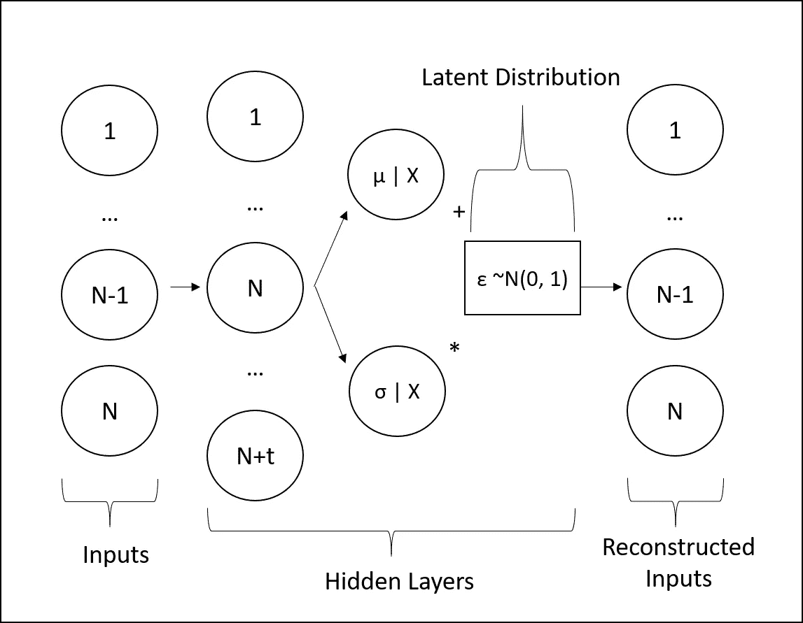

# 什么是变分自动编码器？

> 原文：<https://towardsdatascience.com/what-is-a-variational-autoencoder-9b41bd63f65e?source=collection_archive---------17----------------------->

## [实践教程](https://towardsdatascience.com/tagged/hands-on-tutorials)

## 代码生成机器学习快速入门指南


[围棋熊](https://unsplash.com/@wqqq14?utm_source=unsplash&utm_medium=referral&utm_content=creditCopyText)在 [Unsplash](https://unsplash.com/s/photos/pagoda?utm_source=unsplash&utm_medium=referral&utm_content=creditCopyText) 上拍照

# 介绍

生成机器学习在各种情况下都是有帮助的。例如，一种情况是有某种封闭形式或准封闭形式的解，但计算量很大。在这种情况下，神经网络可以提供具有可接受准确度的及时解决方案。然而，为了训练这样的网络，数据必须被聚集，并且在大多数情况下可能是稀缺的。一个很好的例子是奇异期权的定价。如果你想了解更多关于这个例子的信息，我会留下一个 SSRN 论文的链接…

  

这个问题的解决方案可以通过变型自动编码器在生成式机器学习中找到。有了这样一个模型，我们可以从一组有代表性的群体数据中学习，并生成新的样本，这些样本可以作为更多的数据用于训练。本文将首先考虑自动编码器，给出一个直观的例子，并使用 Python 和 Tensorflow 的函数式 API，通过本文展示的代码过渡到变化的自动编码器。

# 自动编码器

## 前馈神经网络和图表

理解变型自动编码器的最佳方式是首先理解标准自动编码器。如果你不熟悉标准的神经网络架构，我建议你看看这些文章，让你跟上速度…

*   [人工智能训练营](https://medium.com/swlh/artificial-intelligence-bootcamp-8745d61a9d25)
*   [线性回归 vs .神经网络](/linear-regression-v-s-neural-networks-cd03b29386d4)

假设你在神经网络领域有基础，我们可以继续学习自动编码器的结构。

通常，前馈神经网络将具有输入层、在与输入相同的、更高维或更低维的空间中的一定数量的隐藏层、以及在相对于隐藏层和输入的更低维空间的输出层中的一些目标。


作者图片:前馈神经网络架构

这个概念相对简单，任何有构建神经网络经验的人可能会立即提出这个普遍性的反例，这不仅仅是公平的，然而，我离题了。此示例的目的是突出神经网络的每个组件的维度，因为自动编码器具有使其成为自动编码器的特定结构。

## 自动编码器和图表


作者图片:Autoencoder architechture

自动编码器接受输入(无论是波动点的网格、图像的像素还是时间序列路径的签名),并将其压缩到称为潜在空间的低维表示。从这个低维表示，潜在空间，目标是通过重建误差的反向传播来重建输入。

这可以从类似于任何种类的维度缩减方法(即主成分分析和路径签名)的角度来看。

至于语义，自动编码器可以分解为两个模型:

*   **编码器:**将输入压缩到一个潜在空间，由上图中的*输入*和*隐藏层*组成
*   **解码器:**将原始输入的潜在表示作为输入，并尝试重建原始输入

## 自动编码器 Python 代码

关于在 Tensorflow 中实现自动编码器的资源并不多，所以我在下面提供了一个要点，作为使用 Tensorflow 的功能 API 开发您自己的自动编码器的指南。

Tensorflow 中的编码器模型

```
Model: "encoder"
_________________________________________________________________
Layer (type)                 Output Shape              Param #   
=================================================================
encoder_input (InputLayer)   (None, 10)                0         
_________________________________________________________________
intermediate_layer_1 (Dense) (None, 10)                110       
_________________________________________________________________
intermediate_layer_2 (Dense) (None, 10)                110       
_________________________________________________________________
latent_space (Dense)         (None, 5)                 55        
=================================================================
Total params: 275
Trainable params: 275
Non-trainable params: 0
_________________________________________________________________
```

现在我们需要一个解码器…

Tensorflow 中的解码器模型

```
Model: "decoder"
_________________________________________________________________
Layer (type)                 Output Shape              Param #   
=================================================================
decoder_input (InputLayer)   (None, 5)                 0         
_________________________________________________________________
intermediate_layer_3 (Dense) (None, 10)                60        
_________________________________________________________________
latent_space (Dense)         (None, 10)                110       
=================================================================
Total params: 170
Trainable params: 170
Non-trainable params: 0
_________________________________________________________________
```

现在我们有了编码器和解码器，我们可以将它们编译成一个模型，称为(令人震惊的)自动编码器。

Tensorflow 中的自动编码器模型

```
Model: "autoencoder"
_________________________________________________________________
Layer (type)                 Output Shape              Param #   
=================================================================
encoder_input (InputLayer)   (None, 10)                0         
_________________________________________________________________
encoder (Model)              (None, 5)                 275       
_________________________________________________________________
decoder (Model)              (None, 10)                170       
=================================================================
Total params: 445
Trainable params: 445
Non-trainable params: 0
_________________________________________________________________
```

这就是全部了！我们已经使用 Python 和 Tensorflow 成功构建了一个动态自动编码器。现在我们已经有了自动编码器的坚实基础，让我们看看为什么可变自动编码器如此有用。

# 可变自动编码器

## 简介和图表

顾名思义，它和标准自动编码器的唯一区别是*变型*组件…

自动编码器在潜在空间中具有原始输入的离散表示。离散，意味着它们本质上不是概率性的，它们是数学上确定的结果。

变分自动编码器保持潜在空间中的分布。如果听起来令人困惑，那是因为它确实如此。让我们来看一下这个体系结构的示意图，来阐明这个概念…



作者图片:可变自动编码器架构

其中图中的 *X* 表示正向传递中的输入实例。我们可以看到，潜在空间由潜在变量的分布组成，这些变量与编码器得出的平均值和标准偏差直接相关(回想一下我们的自动编码器的结构，这仍然成立)。

## 潜在变量分布

在变分自动编码器的情况下，编码器产生负责构建潜在变量分布的条件均值和标准偏差。没有这些条件均值和标准偏差，解码器将没有用于重构原始输入的参考框架。

为了创建分布本身，我们添加了一个ε项(正态分布),它乘以条件标准差并与条件均值相加。这是为了绕过通过随机节点的反向传播问题。虽然超出了本文的范围，但是如果你对我们为什么必须使用这个*重新参数化技巧*感兴趣，你可以看下面的[帖子](https://stats.stackexchange.com/questions/199605/how-does-the-reparameterization-trick-for-vaes-work-and-why-is-it-important)。

> 这开始变得非常技术性，所以请记住最初的目标:生成代表一些原始数据的新样本。

## 重建误差和 KL 损失

坚持这种潜在变量分布的概念意味着我们可以生成代表用于训练变分自动编码器的集合的新样本。然而，潜在分布的形状并不令人鼓舞。这在基本意义上是有问题的——我们希望从分布中提取值，并将这些提取值传递给解码器以生成新的数据样本，但是，如果我们不能确定我们在采样中捕获了整个变化的自动编码器训练空间，则生成的数据将会有偏差。

幸运的是，变分自动编码器的损失函数有两个分量:重建损失和 KL 损失。重建损失与标准自动编码器相同。KL 损失促使潜在空间中的分布形状趋于正态。这*极其*重要，尤其是如果我们希望生成新的数据样本——如果潜在空间中的分布是正态的，我们可以简单地从正态分布中采样，并将这些值传递给解码器以生成新的输入(*这是一件大事*)。

## 为什么变型自动编码器很棘手

不幸的是，这可能是变型自动编码器变得非常难以工作的地方。当开发上述波动率表面用例的变分自动编码器时，花费了*两周*来找到平衡重建和 KL 损失的适当方法。如果重构误差被优先考虑，则生成的样本将会非常差，但是输入的重构将会很成功。如果 KL 损失被优先化，则生成的样本将是奇妙的，但是实际上没有意义，因为原始输入的重建被完全放弃了。这就是为什么取得平衡是绝对重要的。如果主要的努力是为一个特定的用例构造可变的自动编码器，我鼓励你阅读我的论文，因为它更详细地展示了(并提供了参考)用于平衡这些误差的过程。

## 变分自动编码器 Python 代码

同样，Python 中没有多少变分自动编码器的实现。这可以部分归因于实现的困难和缺乏用例。尽管如此，我还是提供了下面的代码，用于动态实现不同的自动编码器，而不考虑用例…

张量流中的变分编码器模型

您会注意到，变分编码器使用标准偏差的对数表示，而不是标准偏差本身(这也显示在示例函数中，数学上我们使用标准偏差)。这有助于 KL 损失项的收敛。

就像以前一样，变分编码器和变分解码器可以组合成一个单一的模型:变分自动编码器。

```
Model: "VAE"
_________________________________________________________________
Layer (type)                 Output Shape              Param #   
=================================================================
encoder_input (InputLayer)   (None, 10)                0         
_________________________________________________________________
encoder (Model)              (None, 5)                 220       
_________________________________________________________________
decoder (Model)              (None, 10)                170       
=================================================================
Total params: 390
Trainable params: 390
Non-trainable params: 0
_________________________________________________________________
```

# 结论

本文的目标是通过示例代码让您了解可变自动编码器，以便您可以开发自己的生成式机器学习模型。我们首先从简单的前馈神经网络的背景来看标准的自动编码器。离散潜在空间的概念然后扩展到概率潜在空间，自动编码器和变分自动编码器之间的主要区别。最后，我们考虑了变分自动编码器的一些更具技术性的方面，并在训练空间中分解了一些关于平衡优化的问题。

这是机器学习的一个特殊领域，我在最近的研究项目中花了很多时间。如果有任何关于特定代码或任何模型的问题，我很乐意回答。

<https://github.com/RomanMichaelPaolucci> 