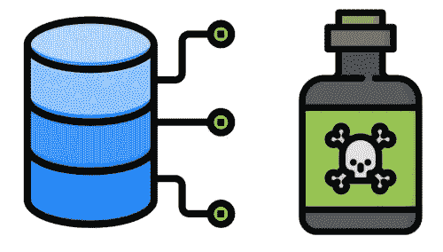
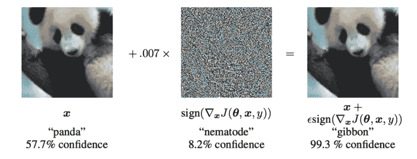
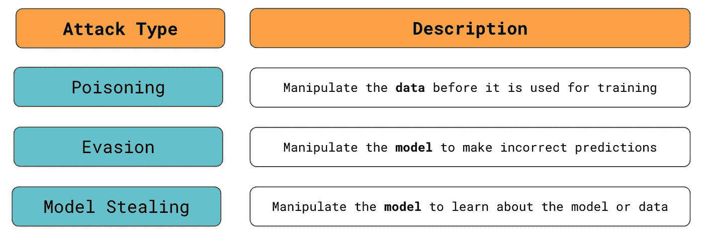
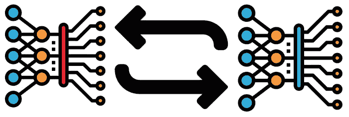

# 什么是对抗性机器学习？

> 原文：<https://towardsdatascience.com/what-is-adversarial-machine-learning-dbe7110433d6?source=collection_archive---------12----------------------->

## 操作机器学习模型的介绍

机器学习模型是复杂的东西，通常，我们对它们如何做出预测的理解很差。这可能会留下隐藏的弱点，被攻击者利用。他们可以欺骗模型做出不正确的预测或泄露敏感信息。假数据甚至可以在我们不知情的情况下用来破坏模型。对抗性机器学习领域旨在解决这些弱点。

来源: [flaticon](https://www.flaticon.com/free-icon/robot_4616760)

在本文的其余部分，我们将更深入地探索这个领域。我们将从讨论对抗性 ML 旨在防止的攻击类型开始。然后，我们将继续讨论防止这些攻击的一般方法。最后，我们将触及对抗性的 ML 如何与一般安全措施和负责任的 AI 相关联。

# 敌对攻击的类型

机器学习可以帮助我们自动化更复杂的任务。不利的一面是，模型会为攻击者引入一个新的攻击目标。新型攻击现在可以用来攻击您的 IT 系统。这些攻击包括中毒、规避和模型窃取攻击。

## 中毒袭击

中毒攻击主要针对用于训练模型的数据。在这种情况下，攻击者将更改现有数据或引入标签不正确的数据。然后，根据该数据训练的模型将对正确标记的数据做出不正确的预测。例如，攻击者可以将欺诈案例重新标记为非欺诈。攻击者可以只对特定的欺诈案例这样做，因此当他们试图以同样的方式实施欺诈时，系统不会拒绝他们。

对于许多应用，模型只训练一次。数据和模型都将被彻底检查，因此像这样的攻击机会可能很少。对于一些系统，模型被不断地重新训练。例如，可以每天/每周一次或者甚至在引入新数据时立即对强化学习模型进行训练。最终，在这种类型的环境中，中毒攻击的机会更大。

## 规避攻击

规避攻击集中在模型本身。它们涉及修改数据，因此看起来是合法的，但会导致不正确的预测。明确地说，攻击者修改模型用来进行预测的数据，而不是用来训练模型的数据。例如，当申请贷款时，攻击者可以使用 VPN 掩盖他们的真实原籍国。他们可能来自一个危险的国家，因此，如果攻击者使用他们真实的国家，模型将拒绝他们的申请。

这些类型的攻击更多地与图像识别等领域相关联。攻击者可以创建在人类看来完全正常的图像，但会导致完全不正确的预测。例如，谷歌的研究人员展示了如何将特定的噪声引入图像中，从而改变图像识别模型的预测。看图 1，你可以看到，对于一个人来说，噪声层甚至是不明显的。然而，模型现在预测熊猫是一只长臂猿。

图 1:对抗的例子(来源: [I. Goodfellow 等人。艾尔。](https://arxiv.org/pdf/1412.6572.pdf))

图像识别模型可以以这种方式被愚弄，因为它们被训练成将某些像素与目标变量相关联。如果我们能以正确的方式调整这些像素，模型就会改变它的预测。如果这些类型的攻击被用来影响自动驾驶汽车等系统，其后果可能会很严重。停车标志或交通灯可以用类似的方法改变吗？这种攻击可能不会被驾驶员注意到，但会导致汽车做出错误的、危及生命的决定。

## 模型窃取

类似地，模型窃取攻击也集中在经过训练的模型上。具体来说，攻击者希望了解模型的结构或用于训练模型的数据。例如，可以从大型语言处理模型中提取社会保险号或地址等机密数据。

就模型结构而言，攻击者可能想要了解该模型，并利用它来获取经济利益。例如，股票交易模型可以被复制并用于股票交易。攻击者可以利用这些信息进行进一步的攻击。例如，他们可以准确识别垃圾邮件过滤模型将标记的单词。然后，攻击者可以更改垃圾邮件/网络钓鱼邮件，以确保它们被发送到收件箱。

图 2:对抗性机器学习攻击的总结

# 对抗攻击的方法

我们捍卫 ML 系统的方式取决于我们使用的模型类型。许多问题可以通过线性回归或逻辑回归这样的简单模型来解决。当涉及到这些类型的模型时，我们描述的许多攻击是无效的。这是因为这些模型是[可解释的](/interpretability-in-machine-learning-ab0cf2e66e1)，这意味着我们可以很容易理解它们是如何工作的。例如，如果发生了中毒事件，我们应该能够在测试过程中发现问题。

像神经网络这样更复杂的模型更难解释。最终，这意味着我们对模型的内部运作了解得更少。这导致了隐藏的弱点，并为上述攻击提供了更多机会。这就是为什么对抗性机器学习领域的大多数研究都旨在打击针对这些模型的攻击。这项研究可以归纳为以下几种一般方法。

## 对抗训练

第一种方法是训练模型来识别对立的例子。对于上面的图像识别模型，熊猫的错误分类图像将被认为是一个对立的例子。希望通过使用这些例子训练/再训练模型，它将能够识别未来的敌对攻击。

问题是首先可能很难发现这些对立的例子。因此，这一领域的研究不仅旨在防御它们，而且旨在自动发现它们。也有像 IBM 开发的[对抗性鲁棒性工具箱](https://adversarial-robustness-toolbox.readthedocs.io/en/latest/)这样的软件包，旨在简化对抗性训练的过程。

## 切换模型

第二种方法是在您的系统中使用多个模型。用于预测的模型是随机变化的。这就产生了一个移动的目标，因为攻击者不知道当前使用的是哪个型号。为了攻击成功，他们可能还必须损害所有模型。中毒或发现多个模型的对立例子要比只有一个模型困难得多。

## 一般化模型

第三种方法是广义模型防御，它也将使用多个模型。它们不是切换模型，而是组合在一起创建一个通用模型。这意味着所有的单个模型都将有助于最终的预测。一个对立的例子可能能够欺骗一个模型，但它可能不会对所有的模型都有效。最终，这意味着一个一般化的模型在对抗对立的例子时更加健壮。

# 一般安全措施和负责任的 AI

上述方法侧重于数据和模型。重要的是要记住，模型不是孤立存在的——它们是更大的 It 系统的一部分。这意味着许多攻击可以通过改变系统来避免。例如，加密和良好的密码实践可以保护数据库，降低中毒攻击的可能性。

再举个例子，让我们回到垃圾邮件过滤系统。攻击者可能会发送多封电子邮件来慢慢了解过滤器的工作原理。我们可以修改我们的电子邮件系统，不给出任何关于被拒绝的电子邮件的信息，而不是对模型进行修改。即系统不会告诉攻击者电子邮件是否被发送到垃圾文件夹。这限制了攻击者可以了解的数量，从而降低了模型窃取攻击的威胁。

最后，一般的安全措施只能带你到这里，我们可能仍然需要使用上述的对抗性防御之一。这也意味着现有的安全框架可能不足以解决机器学习的安全问题。这就是负责任的人工智能发挥作用的地方。它是一个框架，旨在解决人工智能/人工智能系统的安全性以及其他由此产生的问题，如算法的公平性和可解释性。您可以在下面的文章中了解更多信息:

 [## 什么是负责任的 AI？

towardsdatascience.com](/what-is-responsible-ai-548743369729) 

## 图像来源

所有图片都是我自己的或从[www.flaticon.com](http://www.flaticon.com/)获得的。在后者的情况下，我拥有他们的[高级计划](https://support.flaticon.com/hc/en-us/articles/202798201-What-are-Flaticon-Premium-licenses-)中定义的“完全许可”。

## 参考

古德费勒等人。艾尔。、*解释和治理反面事例*(2015)[https://arxiv.org/pdf/1412.6572.pdf](https://arxiv.org/pdf/1412.6572.pdf)

C.Kapelke，*对抗性机器学习*(2019)[https://medium . com/cltc-bulletin/对抗性机器学习-43b6de6aafdb](https://medium.com/cltc-bulletin/adversarial-machine-learning-43b6de6aafdb)

B.Dickson，*什么是对抗性机器学习？*(2020)[https://bdtechtalks . com/2020/07/15/machine-learning-adversarial-examples/](https://bdtechtalks.com/2020/07/15/machine-learning-adversarial-examples/)

K.Wiggers，*机器学习中的对抗性攻击:它们是什么以及如何阻止它们*(2021)[https://venturebeat . com/2021/05/29/机器学习中的对抗性攻击-它们是什么以及如何阻止它们/](https://venturebeat.com/2021/05/29/adversarial-attacks-in-machine-learning-what-they-are-and-how-to-stop-them/)

加州大学柏克莱分校*对抗性机器学习【https://cltc.berkeley.edu/aml/*(2021)