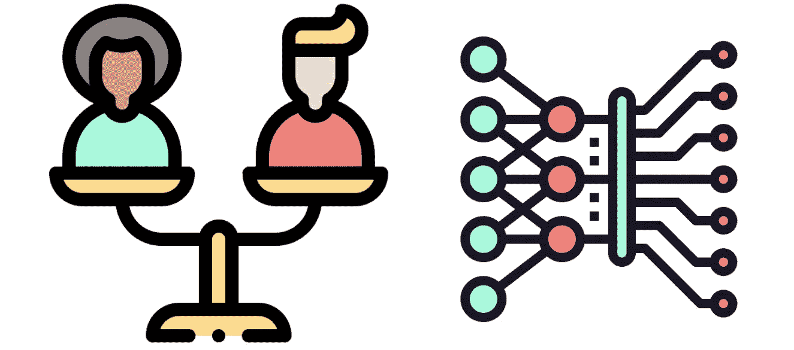
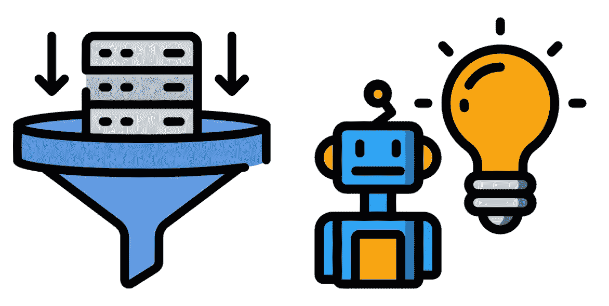
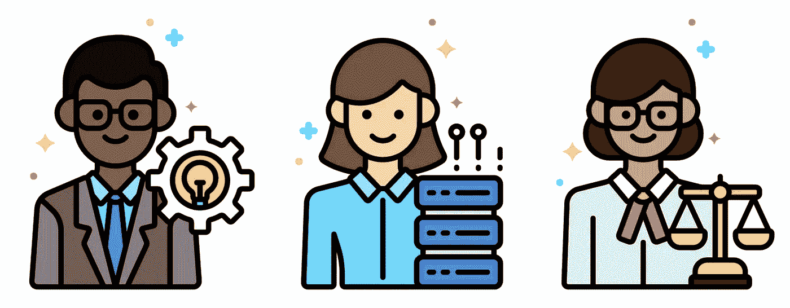
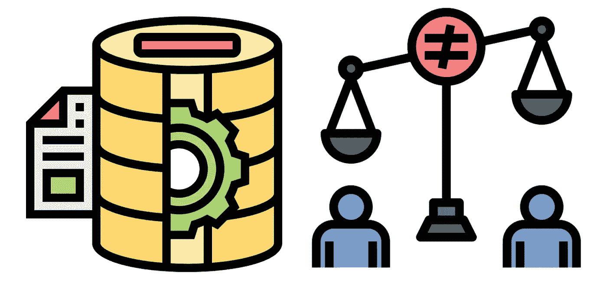
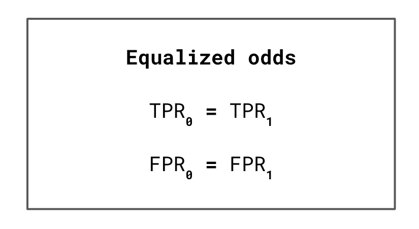
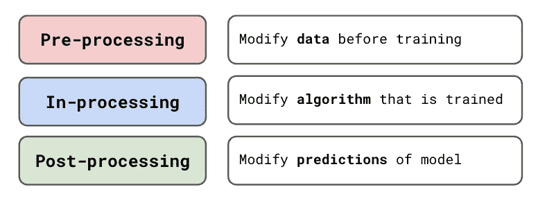

# 什么是算法公平？

> 原文：<https://towardsdatascience.com/what-is-algorithm-fairness-3182e161cf9f?source=collection_archive---------10----------------------->

## 对旨在理解和防止机器学习中不公平现象的领域的介绍

(来源: [flaticon](https://www.flaticon.com/free-icon/fair_3260927) )

起初，不公平的机器学习模型的概念似乎是矛盾的。没有种族、民族、性别或宗教概念的机器怎么会主动歧视某些群体？但算法会，如果不加以检查，它们将继续做出延续历史不公正的决定。这就是算法公平领域的用武之地。

我们探索算法公平的领域和它的目标是什么。为了突出这一领域的重要性，我们讨论了不公平模型及其后果的例子。我们还简要地谈到不公平的原因，如何衡量它和如何防止它。最后，我们讨论公平性和可解释性之间的联系。一路走来，我们链接了关于这些主题的更深入的文章。

在我们继续之前，您可以观看下面的视频，了解本文的摘要:

# 什么是算法公平？

在机器学习中，算法和模型这两个术语可以互换使用。准确地说，算法是像线性回归、随机森林或神经网络这样的数学函数。模型是经过数据训练的算法。一旦经过训练，模型就被用来进行预测，这有助于自动化决策。这些决定可以包括从诊断癌症患者到接受抵押贷款申请的任何事情。

(来源: [flaticon](https://www.flaticon.com/) )

没有一个模型是完美的，这意味着它们可能做出不正确的预测。如果这些错误系统性地使一群人处于不利地位，我们就说这个模型有偏见/不公平。例如，一个不公平的模型可能比男性更经常拒绝女性的抵押贷款申请。类似地，我们最终可能会得到一个比白人更不容易发现黑人皮肤癌的医疗系统。

**算法公平**是一个研究领域，旨在理解和纠正这样的偏见。它处于机器学习和伦理学的交汇点。具体而言，该领域包括:

*   研究数据和算法中偏差的原因
*   定义和应用公平的度量
*   开发旨在创建公平算法的数据收集和建模方法
*   就如何监管机器学习向政府/企业提供建议

理解公平的方法不仅仅是定量的也很重要。这是因为不公平的原因超越了数据和算法。这项研究还将涉及理解和解决不公平的根本原因。

(来源: [flaticon](https://www.flaticon.com/) )

# 为什么算法公平很重要？

如前所述，机器学习模型正被用于做出重要决策。不正确预测的后果对个人来说可能是毁灭性的。如果不正确的预测是系统性的，那么整个群体都会遭殃。为了理解我们这样说的意思，看几个例子会有帮助。

苹果公司最近推出了一种信用卡——苹果卡。你可以在网上申请信用卡，你会自动得到一个信用额度。随着人们开始使用这种产品，人们发现女性获得的信用额度比男性低得多。即使这些女性有着相似的财务状况(和信用风险)。例如，苹果联合创始人史蒂夫·沃兹尼亚克(Steve Wozniak)说，他获得的信用额度是他妻子的 10 倍。

(来源: [flaticon](https://www.flaticon.com/) )

另一个例子是亚马逊用来帮助自动化招聘的系统。机器学习被用来给新候选人的简历打分。为了训练模型，亚马逊使用了历史上成功候选人的信息。问题是，由于科技行业男性占主导地位，这些候选人中大多数是男性。其结果是一种不以性别中立的方式评价简历的模式。实际上，它甚至惩罚了“女人”这个词(例如**女子**足球队的队长)。

这些例子表明，模型可以做出基于性别歧视的预测。与男性同等的女性面临着明显不同的结果。在这种情况下，结果是降低信用额度或拒绝工作申请。这两种结果都可能产生严重的财务影响。总的来说，像这样的模式会增加男女之间的经济不平等。

(来源: [flaticon](https://www.flaticon.com/) )

模特也可以根据种族进行区分。COMPAS 是美国刑事司法系统使用的一种算法，用来预测被告是否有可能再次犯罪。不正确的预测(即假阳性)可能导致被告被错误监禁或面临更长的刑期。结果发现，黑人罪犯的假阳性率是白人罪犯的两倍。也就是说，黑人罪犯被错误地标记为潜在的惯犯的可能性是普通罪犯的两倍。

这些例子表明，我们可以发现有偏见的算法被用于许多行业的不同问题。这些算法做出决策的规模也是一个问题。一个有偏见的人受限于他能担保的贷款数量或他能定罪的人。一种算法可以被缩放并用于做出所有的决定。最终，一个有偏见的算法的后果可能是消极的和普遍的。

# 不公平的原因

很明显，它们是不好的，但是我们怎么会得到不公平的算法呢？算法公平实际上是一个有点误导的术语。算法本身并没有固有的偏见。它们只是数学函数。通过在数据上训练这些算法中的一个，我们获得了机器学习模型。引入有偏差的数据会导致模型有偏差。也就是说，我们围绕算法的选择仍然会放大这些偏见。

(来源: [flaticon](https://www.flaticon.com/) )

数据可能因为不同的原因而有偏差。我们收集的数据将反映历史的不公正，这可以通过一个模型**(历史偏见)来捕捉。**就像亚马逊的招聘模式一样，这可能是因为缺乏少数族裔代表**(不平衡的数据集)**。也可能是由于与种族/性别**(代理变量)**相关的模型特征。我们将在下面的文章中更深入地探讨这些原因。

 [## 你的模型做出不公平预测的 5 个原因

### 偏见的常见来源——历史偏见、代理变量、不平衡数据集、算法选择和用户交互

towardsdatascience.com](/algorithm-fairness-sources-of-bias-7082e5b78a2c) 

# 分析和衡量不公平

许多算法公平性研究旨在开发分析和测量不公平性的方法。这可能涉及分析**数据**以找出上述不公平的潜在原因。它还涉及测量**模型预测**中的不公平性。

## 公平的定义

我们可以通过应用不同的公平性定义来衡量预测的公平性。大多数定义涉及将人口分为特权群体(如男性)和非特权群体(如女性)。然后，我们使用评估指标对各组进行比较。例如，根据**均等几率**的定义，我们要求两组的真阳性率和假阳性率相等。一个有明显不同的费率的模型被认为是不公平的。其他定义包括**平等机会**和**不同影响**。

(来源:作者)

## 探索性公平分析

当你有了最终的模型时，评估公平性并没有开始。这也应该是你探索性分析的一部分。一般来说，我们这样做是为了围绕数据集建立一些直觉。所以，当谈到建模时，你对预期的结果有一个很好的想法。具体来说，为了公平，你想了解你的数据的哪些方面可能导致不公平的模型。

在下面的文章中，我们将带您了解如何进行这样一个**探索性公平分析**。我们还将更深入地讨论公平的定义，并向您展示如何应用它们。

 [## 分析机器学习中的公平性(用 Python)

### 做一个探索性的公平性分析，并使用平等机会、均等优势和完全不同来衡量公平性…

towardsdatascience.com](/analysing-fairness-in-machine-learning-with-python-96a9ab0d0705) 

# 纠正和防止不公平

如果我们发现我们的模型不公平，我们自然会想纠正它。已经开发了各种定量方法。我们可以将它们分为**前处理**、**中处理**和**后处理**。这取决于在模型开发的哪个阶段应用它们。例如，我们可以调整回归模型的成本函数，以考虑公平性。这将被认为是一种正在处理的方法。

(来源:作者)

定量方法有其局限性。这是因为公平是一个复杂的问题。我们需要将它视为超越我们的数据和模型的东西。最终，我们还需要非量化方法来全面解决不公平问题。这些包括解决**根本原因**、问题的**意识**和团队**多样性。**

我们将在下面的文章中讨论更多的定量和非定量方法。这些包括预处理、加工中和后处理方法的例子。我们还试图更深入地理解这些方法的局限性。

 [## 解决机器学习中的不公平问题

### 预处理、加工中和后处理定量方法。以及非定量方法…

towardsdatascience.com](/approaches-for-addressing-unfairness-in-machine-learning-a31f9807cf31) 

# 可解释性和公平性

我喜欢写关于算法公平性的文章，但我的大部分文章都是关于可解释的机器学习的。[可解释性](/interpretability-in-machine-learning-ab0cf2e66e1)包括理解模型如何做出预测。公平性和可解释性其实是相关的。这样做的主要原因是它们都是关于在 ML 系统中建立信任。我们将在下面的文章中讨论这一点和另外两个原因。

 [## 可解释性与公平性的关系

### 为什么可解释的模型更可能是公平的 3 个原因

towardsdatascience.com](/the-relationship-between-interpretability-and-fairness-627266bd6fda) 

我希望这篇文章对你有帮助！如果你想看更多，你可以成为我的 [**推荐会员**](https://conorosullyds.medium.com/membership) **来支持我。你可以访问 medium 上的所有文章，我可以得到你的部分费用。**

 [## 通过我的推荐链接加入 Medium 康纳·奥沙利文

### 作为一个媒体会员，你的会员费的一部分会给你阅读的作家，你可以完全接触到每一个故事…

conorosullyds.medium.com](https://conorosullyds.medium.com/membership) 

你也可以在|[Twitter](https://twitter.com/conorosullyDS)|[YouTube](https://www.youtube.com/channel/UChsoWqJbEjBwrn00Zvghi4w)|

## 图像来源

所有图片均为本人或从 www.flaticon.com[获得。在后者的情况下，我拥有他们的](http://www.flaticon.com/)[高级计划](https://support.flaticon.com/hc/en-us/articles/202798201-What-are-Flaticon-Premium-licenses-)中定义的“完全许可”。

## 参考

Birhane，a .(2021)**算法的不公正:一种关系伦理方法**。[https://www . science direct . com/science/article/pii/s 2666389921000155](https://www.sciencedirect.com/science/article/pii/S2666389921000155)

D.佩萨奇和 e .施慕利，*算法公平性* (2020)，[https://arxiv.org/abs/2001.09784](https://arxiv.org/abs/2001.09784)

[Gal Yona](https://medium.com/u/c81e4b81bed8?source=post_page-----3182e161cf9f--------------------------------) ，*关于算法公平性讨论的温和介绍* (2017)，[https://towards data science . com/A-Gentle-Introduction-to-the-Discussion-on-algorithm-failure-740 BBB 469 b 6](/a-gentle-introduction-to-the-discussion-on-algorithmic-fairness-740bbb469b6)

j、文森特、*苹果信用卡因歧视女性被调查* (2019)、[https://www . the verge . com/2019/11/11/20958953/Apple-credit-card-gender-discrimina tion-algorithms-black-box-investigation](https://www.theverge.com/2019/11/11/20958953/apple-credit-card-gender-discrimination-algorithms-black-box-investigation)

南沃希特-博特彻，*技术上错误:性别歧视的应用程序，有偏见的算法，以及其他有毒技术的威胁* (2017)，[https://www . goodreads . com/book/show/38212110——技术上错误](https://www.goodreads.com/book/show/38212110-technically-wrong)

《卫报》，*亚马逊抛弃了偏爱男性从事技术工作的人工智能招聘工具* (2018)，[https://www . the Guardian . com/technology/2018/oct/10/Amazon-hiring-AI-gender-bias-recruiting-engine](https://www.theguardian.com/technology/2018/oct/10/amazon-hiring-ai-gender-bias-recruiting-engine)

维基百科，*算法偏差* (2021)，https://en.wikipedia.org/wiki/Algorithmic_bias