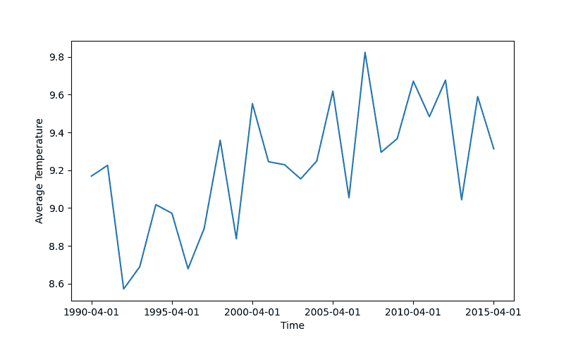

# 什么是 ARIMA 模型？

> 原文：<https://towardsdatascience.com/what-is-an-arima-model-9e200f06f9eb?source=collection_archive---------7----------------------->

## 快速浏览 ARIMA 模特

如果您处理时间序列数据，那么您可能听说过术语 ARIMA。自 20 世纪 70 年代以来，ARIMA 模型一直被用于分析时间序列数据，而且有充分的理由证明它仍然存在；它简单而强大。在这篇博文中，我的目标是为您理解这个模型打下坚实的基础，并希望鼓励您使用它来分析时间序列数据。

# 一般概念

**ARIMA** 模型(自动回归综合移动平均的首字母缩写)，本质上是创建一个线性方程来描述和预测你的时间序列数据。该等式由三个独立的部分组成，可描述为:

*   **AR** —自动回归:基于过去数据点创建的方程项
*   **I** —整合还是差异:说明数据中的总体“趋势”
*   **MA** —移动平均:基于过去数据点的误差或噪声的等式项

这三个部分共同构成了 AR-I-MA 模型。

ARIMA 的 AR 和 MA 方面实际上来自独立的模型，这些模型可以描述更简化的时间序列数据的趋势。有了 ARIMA 模型，你基本上有能力结合使用这两个模型和差分(即“I”)来进行简单或复杂的时间序列分析。很酷，对吧？

# 模型的注意事项

在深入挖掘之前，我想指出 ARIMA 模型是在某些假设下起作用的。为了有效地使用 ARIMA 模型，你会想问自己这些关于你想分析的时间序列数据的问题。

*   是否有已知的季节性(周期性趋势)？
*   是否存在大量异常值或零星数据点？
*   关于均值的数据变异是否不一致？

如果你对这些问题的回答是否定的，那么 ARIMA 模式就是适合你的！否则，您可能需要寻找不同的时间序列模型。

# 了解细节

ARIMA 模型几乎总是被表示为 **ARIMA(p，d，q)** ，其中每个字母对应于上述三个部分中的一个。这三个字母代表您必须提供的参数，描述如下:

*   p 决定自回归(AR)项的数量
*   d 决定差分的顺序
*   q 决定移动平均线(MA)项的数量

虽然我喜欢这些参数背后的数学，但我不会在这篇文章中解释它。如果您对这些方程的工作原理感兴趣，我强烈推荐您查看我在最后发布的参考资料。现在，我将尝试让您对这三个参数有一个大致的了解。

## 综合

让我们从 ARIMA 模型中的“我”开始。模型的这一部分说明了整个时间序列数据中出现的一般趋势。d 值是指需要对时间序列趋势进行多少次求导才能得到一条平坦的线(或常数)。

例如，下图显示了 1990 年至 2015 年 4 月平均土地温度的实际数据。注意线性趋势。

如果我们用 ARIMA 模型分析这个数据，我们可能会用 d=1 来解释它的线性趋势。如果趋势是二次的，我们可能必须使用 d=2。

## 自回归和移动平均部分

ARIMA 模型本质上是递归的，因此依赖于过去的计算。这种递归性质直接来自添加到模型中的 AR 和 MA 方程项。

p 值，或 AR 部分，本质上描述了你的数据点对过去数据点的依赖程度。如果 p=1，那么特定时间的模型输出直接依赖于之前时间的输出。如果 p=2，则输出将依赖于最后两个时间段的输出。

类似地，q 值或 MA 部分使用相同的递归概念。不同之处在于，q 描述了当前输出与其过去的误差或噪声计算的相关程度。因此，如果 q=1，那么当前输出将依赖于过去一段时间的噪声计算。对于 q=2，您的输出将依赖于前两个时间段的噪声。

# 结论

现在我们已经对 ARIMA 模型及其参数有了一个大致的了解，我们实际上可以看看如何使用该模型进行分析。找出正确的 p、d 和 q 值可能具有挑战性，但拥有正确的工具，如 ACF 和 PACF，会有所帮助。在另一篇文章中，我将通过一个完整的例子来说明如何使用这些工具分析时间序列数据，并展示如何一起找到 p、d 和 q 值。下次见！

参考资料:

*   宾夕法尼亚州立大学 STAT 510 在线课程；应用时间序列分析；[https://online.stat.psu.edu/stat510/lesson/1](https://online.stat.psu.edu/stat510/lesson/1)；2021
*   时间序列:自回归模型 AR，MA，ARMA，ARMA 明达张；匹兹堡大学；2018.