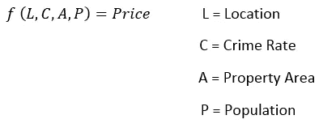
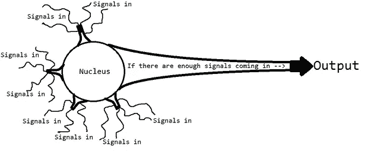
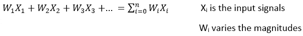
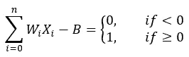
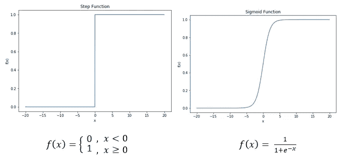
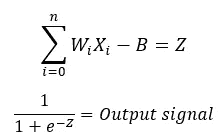
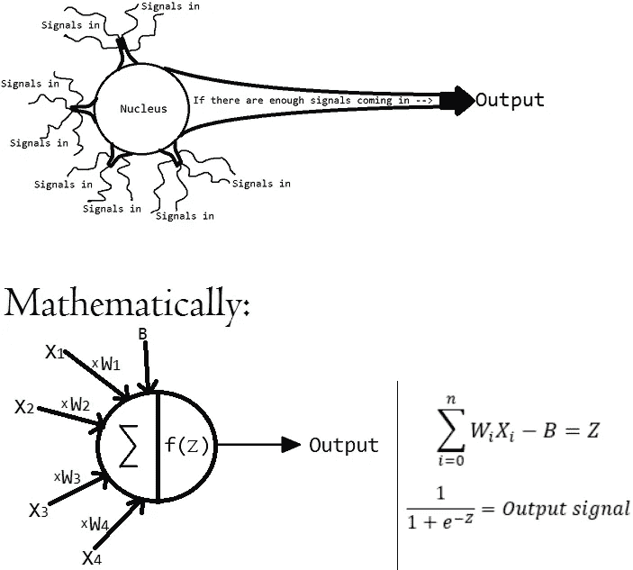
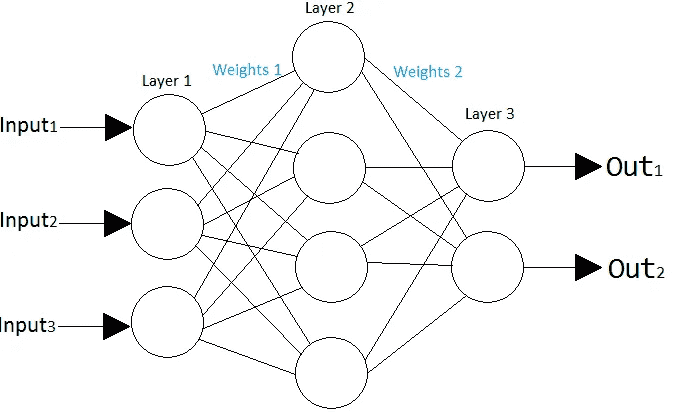

# 什么是人工神经网络？

> 原文：<https://towardsdatascience.com/what-is-an-artificial-neural-network-b508c821ace8?source=collection_archive---------25----------------------->

## 人工神经网络的直观介绍。

神经网络近年来受到了大量的炒作，这是有充分理由的。有了对这种深度学习理论的基本理解，我们就可以创造出用人类，有时是超人的能力来解决复杂问题的技术。无论是高级信号处理、对象检测、智能决策还是时间序列分析，神经网络都是为您的项目增加智能的一种好方法。在我开始解释神经网络的细节之前，让我讲一个小故事，这个故事应该会对为什么首先创建人工神经网络有所启发。如果你只想直接进入神经网络的细节，那么跳到“生物神经元建模”部分。

## 投资者、数学家和神经科学家的故事

假设有一位房地产投资者拥有全球数千处房产的数据。这些数据包括每个物业的位置、位置犯罪率、物业平方英尺和人口。他还有每处房产的售价。他想找出每项财产的数据与该财产的销售价格之间的关系。如果他发现了这种关系，他可以将它应用到一个不在他的数据中的新房子上，并找出它的售价。然后他可以很容易地找到比他转卖价格更便宜的房子。

好吧，这就是一个房地产投资者的愿望。不幸的是，他从来都不擅长数学。因此，带着对财富的渴望，他找到了一位数学家来解决他的问题。让我们从数学家的角度来看这个问题。

对数学家来说，我们有一些函数的一系列输入和输出。输入是资产的位置、位置犯罪率、资产平方英尺和人口。产出是房产的销售价格。这个函数*就是*投资者所指的“关系”,但是数学家看到的是:

*价格是投入的某种函数。这个函数可能很简单，也可能复杂得令人难以置信，我们就是不知道！*****图片作者****

当数学家不知疲倦地寻找这个函数时，投资者变得不耐烦了。几天后，他失去了他的病人，并与一位更有经验的投资者成为商业伙伴，而不是等待数学家。这位更有经验的投资者非常擅长他所做的事情，他可以出现在房产前，甚至不需要使用小学数学就能给出一个很好的估价。

数学家很尴尬，放弃了手动寻找这个函数。失败后，他问自己，“这个问题怎么这么难用数学来解决，但对有经验的投资者来说却如此直观？”。由于无法回答这个问题，他找到了一位神经科学家，希望了解投资者的大脑是如何解决这个问题的。

神经科学家无法准确回答投资者是如何如此准确地估计价格的，他教数学家大脑中的神经元是如何工作的。数学家然后用数学方法模拟这些神经元。经过年复一年的努力，这位数学家终于发现了如何找出任何两个相关事物之间的关系，包括一处房产的细节和它的售价。然后他利用这些信息赚了一亿美元，从此过上了幸福的生活。

## 生物神经元建模

正如我们从上面的故事中所看到的，如果我们想要模拟对人类来说如此直观，但却难以置信地复杂的数学模型，我们必须看看人脑是如何做到的。

人脑是由数十亿个神经元组成的。一个神经元的简化是这样的:许多大小不同的信号进入细胞核，*如果总的输入信号足够强*(它大于特定于该神经元的某个阈值)，神经元将触发*并输出*信号。这个输出信号是另一个神经元的输入之一，这个过程继续进行。请参见下图对此进行形象化描述:

这个阈值在人工神经网络中被称为神经元的“偏差”。****图片作者****

那么我们如何用数学建模呢？神经元接收许多不同幅度的输入，接收的总信号可以建模为:

*这些 W 变量称为权重。他们给输入信号加上“权重”来改变它们的大小。在大脑中，神经连接具有不同的电阻。这种阻力在生物学上相当于我们模型中的重量。*****图片作者****

好的，如果总的输入信号大于这个神经元的阈值，那么这个神经元就会触发。或者数学上:

*该阈值称为偏差，标记为 B。如果加权输入之和大于 B，将输出 1。如果它们小于 B，这将输出一个 0。*****图片作者****

在我们称之为神经元的完整模型之前，我们必须说明一件事。去掉上面等式中的“如果”语句是有益的。我们通过将这个等式的左边传递到所谓的 *sigmoid 函数*中来实现。让我们来看看我们目前拥有的图形与 sigmoid 函数的图形。

*sigmoid 函数是激活函数的一个例子。目前最流行的是使用 ReLu 函数，但是 sigmoid 函数很容易理解他们最初是如何想到这个想法的，因为它与 step 函数相似。*****图片作者****

如你所见，sigmoid 函数的行为与我们之前的阶跃函数几乎完全一样。唯一的区别是我们不需要处理那个难看的 if 语句。这个函数现在也是可微的，这很有用，原因我将很快解释。请注意，我们可以在这里使用任何可微函数，只是有些函数比其他函数更好。

下面是我们对神经元的最终数学表示。

Z =所有输入的加权和-神经元的偏差。然后，我们将 Z 传递给 sigmoid 函数，以获得输出。****图片作者****

我们现在可以更新神经元的图片，以符合我们的数学模型:

****图片作者****

## 组合多个神经元

现在我们理解了一个神经元的工作方式，并且我们已经用数学方法模拟了它。正如我之前所说，人脑由数十亿个神经元组成。这数十亿个神经元都与其他神经元相互发送和接收信号，形成了一个*神经网络*。

让我们放大一个神经元。这个神经元接收一串输入，然后向一个或多个其他神经元发送信号。这些神经元都做同样的事情，从神经元接收一系列输入，然后向更多的神经元发送信号。大脑可以被认为是一个由相互连接的神经元组成的复杂的大网络。

当我们对神经网络进行数学建模时，我们给这个网络带来了一些秩序。最常见的是，我们将神经元组织成层。每一层接收来自前一层的输入，并将输出发送到下一层。我们让最后一层(输出层)有一定数量的神经元=我们想要的输出数量。下面是一个*人工*神经网络(神经网络的数学模型)的例子，有 2 个输出和 3 个输入:

*您将在实施中看到，权重可视为一个矩阵。*****图片作者****

回到我们的房地产投资者的问题，他拥有的关于房地产的数据将是输入，而房地产的价格将是输出。回想一下，他总共有 4 个输入，并希望这些输入告诉他价格。现在，问问自己第一层和最后一层的神经元数量应该是多少，4 个输入 1 个输出。

你的答案第一层应该是 4，最后一层应该是 1。但是，我们应该在中间放多少神经元呢？我们应该有多少层？这是精确的数学停止和尝试和错误进来的地方。我们称这些值为超参数。每个问题的最佳层数和每层中神经元的数量是不同的，这只是你需要测试的东西。一般来说，增加层的数量和每层中的神经元数量将使神经网络更加健壮。但是如果你有太多的层和神经元，那么网络将会过度适应你的数据并简单地记忆输出。

## 人工神经网络背后的基本思想

所以，我们有一个神经网络的数学模型。*我们实际上是如何让这个东西工作的？*在给定输入的情况下，我们如何让这个网络真正给出我们想要的输出？帮我一个忙，让你的大脑进入海绵模式一秒钟，想想下面这个非常大胆的说法。

> ***如果在输入中给定足够的信息，并且给定一个足够健壮的架构，存在一些权重集合，将使神经网络给出我们想要的输出。我们的目标是找到这些重量。***

我们可以说，对于任何两个相关的事物，都有一些复杂的函数来模拟它们之间的关系。这是数学家试图用手找到的函数。这两个相关的东西是关于房产和房产售价的所有数据。事实证明，如果我们的神经网络中有一组正确的权重，我们就可以复制这种关系。

通过一些微积分和代码，我们可以在眨眼之间找到这些权重。然而，寻找这些权重的过程是神经网络和人工神经网络各自采取不同路径的地方。我不确定是否知道真正的神经网络如何学习，但使用微积分和数据，我们可以让我们的人工神经网络找到权重，如果可能的话，将输入映射到输出。

关于寻找这些权重或训练我们的神经网络的文章贴在[这里](https://doingengineering21.medium.com/how-to-train-a-neural-network-from-scratch-952bbcdae729)。

> 感谢您的阅读！如果这篇文章在某种程度上帮助了你，或者你有什么意见或问题，请在下面留下回复，让我知道！此外，如果你注意到我在某个地方犯了错误，或者我可以解释得更清楚一些，那么如果你能通过回复让我知道，我会很感激。

> 这是一系列文章的继续，这些文章从头开始对神经网络进行了直观的解释。其他文章请参见下面的链接:
> 
> 第 1 部分:什么是人工神经网络
> 
> [第 2 部分:如何从头开始训练神经网络](/how-to-train-a-neural-network-from-scratch-952bbcdae729)
> 
> [第 3 部分:梯度下降的全面实施](https://doingengineering21.medium.com/full-implementation-of-gradient-descent-no-holding-back-86e688f36064)
> 
> [第 4 部分:梯度下降的实现(一个例子)](https://doingengineering21.medium.com/implementing-gradient-descent-example-102b4454ea67)
> 
> [第 5 部分:如何在 python 中对手写数字进行分类](https://doingengineering21.medium.com/how-to-classify-handwritten-digits-in-python-7706b1ab93a3)