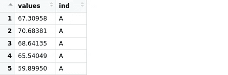
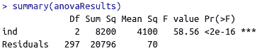
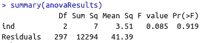

# 什么是方差分析，我们什么时候使用它？

> 原文：<https://towardsdatascience.com/what-is-anova-and-when-do-we-use-it-e0dcd8759c4e?source=collection_archive---------1----------------------->

## 附有示例的综合指南


马库斯·斯皮斯克在 [Unsplash](https://unsplash.com/s/photos/many-different?utm_source=unsplash&utm_medium=referral&utm_content=creditCopyText) 上的照片

推断统计学中的两个基本概念是总体和样本。推断统计的目标是根据样本推断总体的属性。

总体是一组中的所有元素，而样本是指总体中随机选择的子集。收集群体数据并不总是可行或可能的，因此我们使用样本进行分析。

例如，美国的大学生是一个群体，在美国随机选择的 1000 名大学生是这个群体的一个样本。

将样本分析结果直接应用于整个人群是不可靠的。我们需要系统的方法来证明样本结果适用于总体。这就是我们需要统计检验的原因。他们评估样本结果真实代表总体的可能性。

想想我们做的关于肥胖的研究项目。在我们的项目范围内，我们希望比较两个不同国家(A 和 b)20 岁的人的平均体重。由于我们无法收集人口数据，因此我们抽取样本并执行统计测试。

我们设置零假设和替代假设如下:

*   零假设(H0):两组的平均体重没有差异。
*   替代假设(H1):两组的平均权重不同。

两组比较时， **t 检验**优于 **ANOVA** 。然而，当我们有两个以上的组时，t 检验不是最佳选择，因为需要执行单独的 t 检验来比较每一对。

假设我们正在比较三个国家，A、B 和 C。我们需要对 A-B、A-C 和 B-C 对进行 t 检验。随着组数量的增加，这变得更加难以管理。因此，我们选择方差分析。

在比较三组或更多组的情况下，ANOVA 是优选的。方差分析有两个要素:

*   各组内的差异
*   组间差异

方差分析结果基于 F 比率，其计算如下:


f 比率(图片由作者提供)

f 比率是组间变异和组内变异之间比较的一种量度。

较高的 F 比值表明组间的差异大于组的个体差异。在这种情况下，更有可能的是各组的平均值不同。

相比之下，在 F 比值较低的情况下，组内个体差异大于组间差异。因此，我们可以得出结论，一个群体中的元素是高度不同的，而不是整个群体。

> F 比率越大，各组具有不同均值的可能性越大。

我们已经讨论了方差分析背后的直觉，以及它通常在什么时候使用。下一步是做一个例子。我们将使用 R 编程语言来执行 ANOVA 测试。

rnorm 函数基于给定的平均值和标准变化值，生成从正态分布中采样的数字数组。

```
> rnorm(5, mean=10, sd=3)
[1]  8.624795  8.431731 10.570984  7.136710 11.801554
```

我们将使用 rnorm 函数来生成示例数据，然后在数据框中堆叠组。

```
> A = rnorm(100, mean = 60, sd = 5)
> B = rnorm(100, mean = 71, sd = 10)
> C = rnorm(100, mean = 65, sd = 7)
> groups = stack(data.frame(cbind(A, B, C)))
```



分组数据框(图片由作者提供)

values 列包含值，ind 列显示它属于哪个组。ANOVA 测试使用 aov 函数完成:

```
> anovaResults = aov(values ~ ind, data = groups)
```



方差分析测试结果(图片由作者提供)

*   f 值为 58.56，表明各组不同。大于 1 的 f 值表示至少一个组不同于其他组。
*   p 值非常小，表明结果具有统计学意义(即不是由于随机机会产生的)。通常，p 值小于 0.05 的结果被认为具有统计学意义。
*   Df 是自由度。第一行是组间差异，第二行是组内差异，计算如下:


(图片由作者提供)

让我们用平均值非常接近的组来做另一个例子。

```
> A = rnorm(100, mean = 70, sd = 5)
> B = rnorm(100, mean = 71, sd = 6)
> C = rnorm(100, mean = 70, sd = 7)
> groups = stack(data.frame(cbind(A, B, C)))
> anovaResults = aov(values ~ ind, data = groups)
```



方差分析测试结果(图片由作者提供)

在这种情况下，我们为每组选择了相同或非常接近的平均值。结果，f 值非常小，这证实了各组没有不同。

我们在示例中所做的是**单向** ANOVA 测试，它基于一个独立变量比较三个或更多组的平均值。还有一个**双向** ANOVA 测试，它基于两个独立变量比较三个或更多组。

## 结论

方差分析是一种确定组的平均值是否不同的方法。在推断统计学中，我们使用样本来推断总体的性质。方差分析等统计检验帮助我们判断样本结果是否适用于总体。

t 检验和方差分析的区别在于 t 检验只能用于比较两组，而方差分析可以扩展到三组或更多组。

方差分析也可以用于机器学习的特征选择过程。可以通过进行 ANOVA 测试来比较这些特征，并且可以从特征集中消除相似的特征。

感谢您的阅读。如果您有任何反馈，请告诉我。