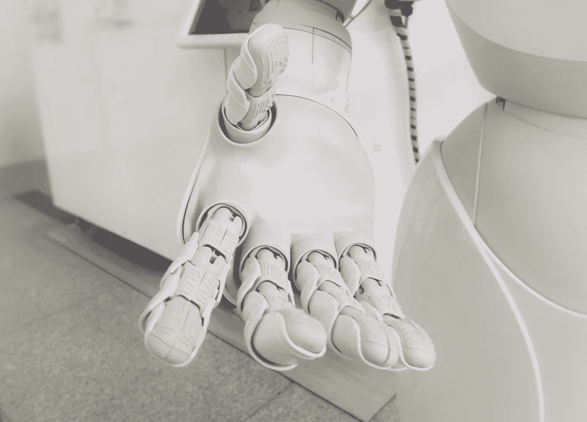
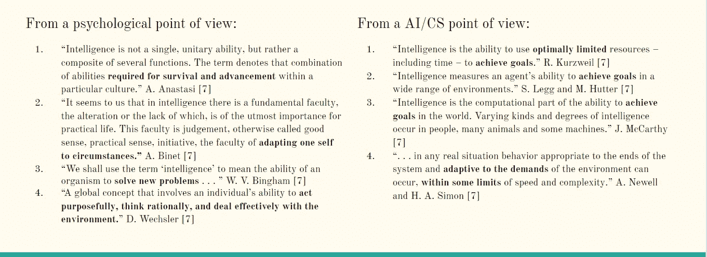
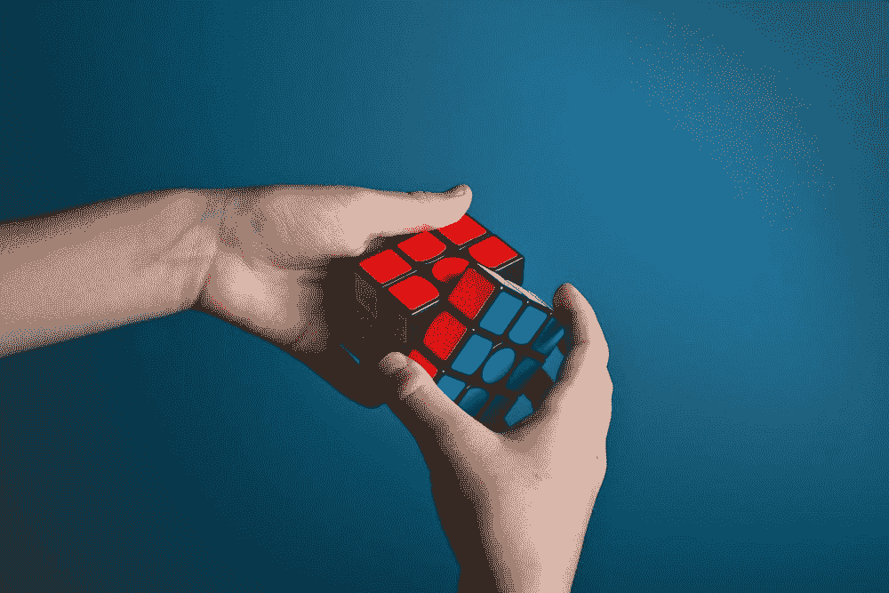
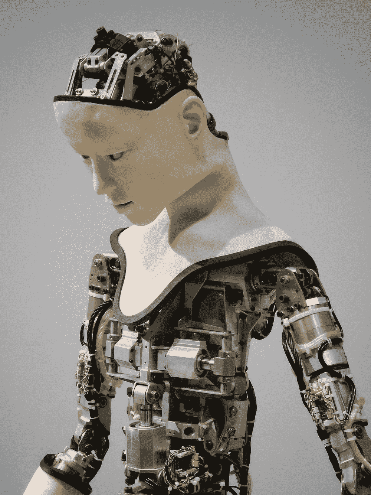

# 什么是“人工通用智能”？

> 原文：<https://towardsdatascience.com/what-is-artificial-general-intelligence-4b2a4ab31180?source=collection_archive---------19----------------------->

## *人工智能概论第一部分*

一扇通往我们人性的窗户。来源:通过 [Unsplash](https://unsplash.com/@possessedphotography) 附身摄影。

> “在某个地方，一些不可思议的事情正等着被人知晓。”
> 
> 卡尔·萨根

# 关于这个系列

## 你好。

我的名字是[迈克·费格森](http://www.mikeferguson.info)，我是麻省理工学院大脑和认知科学(BCS)系的一名研究软件工程师。在我的大学时代，我是弗吉尼亚大学一门新颖的计算机科学课程的创造者和讲师，研究人工智能、神经科学和哲学的交叉。这门课程名为 *CS 1501:人工智能*，在弗吉尼亚大学教授了三个学期，有近 150 名学生，甚至获得了弗吉尼亚大学 CS 学院的教学奖。在我为缺乏简单易懂、简明扼要、触及相关问题的 AGI 介绍而烦恼之后，我有了将这门课转变成一系列博客的想法。

意识的本质是什么？传说中的*图灵测试*是什么，它会按计划进行吗？超级智慧会消灭人类吗？AGI 会摧毁还是改善经济？这些是人类必须提出的一些最重要的问题，可能会决定我们的命运。我不假装知道答案；我的希望只是强调跨学科合作的必要性，并强调哲学和认知科学如何能够阐明甚至回答棘手的计算机科学问题。

这个新的网络系列将通过查看人工智能的一个特定超集来介绍这些问题:人工通用智能——或通用人工智能。在大约 13 篇帖子中，我将把我教的弗吉尼亚大学的课转变成一个可消化的长篇故事，介绍和解释 AGI 的关键概念——从基础认知科学到心灵哲学和超智能。我们将探索神秘的意识领域，遍历认知架构的文献，并消化超智能的问题，敬请关注。对于任何对人工智能的神经科学、哲学难题的应用感兴趣的人，或者想知道天网是否真的可能的人，你找到了正确的地方。我这门课的目标是广度，所以这门“课”涵盖了很多——然而,“AGI 问题”有很多方面，我希望尽我所能介绍它们。

每周/每隔一周(我希望)会有一个新帖子出来，如果有问题、评论或澄清，可以随时给(mferg@mit.edu 发电子邮件。尽情享受吧！

免责声明:毫无疑问，有些人更有资格就我将涉及的问题和主题进行深入的讨论，从情感到神经形态计算。对于这些人来说，这个系列只是对这些主题的介绍，因此，如果为了简洁而省略或浓缩了一些内容，请见谅。我真的只是想要这个系列，以及激发它的课程，作为一个相关 AGI 主题的调查，这些主题通常在学习人工智能或人工智能时不会被教授。还要注意:这个系列与麻省理工学院或其品牌没有任何关系——我只是喜欢写一些我感兴趣的东西，麻省理工学院并不正式认可这里陈述的观点。

# 第一部分:什么是智能？

## 剧透:我们仍然不能同意。

心理学家 R.J .斯滕伯格曾经说过“……似乎有多少专家被要求定义智力，就有多少智力的定义。”另一位心理学家 E. Boring 说:“智力是通过智力测验来衡量的。”

据我所知，没有一个公认的定义，这使得我们制造和/或理解 AGI 的探索只是*稍微复杂一点*，因为我们不知道*到底是什么智能*。如果人们不能就热狗的构成达成一致，你就无法制造出识别热狗的探测器。啊，真是一团糟。

好消息是智慧的九头蛇确实对我们有些仁慈。在一篇很有影响力的论文中，AGI 大学的研究员 Marcus Hutter(我们将在这个系列中经常看到他)总结了几十个智力的历史定义，试图回答上面提出的问题。下面我转录了一些我认为很好的，真正强调了从心理学和计算机科学的角度处理这个问题的区别:

图 1:智能的各种定义。请注意，从人工智能的角度来看，重点是用有限的资源完成目标。原图。

同样，没有一个一致的定义，但在试图就什么使一个人“聪明”达成一个合理的想法时，有一些事情需要注意。首先，在人工智能的定义中，非常强调在有限的问题空间中实现目标的能力。这与强调适应环境和理性思考的心理学观点形成对比。这种二分法将在本系列的后面进行更深入的探讨，但是现在重要的是再次看到，关于什么是智力有许多观点。

还有一种叫做 *G 因子*(不是衡量你有多流氓)的东西，它试图将我们人类*认为的*智力捕捉到一个单一的数字中。早在 1916 年，心理学家刘易斯·特曼就引入了智商的概念——用心理年龄除以生理年龄来计算。一般能力，被定义为心理测量的 *g (G-Factor)* ，来源于人口中各种认知测试分数正相关的经验事实[4][5]。那么，简而言之，这种一般智能， *g* ，是一种试图捕捉我们认为使人“聪明”的不同动态的东西——比如工作记忆表现、流体推理、视觉空间处理、数字推理和整体知识。所以从理论上讲，一个人在测试工作记忆(你能记住多少单词？)、视觉空间推理(系列的下一个矩阵是什么？)，或者以下字段的其他测试将被视为*智能。*

在流行文化中，魔方通常是智力的代表。资料来源:Olav Ahrens rtne via[un splash](https://unsplash.com/photos/4Ennrbj1svk)。

好了，我们似乎对智力有了一个坚实的概念，并且有了一个好的、简洁的方法来量化它。对吗？也许不是。

最常见的测试是 WAIS-4/WIS-C 测试，通常被认为是测量某种程度的 *g.* 尽管对智商测试有许多异议，但它们值得一提:

1.  智力测试也被指责不公平地按照种族、性别、阶级和文化对应试者进行分层；降低创造力、性格和实际知识的重要性；以及宣传这样一种观点，即人与生俱来就具有不可改变的智力天赋，这种天赋决定了他们一生的成功。[7]
2.  [批评者]指出，智商测试更多的是衡量以前学到的技能和知识，而不是潜在的天生能力，许多参与者只是不习惯于静坐和服从命令(这种测试需要的条件)，尽管他们在现实世界中表现良好。——APA 心理学词典[8]

然而，传统上，智商分数与人生成功呈正相关(极具争议，仍然是一个有争议的问题)，所以你们门萨书呆子可能真的有一些东西可以吹嘘了…

爱因斯坦的智商估计在 160 到 200 以上。来源:安德鲁·乔治 via [Unsplash](https://unsplash.com/photos/g-fm27_BRyQ) 。

另一种有科学依据的智能“品种”是*流动智能*和*结晶智能。*总的来说，流体智力是由动态的技能组成的，如(工作)记忆、处理速度，通常包括推理、分析和解决问题的能力[10]。它也会随着年龄的增长而减少。这与结晶智力形成对比，结晶智力是利用先前的知识解决问题的能力，通常通过经验和教育获得。传统上，这随着年龄的增长而增长(希望你获得更多的知识和智慧)。

阅读是增加智力结晶的好方法。资料来源:艾娃溶胶 via [Unsplash](https://unsplash.com/photos/2HfTce4lDTo) 。

最后，你可能听说过哈沃德·加德纳博士的多元智能理论，解释如下。这已经引起了相当多的争议，但在讨论智力时也值得一提。

根据这一理论，有 9 种“智力类型”[11]:

1.  空间:在 3D 中可视化世界。
2.  自然主义者:了解生物，阅读自然。
3.  音乐:辨别声音，它们的音高、音调、节奏和音色。
4.  逻辑/数学:量化事物，提出/证明假设。
5.  个人内部:了解你自己，你的感觉/想要什么。
6.  人际关系:感知人们的感觉和动机。
7.  语言学:寻找合适的词语来表达。
8.  存在主义:接受大问题。
9.  身体动觉:协调你的思想和你的身体。

那是一阵旋风。情报混乱。有许多不同的类型，甚至心理学内部也没有就它到底是什么达成一致。对我们来说，这是个坏消息，因为这表明我们正试图为一个我们甚至可能不知道正确答案的问题创造一个解决方案。然而，我们可以尝试收敛于类似于人类智能的东西…

# 第二部分:是什么让 GI 如此难以复制？

## 我们在寻求一个无法实现的目标吗？

你现在可能会问:天哪，迈克，我只是想了解一下 AGI。为什么所有这些关于智力的讨论都是相关的？嗯，除非我们知道什么样的智能是智能，否则我们不可能希望将某样东西认定为人工智能(或者就此而言，人工智能一般是智能)。这是一个常见的主题，会在本课程中多次出现，包括意识、情绪、感觉等…

好吧，那么，问题是现在的机器真的擅长于*缩小*的任务，因为人工智能在特定领域表现出色，如玩围棋、垃圾邮件检测，以及(令人惊讶的是)Spotify 播放列表推荐。然而，计算机现在缺乏将知识*推广到其他领域的能力，也没有显示任何程度的 *g* (目前还没有)。这是问题的核心，牛津哲学家尼克·博斯特罗姆(他将在后面多次出现)说得很好:*

> 计算机科学家唐纳德·克努特(Donald Knuth)惊讶地发现，“到目前为止，人工智能已经成功地做了几乎所有需要‘思考’的事情，但却未能做大多数人和动物‘不用思考’就能做的事情——不知何故，这要困难得多！"

快速绕过术语，好像我们不弄清楚这一点，就知道以后会一团糟。传统上，机器学习(ML)是人工智能的*子集*，而人工智能是 AGI 的*子集*(或者，取决于谁在问，这是实现 AGI 的一种方式)。AGI 是最广泛的类别，包含人工智能和人工智能，传统的或通俗的人工智能通常被称为“窄人工智能”或“弱人工智能”:智能处理单个窄领域的系统的开发[6]。今天对人工智能的很多关注都在这个*狭义的人工智能*中，比如计算机视觉、深度学习和 NLP。人工智能研究员斯坦·富兰克林说

> 在大约 10 年内(1957 年后)，人们非常清楚地认识到，要让这种“强人工智能”成为现实，人工智能必须克服的问题是巨大的，也许是难以解决的。

这让我们 AGI 人放心了…

好了，不管怎样:我们可以找到一些关于 AGI 的很好的定义，现在我们有了一个很好的智力背景。当被问及一个问题时，我们会像现代历史上所有伟大的人一样做:我们看维基百科:

1.  **维基百科:**人工通用智能(AGI)是机器的智能，它可以理解或学习人类可以完成的任何智力任务。

我认为这是一个相当坚实的定义，抓住了 AGI 是什么的高层次的想法，它只是缺乏一个更深层次的基础，一个 AGI 学会，以及本·戈泽尔博士触及到的基础:

1.  **AGI 社会:**智能堪比人脑的通用系统(或许最终会远远超出人类的一般智能)。
2.  **Goertzel:** 创造出能够执行特定“智能”行为的系统，这些行为可以与人类的行为相媲美，甚至更好”[2]。

AGI 会按照我们的形象制造吗？这个问题我们会再讨论。资料来源:Kendrick Mills via[un splash](https://unsplash.com/photos/mDDMht4jfr0)。

对于本课程和博客系列，我认为下面的定义非常好，可以很好地为我们服务。**这可能就是你来的目的:**

1.  ***智力:学习新信息并运用这些知识以创造性和实践性的方式解决新问题的能力。***
2.  AGI 的 ***:人工合成的人类级别的普通智能，可以做人类能做的任何认知任务。在不同领域表现出广泛的智力，在大多数(如果不是全部的话)解决问题的领域与人类一样好(或者更好)。***

再说一遍，我认为这些都很好，可以作为我们未来的良好指南，这也是我在剩下的课程中提到 AGI 时的意思。如果你是一个专业的情报研究者，并且你对此有意见(不要责备我)，让我知道，我们可以修改！但我认为目前来看*已经足够好了【T11:)*

# 第三部分:AGI 必须能够做什么？

## 希望不要消灭人类…

Goertzel 博士称之为核心 AGI 假说。

> 创建和研究具有足够宽(例如人类水平)范围和强概括能力的合成智能本质上不同于创建和研究具有明显更窄范围和更弱概括能力的合成智能。

基本上，这表明制造和研究 AGI 在许多方面与狭义人工智能完全不同——从研发到伦理再到部署。Goertzel 再次为我们展示了它[2]:

> “AGI”这一概念和术语背后的特定目的是关注某些智能*系统*的一般范围和概括能力，例如人类、理论系统如 AIXI (Hutter，2005)以及潜在的未来合成智能的子集。

也就是说，粗略地说，**AGI 系统是一种*类型*的合成智能，可以将其知识应用于各种各样的任务和领域。**

更广泛地说，许多人认为 AGI 应该能够做这样的事情:

1.  所有任务都有固定的结构。
2.  实现一个符号系统。
3.  代表并有效地使用特定模态的知识。
4.  代表并有效使用大量不同的知识。
5.  代表并有效使用独立于当前认知的信念。
6.  展现并有效使用丰富的、层次化的控制知识。
7.  展现并有效运用元认知知识。
8.  支持无限和有限的审议范围。
9.  支持，多样，全面的学习。
10.  支持渐进式在线学习。

…我认为这是一个进行研究和开发的公平场所，许多人都在积极地追求它。

# 第四部分:结论

## TL；速度三角形定位法(dead reckoning)

智力是混乱的，它有许多定义。简而言之，AGI 对人工智能进行了扩展，试图包含一种概括能力，即在广泛的领域内，在智力任务方面与人类一样好，甚至更好的能力。

我们怎么知道什么时候是真正的 AGI？来源:通过 Unsplash 的着魔摄影。

> "采取明智的行动需要比智力更多的东西."
> 
> ――陀思妥耶夫斯基，《罪与罚》

# 关于作者

Mike Ferguson 是麻省理工学院 DiCarlo 实验室的计算研究开发人员。他将研究[大脑评分](http://www.brain-score.org)，这是一种测量神经网络有多像大脑的工具。他将于 2021 年春天从弗吉尼亚大学毕业，获得计算机科学和应用数学学士学位，以及认知科学和哲学学士学位。他是《一周挑战》一书的参与者，在两年内阅读了超过 138 本关于人工智能、哲学以及对人类意味着什么的书籍。他和他的矮胖的伯恩山犬 boi Winston 住在弗吉尼亚州的夏洛茨维尔。

# 参考资料:

1.  莱格，谢恩和马库斯·哈特。"智力定义的集合."人工智能与应用前沿 157 (2007): 17。
2.  戈泽尔本。"人工智能:概念、现状和未来展望."人工通用智能杂志 5.1(2014):1–48。
3.  特殊儿童的心理卫生。教育学院 22.4(1915):529–537。
4.  查尔斯·斯皮尔曼。“‘一般智力’是客观确定和测量的。”(1961).
5.  《g 因素:心理测量学和生物学》诺华基金会研讨会。奇切斯特；纽约；约翰·威利；1999, 2000.
6.  人工一般智能的基础架构。人工智能进展:概念、架构和算法 6 (2007): 36。
7.  【https://www.apa.org/monitor/feb03/intelligent 
8.  [https://dictionary.apa.org/iq](https://dictionary.apa.org/iq)
9.  [https://www . thoughtco . com/fluid-crystallized-intelligence-4172807](https://www.thoughtco.com/fluid-crystallized-intelligence-4172807)
10.  《评估人类智能系统的主张和挑战》第二届人工通用智能会议论文集(2009)。亚特兰蒂斯出版社，2009 年。
11.  [9 种智力类型—信息图表(adioma.com)](https://blog.adioma.com/9-types-of-intelligence-infographic/)