# 什么是贝叶斯推理？

> 原文：<https://towardsdatascience.com/what-is-bayesian-inference-4eda9f9e20a6?source=collection_archive---------3----------------------->

## 通过一个经典的掷硬币的例子，从直观的解释到数学理论

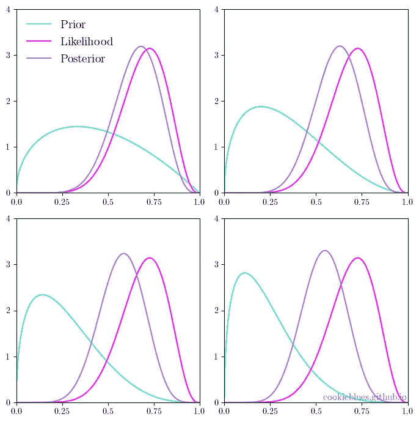

说明我们的先验知识如何影响我们的后验知识。图片作者。

# 内容

这篇文章是我将要发表的一系列文章的一部分。你可以通过点击[这里](https://cookieblues.github.io/guides/2021/03/15/bsmalea-notes-1c/)在我的个人博客上阅读这篇文章的更详细版本。下面你可以看到该系列的概述。

## 1.机器学习导论

*   [(一)什么是机器学习？](/what-is-machine-learning-91040db474f9)
*   [(b)机器学习中的模型选择](/model-selection-in-machine-learning-813fe2e63ec6)
*   [(c)维度的诅咒](/the-curse-of-dimensionality-5673118fe6d2)
*   **(d)什么是贝叶斯推理？**

## 2.回归

*   [(a)线性回归的实际工作原理](/how-linear-regression-actually-works-theory-and-implementation-8d8dcae3222c)
*   [(b)如何使用基函数和正则化改进您的线性回归](/how-to-improve-your-linear-regression-with-basis-functions-and-regularization-8a6fcebdc11c)

## 3.分类

*   [(a)分类器概述](/overview-of-classifiers-d0a0d3eecfd1)
*   [(b)二次判别分析(QDA)](/quadratic-discriminant-analysis-ae55d8a8148a#204a-71584f33e137)
*   [(c)线性判别分析](/linear-discriminant-analysis-1894bbf04359)
*   [(d)(高斯)朴素贝叶斯](/gaussian-naive-bayes-4d2895d139a)

# 频率主义和贝叶斯主义的区别

正如本系列第一篇[中提到的，机器学习主要关注预测，可以想象，预测非常关注概率。在这篇文章中，我们将探讨概率的两种主要解释:频率主义和贝叶斯主义。](/what-is-machine-learning-91040db474f9)

概率的频率主义(或经典)定义是基于事件的频率，而概率的贝叶斯定义是基于我们对事件的了解。在机器学习的背景下，我们可以将这种差异解释为:数据所说的与我们从数据中知道的。

## 类比:手机丢在哪里了？

为了理解这意味着什么，我喜欢用[这个类比](https://stats.stackexchange.com/questions/22/bayesian-and-frequentist-reasoning-in-plain-english/56#56)。假设你把手机丢在家里的某个地方了。你用你朋友的电话打电话给你的手机——当它打电话的时候，你的手机开始响(它不是振动的)。**你如何决定，在家里的什么地方找你的手机？**

常客会用他们的耳朵来识别声音最可能来自的区域。然而，贝叶斯也可以使用他们的耳朵，但除此之外，他们还会回忆起他们以前在家里的哪些地方丢失了手机，并在推断去哪里找手机时将这一点考虑在内。

频率主义者和贝叶斯都使用他们的耳朵来推断在哪里寻找手机，但是贝叶斯也将关于丢失手机的**先验知识**结合到他们的推断中。

# 贝叶斯定理

为了利用贝叶斯理论，我们需要谈谈**贝叶斯定理**。假设我们有两组结果 *A* 和 *B* (也称为事件)。我们分别表示每个事件的概率 *P(A)* 和 *P(B)* 。两个事件的概率用联合概率 *P(A，B)* 来表示，我们可以用条件概率来扩展它

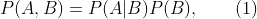

即 *A* 给定 *B* 的条件概率和 *B* 的概率给我们的是 *A* 和 *B* 的联合概率。因此

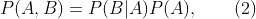

也是。因为(1)和(2)的左边是相同的，所以我们可以看到右边是相等的

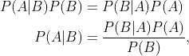

这就是贝叶斯定理。这对你来说应该很熟悉——如果不是，我建议你在继续学习之前先阅读一些概率论的基础知识。

这可能不是很清楚，为什么这在机器学习中如此重要，所以让我们用一种更“数据科学”的方式来写贝叶斯定理:

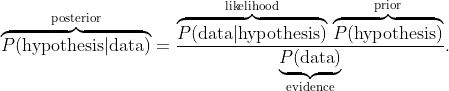

证据(上面的分母)确保左侧的后验分布是有效的概率密度，并被称为[归一化常数](https://en.wikipedia.org/wiki/Normalizing_constant)。因为它只是一个归一化常数，所以我们经常用文字表述这个定理

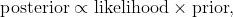

其中∝表示“成比例”。

# 例子:抛硬币

我们从[开始，一个简单的例子](https://www.behind-the-enemy-lines.com/2008/01/are-you-bayesian-or-frequentist-or.html)，我认为它很好地说明了频率主义者和贝叶斯方法之间的区别。考虑以下问题:

> 一枚硬币以概率θ正面朝上，以概率 1θ反面朝上(其中θ未知)。你掷硬币 11 次，结果是正面朝上 8 次。现在，你打赌接下来的两次投掷会正面朝上吗？

设 *X* 是代表硬币的随机变量，其中 *X=1* 是正面， *X=0* 是反面，这样 *P(X=1)=θ* 和*Pr(X = 0)= 1-θ。*再者，让 *D* 表示我们的数据(8 头，3 尾)。

现在，**我们要估计参数 *θ*** 的值，这样就可以计算出连续看到 2 个头的概率。如果概率小于 0.5，我们将打赌不会连续看到 2 个头，但如果高于 0.5，我们就赌。

那么一个常客和贝叶斯会怎么做呢？

## 频繁主义方法

**作为频率主义者，我们希望最大化可能性**，也就是问这样一个问题:给定 *θ* ，什么样的 *θ* 值将最大化我们得到 *D* 的概率，或者更正式地说，我们希望找到

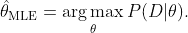

这就是所谓的[最大似然估计](https://en.wikipedia.org/wiki/Maximum_likelihood_estimation)。

**11 次抛硬币遵循二项分布**，其中 *n=11 次*尝试， *k=8 次*成功， *θ* 成功的概率。使用二项式分布的可能性，我们可以找到使数据概率最大化的 *θ* 的值。因此，我们希望找到最大化的 *θ* 的值

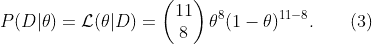

注意，(3)表示给定 *D* 的 *θ* 的*可能性*，和说给定 *D* 的 *θ* 的概率不一样。下图显示了我们的似然函数 *P(D∣θ)* (作为 *θ* 的函数)和最大似然估计。

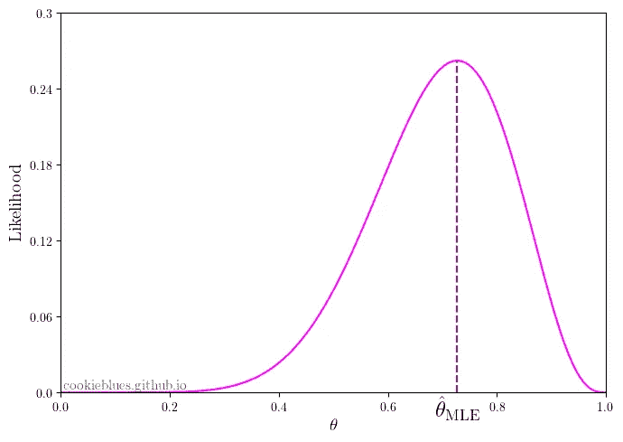

可能性函数 *P(D∣θ)的图示，在最大可能性估计处有一条垂直线。*图片作者。

不出所料，使可能性最大化的 *θ* 的值是 k/n，即试验中成功的比例。因此，最大似然估计为 k/n = 8/11 ≈ 0.73。

假设抛硬币是独立的，我们现在可以计算连续看到两个头的概率:

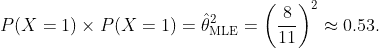

既然连续看到 2 个头的概率大于 0.5，**我们就赌**！

## 贝叶斯方法

**作为贝叶斯，我们希望最大化后验**，所以我们提出这样一个问题:给定 *D* ，什么样的 *θ* 值会最大化 *θ* 的概率？形式上，我们得到

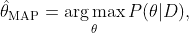

这被称为[最大后验概率(MAP)估计](https://en.wikipedia.org/wiki/Maximum_a_posteriori_estimation)。为了回答这个问题，我们使用贝叶斯定理

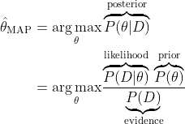

由于证据 *P(D)* 是不依赖于 *θ* 的归一化常数，我们可以忽略它。这给了我们

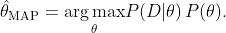

在频率主义方法中，我们已经发现了可能性(3)

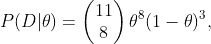

这里我们可以去掉二项式系数，因为它不依赖于 *θ* 。**唯一剩下的就是先验分布 *P(θ)* 。这个分布描述了我们对 *θ* 的初始(先验)知识。**一个方便选择的分布是[贝塔分布](https://en.wikipedia.org/wiki/Beta_distribution)，因为它定义在区间[0，1]上，而 *θ* 是一个概率，必须在 0 和 1 之间。这给了我们

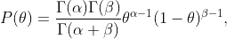

其中γ是[伽马函数](https://en.wikipedia.org/wiki/Gamma_function)。由于分数不依赖于 *θ* ，我们可以忽略它，这样我们就得到

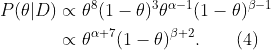

请注意，我们最终得到了另一个 beta 分布(没有归一化常数)。

**现在我们的工作是以这样一种方式设置先验分布，即在看到数据之前，我们结合我们所知道的关于 *θ* 的信息。**现在，我们知道硬币通常是相当公平的，如果我们选择 *α=β=2* ，我们会得到一个比 *θ=0* 或 *θ=1* 更倾向于 *θ=0.5* 的β分布。下图显示了该先验 Beta(2，2)、归一化似然性以及由此产生的后验分布。

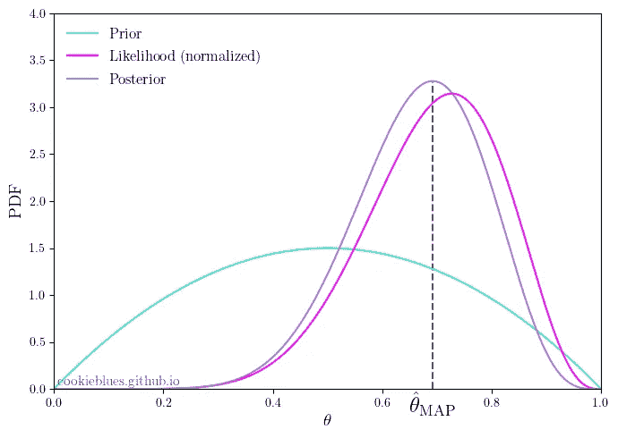

先验 *P(θ)* 、似然 *P(D∣θ)和后验分布 P(θ | D)的图示，在最大后验估计值处有一条垂直线。*图片作者。

我们可以看到**后验分布最终被拉向前验分布**，这使得 MAP 估计与 MLE 估计略有不同。事实上，我们得到了

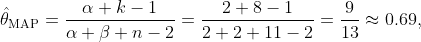

这比最大似然估计值低一点——如果我们现在使用地图估计值来计算连续看到两个头的概率，我们会发现**我们会赌它不赢**

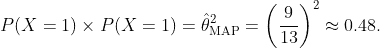

此外，如果我们选择 *α=β=1* ，我们会得到贝塔分布是均匀分布的特殊情况。**在这种情况下，我们的 MAP 和 MLE 估计是相同的，**而且我们做了同样的赌注。下图显示了不同的 *α* 和 *β值的先验、似然和后验概率。*

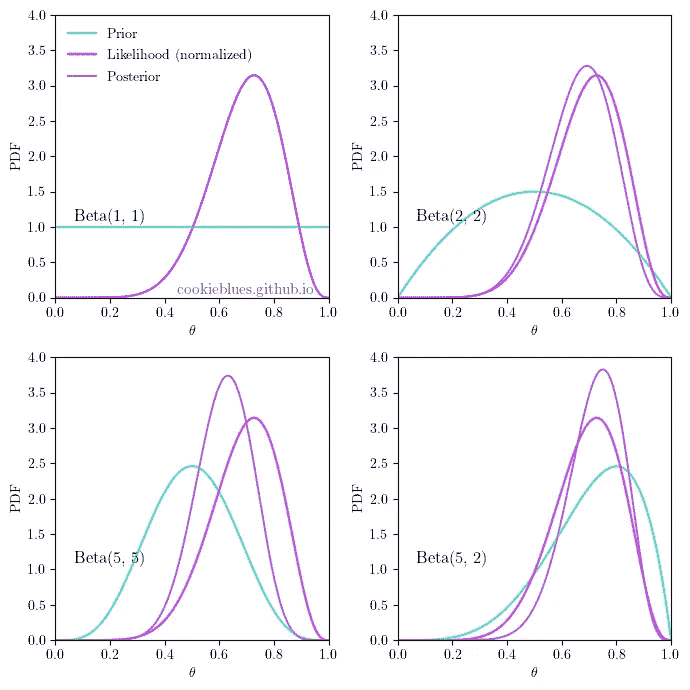

作为改变 *α* 和 *β的结果的先验和后验分布图。*图片作者。

## 完全贝叶斯方法

虽然我们在之前的方法中包括了先验分布，但我们仍然**将分布折叠成点估计**，并使用该估计来计算连续两个头的概率。在真正的贝叶斯方法中，我们不会这样做，因为我们不只是对 *θ* 有一个单独的估计，而是一个整体分布(后验)。

让 *H* 表示连续看到两个头的事件——然后我们问:**给定数据**，即 *P(H∣D)* ，看到两个头的概率是多少？

要回答这个问题，我们首先需要找到(4)中后验分布的归一化常数。因为它是一个贝塔分布，我们可以看(4)并且看到它一定是

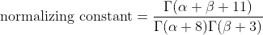

像前面一样，我们也假设掷硬币是独立的，这意味着连续看到两个正面的概率(给定 *θ* 和数据 *D* )正好等于看到正面平方的概率，即 *P(H∣θ，D)=θ* 。

我们现在可以通过“积分出” *θ* 来回答这个问题

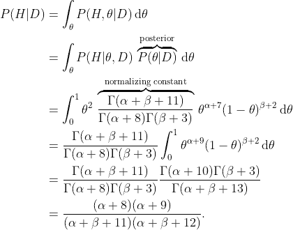

在这种情况下，如果我们选择一个均匀先验，即 *α=β=1* ，我们实际上得到 45/91≈0.49，**所以即使我们选择一个均匀先验**，我们也会下注。其原因更加复杂，并且与均匀先验不是完全不可知的有关。

此外，我们还做了一个隐含的决定，不更新我们预测的两次投掷之间的后验分布。你可以想象，在第一次投掷硬币后，我们将获得关于硬币公平性的知识(关于 *θ* ，我们可以用它来更新我们的后验分布。然而，为了简化计算，我们没有这样做。

# 摘要

*   **频率主义**基于**事件**的频率。
*   **贝叶斯主义**基于**我们对事件**的了解。
*   在之前的**代表你在看到数据**之前**对参数的了解。**
*   **似然**是参数的数据给定值的**概率。**
*   **后验**是给定数据时参数的**概率。**
*   **贝叶斯定理联系了先验、似然和后验分布**。
*   **MLE 是最大似然估计**，这是 frequentists 用的。
*   **MAP 是最大后验估计**，这是贝叶斯人用的。