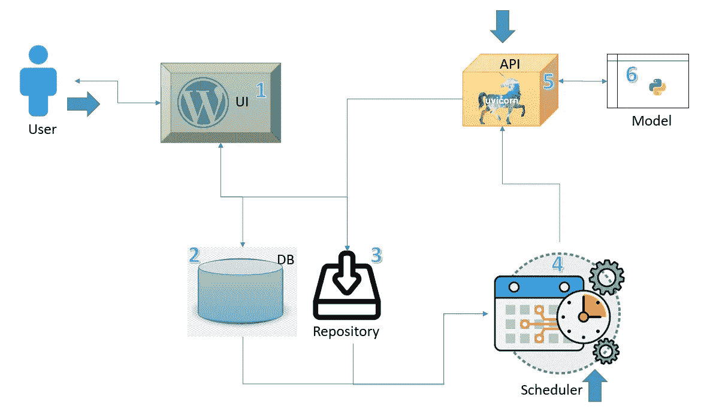
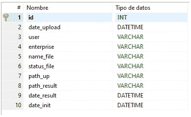

# 什么超出了我们的模型？

> 原文：<https://towardsdatascience.com/what-is-beyond-our-model-23b1354e905b?source=collection_archive---------67----------------------->

## 我们探索一个完整软件解决方案的架构:部署一个 Python 模型，从用户界面到与模型的连接并获得结果。


泽维尔·冯·埃拉赫在 [Unsplash](https://unsplash.com?utm_source=medium&utm_medium=referral) 上的照片

# 背景

长期以来，特别是在我们对机器学习挑战领域的探索阶段，我们专注于寻找一种模型，从特定状态的数据开始，可以在我们认为可接受的准确范围内获得结果。
嗯，获取模型的工作领域是如此广泛、复杂，而且本身就很吸引人，以至于我们会忽略软件解决方案中涉及的其他组件。
因此，我们的模型将被另一组问题所包围，这些问题与我们开发的模型本身一样复杂、广泛和有趣，例如:

*   提取和转换数据，以获得与我们开始时相似的数据集
*   模型在生产中的部署
*   数据收集和后续验证，以监控和纠正我们的初始模型。

然后我们会遇到 [ETL](https://es.wikipedia.org/wiki/Extract,_transform_and_load) 、[数据角力](/data-quality-impact-on-the-dataset-7dab41d36f8a)和 [MLOps](https://en.wikipedia.org/wiki/MLOps) 的字段。
作为数据科学家，仅仅找到能够解决挑战的模型已经不够了；我们至少要考虑所有这些相关领域的可行性。
让我们假设我们设法保护了数据收集管道。
假设我们在特征工程管道中保护自己免受新案例或异常数据的影响。
让我们假设我们获得了一种有效的方法来将其投入生产并存储数据集，并且我们可以监督模型行为。
唉！似乎我们已经计划好了一切。对吗？

**大概不会！**

可能我们缺少与用户交互的软件来展示预测结果。有时我们的模型会与复杂的环境联系起来。需要在它们之间创建一个 API，以便模型可以显示其结果；有时有必要开发软件来使用我们的模型。
本文将在一个测试案例中呈现一个完整的解决方案；所使用的组件和工具可以根据任何其他类型的语言、库和架构而改变。

# 使用案例

我们从一个用 Python 开发的模型开始，它接收一个 CSV 并返回一个 Excel 文件，添加一个包含预测结果的列。

我们需要在服务器中部署这种模型，并开发一个用户界面:

*   登录用户
*   允许用户从任何来源选择适当格式的 CSV 文件，并将其上传到模型。
*   向用户显示一个面板，显示所有上传的文件及其状态(已处理、失败、进度)。
*   当模型完成处理时通知用户。

此外，我们将把模型封装在 API 中，由其他软件作为服务调用。

# 溶液结构

提议的解决方案由六个组件和三个接入点组成。

**组件按外观顺序排列:**
1)用户界面(WordPress + PHP)
2)数据库(MySQL)
3)服务器中的存储库，用于存储输入和输出数据集
4)调度程序(cronJob)用于调度待处理作业的搜索并调用模型
5)用于模型执行的 API(Pyhton—uvicone—Starlette)
6)Python 中的机器学习模型

**系统的访问点有:**
a)用户，当向应用程序上传新数据集时
b)调度程序，当检测到要处理的作业时
c)具有正确凭证的某人想要专门调用模型的 API 来直接处理数据库中注册的数据集。



作者图片

这个想法是用户通过界面上传一个 CSV 文件进行处理。
组件 1 允许并控制 CSV 是否正确。它将数据库中的作业保存为“待定”状态，并将数据集存放在输入存储库中。
然后，调度程序每隔“x”次检查一次是否有未完成的作业，接受它，并改变到“进行中”状态，调用调用模型的函数。流程的结果存储在输出存储库中，将任务的状态更新为“已处理”
从用户面板(第 1 点)中，您可以检测有错误的作业，将其从作业列表中删除、存档或重试。

# 组件

## 1 —用户面板

用户面板在 Wordpress 中开发，通过一个插件访问和管理用户:


作者图片

访问后，该面板有一个标题，用户可以在其中选择一个在其结构中经过验证的数据集，然后将其作为待定项加载到数据库中，并将其留在输入存储库中。

## 2 —数据库



作者图片

选择的数据库是 MySQL

记录任务的表“wp_records”具有以下结构

## 3 —数据存储库

输入和输出存储库是服务器上定义的两个目录，文件作为任务表中生成的条目保存在其中。
一旦 Python 模型处理数据集并返回一个 CSV 格式的结果，它将保存在输出目录中。

## 4 —调度程序执行

以下代码(process_files)说明了如何处理文件，打开数据库(open_db)，查找是否有处于“待定”状态的任务，如果有，则获取其中的第一个任务并调用预测过程(process_file)。

```
import mysql.connector as mysql
from mysql.connector import Error
from datetime import datetime
from jproperties import Propertiesif __name__ == '__main__':
   result = ''
   try:
      db = open_bd()
      cursor = db.cursor()
      sql_Query = "SELECT id FROM wp_records WHERE status_file='IN PROCESS'"
      cursor.execute(sql_Query)
      records = cursor.fetchall()
      if (len(records) != 0):
          result = 'There are files in progress' + str(records[0][0])
      else:
          sql_Query = "SELECT id FROM wp_records WHERE status_file='PENDING'"
          cursor.execute(sql_Query)
          records = cursor.fetchall()
          if (len(records) > 0):
             id = records[0][0]
             **result = process_file(id)**
      except Error as e:
          result = 'Error ' + e
      finally:
          if (db.is_connected()):
             db.close()
             cursor.close()
             result = result + ' (BD correctly closed)'
```

打开数据库的代码有一个配置文件 ConfigFile.properties，其中定义了数据库和访问凭据。

```
def open_bd():
   configs = Properties()
   with open('ConfigFile.properties', 'rb') as config_file:
      configs.load(config_file)
      host = configs.get("HOST")[0]
      user = configs.get("USER")[0]
      pass = configs.get("PASSWORD")[0]
      database = configs.get("DBNAME")[0]

      db = mysql.connect(
           host = host,
           user = user,
           passwd = pass,
           database=database)
      return db
```

处理特定文件的代码(数据库 id 可能是这样的):

```
**def process_file(prm_id):**
   os.environ['TZ'] = 'America/Montevideo'
   time.tzset()
   resultado = ''
   try:
      db = open_bd()
      cursor = db.cursor()
      sql_Query = "SELECT path_up FROM wp_records WHERE id=%s"
      id = (prm_id,)
      cursor.execute(sql_Query, id)
      record = cursor.fetchone()
      input_file = str(record[0])
      upd_Query = "UPDATE wp_records SET status_file = 'IN PROGRESS',date_init=%s WHERE id=%s"
      today = datetime.today()
      params = (str(today),prm_id,)
      cursor.execute(upd_Query, params)
      db.commit()
      outfile = ''
      **output_file = predictions.prediction(input_file)**
      today = datetime.today()
      upd_Query = "UPDATE wp_registros SET status_file='PROCESS OK',path_result = %s,date_result=%s WHERE id=%s"
      params = (output_file,str(today),prm_id,)
      cursor.execute(upd_Query, params)
      db.commit()
      resultado = 'OK - File was created [' + output_file + ']'
   except Error as e:
      result = 'Error ' + e + ' processing id ' +  prm_id
   finally:
      if (db.is_connected()):
         db.close()
         cursor.close()
         result = result + ' (BD closed)'
         return result
```

## 5—uv icon 和 Startlette API

下面是使用 Uvicorn 和 Starlette 开发 API 的 Python 代码，必须安装(使用 pip install)。

在我们的 API 中，我们部署了三种方法:

*   **/** 验证服务器正在运行，我们的 API 正在工作
*   **/process_file？id=id_base_data** 是一个处理某个文件的方法，我们必须通过参数传递与要处理的文件相对应的任务表的 id(记住，在组件 1 中创建了这个表中的条目，并将数据集下载到存储库中)
*   没有参数的 **/process_all** 用于搜索斜率的所有条目并进行处理。

```
from starlette.applications import Starlette
from starlette.responses import JSONResponse
import uvicorn
import connect
import pendings
from datetime import datetimeapp = Starlette(debug=True)
@app.route('**/**')
async def homepage(request):
   return JSONResponse({'MySAMPLE': 'It works!'})@app.route("**/process_file**", methods=["GET"])
   async def process_file(request):
   elid = request.query_params["id"]
   before = datetime.today()
   **result = connect.process_file(elid)**
   after = datetime.today()
   return JSONResponse({
      "resulta": result,
      "Start" : str(before),
      "End" : str(after)})@app.route("**/process_all**", methods=["GET"])
async def process_all(request):
   before = datetime.today()
   **result = pendings.process_files()**
   after = datetime.today()
   return JSONResponse({
      "result": result,
      "Start" : str(before),
      "End" : str(after)})if __name__ == '__main__':
   **uvicorn.run(app, host='0.0.0.0', port=8000)**
```

通过斜坡运行的代码和处理第 4 项中指定的文件的代码

## Python 模型

该模型在应用程序的另一个模块中，因此没有在本文中显示，因为我们的目的不是在这里详述它。

# 摘要

与之前的文章不同，我们专注于解决特定机器学习挑战的工具和方法，这一次，我们展示了另一部分工作，也许没有那么吸引人，但对于将用例的解决方案转换为完整的解决方案来说是必不可少的。

当然，每个解决方案的架构都是根据问题、客户的现有结构、我们对每个实例的工具的了解或补充我们团队的人员来定义的。

每个阶段都有许多库和工具。

> **简而言之:谈论与模型相关的其他方面，这些方面可能是完整解决方案所必需的。**