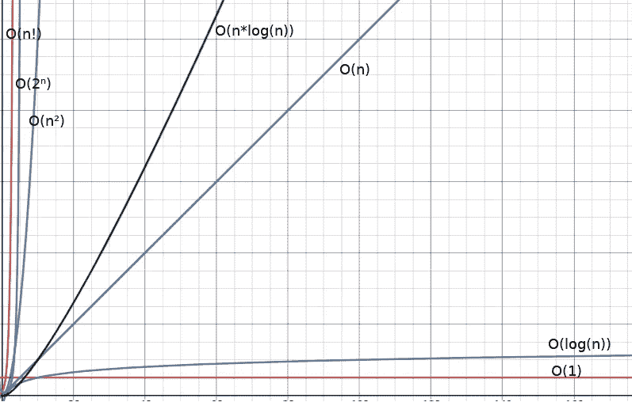
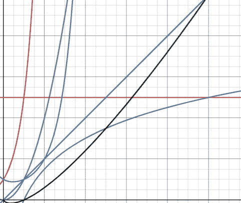

# 什么是大 O 符号，为什么要关注它

> 原文：<https://towardsdatascience.com/what-is-big-o-notation-and-why-you-should-care-5638895a1693?source=collection_archive---------14----------------------->

## 根据您的具体情况，选择最有效的算法来处理您的数据。

由[少年赖斯](https://unsplash.com/@juniorreisfoto?utm_source=medium&utm_medium=referral)在 [Unsplash](https://unsplash.com?utm_source=medium&utm_medium=referral) 拍摄的照片

作为程序员，在开始一个复杂的项目之前，我们经常要做一些原型制作。在这个过程中，我们可能没有写出最有效的代码，但这没关系:更重要的是在尽可能短的时间内达到工作状态。然而，不可避免的是，开始为项目想法的可部署实现编码的时候到了。这意味着可能遗留下来的技术债务现在必须解决。

此外，如果你是一名数据科学家，你经常会发现自己同时处理大量的信息。由于处理大量数据是一项资源密集型且耗时的操作，因此找到解决该问题的最有效方法至关重要。在本文中，我将带您了解大 O 符号及其应用。

## 在选择算法之前

给定一个问题，有无数种可能的方法来解决它。虽然，只有少数是真正好的。你如何在算法 A 和算法 B 之间做出选择？你得先分析问题。

*   你的代码必须每秒运行多次吗？
*   您计划将您的系统扩展到什么程度？
*   您将处理什么类型的数据？

万一你的程序一次又一次地调用相同的函数，你肯定需要确保它们不会成为整个系统的瓶颈。在这种情况下，即使是很小的速度提升也会产生不同。例如，假设你为你的物理引擎写了一个函数`check_collisions()`,运行它需要 20 毫秒。每秒只能计算大约 50 个物理帧。想象一下现在你已经节省了 3 毫秒的执行时间，那已经是每秒 59 帧了。

可伸缩性是另一个需要考虑的重要因素。如果您的应用程序必须处理越来越多的数据，您最好选择一种能够在合理的时间内处理数据并且不需要过多内存的算法。

谈到数据，您是否针对您的具体问题使用了合适的类型和结构？你可以通过预先知道你正在处理的数据来节省大量的内存。例如，如果存储一个人的年龄，就不必使用 4 字节有符号整数。最好只使用一个无符号字节，因为年龄永远不会为负，也不会超过 255 年(单个字节中可以存储的最大数字)。

那么，如何比较不同算法的性能呢？这就是大 O 符号派上用场的地方。

## 什么是大 O 记数法？

来自[维基百科](https://en.wikipedia.org/wiki/Big_O_notation)，大 O 符号是一种数学符号，它描述了当自变量趋向某个特定值或无穷大时，函数的[极限行为](https://en.wikipedia.org/wiki/Asymptotic_analysis)。在计算机科学中，大 O 符号用于根据算法的运行时间或空间需求如何随着输入大小的增长而增长来对算法进行分类。换句话说，它测量一个函数的[时间](https://en.wikipedia.org/wiki/Time_complexity)或[空间](https://en.wikipedia.org/wiki/Space_complexity)复杂度。这意味着，我们可以提前知道算法在特定情况下的表现。

在开始编写代码之前，在计算算法的时间或空间复杂度时，需要遵循以下简单规则:

1.  将你的算法分成单个操作或函数。
2.  计算每个操作的复杂度。
3.  把产生的大 Os 加起来。
4.  移除任何常数和低阶项。只保留最高阶项(增长最快的项)，这将是你的算法的大 O。

为了更清楚，让我们看一些具体的例子。对于代码示例，我将使用 Python，因为它有简单的类似英语的语法，任何人都可以理解。此外，我将重点关注时间复杂性，而不是空间复杂性，以保持文章更加简洁。无论如何，同样的规则也适用，所以对我来说详细谈论它似乎有点多余。

## 恒定时间复杂度

让我们从大 O 符号中的简单情况开始，恒定时间复杂度。看一下这段代码:

完成此计算所需的时间不取决于输入大小。如果数字是 2、60、100 或 1000，运行时间不会增加或减少，至少不会显著增加。使用大 O 符号将其分类为 ***O(1)*** ，意味着它具有恒定的时间复杂度。

这同样适用于这个代码片段。改变`input_number`不会影响算法的性能。所有运算之和是***O(1+1+1+1+1+1)***或***(6)***，但可以近似为刚好是 ***O(1)*** ，因为 6 是常数。当然，它的执行时间要比前一个例子长，但是大 O 并不测量完成某个任务所花费的精确时间。大 O 是关于衡量算法的性能变化与不断增长的输入大小的关系。

数学运算、赋值、逻辑语句和函数调用都近似于 ***O(1)*** ，除非它们的实现也依赖于输入大小。以下是被视为时间常数的常见操作列表:

*   算术运算:`a + b, a — b, a * b, a++ ...`
*   变量赋值:`a = 2, a += 3, a -= 4 ...`
*   数组索引:`a[0], a[i] ...`其中`a`是一个数组，`i`是一个整数。
*   函数调用:`foo(), bar(arg) ...`只要它们的运行时间不明显依赖于输入大小。
*   逻辑语句:`a && b, a and b, !a, not a, a || b, a or b ...`
*   成员访问:`a.member, a.foo() ...`
*   按位运算:`a << b, a | b, a & b, a >> b ...`

[哈希表](https://en.wikipedia.org/wiki/Hash_table)也索引分数，平均起来，***【O(1)***像数组。尽管如此，在极少数情况下他们能达到 ***O(n)*** 。

## 迭代时间复杂度

假设您必须迭代数组中的每个元素，例如计算某个特定值出现的次数。

完成任务所需的时间取决于数组元素的数量`n`，准确地说是成正比的。这种算法的时间复杂度可以归为 ***O(n)*** ，意思是随着`n`的增加，运行时间线性增加。

我们可以忽略`for`循环中的`if`语句，因为它的时间复杂度 ***O(1)*** 并不强烈依赖于输入大小。注意，它的性能取决于要比较的字符串的长度，但它没有`array`的长度重要，因此可以忽略。请记住，大 O 是在输入大小趋于无穷大时给出算法行为的近似值，而不是精确的测量值。

## 不断嵌套迭代，指数时间复杂度

假设您必须多次迭代一个数组，例如计算长度为两个字符的所有可能的密码组合，并且只使用从 0 到 9 的数字。

这种算法的运行时间显然取决于可能的字符数。准确地说，它生成了 *n 个*组合，其中`n`是可能的字符数。如果再添加一个字符，程序将不得不在数组`n`上迭代更多次。这种方法的时间复杂度得分为 ***O(n )*** 。

如果您要添加更多的`for`循环来增加密码的长度，时间复杂度将是***【o(nᶩ】***，其中`n`是`for`循环的数量，`l`是可用字符的数量。比如三圈得分 ***O(n )*** ，四圈得分***【o(n⁴】***等等。

语句`combinations.append(char1 + char2)`通常可以近似为时间复杂度为 ***O(1)*** ，尽管其运行时间也可能受到输入大小的影响，这取决于函数的实现。说到 Python 的列表，[它们实际上是动态数组](https://docs.python.org/3/faq/design.html#how-are-lists-implemented-in-cpython)，所以它们必须随着增长而调整大小。反正这个话题不在本文讨论范围内，我就不多讲了。

## 在两个阵列上迭代，线性时间复杂度

假设您现在必须迭代两个数组，以找出它们有多少共同的元素。

该算法的时间要求还取决于要检查的元素的数量`n`。对于一个数组中的每个元素，它必须遍历所有其他数组。例如，如果我们向`array1`添加元素，程序将不得不再次迭代`array2`的每个元素。

由于迭代的总次数是第一个数组的长度乘以第二个数组的长度，将一个元素添加到一个数组中会使迭代次数增加另一个数组的长度，因为`f(a,b) = a*b`的[偏导数](https://en.wikipedia.org/wiki/Partial_derivative)相对于`a`是`b`，相对于`b`是`a`。这个算法的大 O 符号应该是 ***O(a*b)*** ，但是通过将两个数组中的一个数组的长度视为常数，可以简化为 ***O(n)*** 。

如前所述，在计算时间复杂度时，可以忽略`if`语句和`counter`的增量，因为它们不依赖于输入大小。

## 嵌套迭代，指数时间复杂度

在给定可变密码长度的情况下，以下算法为给定的字符集生成所有可能的密码组合。

设`n`为密码长度，`k`为可用字符的常量，该程序执行 *n*kⁿ* 迭代。这是因为对于外层`for`循环的每一次 *kⁿ* 迭代，`n`其他迭代由内层`for`循环执行。其他操作可以忽略。

迭代次数的导数 *n*kⁿ* 为 *kⁿ+kⁿ*n*log(k)* ，但可以近似为***【o(n*kⁿ】***，常写成***【o(n*2ⁿ】****随着输入大小向无穷大增长。*

## *对数时间复杂度*

*现在让我们来看一个非常流行的算法:[二分搜索法](https://en.wikipedia.org/wiki/Binary_search_algorithm)。给定一个排序数组，它查找指定元素的索引(如果存在)。*

*二分搜索法的工作原理是在每次迭代中丢弃数组的一半。不管给定数组的大小如何，这种方法都减少了要快速搜索的元素。它在时间复杂度上得分为 ***O(log(n))*** ，并且由于其[对数](https://en.wikipedia.org/wiki/Logarithmic_growth)运行时间，当涉及到大输入大小时，它非常有效。*

## *阶乘时间复杂度*

*对于大 O 来说，最糟糕的情况之一是阶乘运行时。以这个简单的代码片段为例:*

*对于这个函数的每次迭代，`factorial`都会被调用多次。这个递归调用导致`for`循环被反复执行，直到`number`达到零。这种算法确实非常慢，尤其是在高输入数的情况下。这个函数的时间复杂度是 ***O(n！)*T6。***

## *如何选择合适的算法*

*当需要解决这个问题时，选择一个合适的算法是很重要的。显然，您应该选择尽可能低的时间复杂度，对吗？其实没那么容易。*

*根据输入大小和具体实现，an ***O(n)*** 甚至可能比 an ***O(1)*** 更快。看一下这张图表:*

**

*常见大 O 符号情况的图表。*

*从长远来看，较低的时间复杂度总是比较高的时间复杂度更有效。然而，如果你打算尽可能地优化你的程序，有一点你应该密切注意，一些性能线重叠。*

**

*常见大 O 符号情况的图表。*

*正如你所看到的，在某个阈值以下，这完全取决于情况，一些在大 O 中得分较低的算法实际上比其他在较大输入大小时可能做得更好的算法更有优势。这就是说，在跳上键盘之前，你应该首先深入分析和相关的环境。根据您必须处理的数据，您的算法的图表在这个级别可能会有所不同。*

## *结论*

*总而言之，为了在这种情况下应用最有效的算法，充分了解您的问题和您的数据是很重要的。当计划构建一个应用程序时，您必须考虑随着用户群和数据的增长它将如何执行，并相应地调整您的代码。*

*不幸的是，没有适合所有目的和情况的工具。优化就是针对特定情况使用最合适的方法，而不是先坚持使用手头的方法。*

> *即使你可以用锤子敲进一颗螺丝钉，你也可以用螺丝刀。*

*我希望你喜欢这篇文章。如果你有问题或者想补充什么，请在评论中分享你的想法。我想知道你的意见。*

***感谢阅读！***