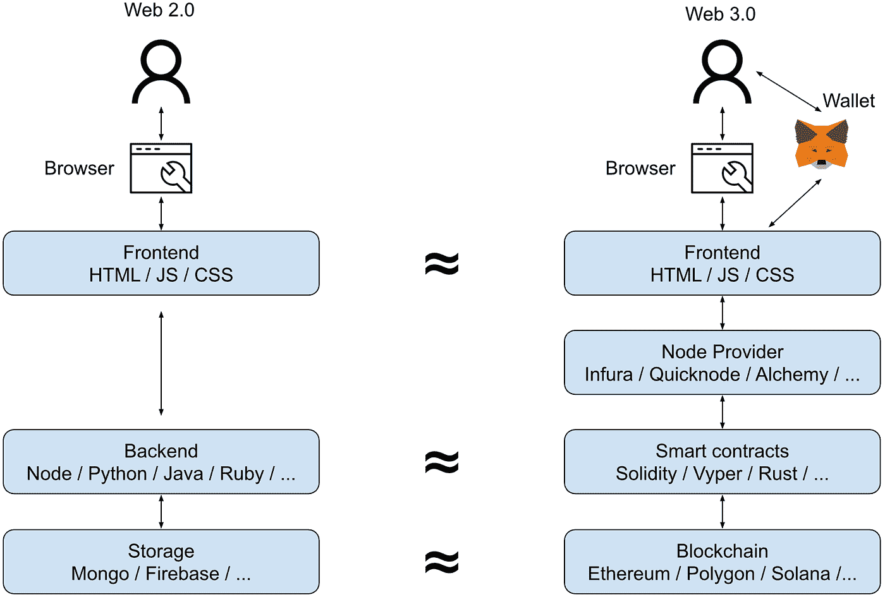
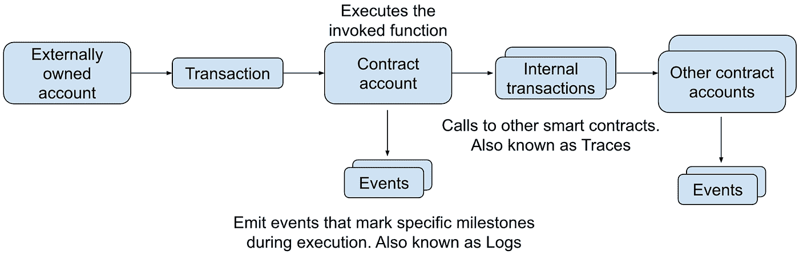
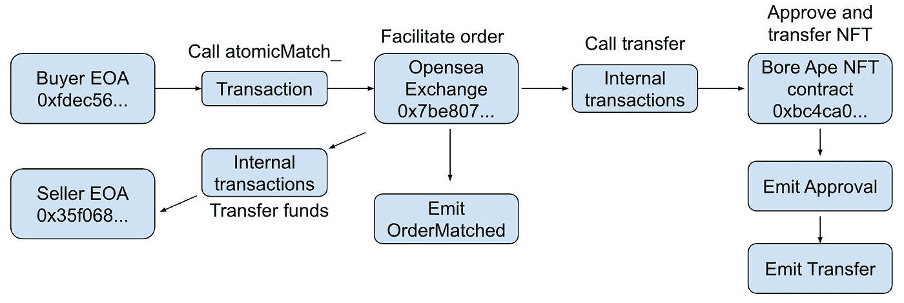
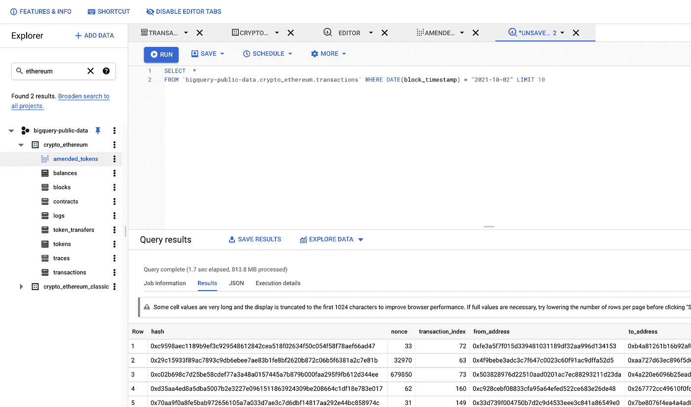

# 什么是加密数据？

> 原文：<https://towardsdatascience.com/what-is-crypto-data-fef70ecadf7b?source=collection_archive---------4----------------------->

## 数据科学从业者实用指南


美国宇航局在 [Unsplash](https://unsplash.com?utm_source=medium&utm_medium=referral) 拍摄的照片

在我的上一篇[帖子](https://yifei-huang.medium.com/why-every-data-scientist-should-pay-attention-to-crypto-39b4c25ff319)中，我认为随着越来越多的消费者加密应用获得关注，越来越多的公开加密数据将从根本上改变下一代产品的竞争和运营方式。有效利用数据资产对于实现这一未来至关重要，而数据科学将发挥关键作用。在这篇文章中，我想提供更多关于加密数据的背景知识——它们在加密应用程序中代表什么，它们看起来像什么，以及如何使用它们[1]。如果你还没有阅读我的上一篇[文章](https://yifei-huang.medium.com/why-every-data-scientist-should-pay-attention-to-crypto-39b4c25ff319)，请考虑这样做，因为它将为这篇文章提供有用的背景。

# Web 2.0 -> Web 3.0

在深入研究数据之前，了解一下分散式加密(有时称为 web 3.0)应用程序是什么样子以及它与 web 2.0 应用程序有什么不同是很有用的。在传统的 web 2.0 应用程序中，用户通过浏览器与应用程序前端进行交互。前端将用户请求翻译成对后端 API 的查询。后端执行必要的计算来满足请求，并将相关数据保存到存储中。



Web 2.0 与 web 3.0 架构的对比—作者图片

在 web 3.0 应用程序中，前端或多或少以相同的方式工作，增加了软件钱包的要求，该软件钱包有助于向区块链网络唯一地标识用户。然而，后端服务器被一个功能类似于分布式虚拟机的分散式区块链网络所取代。用高级语言如 [Solidity](https://docs.soliditylang.org/en/v0.8.9/) 编写的智能合同存在于这个虚拟机上，充当后端 API。借助区块链网络上的节点(通常通过节点即服务提供商访问)，前端以事务的形式向这些智能合约广播用户请求，智能合约在虚拟机上执行调用的逻辑。完成后，交易细节和状态变化以可加密验证的方式保存在区块链分类帐中。

在一个公认的简化视图中，人们可以将区块链虚拟机视为后端服务器，智能合约视为后端 API，区块链总账视为存储[2]。然而，在 Web 3.0 架构中有两个关键的区别值得强调

1.  与传统的后端 API 不同，智能合约是分散的，可以公开访问。网络上的任何人都可以看到代码，并在其上构建新的智能合约或前端。没有哪家公司能像脸书那样控制对智能合约的访问。这有时被称为智能契约的可组合性。
2.  每一个后端 API 调用(即交易)都以可验证和有效不变的方式发布在区块链账本上。每个事务记录都包含关于特定请求和结果状态变化的详细元数据。这种级别的透明性代表了 web 2.0 应用程序的范式转变，也是加密数据如此引人注目的原因。

# 交易的剖析

事务对于加密应用程序的工作方式和创建的数据至关重要，因此准确定义它们的工作方式非常重要。在更广泛的区块链网络环境中，事务是改变区块链虚拟机状态的原子活动单元。有 3 种不同类型的交易:

1.  一个外部拥有的账户(EOA)以基础货币形式向另一个账户转移价值，例如 Emily 在以太网上向 Bob 3 ETH 汇款
2.  由 EOA 创建智能合约，例如，Emily 向区块链上的地址提交代码，创建智能合约，使用户能够与 BTC 交换 ETH
3.  通过 EOA 调用智能合约，例如，鲍勃调用艾米丽的智能合约以用 15 个以太网交换 1 个 BTC

所有交易必须由外部拥有的账户(EOA)发起，该账户是唯一的区块链地址，由私钥控制。这通常代表人类用户，但有时也可能是机器人。智能合约一旦创建，也只是拥有唯一区块链地址的账户。智能合约帐户和 EOA 之间的唯一区别在于，智能合约帐户由合约代码控制，而不是由私钥控制。

交易的一个显著特点是，它们需要向网络(或者更准确地说是矿工节点)支付称为天然气费的费用。对于区块链网络上的气体，一个有用的类比是实际的汽油。正如汽车需要汽油作为动力一样，区块链网络也需要汽油来运行代码。汽油的数量是以公升等体积单位来衡量的，而单位价格是以美元等法定货币来衡量的。以太坊气是以称为气的数量单位来计量的，而每单位的价格是以卫来计量的，这是以太坊的 1/10^18th。当发起交易时，EOA 必须指定它愿意为执行交易向网络支付的天然气量。如果指定的数量不足，则事务将失败，所有分段状态更改将被还原。这有两个主要功能

1.  激励 miner 节点参与并在网络上运行代码。天然气价格根据计算能力的供应和需求而波动，类似于乘车共享中的激增定价概念
2.  打消那些想要向网络发送垃圾邮件的不良分子的动机

当用户在加密应用程序中发出请求时，会发生以下情况:

1.  与用户相关联的 EOA 发起指定目标智能合同地址、目标功能、该功能的自变量、交易支付(如果有的话)以及它愿意支付的燃气费的交易
2.  交易被广播到网络，并由执行目标智能合约中的指定功能的有意愿的矿工拾取
3.  如果执行成功，智能协定将发出标志着某些里程碑完成的事件。由此产生的事件数据结构称为*日志*。
4.  目标智能合约可以启动对其他智能合约的内部事务(附加调用)。这些内部事务创建称为*跟踪*的数据结构，并且还可能在它们各自的执行过程中发出额外的日志事件。



智能合同交易-作者图片

为了更具体地说明这一点，让我们仔细看看在 [Opensea](https://opensea.io/) 交易所智能合约上购买[无聊猿 NFT](https://boredapeyachtclub.com/#/) 的交易示例



一笔[交易](https://etherscan.io/tx/0xfd2d4e8c5037b2f20a80105d2f7c68f66e7e704fc2836320614f7fcc057ac930/advanced)以 40.4 ETH(约 14.4 万美元)的价格购买了一只[无聊的猿 NFT](https://opensea.io/assets/0xbc4ca0eda7647a8ab7c2061c2e118a18a936f13d/7357)——图片由作者提供

在此交易中:

1.  买方 EOA 通过调用 Opensea 交易所智能合约中的`atomicMatch_`函数来启动交易
2.  交换合同验证订单出价与卖方的要价相匹配，然后发出表示订单被确认的`OrderMatched`事件
3.  交换合同启动 Bored Ape NFT 合同的内部交易，将 NFT 从卖方转移到买方，交易完成后，该交易又发出一个`Approval`和一个`Transfer`事件
4.  交换合同然后启动另一个内部交易，以将由买方 EOA 在启动原始交易时支付的资金转移到卖方 EOA

在此序列完成后，事务处理、内部事务处理的跟踪以及事件的日志都将保存到区块链分类帐中。正如这个例子所希望阐明的那样，来自交易的数据耗尽提供了关于加密应用程序内部工作方式及其促进的经济活动的非常精细的细节。

# 数据结构

现在我们已经了解了加密应用程序创建的数据元素，以及它们在现实中代表的内容，让我们来看看这些数据是什么样子的。事务和跟踪数据结构包含智能合约函数调用的细节，特别是

*   `hash`:交易的唯一标识
*   `from_address`:起始 EOA 地址
*   `to_address`:目标智能合约地址
*   `input`:目标函数和该函数参数的十六进制编码表示
*   `value`:交易价值或付款

示例交易

```
**hash**: 0xfdf4e500eeefa5b12d773fb74d55c4bbfc92a4297cddc8f85b937978a3fc6477**nonce**: 232**transaction_index**: 19**from_address**: 0xfc7396fc573e916dc0d7203b0f087ffc46882c17**to_address**: 0x7be8076f4ea4a4ad08075c2508e481d6c946d12b**value**: 0E-9**gas**: 74902**gas_price**: 52545827339**input**: 0xa8a41c700000000000000000000000007be8076f4ea4a4ad08075c2508e481d6c946d12b000000000000000000000000fc7396fc573e916dc0d7203b0f087ffc46882c170…**receipt_cumulative_gas_used**: 1242267**receipt_gas_used**: 74902**receipt_contract_address**: None**receipt_root**: None**receipt_status**: 1**block_timestamp**: 2021–08–10 04:18:55**block_number**: 12995203**block_hash**: 0x7ca2ff7158d7a40997a5230e39f8d96ad17cf59ced6b27a3288653f9c94ce7a3**max_fee_per_gas**: None**max_priority_fee_per_gas**: None**transaction_type**: None**receipt_effective_gas_price**: 52545827339
```

日志数据结构包含在执行智能合同功能期间发出的事件的细节，特别是

*   `transaction_hash`:事件所属事务的 ID
*   `address`:发出事件的智能合约的地址
*   `topics`:发出事件的函数
*   `data`:事件元数据

示例日志

```
**log_index**: 260**transaction_hash**: 0x2ac3648d5a0a7c1dd58685fabb5c5602add36f1555b1001cb900ea0410ab23db**transaction_index**: 131**address**: 0xff64cb7ba5717a10dabc4be3a41acd2c2f95ee22**data**: 0x000000000000000000000000000000000000000000054e0ee097e3dbdbde51b2000000000000000000000000000000000000000000000000000000000000000000000000000000000000000000000000000000000000000000000000000000000000000000000000000000000000000000000000000000011d65da6b52d881dd**topics**: [‘0xd78ad95fa46c994b6551d0da85fc275fe613ce37657fb8d5e3d130840159d822’,‘0x00000000000000000000000003f7724180aa6b939894b5ca4314783b0b36b329’,‘0x000000000000000000000000e83df6e24de6d5d263f78ad281143f184a6c95eb’]**block_timestamp**: 2021–08–04 06:40:42**block_number**: 12957113**block_hash**: 0x3ea06d9b495dffb2804a5f62ee0182949afac9f82d6ba922567fa3a95efc3d86
```

敏锐的读者会注意到，许多长十六进制的领域对人类并不友好。为了解析出编码信息，我们需要使用一种叫做应用程序二进制接口的东西来解码这些信息。我将在下一篇文章中详细讨论这个问题。

# 用于访问和使用加密数据的工具

既然我们已经很好地理解了加密数据代表什么以及它看起来像什么，那么我们实际上如何访问和使用它呢？幸运的是，有一系列很好的工具可以帮助我们做到这一点。

**块浏览器**

块浏览器是在给定区块链上检查单个事务细节的绝佳资源。block explorers 的创建者已经提取并索引了整个区块链分类账，并创建了快速网络界面来帮助用户轻松查找任何交易。请看下面的截图示例。所有主要的区块链都有探险者——突出的例子包括[以太扫描](https://etherscan.io/)、[多边形扫描](https://polygonscan.com/)、 [BSCScan](https://bscscan.com/) 、[索拉纳海滩](https://solanabeach.io/)


[以太网扫描上的交易示例](https://etherscan.io/tx/0xfdf4e500eeefa5b12d773fb74d55c4bbfc92a4297cddc8f85b937978a3fc6477) —图片来自以太网扫描. io

虽然块浏览器非常适合询问区块链分类帐中的单个记录，但它们不适合回答需要聚合或转换数据的问题。例如，如果您想知道在过去 3 个月中有多少 NFT 通过 Opensea 交易所售出，那么仅用 block explorers 很难回答这个问题。为此，您需要直接访问数据。

**获取数据**

直接访问数据的一种方法是自己查询区块链。Python 和 Javascript 中提供了各种开源实用程序包来帮助简化这一过程。例如

*   对于以太坊区块链和 EVM 兼容链，如 Polygon 和 BSC，您可以使用 [Web3 包](https://web3py.readthedocs.io/en/stable/quickstart.html)。
*   对于索拉纳，你可以使用[索拉纳 Py](https://michaelhly.github.io/solana-py/)

使用这些实用程序库，您将能够以编程方式与感兴趣的区块链进行交互，以查询数据、提交事务，甚至部署智能合同。

也有一些开源项目将上述构件打包成完整的 ETL 管道，帮助您将所有粒度数据下载到自己的环境中。此外，这些项目的所有者还将许多原始数据集发布到 [Google cloud](https://github.com/blockchain-etl/public-datasets) 上的公共数据集，Google cloud 提供了一个相对易用的 SQL 接口来查询数据。



以太坊上的谷歌公共数据集——谷歌大查询

最后但同样重要的是， [Dune analytics](https://dune.xyz/home) 是访问和分析区块链数据的另一个重要资源。在撰写本文时，它同时拥有以太坊、多边形、乐观和 BSC 的原始数据和解码数据。与 Google 上的公共数据集相比，这是一个非常不同的产品，因为解码使得十六进制编码的数据字段可读。它提供了一个 Postgres 界面来查询数据集，并提供了一个简单的点击界面来在查询结果上创建简单的仪表板。Dune 上的用户社区也非常活跃，并且已经生成了大量可供学习的示例查询和仪表盘库。这里有几个我在 Dune 上创建的例子分析

*   [Opensea 交易和用户深度挖掘](https://dune.xyz/yifeihuang/Opensea)
*   [分散交易所交易和用户深度挖掘](https://dune.xyz/yifeihuang/Top-DEXes)

# 关键要点

*   加密数据是 web 3.0 应用程序架构的废气
*   它包含加密应用程序中所有“后端 API 调用”的完整历史，以事务、日志和跟踪的形式
*   这些数据结构包含用户请求和应用程序状态变化的粒度细节
*   有各种免费的工具可以帮助我们访问和分析这个数据宝库

希望这是一个有用的讨论，我已经帮助你对什么是加密数据，它看起来像什么以及如何使用它有了更好的直觉。在我的下一篇文章中，我将提供一个关于如何解码加密数据并使它们更易于阅读的教程，作为对 Opensea 和 Uniswap 等流行加密应用程序进行更深入研究的前奏。如果你想在帖子发布时得到通知，请务必点击电子邮件图标进行订阅。

感谢您的阅读，如果您有任何问题或意见，请随时联系我们。[*Twitter*](https://twitter.com/yifei_huang)*|*[*Linkedin*](https://www.linkedin.com/in/yifeihuangdatascience/)

[1]本次讨论将使用以太坊区块链作为主要参考架构。具体情况可能会有所不同的其他区块链一样，索拉纳，但许多概念将普遍。

[2]这是一个 web 3.0 应用程序的简化示意图，它掩盖了一些实现细节。为了更彻底的回顾，鼓励用户研究这个[优秀的深潜](https://www.preethikasireddy.com/post/the-architecture-of-a-web-3-0-application)。