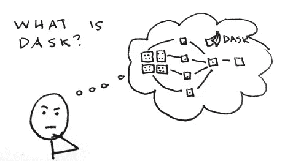
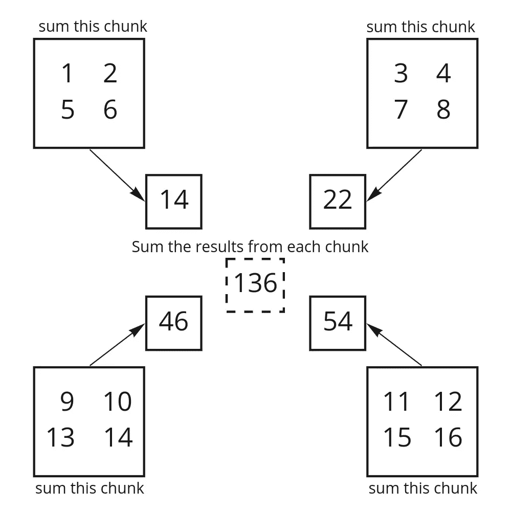
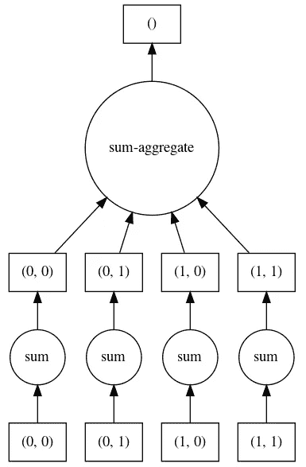

# 什么是 Dask，它是如何工作的？

> 原文：<https://towardsdatascience.com/what-is-dask-and-how-does-it-work-aa99770a31cf?source=collection_archive---------29----------------------->

作者原创作品

## Dask 是一个开源的 Python 库，它可以让你在任意大的数据集上工作，并显著提高你的计算速度。

本文将首先说明 Dask 的特殊之处，然后更详细地解释 Dask 是如何工作的。那么:是什么让达斯克与众不同？

*   熟悉的界面
*   需要时的灵活性
*   Python 一直往下

# 熟悉的界面

*达斯克没有多此一举。*

Python 拥有丰富的数据科学库生态系统，包括数组的 numpy、数据帧的 pandas、nd-data 的 xarray 和机器学习的 scikit-learn。Dask 匹配那些库。

这意味着:

*   你不必学习一组新的参数来传递给`read_csv`
*   开始使用 Dask 时，您不必进行大规模的代码重组。

# 需要时的灵活性

有时，您的数据不能整齐地放入数据帧或数组中。或者可能你已经写了一整段管道，你只是想让它更快。这就是`dask.delayed`的作用。用`dask.delayed`装饰器包装任何函数，它将并行运行。

# Python 一直往下

这个很简单。Dask 是用 Python 写的，为想用 Python 写和用 Python 排错的人运行 Python。

# 它是如何工作的？

有三个主要部分组合在一起，让 Dask 以最少的工作量有效地运行分布式代码。

*   逐块算法在数据碎片上并行运行
*   任务图组织任务并实现优化
*   调度器决定潜在的多节点集群中的哪个工作者获得哪个任务。

# 分块算法

Dask 数组可能看起来像 numpy，Dask 数据帧可能看起来像熊猫，但是每个方法的实际实现都被重写以并行工作。这意味着:

*   您的数据不一定要放入内存。
*   你可以同时操作它的不同部分——这样更快。

# 它是如何工作的

在内部，Dask 数组是一组特定模式的 numpy 数组。Dask 实现了分块操作，因此 Dask 可以单独处理每个数据块，然后将结果组合起来。

让我们考虑一个 4x4 的数组，从 1 到 16，分成 4 个 2x2 的块。

当您获取数组的总和(`a.sum()`)时，Dask 首先获取每个块的总和，只有在每个块都完成之后，才获取每个块的结果总和。

从区块到组合再到聚合的数据聚合的表示

通过让每个工人分别做一道算术题，然后最后合并，Dask 的运算速度比只有一个工人独自完成的情况快了大约 4 倍。

# 任务图

除非你告诉它，否则 Dask 不会做任何事情——它很懒。

当你在一个 Dask 对象上调用方法——比如`a.sum()`——时，Dask 所做的只是构造一个图。调用`.compute()`使 Dask 开始处理图表。

等到你真正需要答案的时候，Dask 就有机会优化图表。所以 Dask 只需要读取需要的数据就可以得到你想要的结果。由于懒惰，达斯克做的工作越来越少！这通常比 Dask 必须在调用原始函数时进行所有计算要快。

# 它是如何工作的

每个块上的每个操作都表示为一个任务。这些任务连接在一起形成一个图表，这样每个任务在运行之前都知道必须发生什么。

这是上面描述的`a.sum()`操作的任务图。

使用` a.sum()用 graphviz 创建的任务图形绘制。visualize()`

Dask 通过向图中添加层来将操作串在一起。该图被表示为一个类似 dict 的对象，其中每个节点包含一个到其依赖项的链接。

在计算图表之前，有一个优化步骤，可以将许多任务合并成一个任务(`fuse`，丢弃不再需要的任务(`cull`)。您甚至可以定义自己的自定义优化。

# 调度程序决定谁得到什么

> *按需分配……—卡尔·马克思*

触发任务图上的计算告诉 Dask 将图发送给调度器。在那里，每个任务被分配给一个工人。根据您的设置，您的个人电脑上可能有 4 名员工，或者您的 HPC 系统或云上可能有 40 名员工。调度程序试图最小化数据传输，最大化每个工作人员的利用率。

这是调度程序(这里显示为紫色)向每个工人(显示为橙色和黄色)发送`a.sum()`操作的样子。

dask dashboard 中的集群图—在 4 个工作集群上运行“a.sum()”。

由于有 4 个工人，每个块上的`sum`并行发生。这是最终让 Dask 如此快速的原因。每个工作人员每次只需要接收一小部分数据，并且可以在其他工作人员处理其他数据时对其进行操作。

至关重要的是，这意味着任何一个工作线程都不会读取整个数据集。因此，您的数据可以任意大，但仍有可能使用它。

# 结论

有时你的数据是一个合理的大小，你可以愉快地使用普通的 numpy 和 pandas。其他时候不是，你也不能。这就是达斯克的用武之地。

在 dask.org 了解更多信息。

*免责声明:我在* [*土星云*](https://www.saturncloud.io/s/freehosted/?utm_source=julia%20dask%20blog&utm_medium=try%20saturn) *工作，为 Dask 的维护做贡献。其他公司也参与维护 Dask，包括 Anaconda、Capital One、Coiled、Nvidia、Prefect 和 Quansight。*

*原载于 2021 年 4 月 27 日*[*https://www . Saturn cloud . io*](https://www.saturncloud.io/blog/what-is-dask/)*。*