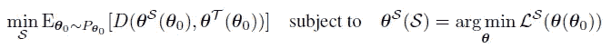

# 什么是数据浓缩？

> 原文：<https://towardsdatascience.com/what-is-data-condensation-8a8ef75bf053?source=collection_archive---------29----------------------->

## [入门](https://towardsdatascience.com/tagged/getting-started)

## 小的合成数据集足以训练模型。

[AJ Jean](https://unsplash.com/@aaronjean?utm_source=medium&utm_medium=referral) 在 [Unsplash](https://unsplash.com?utm_source=medium&utm_medium=referral) 上的照片

数据高效学习的主题是数据科学中的一个重要主题，也是一个活跃的研究领域。在大数据上训练大型模型可能需要大量的时间和资源，因此问题是我们能否用较小的数据集替换大型数据集，而较小的数据集仍然包含来自大型数据集的所有有用信息，使我们能够在这个小型数据集上训练模型，这将在真实数据上很好地推广。这里我们想要的是从大数据集中提取一个包含大部分信息的小数据集。

一个显而易见的方法是从现有数据中选择例子。这种方法的问题是，信息通常分散在多个示例中，因此很难或不可能选择这样的示例来让模型根据它们进行训练，并根据看不见的数据进行归纳。另一种方法是学习数据所在的流形。然后你可以通过从这个流形上取样来生成数据。这种方法是困难的，因为我们正在讨论多维空间(对于计算机视觉来说，这是宽度乘以高度乘以 3)，在多维空间上流形学习是困难的。

如果我们可以生成不在流形上的信息丰富的示例，但仍然能够使基于这些示例训练的模型在真实数据上很好地推广，会怎么样？这种方法首先在《数据集提炼》一文中进行了探讨:

 [## 数据集提炼

### 模型提取旨在将复杂模型的知识提取到更简单的模型中。在这篇文章中，我们考虑一个…

arxiv.org](https://arxiv.org/abs/1811.10959) 

数据提取这一名称是对知识蒸馏一个引用，它是一种教授小型学生模型和大型教师模型的方法。我将在本文中回顾的一篇论文中对这种方法进行了改进:

 [## 具有梯度匹配的数据集浓缩

### 由于许多领域最先进的机器学习方法依赖于更大的数据集，存储它们并训练…

arxiv.org](https://arxiv.org/abs/2006.05929) 

这篇论文被 [ICLR 2021 会议](https://openreview.net/group?id=ICLR.cc/2021/Conference)接受:

来源:[https://arxiv.org/abs/2006.05929](https://arxiv.org/abs/2006.05929)

这些论文的主要思想是生成合成数据集，然后在合成数据上训练模型，并确保模型在真实数据上概括。生成合成数据的过程让我想起了生成白盒模型的对立示例:反向传播错误，但对输入层而不是模型参数应用调整。

来源:https://arxiv.org/abs/2006.05929

为了生成良好的合成数据，我们需要解决一个具有双重目标的任务:确保基于合成数据训练的模型能够推广到真实数据。这可以表示为几个等式:

来源:https://arxiv.org/abs/2006.05929

这里 T 表示训练集，S 表示合成集。右边的方程是神经网络对合成数据的训练过程，左边的方程表示我们对合成数据训练的模型也最小化了训练数据的损失函数。

天真的方法是嵌套循环，效率非常低。为了帮助训练过程的收敛，建议 S 模型的权重接近 T 模型的权重(假设两个模型的架构相同)。这是上述左侧等式的一个充分条件。如果在参数空间中定义度量 D()，那么训练任务将变成:

来源:https://arxiv.org/abs/2006.05929

这个条件要求两个网络具有相同的初始参数θ0。为了确保合成数据集可以与具有任何参数初始化的神经网络一起工作，我们可以对初始参数θ0 的所有可能值的距离进行平均，或者更精确地说，最小化相对于初始权重θ0 的分布的期望距离 D。

来源:[https://arxiv.org/abs/2006.05929](https://arxiv.org/abs/2006.05929)

另一个收敛改进是在优化过程中不仅最小化最终权重的期望距离，而且最小化权重的一些中间值:

来源:[https://arxiv.org/abs/2006.05929](https://arxiv.org/abs/2006.05929)

这里，opt-alg 可以是 SGD、Adam 或任何其他有效的优化算法，ς是步骤的数量，t 是迭代的数量。这种方法有时被称为*课程学习*，其中教师网络指导学生网络实现匹配的性能。

最后，为了最小化两个网络的参数之间的距离，在每次迭代中最小化梯度之间的距离就足够了:

来源:https://arxiv.org/abs/2006.05929

因此标题中的渐变匹配。并且我们可以在网络训练过程中计算梯度。

所以整个算法可以总结如下:

来源:https://arxiv.org/abs/2006.05929

让我来解释一下这个算法。第 1 行说合成的例子最初只是噪音。通过从初始权重的分布中抽取大小为 K 的样本来估计期望值。内环有 T 个步骤，在每个步骤上，我们计算 T 和 S 及其梯度的损失函数，使用优化算法更新合成数据和模型参数。所提出的距离函数是基于分层余弦相似性的度量:

来源:https://arxiv.org/abs/2006.05929

来源:[https://arxiv.org/abs/2006.05929](https://arxiv.org/abs/2006.05929)

## 实验结果

这里一个有趣的问题是信息合成数据集的最小大小是多少。成效显著！例如，在每类只有一个样本的 MNIST 数据集上，他们可以达到 91.7%的准确率！所以大部分信息可以被压缩到每个类的一张图片中！其他结果也令人印象深刻，只要每类有 10 张图像，他们就可以获得相当好的模型性能。作者还发现，使用合成图像，他们可以成功地训练一个不同架构的神经网络。例如，在 AlexNet 上生成的合成数据可以用于训练 ResNet 模型，该模型将正确地对真实图像进行分类。

## 这是理论玩具吗？

一个问题可能是我们为什么需要它？因为无论如何，为了生成合成数据集，我们需要在所有数据上训练一个模型(以便能够进行梯度匹配)。所以问题是:这种方法能有任何实际应用吗？

这种方法的一个应用是*持续学习*。持续学习的目标是在几个不同的任务上连续训练模型。持续学习的主要问题是*灾难性遗忘*:当模型在接受任务训练时，会忘记所有之前的任务，这意味着模型在所有之前的任务中的准确性都会下降。

对持续学习的一个很好的类比就是我们的大脑是如何处理信息的。当我们经历新的事物时，我们将新的经验与先前的经验进行比较，并基于新的经验和先前的经验更新我们的世界模型。我们不必再次经历所有先前的经历。必要时，我们的大脑会产生过去经历的浓缩记忆，这使得在不忘记先前经历的情况下基于新的经历进行学习变得容易。因此，我们的头脑总是在一种生成模式下工作。以类似的方式，为了使持续学习成功，我们可以使用浓缩的合成数据作为一种手段来帮助模型学习新任务，而不会忘记以前的任务。

数据压缩的另一个应用是用于*神经架构搜索*，并且通常用于模型选择。如果您可以在小得多的合成集上训练模型，则可以节省时间和资源，为每个候选架构和超参数组合在整个训练数据集上重新运行训练。

## 结论

我经常看重大会议上接受的论文，以跟上研究。这仍然是很多信息，但比试图在 arxiv 中找到一些有趣的东西要好。我在本文中回顾的论文是关于我一直感兴趣的主题，特别是作为对持续学习过程的帮助。我认为有许多数据压缩领域可以进一步探索。例如，该方法对对抗性攻击有多敏感。合成数据是否会包含敌对信息，并导致经过训练的模型做出敌对预测？如果数据包含偏见(性别、种族等)怎么办？)?合成数据会放大偏倚还是减小偏倚？这种方法可以用作隐私保护机制吗？此外，该技术能否应用于计算机视觉领域之外，例如，表格数据？既然表格数据通常是有噪声的，那么合成数据如何处理这个问题呢？

最后，本文没有官方源代码。算法和实验都描述得很好，所以这是一个邀请写算法的非官方实现。