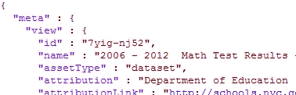

# 从网站和 API 收集 CSV、JSON、XML 和 SQL 格式数据的指南

> 原文：<https://towardsdatascience.com/what-is-data-extraction-python-review-of-json-xml-apis-sql-and-csv-formats-a5470afc27b6?source=collection_archive---------12----------------------->

## 关于如何为您的数据科学和机器学习投资组合收集不同格式数据集的指南


图片由 [Gerd Altmann](https://pixabay.com/users/geralt-9301/?utm_source=link-attribution&utm_medium=referral&utm_campaign=image&utm_content=1307227) 从 [Pixabay](https://pixabay.com/?utm_source=link-attribution&utm_medium=referral&utm_campaign=image&utm_content=1307227) 拍摄

数据收集和提取包括从不同来源提取数据，并将其转换为有用的格式，以便进一步处理或分析。它是数据工程过程中提取-转换-加载管道( [ETL](https://en.wikipedia.org/wiki/Extract,_transform,_load) )的第一步。

作为一名数据科学家，您可能需要组合多种文件格式的数据，如 JSON、XML、CSV 和 SQL。

在本教程中，我们将使用 python 库，如 pandas、JSON 和 requests 来读取不同来源的数据，并将它们作为 pandas 数据帧加载到 Jupyter 笔记本中。

## 1.CSV 文件

这指的是“逗号分隔值”文件，用于以表格格式存储数据，类似于电子表格。文件中的每一行都是一个观察(或记录)，每个记录都有一个或多个用逗号分隔的属性。


文本编辑器中 csv 文件的图像

通常，但不总是，第一行代表特性(列)名称。

我们将从 data.gov 网站下载[数学成绩数据](https://catalog.data.gov/dataset/2006-2012-math-test-results-district-all-students)并保存在我们的工作目录中。推出新的 Jupyter 笔记本。

在我们从数据中创建熊猫数据帧之前，首先使用 python 的内置读取库来查看文件是很重要的。下面的代码显示了下载文件的前 5 行。

需要注意的事项:

*   如果第一行包含列名，使用不带附加参数的`pd.read_csv(file)`，这假定第一行包含列标题。如果没有，我们就用`pd.read_csv(file, header=None)`。在这里，Pandas 为您创建了索引列名，您可以稍后使用`df.columns = <list_of_names>`添加名称。
*   如果顶部有任何空行，我们需要使用`pd.read_csv(file, skip_rows=n)`跳过它们。


下面的代码直接从网站下载文件*并创建一个熊猫数据框架。*

```
file_link = '[https://data.cityofnewyork.us/api/views/7yig-nj52/rows.csv'](https://data.cityofnewyork.us/api/views/7yig-nj52/rows.csv')
df_csv = pd.read_csv(file_link)
```

## 2.XML 数据

可扩展标记语言，简称 XML，是一种与 HTML 非常相似的标记语言。您可以识别 XML 格式的数据，因为它是由特定于数据的唯一标签标记的，不像 HTML 的预定义标签。

我们将继续使用来自 data.gov 网站的[数学结果数据](https://catalog.data.gov/dataset/2006-2012-math-test-results-district-all-students)，该网站提供了一个下载 XML 格式数据的选项。

在 Jupyter 笔记本中运行下面的代码将打印前 20 行。


代码编辑器上 XML 文件的图像

为了提取 XML 数据，我们使用一个名为 [BeautifulSoup](https://www.crummy.com/software/BeautifulSoup/bs4/doc/) 的 python 库。要安装 BeautifulSoup，请将下面的代码粘贴到 Jupyter 笔记本中。

```
!pip install bs4
```

然后导入库，打开文件并将其内容加载到 BeautifulSoup 中。

```
from bs4 import BeautifulSoupwith open("math results.xml") as f:
    soup = BeautifulSoup(f, "lxml")
```

从收集的 XML 数据中，我们将使用 BeautifulSoup 的`find_all()`方法，该方法将标签作为列表返回。


作者查找全部的图片

对于我们的例子，感兴趣的标签是`‘district’, ‘grade’, ‘number_tested’, and ‘mean_scale_score’.`

然后我们将遍历这些行，对于每个标记，使用`get_text`方法检索其中的值。

名为“数据”的列表代表我们所有的记录。


按作者排列的前 5 条记录的图像

下一步是创建一个 pandas 数据框架，并传递将用于数据的列。

```
df_xml = pd.DataFrame(data, columns=['district', 'grade','number_tested', 'mean_scale_score'])
```


## 3.JSON 数据

JavaScript Object Notation，或称 [JSON](https://www.json.org/json-en.html) ，以字典风格的格式压缩数据。数学结果的 JSON 文件可以在[这个](https://data.cityofnewyork.us/api/views/7yig-nj52/rows.json?accessType=DOWNLOAD)链接中找到。下面是使用代码编辑器的文件截图。



作者的 json 文件截图

JSON 是在 XML 之后开发的，但是随着时间的推移，它变得越来越流行了。这两种格式经常用于通过 web APIs 发送数据，这将在下面的第 5 点中讨论。

Pandas 库提供了一种简单的方法来读取 JSON 文件；`pd.read_json()`。您可以根据数据的格式传递`‘orient’`选项。[熊猫文档](https://pandas.pydata.org/pandas-docs/stable/reference/api/pandas.read_json.html)解释了`‘orient’`选项。

我们的 JSON 数据格式不同，`pd.read_json()`返回一个错误。它有很多元信息；920 行。实际数据从第 921 行开始。


作者 json 文件的折叠元和数据标签的图像

下图显示了使用[记事本++](https://notepad-plus-plus.org/) 代码编辑器的**数据**的截图。注意每行的前 8 个字段是没有用的。


我们将使用 [json 库](https://docs.python.org/3/library/json.html)，它将 json 数据作为字典加载。

```
import jsonwith open('math results.json') as f:
    json_data = json.load(f)type(json_data)
###dict
```

在我们的例子中，将有两个字典条目；元数据和数据。因此，我们可以使用`dict.get(key).`获得**数据**信息

```
data = json_data.get('data')
data = [x[8:] for x in data]
```

下图显示了我们的数据列表。右图使用[列表理解](/a-gentle-introduction-to-flow-control-loops-and-list-comprehensions-for-beginners-3dbaabd7cd8a)只返回每个列表中第 8 个元素的项目。


下一步是创建一个熊猫数据框架。根据我们对数据集的了解，我们将把列名作为参数传递。


## 4.SQL 数据库

结构化查询语言，或 SQL，使我们能够访问和操作数据库。您可以使用 Pandas 库从 SQL 文件和数据库中收集数据。这是通过打开数据库或运行 SQL 查询实现的。

根据数据库的类型，可以使用两个 python 库来建立连接； [sqlite3](https://docs.python.org/3/library/sqlite3.html) 库或 [sqlalchemy](https://www.sqlalchemy.org/) 库。

出于我们的目的，我们有一个 [SQLite](https://www.sqlite.org/index.html) 数据库文件，其中包含我们一直在处理的数学结果。SQLite 为个人应用和设备提供本地数据存储。点击阅读更多关于何时使用 SQLite [的信息。因此，我们将使用 **sqlite3 库**。数据库文件只有一个表。](https://www.sqlite.org/whentouse.html)

```
import sqlite3
import pandas as pd# connect to the database
conn = sqlite3.connect('maths_results.db')# run a query
data_sql = pd.read_sql('SELECT * FROM maths_results', conn)# display 5 rows
data_sql.head()
```

当使用大型*客户端/服务器* SQL 数据库如 MySQL 和 PostgreSQL 时，使用 **sqlalchemy 库**。查看 [SQLAlchemy 文档](https://docs.sqlalchemy.org/en/14/core/engines.html)，了解如何加载不同的数据库[，包括我们将使用以下代码实现的 SQLite](https://docs.sqlalchemy.org/en/14/core/engines.html#sqlite) 。

```
import pandas as pd
from sqlalchemy import create_engine#create a db engine
engine = create_engine('sqlite:///maths_results.db')#run query
df_sql = pd.read_sql("SELECT * FROM maths_results", engine)
```

## 5.使用 API 从 web 中提取数据

应用编程接口，或称 API，为脸书、威特、谷歌等公司提供了一种与用户共享数据的方式。这阻碍了构成法律灰色地带的网络抓取。

这些公司提供面向公众的 API 的网址，开发者可以从这些网址访问数据，并将其用于分析或创建自己的应用程序。有些在发送请求时需要登录凭证，而有些则是公开的。它们还提供了如何格式化 URL 请求的文档。

在本节中，我们将从[世界银行](https://datacatalog.worldbank.org/)数据目录中提取数据。该网站不需要登录凭据。API 文档可在[这里](https://datahelpdesk.worldbank.org/knowledgebase/articles/898581-api-basic-call-structure)获得。

[该](https://datacatalog.worldbank.org/search/indicators)页面有一个指示器列表，带有使用 API 下载的选项。我们将关注“女性企业主的数量”,它显示了每个国家每年的结果。

向下滚动到您想要的指标数据，然后单击“API”访问选项。


截图来自[世界银行](https://datacatalog.worldbank.org/search/indicators)目录

这将把您重定向到一个包含原始 JSON 数据的新网页。从地址栏复制网址，打开一个新的 Jupyter 笔记本。编写下面的代码，并用复制的文本替换`url`文本。

Python 有一个[请求库](https://pypi.org/project/requests/)，用于使用 python 发送 HTTP 请求。下面的代码返回一个响应对象。

```
import requests
import pandas as pdurl = '[https://api.worldbank.org/v2/en/country/all/indicator/IC.WEF.LLCO.FE?format=json&per_page=20000&source=14'](https://api.worldbank.org/v2/en/country/all/indicator/IC.WEF.LLCO.FE?format=json&per_page=20000&source=14')r = requests.get(url)
```

由于数据是 JSON 格式的，我们将调用`response.json()`返回提取的 JSON 数据。

```
r.json()
```

这将返回一个包含两个字典部分的列表。第一部分包含元信息。第二部分保存实际数据。


要创建数据框，请使用 list[1]来索引列表的第二个元素。

```
data_api = pd.DataFrame(r.json()[1])data_api.head()
```


## 结论

在这篇文章中，我们探索了数据收集，并提取了 5 种不同格式的数据，将其加载到熊猫的数据框中。完整的代码可以在 Github 的这里[找到。](https://github.com/suemnjeri/medium-articles/blob/main/data%20extraction/Data%20extraction%20for%20medium.ipynb)

对于希望提取和分析真实世界数据集的数据科学家来说，收集数据的技能非常有价值。提取后的下一步是[将数据转换](https://www.stitchdata.com/resources/data-transformation/)为结构化和有组织的格式。

下面的资源列出了可用于项目的公共数据集。

*   [Github 上令人惊叹的公共数据集列表](https://github.com/awesomedata/awesome-public-datasets)
*   [一个 Quora 问题](https://www.quora.com/Where-can-I-find-large-datasets-open-to-the-public)
*   elite data science 的这篇[博客文章](https://elitedatascience.com/datasets)