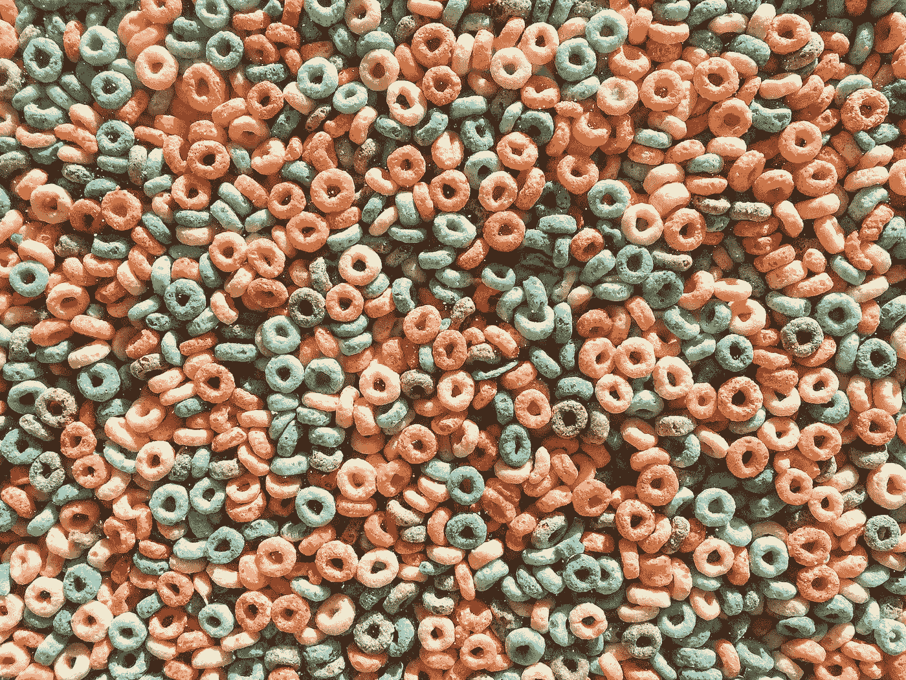

# 大数据摄取

> 原文：<https://towardsdatascience.com/what-is-data-ingestion-5220edf50677?source=collection_archive---------8----------------------->

## 简要概述什么是大数据以及数据收集解决方案的第一层

艾蒂安·吉拉尔代在 [Unsplash](https://unsplash.com?utm_source=medium&utm_medium=referral) 上拍摄的照片

# 介绍

你使用导航软件从一个地方到另一个地方吗？你在亚马逊上买过书吗？你看了网飞频道的《奇异事物》吗？你在 YouTube 上找搞笑视频了吗？

如果你对这些问题中的任何一个回答是肯定的，那么恭喜你！你是大数据生产者。事实上，即使你对我的任何问题都没有回答“是”，你可能仍在为大数据做出贡献——在当今世界，我们每个人都至少有一部智能手机、笔记本电脑或智能手表、智能汽车系统、机器人吸尘器等等，我们在日常活动中产生了大量对我们来说似乎微不足道的**数据**。

# 什么是大数据？

当我们说**大数据**时，我们通常指的是特别大的数据，速度快且结构不同，以至于很难或无法用传统工具进行分析。

通常用“三个 v”来定义大数据的概念:

1.  **卷—数据的大小**
2.  **速度——数据采集的速度**
3.  **变化——不同类型的数据**

为了解决大数据世界带来的复杂问题，该解决方案分为五层:

1.  数据源
2.  **数据摄取**
3.  数据存储
4.  数据处理——准备和培训
5.  服务

作者提供的大数据层架构/图像

# 数据摄取

数据接收是**大数据架构中的第一层—** 这一层负责从各种数据源(物联网设备、数据湖、数据库和 SaaS 应用程序)收集数据，并将其存储到目标数据仓库中。这是流程中的一个关键点，因为在这个阶段可以理解数据的大小和复杂性，这将影响架构或我们今后做出的每个决策。

作者图片

## 为什么我们需要数据摄取层？

1.  可用性—数据可供所有用户使用:BI 分析师、开发人员、销售人员和公司中的任何其他人都可以访问数据。
2.  一致性—高质量的数据摄取过程可以将不同类型的数据转化为统一的数据，便于读取和执行统计和操作。
3.  节省资金和时间—数据摄取流程节省了工程师收集所需数据和高效开发的时间。

## 数据接收面临哪些挑战？

1.  复杂性—由于数据的速度和多样性，编写数据接收流程可能会很复杂，有时开发时间会耗费大量的时间和资源。
2.  数据安全性—将数据从一个地方转移到另一个地方时，敏感数据存在安全风险。
3.  不可靠性—在此过程中，数据的可靠性可能会受到损害，从而导致数据毫无价值，或者在最糟糕的情况下，根据不真实的数据做出不正确的决策。

# 数据接收类型

有三种常见的数据接收方式，使用方式将根据产品需求而定——实时收集数据重要吗，还是可以以定时方式偶尔收集一次？

## 实时数据摄取

这是从各种数据源实时收集和处理数据的过程，也称为流，当收集的数据对时间敏感时，我们将使用这种方法。

例如，在发生泄漏的情况下，来自油罐传感器的数据将至关重要。

在实时情况下，数据的速度会很快，因此解决方案将包含一个队列以避免丢失事件。我们将尽快提取、处理和保存这些数据。

## 批处理数据摄取

批处理数据接收意味着数据按照预定的时间间隔从数据源移动到数据目标。

当公司需要每天收集数据时，批量接收非常有用。

# 结论

虽然数据摄取不是一个简单的编写过程，并且随着时间的推移，建立基础设施和维护的成本会很高，但是一个编写良好的数据摄取过程可以帮助公司做出决策并改进业务流程。

此外，这一过程使处理大量信息源变得更加容易，并允许工程师和分析师等轻松访问。