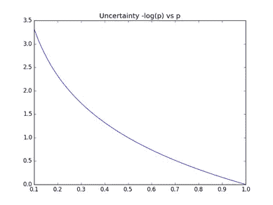
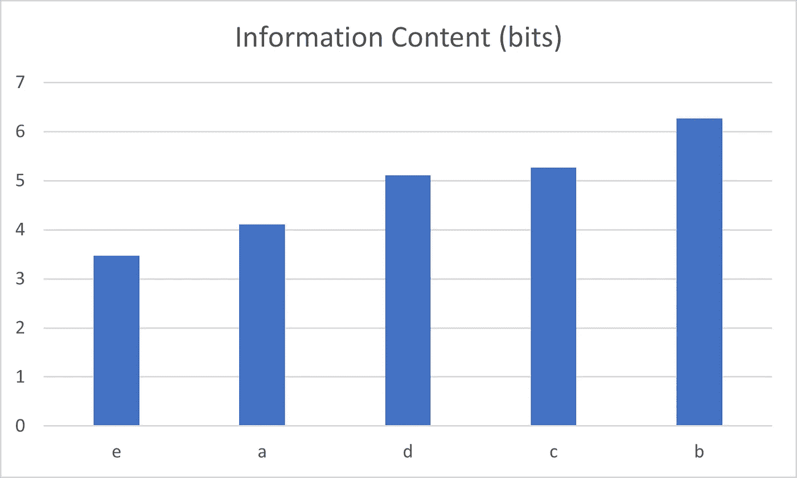
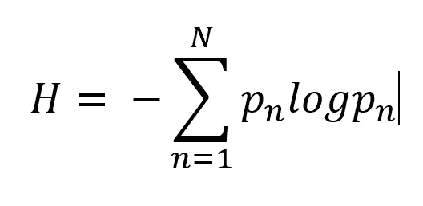
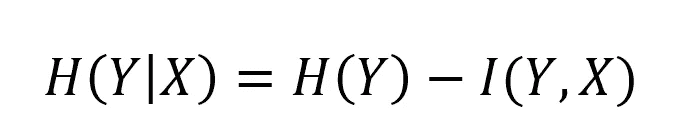
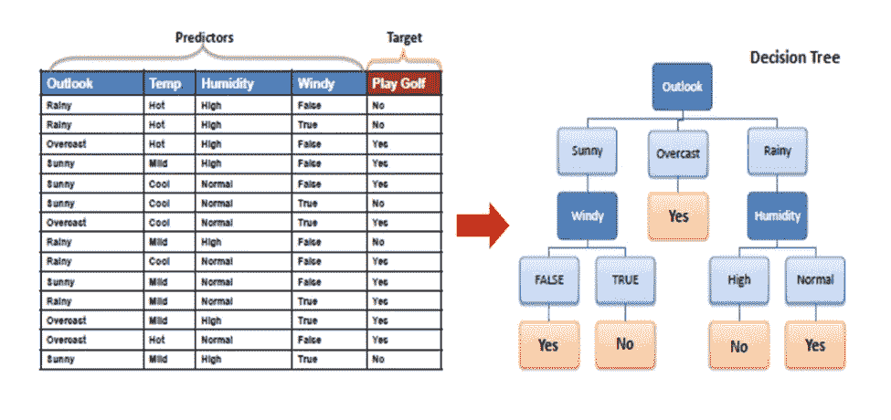

# 什么是数据挖掘？

> 原文：<https://towardsdatascience.com/what-is-data-mining-c8e58b153c42?source=collection_archive---------28----------------------->

## 快速历史和实用介绍

数据挖掘就是它所说的:挖掘数据。尽管这经常涉及到从数据库中访问数据，但这只是一个步骤。数据挖掘最终寻求从具有潜在价值的数据中提取不明显的模式。换句话说，数据挖掘从数据中提取信息。在过去几十年中，生成和记录的数据量呈爆炸式增长。数字存储和传输成本的降低允许以多种形式收集越来越多的数据，如图像、视频和文本。但是，有用的信息量可能要小得多。在数据中寻找信息可以看作是在碳的海洋中寻找钻石。如何评估数据的价值？一种方法是利用信息论。

什么是信息？这是你还不知道的。如果一条数据没有揭示任何新的东西，或者是确定的，它就不包含任何信息[1]。克劳德·香农于 1948 年在他的论文《交流的数学理论》中提出了这种信息测量方法。为了衡量信息，数据被认为是一个更大的集合的一部分，但不是一个万能的集合。例如，英文字母是一组 26 个符号中的一部分(仅考虑小写)。有些符号，如字母 e，比其他符号出现得更频繁。出现的概率表明一个符号或一段数据有多少信息。如果符号总是发生，它的概率为 1，包含 0 信息。这可能看起来有点违背直觉，但经过一番思考后还是有道理的。如果你正在读一篇文章，并且知道下一个字母是什么，你没有获得新的信息。如图 1 所示，概率与信息量或不确定性之间存在反比关系。数据项的概率越低，信息量就越大，信息量以比特为单位。

图 1 从对数概率(1/p)获得的数据项中的信息。不经常出现的数据项的概率接近于 0，不确定性更大，如果出现，信息也更多。信息量是用比特来衡量的。如果数据项的概率为 0.1，那么它大约有 3.3 比特的信息(图片由作者提供)。

图 2 显示了前五个字母 a、b、c、d、e 的信息内容。字母“e”最常见，信息量最少。所有字母的平均信息给出了字母表的熵，估计大约为 1.8 比特/字母[2]。

图 2 a、b、c、d、e 的信息内容，使用每个字母相对于一个更大的字母表的概率来计算。字母“b”最不可能包含大约 6 位信息(图片由作者提供)。

熵是香农对信息的度量，用字母 h 表示。熵给出了 N 个数据项集合中的平均信息量。项目 n 的发生概率为 pn。

一位也用来指二进制数字，1 或 0。然而，在这种情况下，比特指的是信息量，具体来说，它与确定出现什么数据项所需的是/否问题的数量有关。一个二进制数字可以携带一位或更少的信息。像文件或图像这样的数据项的大小只是粗略地给出了其中的信息量。

数据挖掘可以被认为是提取信息。例如，在预测中，目标是将数据项分类到一个类别中，或者使用该项的特征预测连续值。如果 Y 是项目的类别，X 是项目的特征，则信息增益 H(Y|X)给出 X 给出关于 Y 的多少位信息。它等于原始熵 H(Y)减去 X 和 Y 之间的互信息。互信息 I(Y，X)是熵公式对两个变量的直接概括。

决定在某一天打高尔夫球的任务给出了一个简单的问题，在参考文献[3]中有进一步的解释。图 3 显示了这组数据有 1 个目标变量，用于判断是或否，以及 4 个特征或预测因子。这是一个目标已知的训练集。任务是使用这个集合来制作一个模型，该模型预测如果只给出 4 个特征，是否打高尔夫球。如果你不是高尔夫爱好者，也许你的配偶是。决策树是一种简单、直观的模型，可以给出这样的预测。如图所示，树组织特征以决定是或否。使用信息增益给出了训练树的有用方法。训练过程通常如下进行。

1.计算初始目标熵 H(打高尔夫球)= 0.94 比特

2.选择给出最大信息增益的预测器作为第一个决定因素。

a.Outlook:给出 0.247 位信息，并选择“Outlook”功能。

b.温度:给出 0.029 位

c.湿度:给出 0.152 位

d.Windy:给出 0.048 位

3.仅考虑剩余的预测值，并对所选预测值的每个值重复步骤 2。

图 3 用于决定是否打高尔夫球的决策树。用来决定玩的最重要的特征是前景，是雨天、晴天还是阴天。经[http://saedsayad.com/decision_tree.htm](http://saedsayad.com/decision_tree.htm)许可的图片

虽然这是一个简单的例子，但它很好地展示了在分类中使用信息论的整个过程。从特征中提取比特信息来决定结果。一点值多少钱？以美元计算，存储在存储器中的数据和以美元计算的传输数据都有一定的成本。据估计，擦除 1 位信息所需的最小能量约为 kTlog2，其中 T 为温度，k 为玻尔兹曼常数[2]。该值取决于上下文。

总之，数据挖掘试图从数据中提取有趣的、潜在有用的模式。它与机器学习或数据科学等其他领域没有明显区别[4]。量化提取的模式值的一种方法是使用香农的信息度量。尽管对于某些应用程序来说，原始数据包含的信息可能要少得多，但如果可能的话，应该保留原始数据。一般的期望是，收集所有这些数据可以产生已知的知识，并用于以前没有预见到的目的。

**参考文献**

[1] Gershenfeld《信息技术物理学》，剑桥大学出版社 2000。

[2]斯通《信息论》。教程介绍》，Sebtel 出版社 2015 年。

[3]http://saedsayad.com/decision_tree.htm

[4]扎基和梅拉《数据挖掘与分析》。基本概念和算法》，剑桥大学出版社 2014 年。