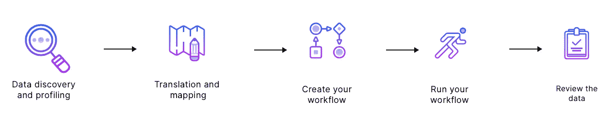
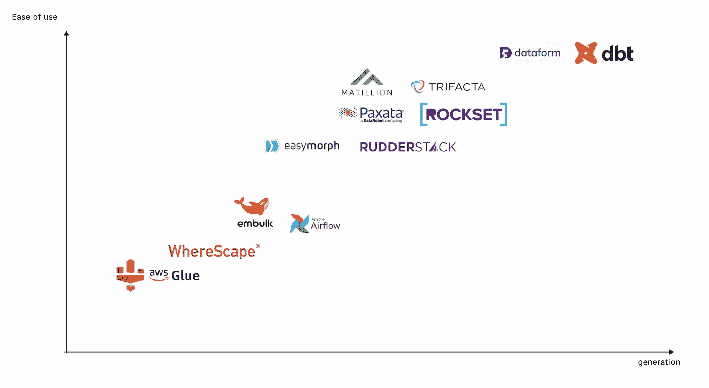

# 什么是数据建模？

> 原文：<https://towardsdatascience.com/what-is-data-modeling-6f14c1b7f2fd?source=collection_archive---------11----------------------->

## 业务价值不在您的数据中，而是在转换层中

数据建模工具竞赛—图片来自 [Castor 的](https://www.castordoc.com)网站

今天，每个公司都收集数据并试图利用它。问题是，原始数据不会让你获得深刻的见解和有用的预测，只是因为它的结构方式不利于数据分析。你通常必须转换你的数据和变量，以使其**分析就绪**。我们经常听说数据转换，因为它是 ETL/ELT(提取—加载—转换)过程中的一个关键步骤，是最广泛使用的数据集成方法。今天，我们深入到转换过程，并试图解开数据转换/数据建模生态系统。

# 什么是数据转换？

简单地说，数据转换是改变变量的格式、结构或值的过程。结构化和重新格式化数据的目的是将它转换成一种**数据模型**，从中你可以学习洞察力并获得**商业智能**。

很多时候，转换步骤包括将**事务性**数据与**运营性**数据集成在一起，以便数据可以用于业务分析和 BI。例如，转换平台可以将业务运营中使用的名称、地点和定价数据与交易数据相结合，例如零售或医疗保健索赔，如果最终用户需要这种结构来进行数据分析的话。因此，转换主要是由寻求用数据解决精确业务问题的分析师的特定需求决定的。

转换数据有多种优势:

✅ **更好的组织:**转换后的数据对人和计算机来说都更容易处理。

✅ **数据质量:**原始数据通常意味着质量差的数据:缺少值、空行、格式不好的变量等等。转换数据以提高其质量可以改善数据用户的生活，使他们能够提高工作效率并从数据中获得更多信息

✅ **可用性:**太多的组织坐在一堆不可用的、未经分析的数据上。标准化数据并将其置于正确的结构下，可以让您的数据团队从中产生业务价值。

# 数据转换工作流

数据转换工作流程—图片由 Louise de Leyritz 提供

1.  **数据发现和分析:**转换工作流程的第一步是识别和理解原始来源中的数据。这一步允许您决定数据应该经过哪些操作才能达到所需的格式/结构。
2.  **翻译和映射:**这包括在源和目标字段之间建立清晰的对应关系。
3.  **工作流创建:**这一步包括编写代码来执行转换任务。代码通常是使用特定的数据转换平台生成的。
4.  **工作流程执行:**数据被转换成所需的格式。
5.  **数据检查:**检查转换后的数据，确保其格式正确。

# 数据转换工具的发展

我们区分了三代数据建模解决方案:

**第 1 代:**数据转换由 ETL (Extract-Transform-Load)工具操作，大多使用 python 和 airflow。

**第二代:** EL-T(提取-加载-转换)流程取代了传统的 ETL。转换现在在数据仓库中操作。一个模糊的时代，没有专门用于数据转换的工具。

**第三代:**数据仓库中专门用于数据转换的工具的出现。dbt 的出现建立了一种新的转换范式。

# 数据建模 1.0:ETL 时代的转换

在研究第一代转换工具之前，有必要了解一下过去的数据转换是如何进行的。

数据转换是更广泛的**数据集成**过程的一部分，该过程包括将来自多个来源的数据集成到一个真实的来源，通常是**数据仓库。**建立一个唯一的事实来源的目的是让数据用户能够比分散在几十个应用程序和来源系统中更容易地找到数据。

在 20 世纪 90 年代，ETL(提取-转换-加载)过程是最广泛使用的数据集成方法。将来自多个来源的数据放入数据仓库包括三个关键步骤:首先从源系统中提取数据，然后根据我们上面描述的过程转换数据，然后将数据加载到数据仓库中。要记住的关键点是，在 ETL 过程中，数据在被装载到仓库之前被转换。原因是在 20 世纪 90 年代，当存储和带宽非常昂贵时，在数据仓库中加载未转换的、原始的、不可用的数据是愚蠢的。分析师必须定义特定的数据项目和业务用例，以便数据可以相应地转换，然后加载到数据仓库中。因此，ETL 过程的提取和加载步骤是紧密耦合的，ETL 管道一起执行这两个步骤。

ETL 流程—图片由 Louise de Leyritz 提供

[ETL 管道](/what-is-etl-88154bdcde58)由**数据工程师**设计，涉及大量**使用 Bash、Python、C++和 java 等脚本语言的定制代码**。用于转换数据的工具与执行数据集成的提取和加载步骤的工具是相同的:优秀的旧式 ETL 工具。

# 数据建模 2.0:数据在仓库中转换

在过去的几十年里，存储和计算成本下降了数百万倍，带宽成本下降了数千倍。这导致了云的指数级增长，以及**云数据仓库**的到来，如亚马逊红移或谷歌 BigQuery。云数据仓库的独特之处在于，它们比传统数据仓库具有无限的可扩展性，能够容纳几乎任何数量的数据。

这些新的云数据仓库要求在数据集成过程中进行彻底的变革。现在，存储和带宽限制已经消失，在云数据仓库中加载大量未转换的数据不再是问题。这意味着在提取和加载数据之后，转换步骤可以在云数据仓库中轻松完成。EL-T(提取-加载-转换)过程因此取代了传统的 ETL，因为转换层被移动到了工作流的末端。这种新的数据集成方法更加省时，因为[数据管道变得不那么复杂了。](https://www.castordoc.com/blog/etl-benchmark-for-mid-market-companies)

EL-T 过程—图片由 Louise de Leyritz 提供

这标志着进入了一个相当模糊的时代。转换步骤是在云数据仓库中处理的，这是一个很大的变化。然而，**没有建立标准**，或者规定如何进行转换的规则。在 ELT 流程变得司空见惯之后的几年里，使用 SQL、python，有时使用 airflow 来执行转换。我们没有真正找到一种广泛的、统一的数据转换方式。缺乏专用的数据建模工具导致**整个云数据仓库缺乏可见性**。这是一个大问题。企业需要处理数千甚至数百万个数据集。由于没有数据团队可以学习和应用的清晰的转换标准，它很快变得混乱。

# 数据建模 3.0:转型的新范式

2016 年， [Dbt](https://www.getdbt.com) ，一个你肯定听说过的平台，开创了第三代数据建模解决方案。

Dbt 是一个专门致力于数据转换的平台，只关注 EL- **T** 过程中的 T。现在，Dbt 为数据转换设立了一个**新标准**，这一点已被广泛接受。有了 Dbt，转换不再像在 ETL 范例下那样用复杂的脚本语言编写。**数据建模现在发生在 SQL** 中，这是一种由 BI 专业人员、数据分析师和数据科学家共享的语言。这意味着，过去只属于数据工程师的转换，现在可以由分析师和技术含量较低的人员来处理。转换也是协作操作的。

Dbt 实验室建立了一个由 15，000 名数据人员组成的社区，共享和交换 dbt 包以及如何最好地标准化和建模数据以进行分析的技巧。Dbt 统一了转换的操作方式，产生了期待已久的新范式。在这个新的范例中，每个懂 SQL 的人都可以动手构建转换管道。数据工程师看到了他们的角色转变，越来越关注提取和加载阶段，将转换步骤留给技术含量较低的部分。

这既有很大的影响，也有不太大的影响:

✅ **伟大的** ‍

数据科学家和数据分析师比软件工程师更了解数据的战略影响。因此，让他们负责数据转换是有意义的，因为他们比任何人都更清楚为特定的业务目的构建数据的最终目标。另一个伟大的成果是，数据科学家和数据分析师可以访问原始数据并进行自己的转换，而无需提交票证并等待数据工程师来领取。

❌ **不太好**

**‍** 数据分析师大多受短期目标驱动，因为他们在运营受限的情况下工作。他们的仪表板和 BI 报告预计明天发布，而不是下个月。他们只关心快速获得洞察力。现在，他们可以学习在不需要工程支持的情况下转换数据，从而可以更快地获得业务洞察力。在实践中，事情是这样的:数据分析师为一个精确的用例创建一个新表，称之为“客户流失 _2021”，获得见解，构建一份报告，提交给他的经理，继续他的一天。这张桌子放在哪里？哪儿也不去。它留在仓库中，与其他 200 个表具有相同的名称，并被其他分析师遗忘。

结果呢？**完全混乱**。显然，分析师创建的表只能用于单一用例，因为它们是为单一用例构建的。这导致了混乱的数据仓库，有不可用的和文档记录不良的表。它会无用地占用大量存储空间，并需要大量的监控工作来处理[数据质量问题](https://www.castordoc.com/blog/data-monitoring-and-observability)。随着每个人都参与数据转换时创建的数据集的数量，如果您不想最终淹没在未标记、记录不良的数据海洋中，您最好有一个可靠的[数据记录](https://www.castordoc.com)解决方案。

数据工程师根据不同的逻辑转换数据。他们的目标是构建可靠的数据基础架构，为自助分析提供干净可靠的数据。数据工程师寻求以一种使数据对业务分析有用的方式来转换和构造数据，但这也使数据可以在不同的用例中重用。他们的抽象能力和长期思维导致了结构良好的数据仓库，一个表服务于几十个分析师的用例。

现在，天空不全是灰色的。我们正在见证一个新角色的出现:解决这些问题的 [**分析工程师**](https://blog.getdbt.com/we-the-purple-people/) 。分析工程师有足够的**业务背景**和数据工具经验来构建可重用的数据模型。他们基本上将软件工程最佳实践应用到数据分析中，并将面向业务的思维方式引入数据工程工作中。当分析工程师负责数据转换时，组织生活在尽可能好的世界中:出色的数据基础架构、自助式配置中构建良好且可重复使用的数据库，以及跨数据仓库的完美可见性。

# 哪种转型工具适合您的组织？

下面是数据转换解决方案的概况，希望可以帮助您为组织选择合适的平台。

数据转换工具的演变 Louise de Leyritz 的图片

点击此处查看更详细的数据建模生态系统基准:[https://notion.castordoc.com/catalog-of-data-modeling-tools](https://notion.castordoc.com/catalog-of-data-modeling-tools)

# 更现代的数据堆栈基准？

点击此处，了解更多关于现代数据堆栈[的性能指标评测和分析。我们写了利用数据资产时涉及的所有过程:从现代数据堆栈到数据团队的组成，再到数据治理。我们的博客涵盖了从数据中创造有形价值的技术和非技术方面。如果你是一名数据领导者，并希望更深入地讨论这些话题，请加入我们为此创建的](https://notion.castordoc.com/)[社区](https://notion.castordoc.com/unsupervised-leaders)！

在 Castor，我们正在开发一个数据文档工具 Figma，Slack generation。或者对 Fivetran，Looker，Snowflake，DBT 的狂热爱好者来说是数据方面的。我们把我们的目录设计成**易于使用、令人愉快和友好。**

想去看看吗？联系我们，我们会给你演示。

*最初发表于*[*https://www.castordoc.com*](https://www.castordoc.com/blog/what-is-data-modeling)*。*