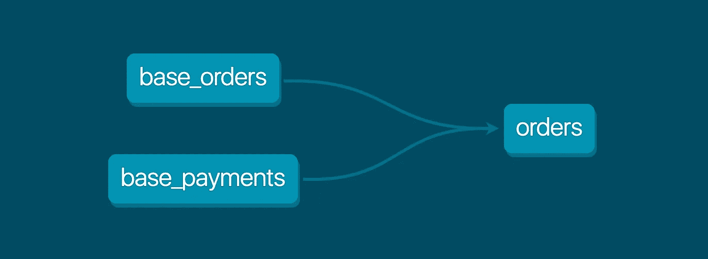

# dbt 是什么？

> 原文：<https://towardsdatascience.com/what-is-dbt-a0d91109f7d0?source=collection_archive---------9----------------------->

## 您的分析工程指南和创建它的工具


兰迪·法特在 [Unsplash](https://unsplash.com/s/photos/build?utm_source=unsplash&utm_medium=referral&utm_content=creditCopyText) 上的照片

一年多以前，我在公司的另一个部门担任了一个新的数据工程职位。我知道，进入 it 行业后，我将会比以前工作时使用更多的 Python 和 SQL。作为数据和分析的爱好者，这令人兴奋。我在那家公司的工程岗位上从未真正使用过 SQL，现在是提高我技能的机会。

几周之后，我的经理向我介绍了一个工具，这个工具刚刚开始实施，叫做 [dbt](https://docs.getdbt.com/docs/introduction) (代表数据构建工具，也就是构造封面图片)。起初我并不真正理解它的用途以及我们为什么要使用它。但是当我开始探索它的特性时，我变得着迷了，说得轻一点。现在，我在另一家公司担任分析工程师，帮助构建以使用 dbt 为中心的整个数据堆栈。

## 事实真相

Dbt 是一种数据建模工具，它使分析师和工程师的工作变得更加容易。它帮助您以一种不必担心依赖性的方式编写 SQL 查询。我喜欢把它看作是把查询分成容器化的代码块。它允许您以一种不必重复已经编写的查询部分的方式编写 SQL 代码。



照片来自 [dbt](https://docs.getdbt.com/docs/introduction)

例如，查看这个 DAG，您可以看到 orders 模型依赖于两个模型，base_orders 和 base_payments。如果要运行模型订单，它还会运行两个依赖关系基表。但是，这些基本模型完全独立于订单，也可以被其他模型使用。这保持了 SQL 代码的模块化和跨模型可重用性。

## 它是如何组织的

虽然有几种不同的方法可以在 dbt 项目中组织文件夹，但是创建该工具的公司建议这样做。在项目的“models”目录中，您可以创建三个目录——一个用于基本模型，另一个用于中间模型，还有一个用于您的 mart。

基本目录包含所有直接从数据源读取的模型，数据源通常是数据仓库中的一个模式。在 dbt 中，使用以下符号表示源:

```
{{ source('campaigns', 'channel')}}
```

该源引用您的。yml 文件。这些源模型类似于它们所读取的原始数据文件。但是，这里的最佳实践需要清除列名，并根据需要转换为不同的数据类型。

接下来是中间目录。这些模型总是引用我们刚刚谈到的基础模型，而不是来自某个来源。您可以把他们看作是您的分析师将要查询的基础模型和最终模型之间的中间人。此处的引用将始终使用这种符号:

```
{{ ref('base_campaign_types')}}
```

这些中间模型通常用于多个基础模型之间的连接。

最后，mart 目录是分析团队使用的“最终”模型被配置的地方。它们使用相同的参考符号来指代中间模型，而不是基础模型。这是可能发生任何计算以及任何其他微调以准备要查询的模型的地方。

## 其他功能

Dbt 还包括其他一些很酷的特性，比如种子、测试和标签。种子是 csv 文件，您可以将其添加到 dbt 项目中，以便上传到数据仓库。如果您有一个在分析中可能需要的唯一代码或员工 id 的列表，但当前数据中没有这些代码或 id，这将很有帮助。在我之前的角色中，我们使用这些来帮助测试我们的代码。

测试允许您检查数据源的某些功能，以确保您的数据符合标准。两个最常见的测试是检查表的主键是否唯一，并确保它不为空。还可以测试表之间的主键和外键，以确保一个值不在一个表中，而在另一个表中。这对于希望遵循强大的数据治理实践的团队非常有帮助。

我喜欢利用的另一个 dbt 特有的特性是标签。这正是它听起来的样子——你可以用某些关键词来标记你的模型。最棒的是，您可以使用它们的标签运行一组模型。例如，假设我有几个想要每天运行的关键模型。我可以安排以下命令在每天早上 6 点运行，它将每天执行带有标签的所有模型。

```
dbt run --models tag:daily
```

如果您希望在某个业务领域运行模型，这也很有帮助。你可以给他们贴上营销、财务、销售等标签。

随着我对 dbt 的深入研究，我将在这里分享我的发现。请务必阅读关于命名 dbt 模型、将 dbt 与雪花一起使用以及文档最佳实践的文章。

关于分析工程、现代数据堆栈和 dbt 的更多信息，[订阅我的免费每周简讯](https://madisonmae.substack.com/)。