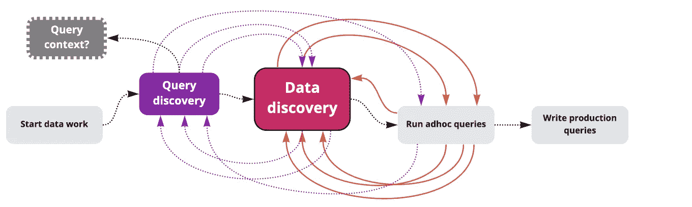

# 什么是深度分析？

> 原文：<https://towardsdatascience.com/what-is-deep-analytics-e12d0c625044?source=collection_archive---------18----------------------->

## 以及为什么我们需要重新思考商业智能

去潜水。乔·波勒从[拍摄的照片。](https://unsplash.com/photos/7rsnvqz1pPo)

## 作为数据分析师，我们浪费了太多时间为他人制作仪表盘，而没有足够的时间来回答关于关键业务问题的深层问题。这对个人是资源的浪费，对企业也是资源的浪费。

有关该业务的真正实质性问题，比如:“是什么促成了上个月收入的突然增长？”无法通过具有收入和流量数字的通用仪表板来回答。你需要对这个问题进行一次*式的深入探究。你需要把问题分解成具体的问题。*

*   按月查询过去 12 个月的收入
*   以 12 个月为间隔，通过交叉检查每月收入来检查季节性模式
*   查询营销支出数据
*   查询营销流量数据
*   查询产品使用数据，并根据用户采取的不同操作进行切割
*   寻找所有用户采取的不同产品行动
*   寻找不同用户群采取的不同产品行动

结论可能是存在季节性效应(人们在一年中的特定时间购买更多)，有一次成功的营销活动增加了产品的流量，或者一群用户极大地影响了收入。无论它是什么，都有一种深刻的探索性去寻找一个看似简单问题的答案。这个工作流程还有第二个方面:**组织和分享**这些发现。我将这整个过程称为“**深度分析”**(与“浅层分析”相反，浅层分析更侧重于构建通用指标和通过仪表板共享见解——这是一种更生硬的工具，如果不是更通用的话)。

## 深度工作流:被遗忘的孩子

深层工作流的一个例子。图片由 [Hyperquery](https://www.hyperquery.ai/) 提供

问题是，更广泛的商业社区并没有重视这些深层的工作流程，尽管这恰恰是推动最大数量业务成果的工作类型。真正伟大的、独特的见解不会在盯着仪表盘时实现。它们来自于以新颖、不明显的方式来看待业务及其数据。从定义上来说，这不能以一刀切的方式进行。

事实是*甚至分析社区*也不重视这些深层工作流。缺乏关心会导致缺乏标准和工具。一个明显的例子是:SQL IDE 已经几十年没有重新设计了。共享和组织分析查询是事后才想到的。在发现和选择用于分析的不同版本的分析数据方面没有标准。

## 呼唤工具:工具定义工作流

优秀的工作流工具不仅仅使工作流更加高效。他们*定义*工作流程。Github 为代码定义了版本控制和协作。Figma 定义的协同界面设计。Ableton Live 定义了电子音乐制作。我们需要一个定义深度分析的工具。

传统的 BI 工具就是不能满足它。它们旨在帮助分析师为普通业务受众构建自助服务数据工具(例如仪表板)。SQL IDEs 也没有削减它——它们是为事务而构建的，而不是为探索而构建的(标签太多了！).Jupyter 笔记本非常适合 Python 中的数据科学工作流，但不适合分析。数据发现工具对于一般的可观察性非常有用，但是没有集成到查询编写工作流中。像 concept 和 Confluence 这样的 Wiki 工具是共享信息的通用场所，但不是专门为共享分析见解而构建的。这是一个不相交的工作流，工具并不专注于完成工作。

## 呼吁关注:深度分析至关重要

通过给工作流命名，我们给概念带来了生命。我们可以用简洁的方式来指代一个细微差别的概念。我们给数据科学这个学科起了个名字。我们将深度学习称为预测模型的一个变革类别。我们发明了商业智能这一术语，以表明通过自助服务工具进行数据驱动的决策的重要性。最近，我们发明了一个全新的职业:分析工程师。我们需要关注深度分析这一类别。我们需要工具来帮助我们更有效地工作。

[Joseph](http://linkedin.com/in/yosupmoon) 是 Hyperquery 的创始人兼首席执行官，该公司正在建立一个深度分析平台。通过 joseph@hyperquery.ai 和 Twitter @josephmoon_ai 联系 Joseph。