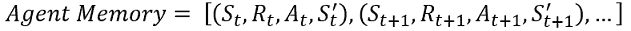

# 什么是深度强化学习？

> 原文：<https://towardsdatascience.com/what-is-deep-reinforcement-learning-de5b7aa65778?source=collection_archive---------10----------------------->

## 详细的介绍

深度强化学习是我作为工程师使用过的最酷的工具之一。一旦完成，你所要做的就是告诉代理你想要完成什么，然后看着人工智能找出令人难以置信的创造性方法来完成这项任务。

理解神经网络(这里解释)是深度 RL 的前提。此外，如果你对列表强化学习感到舒服，深度强化学习可以更容易理解，我在这里深入解释了[。](/what-is-tabulated-reinforcement-learning-81eb8636f478)

## 列表 RL 和深 RL 之间的差异

列表 RL 的快速总结如下。

1.  代理从环境接收状态
2.  使用ε贪婪策略(或一些其他的状态探索策略)，代理或者进行随机动作，或者选择将导致具有最高值的状态的动作
3.  在这一集的结尾，代理将所有访问过的州存储在一个表中。然后，代理回顾该集访问的州，并根据收到的奖励更新每个州的值

所以，如果我们从一开始就知道每个州的真实值；这很容易。我们只是让代理总是移动到具有最高值的状态。主要问题是找到这些正确的状态值。

deep RL 做的是；我们不是保存我们遇到的每个状态的所有值的表格，而是使用神经网络实时地近似所有下一个可能状态的值。

假设我们已经有一个神经网络，我们可以将当前状态作为输入，输出将是一个数组，其中填充了我们可能处于的所有下一个状态的值(如果有 n 个可能的动作，那么通常我们可能处于 n 个下一个可能的状态)。说我们的环境是雅达利游戏‘突围’，我们的代理处于开始状态(游戏第一帧)。在突破中，我们可以做三件事；保持不动，向左移动，或向右移动。这些行为中的每一个都会带来一个独特的新状态。我们将把当前状态输入到神经网络中，并接收一个数组，告诉我们采取每个动作后的状态值。然后，我们采取导致最高价值的行动。

下图是在只有 2 个可用动作的环境中的神经网络。输入是当前状态，输出是下一个状态值。

*如果有 N 个可用动作，那么将有 N 个输出到神经网络*****作者的图像****

## 关于代理内存的快速说明

在我们学习如何训练我们的神经网络之前，重要的是要了解我们是如何存储从玩游戏中获得的信息的。大多数时候，我们处于状态 S，我们收到奖励 R，我们采取行动 A，我们转移到下一个状态 S '。我说大部分时间是因为如果我们处于结束一集的终结状态，我们只是收到一个奖励 R(因为没有下一个状态和采取的行动)。

实际上，我们所做的是将这些值组合成一个 4 元组，并将它们存储在一个列表中。所以，它会看起来像这样。

*如果状态是终端，那么 A 和 S’将是 Nan*

现在，我们已经准备好了这些信息，以便在需要培训我们的代理时使用。

## 训练神经网络

所以，我们知道我们希望我们的输出是每一个动作产生的状态值。为了在我们的神经网络中找到使这成为可能的所有权重，我们需要确定我们想要最小化的损失函数。首先，

> *我们希望我们的神经网络的输出和观察到的下一个状态值之间的差值为 0* 。

如果我们使用均方误差损失函数，我们得到:

不要让索引绊倒你，V^ai 是采取行动所带来的状态的价值。如果在一个索引上有一个索引让你感到害怕，它可能应该，那么就用 I 代替 ai

现在从列表 RL 中回忆一下，

或者下一个状态的值正好是那个状态收到的奖励+之后那个状态的值。为了找到 V(t+2)真，我们可以继续说，

然后用同样的方法求 V(t+3)真，然后 V(t+4)一直真，直到我们达到一个终态。但这是不切实际的，坦率地说也是不必要的。

实际上我们可以说:

或者，V(t+1)true = R(t+1) +我们从输入下一个状态 S(t+1)到我们的 NN 中得到的最高输出。

这可能看起来有点奇怪，因为对于未经训练的网络，V(t+2)预测将是不准确的废话。这是真的，但是经过多次权重更新，准确的信息 R(t+1)足以最终使 V(t+2)预测值准确。我的想法是这样的，

但是告诉 NN R(t+1)可以让它稍微提高预测的*V(t+****1****)的准确性，从而在多次迭代后，V 预测值变得准确。*

如果我刚才说的没有意义，不用担心。你真正需要知道的是我们使用的损失函数是这样的:

*Vmax 是最大预测值。或者神经网络的最大输出。R^ai 是采取行动的奖励。请注意，我们只知道采取其中一项行动所获得的奖励。我称之为部分信息训练，这是下一个话题。*****图片作者****

## 部分信息培训

作为一个视觉，想象下面的 NN 在一个有 2 个动作的环境中。当我们的代理人处于这种状态时，他采取了行动 a1，并在下一个状态中获得奖励 R(a1，t+1)。现在我们不知道自从我们采取行动 a1 后，采取行动 a2 所产生的状态值是多少。我们训练需要这个！

****图片作者****

我们所做的是假设神经网络预测了这个动作的正确值，所以差变成 0。不是很优雅，但它的工作！所以，我们最后得到:

*如果你想实验，我从未探索过的一个想法是假设神经网络一开始预测完全错误，然后随着时间的推移慢慢改变假设，假设它是准确的。如果你尝试这样做，请在回复中告诉我效果如何！*****图片作者****

## 理论部分总结

这个理论可能有点复杂，这取决于你想深入细节到什么程度。我学习的方法是坐下来，拿着纸和铅笔，手动画出 3 或 4 个代理的时间步，看看我如何训练这些时间步。如果你想深入了解是怎么回事，我建议你也这样做。从状态 St 开始，在那里你得到奖励 rt。现在画一些虚构的输出值到 NN，然后选择一个动作并在内存中记录(S，A，R，S’)元组。现在再做 2 到 3 个时间步，假设你到达了一个终态。现在，随机选择一个时间步长，试着写下在这个时间步长上训练神经网络的损失函数。下面是我为理解这一点所做的一个例子:

*我决定采取的行动用绿色圈出。不是说上面的动作是 0，下面的动作是 1。*****图片作者****

如果所有的理论都有点模糊，不用担心。如果你第一次看到这一切时就能完全理解，我会认为你是外星人。但是现在我们已经了解了这个理论，真正学习它的唯一方法就是应用它。顺便提一下，我的第一个深度 RL 项目花了我几个星期才弄明白。这个项目教会了我代码漂亮和可读是多么重要。所以，如果没有马上得到，也不要气馁。如果我能做到，那么你也能。

下面是一个帖子的链接，我们实现了这个来让一个代理玩 Atari Pong。看看吧！

</getting-an-ai-to-play-atari-pong-with-deep-reinforcement-learning-47b0c56e78ae>  

> 感谢您的阅读！如果这篇文章在某种程度上帮助了你，或者你有什么意见或问题，请在下面留下回复，让我知道！此外，如果你注意到我在某个地方犯了错误，或者我可以解释得更清楚一些，那么如果你能通过回复让我知道，我会很感激。